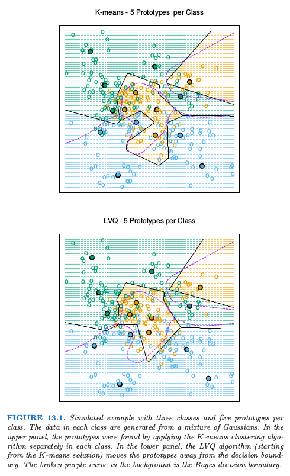
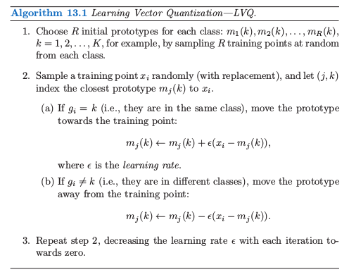
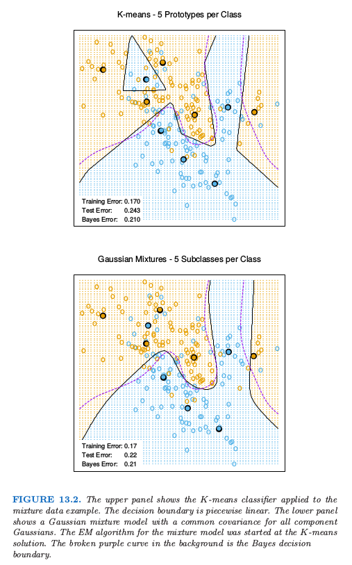

# 13.2 原型方法

| 原文   | [The Elements of Statistical Learning](https://web.stanford.edu/~hastie/ElemStatLearn/printings/ESLII_print12.pdf#page=478) |
| ---- | ---------------------------------------- |
| 翻译   | szcf-weiya                               |
| 发布 | 2017-08-28 |
| 状态 | Done |

!!! note "weiya注：原型"
	英文是prototype，这里翻译为原型．

在这章，我们的训练数据包含 $N$ 个数据对 $(x_1,g_1),\ldots, (x_n,g_n)$，其中 $g_i$ 是在 $\\{1,2,\ldots, K\\}$ 中取值的类别标签．**原型方法 (prototype methods)** 用特征空间中的点集来表示训练数据．这些原型通常不是训练样本的实例，除了后面讨论的 1-最近邻分类情形．

每个原型有其对应的类别标签，并且将查询点 $x$ 分到“最近的”原型类别中．“最近的”通常是由特征空间中的欧氏距离定义的，在计算欧式距离前，需要将训练样本中的每个特征进行标准化后使其均值为 0，方差为 1．对于定量变量，欧式距离是合适的．我们将在第 14 章讨论定性和其它类型的特征值 (feature values) 的距离度量．

当原型能够捕捉到每个类的分布，这些方法是很有效的．如果特征空间中有足够的原型处于正确的位置，会得到不规则的类别边界．主要的挑战在于确定需要多少原型以及应该将原型放在哪儿．这些原型方法的区别在于原型的个数以及选择的方式．

## K 均值聚类

K 均值聚类是在未标签的数据中选择簇以及簇的中心．选择簇中心的数目，假设为 $R$，$K$ 均值过程是迭代地移动簇的中心使得簇内总的方差最小．

!!! note "weiya 注"
    这里的 $R$ 与“$K$ 均值”中的 $K$ 意义是一样的．原书中的脚注为“$K$ 均值中的 $K$ 指的是类别中心的数目．因为我们已经用 $K$ 来表示类别的个数，所以用 $R$ 来表示簇的个数．”

给定初始的中心集合，$K$ 均值算法轮流进行下面两步：

1. 对于每个中心，确定出那些离该中心的距离比到其它中心的距离都要近的训练点的集合（称为簇）；
2. 计算每个簇中数据点每个特征的均值，这个均值向量称为簇的新中心．

迭代这两步直到收敛．一般地，初始的簇中心是随机从训练数据中选取 $R$ 个．$K$ 均值过程，以及它推广到不同的变量类型和更一般的距离度量的情形将在第 14 章中详细介绍．

对有标签数据采用 $K$ 均值聚类的步骤如下：

1. 对每个类别采用 $R$ 个原型，分别对每个类中的训练数据应用 $K$ 均值聚类；
2. 对 $K\times R$ 个原型赋予标签；
3. 将新特征 $x$ 分到离它最近的原型所在的类别中．

图 13.1（上半图）显示了 3 个类别和 2 个特征的模拟例子．对每个类别采用 $R=5$ 个原型，并且显示了类别区域及其判别边界．注意到很多原型靠近类别边界，导致离这些边界很近的点有潜在的误分类误差：对于每个类别，其它类的点对该类的原型所在位置没有影响．一个更好的方式是使用所有的数据来确定所有原型的位置，下面将讨论这一方法．

## 量化学习向量

在 Kohonen(1989)[^1] 的这种技术中，原型是按照 **特定 (ad-hoc)** 的策略放在判别边界上的．LVQ 是一种 online 的算法——每次处理一个观测值．

想法是训练点吸引正确类别的原型，同时排斥其它的原型．迭代完成时，原型应该与它们类别中的训练点很近．学习速率 $\epsilon$ 随着每次迭代的进行降低至 0，遵循随机近似学习率的指导原则．（11.4 节）

图 13.1 的下半图显示了 LVQ 的结果，采用 $K$ 均值的解作为起始值．原型趋向于从判别边界中移开，并且远离其它类中的原型．

这个过程实际上称为 LVQ1．已经有了改进的版本（LVQ2，LVQ3 等等），这些改进的版本有时能够提高效果．量化学习向量的一个缺点是它们被算法定义，而不是一些固定准则的优化；这导致很难理解它们的性质．

## 高斯混合模型

高斯混合模型也可以看成是原型方法，思想上类似$K$均值和LVQ．在第6.8，8.5 以及 12.7 节中都有介绍高斯混合模型．每个簇用高斯密度来描述，有一个形心（如在$K$均值中一样），以及一个协方差矩阵．如果我们现在每个组分的高斯分布有标量化的协方差矩阵，这种比较变得更加清晰．轮流进行EM算法的过程与$K$均值中的两个步骤很类似．

- 在E步，对于每个簇，基于其对应的高斯似然，在每个观测值上赋予一个责任(responsibility)或者权重．越靠近簇中心的观测值越可能对该类的权重为1，而对其它类权重为0．在两个簇中间的观测值则平分对这两个簇的权重．
- 在M步，对每个簇，根据每个观测值贡献，得到加权均值和加权协方差．

结论是，高斯混合模型通常被称为软(soft)聚类方法，而$K$均值称为硬(hard)聚类方法．

类似地，当高斯混合模型用于表示每个类别中的特征密度，它产生用于对$x$进行分类的光滑的后验概率$\hat p(x)=\\{\hat p_1(x),\ldots, \hat p_K(x)\\}$．通常这解释为软分类，但事实上分类规则为$\hat G(x)=\text{arg max}_k\hat p_k(x)$．

图13.2比较了$K$均值和高斯混合模型在第二章中模拟的混合问题的结果．可以看到判别边界大致相似，但是高斯混合模型更加光滑(尽管原型近似在同样的位置上)我们也可以看出尽管两个过程都得到了西北方向上一个蓝色的原型(不正确)，高斯混合分类器最终忽略了这个区域，而$K$均值没有．LVQ在这个例子中给出了与$K$均值非常相似的结果，但是没有展示出来．

[^1]: Kohonen, T. (1989). Self-Organization and Associative Memory (3rd edition), Springer, Berlin.

