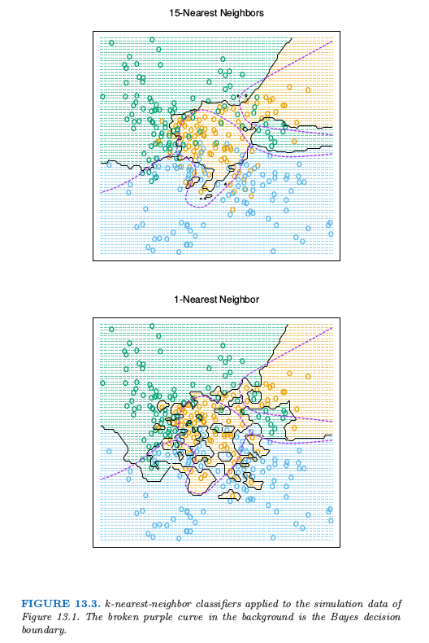
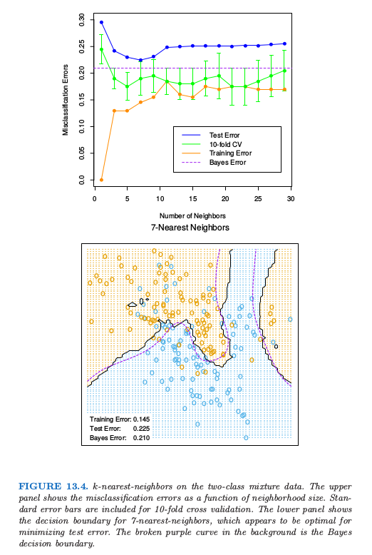
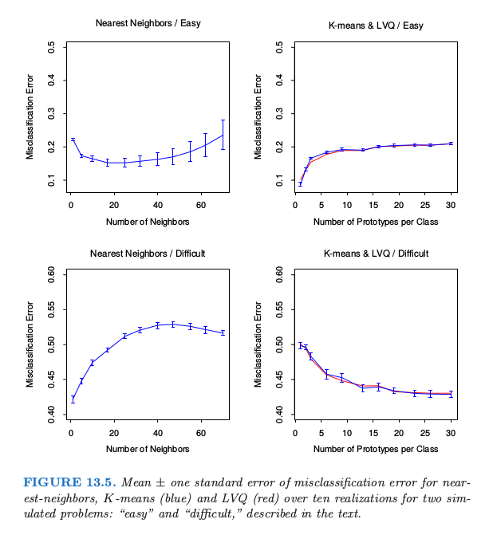
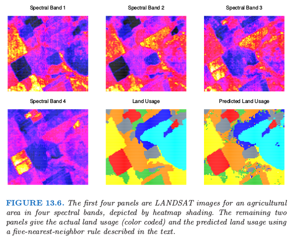
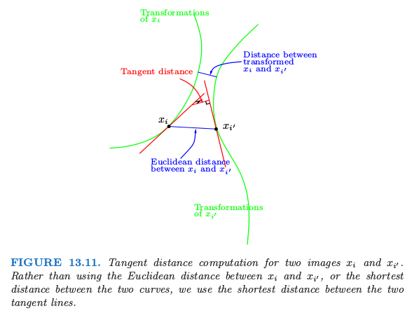
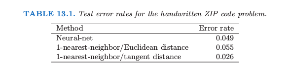

# 13.3 k最近邻分类器

| 原文   | [The Elements of Statistical Learning](https://web.stanford.edu/~hastie/ElemStatLearn/printings/ESLII_print12.pdf#page=482) |
| ---- | ---------------------------------------- |
| 翻译   | szcf-weiya                               |
| 发布 | 2017-08-28 |
|更新|2021-05-06 22:01:56|
|状态 | Done|

这些分类器是 **基于存储的 (memory-based)**，并且不需要拟合模型．给定查询点 $x_0$，找到 $k$ 个距离 $x_0$ 最近的训练点 $x_{(r)}, r=1,\ldots,k$，接着在这 $k$ 个最近邻中采用少数服从多数的方法进行分类．对于重复点，随机地将它们分开．为了简便起见，假设所有的特征是实值的，我们在特征空间中采用欧氏距离

$$
d_{(i)} = \Vert x_{(i)} - x_0\Vert \tag{13.1}
$$

一般地，首先对每个特征进行标准化使得均值为 0 方差为 1，因为它们可能是在不同的尺度下的测量值．在第 14 章中，我们讨论适用于定性变量和有序变量的距离度量，以及对于混合数据怎样将它们结合起来．自适应的距离度量将在下一节中讨论．

尽管 $k$ 最近邻很简单，但是在大量的分类问题中取得了成功，包括手写字体，卫星图像以及 EKG 模式．当每个类别有许多可能的原型时，并且判别边界非常不规则，通常会取得成功．图 13.3 的上图显示了对 3 个类别的模拟例子应用 15 最近邻分类器的结果．这个判别边界比下半图的 1-最近邻分类器要光滑．最近邻和原型方法有着紧密的联系，在 1-最近邻分类中，每个训练点就是一个原型．

图 13.4 显示了两个类别的混合问题中，训练误差、测试误差以及 10 折交叉验证误差关于邻居大小的函数图像．因为 10 折 CV 误差是 10 个数据的平均，因此我们可以估计标准误差．

因为最近邻仅仅用到离查询点近的训练点，1-最近邻的偏差通常很低，但是方差很高．Cover and Hart(1967)[^1]证明了一个很著名的结果，1-最近邻分类器的误差率渐近地不会高于两倍的贝叶斯误差率．证明的大致思想如下（采用平方误差损失）．假设查询点刚好与其中一个训练点重合，则偏差为 0．如果特征空间的维数固定，且训练数据密集地充满空间．则贝叶斯误差恰恰是 Bernoulli 随机变量的方差，而 1-最近邻的误差是 Bernoulli 随机变量方差的两倍，对训练和查询目标各自贡献了一份．

!!! note "weiya 注："
    假设查询点 $x_0$ 与训练点 $x_i$ 重合，则 1NN 的判别规则为
    $$
    \hat y_0^{\mathrm{1NN}} = y_i\,,
    $$
    则其（期望）平方误差为
    \begin{align*}
    \E(\hat y_0^{\mathrm{1NN}} - y_0)^2 &= \E(y_i - y_0)^2 \\
    &= \E(y_i - \E y_i + \E y_0 - y_0)^2\qquad \text{因为 }\E y_i = \E y_0\\
    &= \E(y_i - \E y_i)^2 + \E(y_0 -\E y_0)^2 + 2\E(y_i-\E y_i)(y_0 - \E y_0)\\
    &= 2\Var(y_0)\qquad \text{因为 $y_0$ 和 $y_i$ 独立同分布}\,.
    \end{align*}
    而在平方误差意义下 Bayes 的判别规则为
    $$
    \hat y_0^{\mathrm{Bayes}} = \E y_i\,,
    $$
    则其误差为
    $$
    \E(\hat y_0^{\mathrm{Bayes}} - y_0)^2 = \Var(y_0)\,.
    $$

对于误分类损失，我们在下面给出更多的细节．令 $k^\*$ 为 $x$ 点处的优势类别，而 $p_k(x)$ 是类别 $k$ 的真实条件概率．则

$$
\text{Bayes error} = 1-p_{k^*}(x)\tag{13.2}
$$

$$
\begin{align}
\text{1-nearest-neighbor error}&=\sum\limits_{k=1}^Kp_k(x)(1-p_k(x))\tag{13.3}\\
&\ge 1-p_{k^*}(x)\tag{13.4}
\end{align}
$$

渐近的 1-最近邻误差率是一个随机规则；我们以概率 $p_k(x),k=1,\ldots,K$ 随机选择类别和测试点．对于$K=2$，1-最近邻误差率为 $2p_{k^\*}(x)(1-p_{k^\*}(x))\le 2(1-p_{k^\*}(x))$ （两倍的贝叶斯误差率）．

!!! note "weiya 注："
    同上，1NN 的判别规则为
    $$
    \hat y_0^{\mathrm{1NN}} = y_i\,,
    $$
    但在误分类损失下，其误差为
    \begin{align*}
    \E 1\{y_i\neq y_0\} &= \Pr(y_i\neq y_0)\\
    &=\sum_{k=1}^K\Pr(y_0=k)\Pr(y_i\neq k)\qquad \text{$y_0$ 和 $y_i$ 独立}\\
    &=\sum_{k=1}^K\Pr(y_0=k)\Pr(y_0\neq k)\qquad \text{$y_0$ 和 $y_i$ 同分布}\\
    &=\sum_{k=1}^Kp_k(x)(1-p_k(x))\,,
    \end{align*}
    当 $K=2$ 时，有 $p_1(x)+p_2(x)=1$，则
    $$
    \sum_{k=1}^2p_k(x)(1-p_k(x)) = 2p_1(x)p_2(x) = 2p_{k^\star}(x)(1-p_{k^\star}(x))\,.
    $$
    而 Bayes rule 在误分类损失下的规则为
    $$
    \hat y_0^{\mathrm{Bayes}} = \argmax_kp_k(x)\triangleq k^\star\,,
    $$
    且误差为
    $$
    \Pr(\hat y_0^{\mathrm{Bayes}}\neq y_0) = 1-p_{k^\star}(x)\,.
    $$

更一般地，可以证明（[练习 13.3](https://github.com/szcf-weiya/ESL-CN/issues/129)）

$$
\sum\limits_{k=1}^Kp_k(x)(1-p_k(x))\le 2(1-p_{k*}(x))-\frac{K}{K-1}(1-p_{k^*}(x))^2\tag{13.5}
$$

可以导出更多这种形式的结果；Ripley(1996)[^2]总结了其中的一些．

!!! info "weiya 注：Ex. 13.3"
    已解决，详见 [Issue 129: Ex. 13.3](https://github.com/szcf-weiya/ESL-CN/issues/129)．

这个结果可以提供在给定问题中最优的效果的大致思路．举个例子，如果 1-最近邻有$10\%$的误差率，则渐近情况下贝叶斯误差率至少为 $5\%$．这里是渐近情形，它假设最近邻的偏差为 0．在实际问题中，偏差可能很大．本章后面讨论的自适应最近邻试图减去这种偏差的影响．对于简单的最近邻，在给定的问题中，偏差和方差可以决定最优的最近邻个数．在下面的例子中会解释．

## 例子： 比较研究

我们在两个模拟问题中比较了最近邻，K 均值和 LVQ 分类器．有 10 个独立的特征 $X_j$，每个都是 $[0,1]$ 上的均匀分布．两类别的 0-1 目标变量由下式定义：

$$
\begin{align}
Y&=I(X_1\ge \frac 12);\qquad\text{problem 1: easy}\notag\\
Y&=I(\sign\{\prod\limits_{j=1}^3(X_j-\frac 12)\}>0);\qquad \text{problem 2: difficult}\notag
\end{align}
\tag{13.6}
$$

因此在第一个问题中，两个类别被超平面 $X_1=\frac 12$ 分离开；在第二个问题中，两个类别在被前三个特征定义的超立体中形成了 **跳棋盘 (checkerboard)**．这两个问题的贝叶斯误差率都是 0．有 100 个训练观测和 100 个测试观测．

图 13.5 展示了最近邻、K 均值和 LVQ 当调整参数变化的 10 次实现中的误分类误差的均值和标准误差．我们看到 K 均值和 LVQ 给出了几乎相近的结果．在调整参数的最优选择下，K 均值和 LVQ 在第一个问题上都比最近邻要好，并且在第二个问题上它们表现很相似．注意到每个调整参数的最优值在不同情形是不同的．举个例子，在第一个问题中，25 最近邻比 1 最近邻好 $70\%$，而在第二个例子中 1 最近邻比 25 最近邻好 $18\%$．这些结果强调了采用客观的、基于数据的方法的重要性，比如用交叉验证来估计调整参数的最优值（见图 13.4 和第 7 章）．

## 例子： k-最近邻和图像分类

STATLOG 项目 (Michie et al., 1994) 采用 LANDSAT 的部分图像作为分类的基准（$82\times 100$ 个像素）．图 13.6 显示了四张热图的图像，两张为可见光，两张为红外线，它们指的是澳大利亚的农业用地的区域．每个像素点有从 7 个元素集合 $\cG = \\{\text{red soil, cotton, vegetable stubble, mixture, gray soil, damp gray soil, very damp gray soil}\\}$ 取值的类别标签，这是由调查该区域的研究助理人工确定的．下一行中间的图像展示了实际的土地使用情况，用不同的颜色阴影来表示类别．目标是对每个像素进行分类，基于四条光谱带．

5 最近邻得到的预测地图展示在右下角的图中，并且按如下方式进行计算．

对于每个像素点，我们提取 8 邻居特征地图——像素点本身及其 8 个直接的邻居（见 13.7）．

这对四条光谱带分别进行，每个像素点提供 $(1+8)\times 4=36$ 个输入特征．接着在这个 36 维特征空间中应用 5 最近邻分类．最终的测试误差率约为 9.5%（见图 13.8）．

在 STATLOG 项目中使用的所有方法中，包括 LVQ, CART, 神经网络，线性判别分析以及其它的方法，$k$-最近邻在这个任务上表现最好．因此 $\IR^{36}$ 中的判别边界有可能非常不规则．

## 不变量和切线距离

有些问题中，训练特征在特定的自然变换下保持不变．最近邻分类器可以通过将它们考虑到计算物体间距离的度量中来利用这种不变性．这里我们给出一个这个想法取得重大成功的例子，并且得到的分类器在其发展阶段比其它方法都要好（Simard et al., 1993[^3]）．

这个问题是手写数字识别，如在第一章以及 11.7 中讨论的那样．输入是包含 $16\times 16=256$ 个像素点的灰度图像；在图 13.9 中展示了部分例子．

在 13.10 的上方，展示了手写 “3”，中间为实际朝向的图像，而剩下四张分别是向两个方向偏离 7.5° 和 15° 的图像．

这样的旋转在实际手写中经常发生，而是对人眼而言，很容易看出经过微小旋转后，“3” 仍然是 “3”．因此我们希望我们的最近邻分类器能将这两个 “3” 看成很近（相似）．然而对于一个旋转的 “3” 的 256 个灰度像素值会与原图像有很大不同，因此在 $\IR^{256}$ 的欧氏距离中，这两个图像会离得很远．

我们希望移除同一类别中两张数字图像间测量距离时旋转的影响．考虑包含原始 “3” 及其旋转版本的像素值的集合．这是 $\IR^{256}$ 中的一维曲线，由图 13.10 中经过“3”的绿色曲线来描述．

图 13.11 展示了 $\IR^{256}$ 中的固定版本，其中两张图像分别由 $x_i$ 和 $x_{i'}$ 来表示．举个例子，这些可能是两个不同的“3”．对于每张图像，我们画出了该图像旋转版本的曲线，称为 **不变流形 (invariance manifolds)**．现在，不是用传统的欧氏距离，而是采用两条曲线见的最短距离．换句话说，两张图像间的距离取为第一张图像的任意旋转版本与第二张图像的任意旋转版本间的最短欧氏距离．这个距离称为 **不变度量 (invariant metric)**．

原则上，可以采用这种不变度量来进行 1 最近邻分类．然而这里有两个问题．第一，对于真实图像很难进行计算．第二，允许大的变换，可能效果很差．举个例子，经过 180° 旋转后，“6” 可能看成是 “9”．我们需要限制为微小旋转．

**切线距离 (tangent distance)** 解决了这两个问题．如图 13.10 所示，我们可以用图像“3”在其原图像的切线来近似不变流形．这个切线可以通过从图像的微小旋转中来估计方向向量，或者通过更复杂的空间光滑方法（[练习 13.4](https://github.com/szcf-weiya/ESL-CN/issues/187)）．对于较大的旋转，切线图像不再像“3”，所以大程度的旋转问题可以减轻．

想法是对每个训练图像计算不变切线．对于待分类的 **查询图像 (query image)**，计算其不变切线，并且在训练集的直线中寻找最近的直线．对应最近的直线的类别（数字）是对查询图像类别的预测值．在图 13.11 中，两条切向直线相交，但也只是因为我们是在二维空间中表示 256 维的情形．在 $\IR^{256}$ 中，两条这样的直线相交的概率是 0．

现在更简单地能达到这种不变性是往训练集中加入每张训练图像的一些选择版本，然后只需要用标准的最近邻分类器．这个想法在 Abu-Mostafa (1995)[^4] 中称为“hints”，并且当不变量的空间很小时效果会很好．至今为止，我们展示了这个问题的简化版本．除了旋转，还有 6 种其他的变换，我们也希望分类器能够在这些变换下保持不变．它们是平移（两个方向），收缩（两个方向），sheer 以及字体粗细．因此图 13.10 和 13.11 中的曲线和切线实际上是 7 维流形和超平面．不可能通过加入每张训练图象的转换版本来捕捉所有的可能性．切线流形提供了捕捉这种不变量的一种优美的方式．

表 13.1 展示了在包含 7291 张训练图像和 2007 张测试图像（美国邮政服务数据库）的问题中不同方法的测试误分类率，这些方法是神经网络，简单的 1-最近邻和切线距离的 1-最近邻．切线距离最近邻分类器表现得非常好，测试误差率接近人眼（这是众所周知的很困难的测试集）．实际中，最近邻对于这个应用的实时分类是很慢的（见 13.5 节），并且陆续发展了神经网络分类器来模仿它．

[^1]: Cover, T. and Hart, P. (1967). Nearest neighbor pattern classification, IEEE Transactions on Information Theory IT-11: 21–27.
[^2]: Ripley, B. D. (1996). Pattern Recognition and Neural Networks, Cambridge University Press.
[^3]: Simard, P., Cun, Y. L. and Denker, J. (1993). Efficient pattern recognition using a new transformation distance, Advances in Neural Information Processing Systems, Morgan Kaufman, San Mateo, CA, pp. 50–58.
[^4]: Abu-Mostafa, Y. (1995). Hints, Neural Computation 7: 639–671.