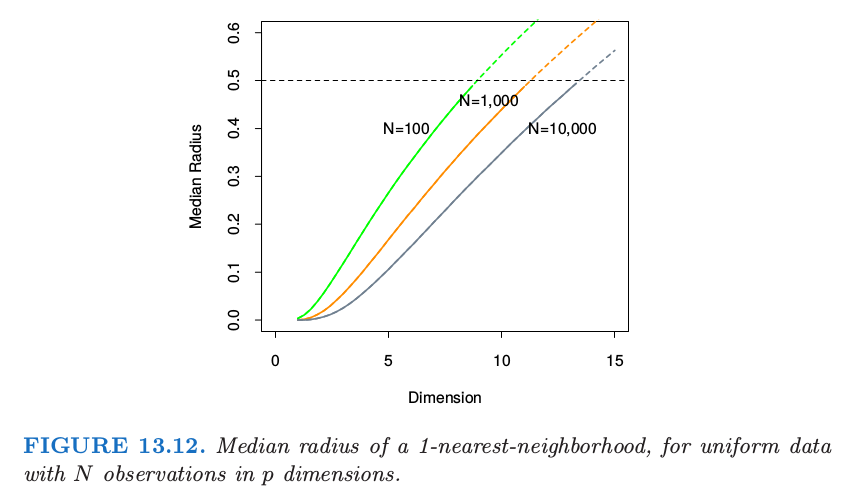
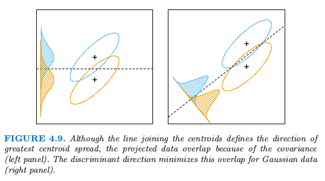
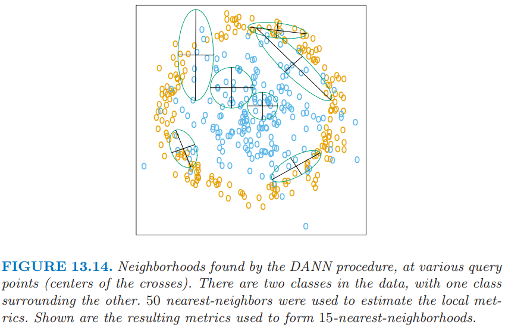
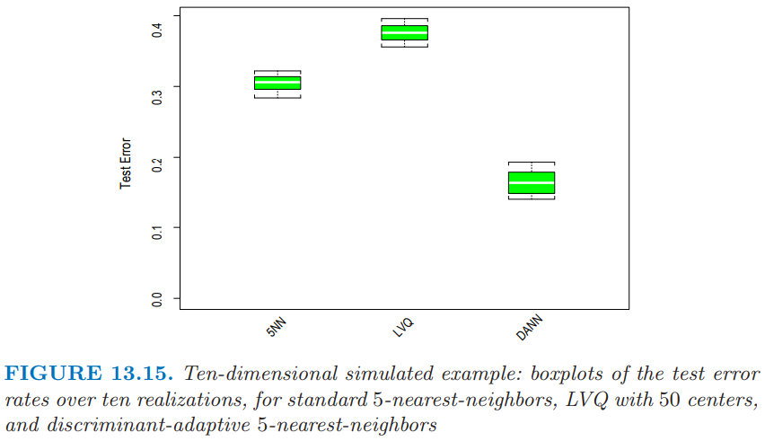

# 13.4 自适应最近邻方法

| 原文   | [The Elements of Statistical Learning](https://web.stanford.edu/~hastie/ElemStatLearn/printings/ESLII_print12.pdf#page=494) |
| ---- | ---------------------------------------- |
| 翻译   | szcf-weiya                               |
| 发布 | 2017-08-29 |
| 更新|2019-09-23 16:14:01|
|状态|Done|

当在高维特征空间中做最近邻分类时，最近邻的点可以离得非常远，带来偏差，并且降低了分类器的效果．

为了量化这一点，考虑在单位立方体 $[-\frac{1}{2},\frac{1}{2}]^p$ 中均匀分布的 $N$ 个数据点．令 $R$ 为中心在原点的 1-最近邻的半径．则

$$
\text{median}(R) = v_p^{-\frac{1}{p}}\left(1-\frac{1}{2}^{1/N}\right)^{1/p}\tag{13.7}\label{13.7}
$$

其中 $v_pr^p$ 是 $p$ 维空间半径为 $r$ 的球的体积．

!!! note "weiya 注：推导 \eqref{13.7}"
	记 $X$ 为离原点的距离，根据点的均匀分布知
	$$
	F(X) = P(X<x)=v_pr^p
	$$
	考虑次序统计量 $X_{(1)}$，即原点与其 1 最近邻点的距离，则
	$$
	F_1(x)=P(X_{(1)}<x)=1-(1-F(x))^N
	$$
	而中位数满足
	$$
	F_1(\mathrm{median}(R))=\frac 12
	$$
	则
	$$
	\mathrm{median}=v_p^{-\frac 1p}\Big(1-{\frac 12}^{\frac 1N}\Big)^{1/p}
	$$
	证毕．

图 13.12 显示了不同的训练样本大小和维度下半径的中位数．我们看到半径的中位数很快达到 0.5，也就是到立方体的边的距离．

这个问题我们可以怎么做呢？考虑图 13.13 的二分类的情形．

图中有两个特征，并且用圆形区域画出了 *查询点 (query point)* 的最近邻．最近邻分类的隐含假设是类别概率在邻域内近似为常值，因此简单的平均会得到不错的估计．然而，在这个例子中，只有水平方向上的类别概率会变化．如果我们提前知道这一点，可以将邻居拉伸为长方形区域．这会降低估计的偏差，同时保持方差不变．

一般地，这要求最近邻分类中采用自适应的度量，使得得到的邻域沿着类别不会改变太多的方向上拉伸．在高维特征空间中，类别概率可能仅仅只在一个低维的子空间中有所改变，因此自适应度量是很重要的优点．

Friedman (1994a)[^1] 提出通过逐步剔除包含训练数据的盒子的边来自动寻找长方形邻域．这里我们介绍  Hastie and Tibshirani (1996a)[^2] 提出的 **判别自适应最近邻 (discriminant adaptive nearest-neighbor) (DANN)**．更早的研究中，相关的方法有 Short and Fukunaga (1981)[^3] 和 Myles and Hand (1990)[^4].

在每个查询点，构造其大小为 50 个点的邻域，并且用这些点的类别分布来决定怎么对邻域进行变形——也就是，对度量进行更新．接着更新后的度量用在该查询点的最近邻规则中．因此每一个查询点都可能采用不同的度量．

在图 13.13 中，很明显邻域应当沿着垂直类别重心连线的方向拉伸．这个方向也与线性判别边界重合，而且是类别概率改变最少的方向．一般地，类别概率变化最大的方向不会与类别重心连线垂直（见 [4.3 节](../04-Linear-Methods-for-Classification/4.3-Linear-Discriminant-Analysis/index.html) 的图 4.9）．

!!! note "Recall"
	

!!! question "weiya 注："
	这里有点困惑。文中首先说，“the direction in which the class probabilities change the least”，然后又说“this direction of maximum change”，一个“change the least”，一个“maximum change”，但按照上下文，指的应该是同一个方向？怀疑是否是作者的笔误，“maximum” 应为 “minimum”。

假设一个局部判别模型，局部 **类别内 (within-)** 和 **类别间 (between-)** 协方差矩阵的信息就足以确定邻居的最优形状．

**判别自适应最近邻 (DANN)** 在查询点 $x_0$ 的度量定义为 

$$
D(x,x_0)=(x-x_0)^T\bSigma(x-x_0)\,,\tag{13.8}\label{13.8}
$$

其中

$$
\begin{align}
\bSigma &= \W^{-1/2}[\W^{-1/2}\B\W^{-1/2} + \epsilon \I]\W^{-1/2}\notag\\
&=\W^{-1/2}[\B^* + \epsilon\I]\W^{-1/2}\,.\tag{13.9}
\end{align}
$$

这里 $\W$ 是 **合并的 (pooled)** 类别内协方差矩阵 $\sum_{k=1}^K\pi_k\W_k$，并且 $\B$ 是类别间协方差矩阵 $\sum_{k=1}^K\pi_k(\bar x_k-\bar x)(\bar x_k-\bar x)^T$，其中 $\W$ 和 $\B$ 仅用 $x_0$ 附近的 50 个最近邻点．计算完这个度量之后，可以用来构造 $x_0$ 处的最近邻规则．

这个复杂的公式实际上计算很简单．它首先将数据关于 $\W$ 进行球面化，接着沿着 $\B^*$（球面化数据的类间方差）的零特征值方向拉伸邻域．参数 $\epsilon$ 围绕着邻域，从无穷的长条到椭球，避免使用离查询点过远的点．一般 $\epsilon=1$ 的效果很好．

图 13.14 展示了某个问题中得到的邻域，其中类别构成了两个同心圆．注意到当邻域中同时存在两个类别的点时，邻域是怎么沿着判别边界的方向进行拉伸．在只有一个类别的区域中，邻居仍保持圆形；这种情形下类间协方差矩阵 $\B=0$，并且 \eqref{13.8} 是单位矩阵．

!!! note "weiya 注："
	谢谢 [@ian Chin](https://disqus.com/by/qianyy/) 提醒，这里可能是作者笔误，应当是沿着 **判别边界的方向** 进行拉伸，而非 **垂直判别边界的方向**。

## 例子

这里我们在十维空间中生成两类别数据，这类似图 13.14 中二维例子．类别 1 中的 10 个变量取自独立的标准正态分布，但其半径平方需要大于 22.4 小于 40，而类别 2 中的预测变量是无约束的独立标准正态．每个类别有 250 个观测值．因此在全十维空间中，类别 1 几乎完全包围类别 2．

这个例子中没有单独的噪声变量，最近邻子集选择可能不适用．在特征空间中的每个点，类别判别值沿着一个方向．然而，当我们在特征空间中移动时方向会发生变化，并且所有变量在这个空间中某个地方都是有用的．

图 13.15 展示了标准的 5 最近邻，LVQ，以及判别自适应 5 最近邻的 10 次模拟．对于 LVQ，每个类别我们用 50 个原型，使得其与 5 最近邻相当（因为 250/ 5 = 50）．与 LVQ 或标准的最近邻相比，自适应的度量显著降低了误差率．

## 最近邻的全局维度降低

**判别自适应最近邻 (DANN)** 方法进行了局部维度降低——也就是，在每个查询点单独降低维度．在许多问题中，全局维度降低也是有用的，也就是，对原特征空间的最优子空间应用最近邻规则．举个例子，假设两个类别在四维特征空间中构成了两个 **嵌套的球体 (nested spheres)**，另外还有 6 个额外的噪声特征，其分布与类别独立．接着我们想找到最重要的四维子空间，并且在这个降维后的子空间中应用最近邻分类．Hastie and Tibshirani (1996a) [^2] 讨论了针对这个目标时 **判别自适应最近邻 (DANN)** 的变形．在每个查询点，计算类别间矩阵 $\B_i$，然后在所有训练点上进行平均：

$$
\bar\B = \frac 1N\sum_{i=1}^N\B_i\,.\tag{13.10}
$$

令 $e_1,e_2,\ldots,e_p$ 为 $\bar \B$ 的特征向量，按照特征值 $\theta_k$ 从大到小排序．则这些特征向量张成了全局子空间降维的最优子空间．推导过程基于 $\bar \B$ 的秩为 $L$ 的最优近似，$\bar \B_{[L]}=\sum_{\ell=1}^L\theta_\ell e_\ell e_\ell^T$，它是下式最小二乘问题的解

$$
\underset{\rank(\M)=L}{\min}\sum_{i=1}^N\trace[(\B_i - \M)^2]\,.\tag{13.11}\label{13.11}
$$

因为每个 $\B_i$ 包含的信息有 (a) 局部判别子空间 (b) 子空间差异的强度，\eqref{13.11} 可以看成是通过加权最小二乘寻找 $N$ 个子空间序列的秩为 $L$ 的最优子空间近似（[练习 13.5](https://github.com/szcf-weiya/ESL-CN/issues/170)）．

上面提到的四维球体例子，Hastie and Tibshirani (1996a)[^2] 进行了研究，四个特征值 $\theta_\ell$ 很大（其特征向量几乎张成了感兴趣的子空间），并且剩下的 6 个接近为 0．操作上，我们将数据投影到该四维子空间中，接着应用最近邻分类．在 13.3.2 节中的卫星图象分类例子，图 13.8 中标签为 `DANN` 的方法采用全局降维子空间的 5 最近邻． Duan and Li (1991)[^5] 的 sliced inverse regression 方法与这个方法也有些联系．他们在回归设定中采用类似的想法，但是进行全局的计算，而不是局部的．他们假设并利用特征分布的球对称性来估计感兴趣的子空间．

!!! tip "weiya 注：SIR (Sliced Inverse Regression)"
	[SIR and Its Implementation | WeiYa's Work Yard](https://stats.hohoweiya.xyz//2019/01/05/SIR/) 记录了 Duan and Li (1991) 的主要算法，并用 R 语言重现了论文的结果．

[^1]: Friedman, J. (1994a). Flexible metric nearest-neighbor classification, Technical report, Stanford University.
[^2]: Hastie, T. and Tibshirani, R. (1996a). Discriminant adaptive nearestneighbor classification, IEEE Pattern Recognition and Machine Intelligence 18: 607–616.
[^3]: Short, R. and Fukunaga, K. (1981). The optimal distance measure for nearest neighbor classification, IEEE Transactions on Information Theory 27: 622–627.
[^4]: Myles, J. and Hand, D. (1990). The multiclass metric problem in nearest neighbor classification, Pattern Recognition 23: 1291–1297.
[^5]: Duan, N. and Li, K.-C. (1991). Slicing regression: a link-free regression method, Annals of Statistics 19: 505–530.