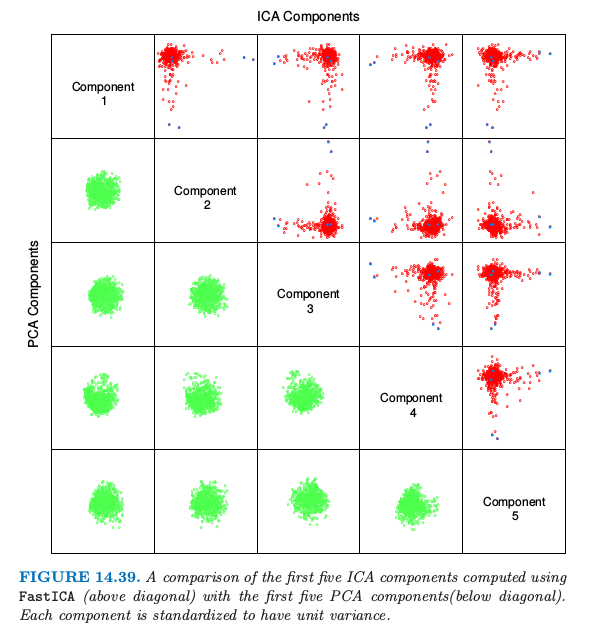
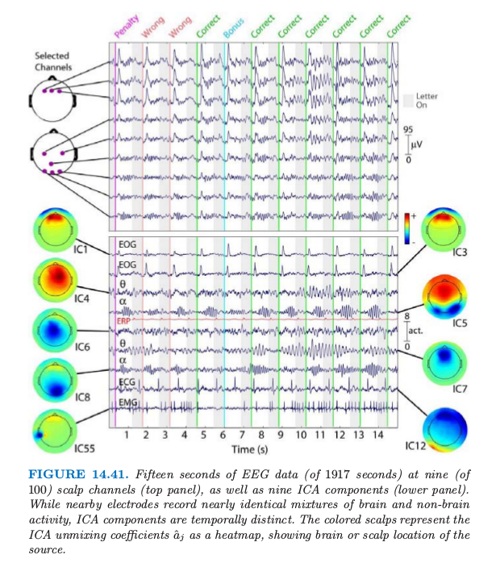
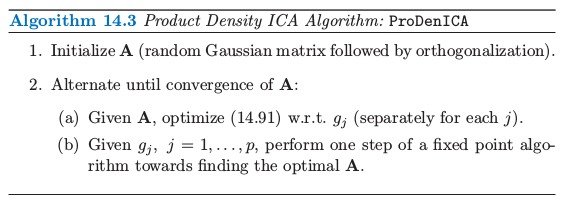

# 14.7 独立成分分析和探索投影寻踪

| 原文   | [The Elements of Statistical Learning](../book/The Elements of Statistical Learning.pdf) |
| ---- | ---------------------------------------- |
| 翻译   | szcf-weiya                               |
| 时间   | 2017-09-03                   |
|更新 |2018-01-20 & 2018-01-21|

多元数据经常被看成是从未知来源中多重间接测量的数据，一般不能直接测量。包括以下例子：

- 在教育或心理学测试中，采用问卷的答案来衡量潜在的智商以及其他的心理特征。
- EEG脑扫描通过放置在头部的不同位置的感受器的电子信号来间接衡量脑的不同部分的神经元活性。
- 股票交易价格随着时间持续变化，并且反映了各种各样的未测量的因素，如市场信心，外部影响以及其他很难识别和测量的推动力。

因子分析(Factor Analysis)是在统计学领域为了识别潜在因素的一个经典方法。因子分析模型通常是用在高斯分布中，某种程度上阻碍了它的适用性。最近，独立成分分析(Independent Component Analysis)成为了因子分析的强劲对手，我们将会看到，它对非高斯分布的依赖是其成功的根本来源。

## 潜变量和因子分析

奇异值分解$\mathbf X=\mathbf{UDV}^T$(14.54)有潜变量的表示。记$\mathbf S=\sqrt{N}\mathbf U$，以及$\mathbf A^T=\mathbf{DV}^T/\sqrt{N}$，我们有$\mathbf{X=SA}^T$，因此$\mathbf X$的每一列是$\mathbf S$的列的线性组合。现在因为$\mathbf U$是正交的，并且和之前一样假设$\mathbf X$的列均值为0（因此$\mathbf U$也是），这意味着$\mathbf S$列均值为0，而且不相关，有单位方差。采用随机变量，我们可以把SVD或者对应的主成分分析看成是下列潜变量模型的一个估计

$$
\begin{align}
X_1&=a_{11}S_1+a_{12}S_2+\cdots+a_{1p}S_p\\
X_2&=a_{21}S_1+a_{22}S_2+\cdots+a_{2p}S_p\\
\vdots &\qquad\vdots\\
X_p&=a_{p1}S_1+a_{p2}S_2+\cdots+a_{pp}S_p
\end{align}
\qquad (14.78)
$$

或者简单地写成$X=\A S$。相关的$X_j$都表示称不相关的、单位方差的变量$S_\ell$的线性展开。尽管这不是太满意，因为对于任意给定的$p\times p$的正交矩阵$\R$，我们可以写出

$$
\begin{align}
X&=\A S\\
&=\A\R^T\R S
&=\A^*S^*
\end{align}
\qquad (14.79)
$$

并且$\Cov (S^*)=\R\Cov(S)\R^T=\I$。因此存在许多这样的分解，也因此不可能将任意特定的潜变量作为唯一的潜在来源。SVD分解确实有这样的性质，以最优的方式得到使得任意$q < p$的截断分解。

经典的因子分析模型，主要由心理测量学(psychometrics)的研究者发展而来。某种程度上缓解了这个问题；举个例子，Mardia et al. (1979)[^1]。当$q < p$，因子分析模型有如下形式

$$
\begin{align}
X_1&=a_{11}S_1+a_{12}S_2+\cdots+a_{1q}S_q+\varepsilon_1\\
X_2&=a_{21}S_1+a_{22}S_2+\cdots+a_{2q}S_q+\varepsilon_2\\
\vdots &\qquad\vdots\\
X_p&=a_{p1}S_1+a_{p2}S_2+\cdots+a_{pq}S_q+\varepsilon_p
\end{align}
\qquad (14.80)
$$

或者写成$X=\A S+\epsilon$。这里$S$是 $q < p$个揭示潜变量或者因子的向量，$\A$ 是$p\times q$的因子载荷(loadings)矩阵，$\varepsilon_j$是零均值不相干的扰动。想法是潜变量$S_\ell$是$X_j$公共方差的来源，意味着它们直接的相关性结构，而$\varepsilon_j$对每个$X_j$是唯一的，并且解释了剩下的方差。一般地，$S_\ell$和$\varepsilon_j$假设为高斯随机变量，并且采用极大似然法来拟合模型。参数都存在于下面的协方差阵中

$$
\Sigma=\A\A^T+\D_\varepsilon \qquad (14.81)
$$

其中$\D_\varepsilon = diag[\Var(\varepsilon_1),\ldots, \Var(\varepsilon_p)]$. $S_\ell$为高斯并且不相关，这使得它们在统计上是独立随机变量。因此一系列的教育考试成绩可以认为是有潜在独立的因子，比如智力(intelligence)，动机(drive)等等所决定的. $\A$的列被称为因子载荷(factor loadings)，而且用来命名因子和解释因子。

不幸的是, 唯一性问题(14.79)仍然存在, 因为在式(14.81)中, 对于任意$q\times q$的正交矩阵$\R$, $\A$和 $\A\R^T$是等价的. 这导致了因子分析中的主观性, 因为用户可以寻找因子更易解释的旋转版本. 这点使得许多分析学家对因子分析表示怀疑, 而且这可能是它在当代统计中不受欢迎的原因。尽管我们这里不继续讨论细节，但是SVD分解在(14.81)的估计上发挥重要作用。举个例子，$\Var(\varepsilon_j)$假设相等，SVD的前$q$个成分确定了由$\A$张成的子空间。

因为每个$X_j$独立的扰动$\varepsilon_j$，因子分析可以看成是对$X_j$的相关结构进行建模，而非对协方差结构建模。这个可以通过对(14.81)的协方差结构进行标准化后得到（练习14.14）。

!!! note "weiya注: Ex. 14.14"
    练习14.14表明，因子分析实质上是对相关矩阵进行分解。详见解答见[Ex. 14.14](https://github.com/szcf-weiya/ESL-CN/issues/51)

这是因子分析与PCA的重要区别，尽管这不是我们讨论的重点。练习14.15讨论了一个简单的例子，因为这个差异，因子分析和主成分的解完全不同。

!!! note "weiya注: Ex. 14.15"
    练习14.15用一个实际例子说明了，因子分析和主成分得到的第一因子和第一主成分完全不同。详细解答见[Ex. 14.15](https://github.com/szcf-weiya/ESL-CN/issues/50)

## 独立成分分析

独立成分分析(ICA)模型与(14.78)有相同的形式, 除了假设$S_\ell$是统计上独立而非不相关. 

!!! note "weiya注: 独立与不相关"
    统计上, 连续型随机变量$X$与 $Y$独立的定义为
    $$
    p(x, y)=p_X(x)p_Y(y)\;\forall x,y
    $$
    而不相关的定义为
    $$
    Cov(X, Y)=0
    $$
    独立意味着不相关，但反之不对。对于二元正态随机变量，两者等价。

直观上, 不相关确定了多元变量分布的二阶交叉矩(协方差), 而一般地, 统计独立确定了所有的交叉矩. 这些额外的矩条件能让我们找到唯一的$\A$. 因为多元正态分布只要二阶矩就可以确定, 因此这是一个特例, 任意高斯独立成分可以像之前一样乘以一个旋转来确定. 因此如果假设$S_\ell$是独立且非高斯的, 则可以避免(14.78)和(14.80)的唯一性问题.

这里我们将要讨论(14.78)中的全$p$个成分的模型, 其中$S_\ell$是独立的且有单位方差; 因子分析模型(14.80)的ICA版本也同样存在. 我们的处理基于Hyvärinen and Oja (2000)[^2]的综述文章.

我们希望恢复$X=\A S$中的混合矩阵$\A$. 不失一般性, 我们假设$X$已经白化(whitened)得到$\Cov(X)=\I$; 这一般可以通过前面描述的SVD实现. 反过来, 因为$S$的协方差也为$\I$, 这意味着$\A$是正交的. 所以求解ICA问题等价于寻找正交的$\A$使得随机变量向量$S=\A^T X$的组分是独立(且是非高斯的)。

图14.37显示了在分离两个混合信号例子中ICA的能力。这也是经典的cocktail party problem的一个例子，不同的麦克风$X_j$接受来自不同独立源$S_\ell$(音乐、不同人说的话等等)的混合信号. ICA通过利用原始信号源的独立性和非高斯性，能够进行盲信号分离(blind source separation).

ICA许多流行的方式是基于熵. 密度为$g(y)$的随机变量$Y$的相对熵(differential entropy) $H$由下式给出

$$
H(Y)=-\int g(y)\LOG g(y)dy\qquad (14.82)
$$

信息理论中一个著名的结论是在所有同方差的随机变量中，高斯随机变量有最大的熵。最后，随机向量$Y$的组分之间的互信息量(mutual information)$I(Y)$是独立性的一个自然度量:

$$
I(Y)=\sum\limits_{j=1}^pH(Y_j)-H(Y)\qquad (14.83)
$$

值$I(Y)$称为$Y$的密度$g(y)$与其独立版本$\prod\limits_{j=1}^pg_j(y_j)$之间的Kullback-Leibler距离, 其中$g_j(y_j)$是 $Y_j$的边缘密度. 如果$X$有协方差$\I$, 且$Y=\A^TX$, 其中$\A$是正交, 则易证

$$
\begin{align}
I(Y)&= \sum\limits_{j=1}^pH(X)-\LOG\vert \det\A\vert\qquad (14.84)\\
&=\sum\limits_{j=1}^pH(Y_j)-H(X)\qquad (14.85)
\end{align}
$$

!!! note "weiya注: (14.85)的证明"
	只要证
	$$
	H(Y)=H(X)+\LOG \vert \det \A \vert
	$$
	对(14.82)进行变量替换有
	$$
	H(Y)=-\int g(\A'x)\LOG g(\A'x)\cdot \vert \det \J\vert dx\qquad (*)
	$$
	其中$\J_{ij}=\frac{\partial y_i}{\partial x_j}$.
	又
	$$
	y_i = \sum\limits_{j=1}^p (\A')_{ij}x_j
	$$
	故
	$$
	\J_{ij}=(\A')_{ij}
	$$
	所以$\det\J = \det \A'=\det \A$.
	另外, $X$的密度函数为
	$$
	f(x)=g(\A'x)\cdot\vert \det\J\vert 
	$$
	于是$(*)$式可以写成
	$$
	\begin{align}
	H(Y) &= -\int \frac{f(x)}{\vert\det\A\vert} \LOG\frac{f(x)}{\vert\det\A\vert}\cdot\vert\det\A\vert dx\\
	&=-\int f(x)[\LOG f(x)-\LOG\vert\det\A\vert]dx\\
	&=H(X)+\LOG\vert\det\A\vert
	\end{align}
	$$
	证毕.

寻找$\A$来最小化$I(Y)=I(\A^TX)$也就是寻找使得组分间的独立性最强的正交变换. 考虑到式(14.84), 这等价于最小化$Y$的各组分的熵的和, 反过来意味着最大化它们与高斯分布的距离.

!!! note "weiya注"
	因为高斯随机变量的交叉熵最大, 则让各组分熵之和最小, 意味着各组分远离高斯分布.

为了简便, 与其采用熵$H(Y_j)$, Hyvärinen and Oja (2000)[^2]采用负熵(negentropy)$J(Y_j)$

$$
J(Y_j) = H(Z_j)-H(Y_j)\qquad (14.86)
$$

其中$Z_j$是与$Y_j$同方差的高斯随机变量. 负熵是非负的, 它度量了$Y_j$与高斯随机变量之间的距离. 他们提出负熵的一个简单近似, 这个近似可以用来计算和优化数据. 图14.37至图14.39中的ICA都采用下面的近似

$$
J(Y_j)\approx [EG(Y_j) - EG(Z_j)]^2\qquad (14.87)
$$

其中$G(u)=\frac 1a\LOG \cosh(au), 1\le a\le 2$. 当应用到实际数据时, 期望用数据的平均值代替. 这是这些作者们提供的`FastICA`软件中的一个选项. 更经典(以及不太鲁棒)的度量是基于四阶矩, 也因此可以通过峰度(kurtosis)来衡量与高斯分布的距离. 更多细节参见Hyvärinen and Oja (2000)[^2]. 在14.7.4节我们讨论他们寻找最优方向的近似牛顿算法.

!!! note "weiya注:"
	峰度是四阶标准矩
	$$
	Kurt(X)=\E\Big[
	\Big(
	\frac{X-\mu}{\sigma}
	\Big)^4
	\Big]
	$$

总结一下, ICA应用到多元数据中, 来寻找一系列的正交投影, 使得投影数据尽可能远离高斯分布. 采用白化后的数据(协方差为$\I$), 这意味着寻找尽可能独立的组分.

ICA本质上从因子分析的一个解出发, 并且寻找一个旋转得到独立组分. 从这点看, ICA与在心理测量学中采用的传统方法\``varimax"和\``quartimax"一样, 仅仅是因子旋转的一种方式.

### 例子: 手写数字

我们再次讨论14.5.1 节用PCA分析的手写数字"3". 

图14.39比较了前五个主成分(标准化)和前五个ICA成分, 都显示在标准化后的同一单位尺度下. 注意到每张图都是256维空间的二维投影. 所有PCA组分看上去都服从联合高斯分布, 而ICA组分都服从长尾分布. 这并不是很奇怪, 因为PCA主要考虑方差, 而ICA特地寻找非高斯的分布. 所有的组分都已经标准化, 所以我们看不出主成分的方差降低. 

图14.40展示了每个ICA主成分的两个极端的数据点, 以及均值的两个极端点. 这解释了每个组分的实际意义. 举个例子, 第五个ICA成分捕捉具有长扫尾(long sweeping tailed)的"3".

### 例子: 时序脑电图数据

ICA已经成为脑动力学(brain dynamics)中的重要工具, 这里介绍的例子采用ICA来理清多频脑电图(EEG)数据中信号的组分(Onton and Makeig, 2006).

被试者戴上装有100个EEG电极的帽子, 这些用来记录头皮上不同部位的脑活动. 

图14.41(上图)显示了被试者在30分钟的周期内进行标准的"two-back"学习过程时, 这些电极中的9个电极在15秒内的输出结果. 大约间隔1500ms依次给被试者呈现一个字母(B, H, J, C, F或者K), 然后通过按"是"或"否"来判断当前的字母与前两步出现的字母是否一致.

!!! note "weiya注: n-back"
	参考[$n$-back | wiki](https://en.wikipedia.org/wiki/N-back), $n$-back是指给被试者连续的刺激, 要求其判断当前刺激与前$n$步的刺激是否一致. 举个例子, 在3-back测试中, 若给被试者如下刺激
	
	则当前刺激为高亮部分时, 被试者应当判断"是", 因为在前3步出现了高亮部分相同的刺激.

根据被试者的回答, 他们得分或者失分, 并且偶尔赚取bonus或者额外惩罚. 脑电图信号中这个时序的数据表现出空间上的相关性--邻近的信号感受器看起来非常相似.

这里重要假设是在每个头皮电极上记录的信号是从不同表皮活动以及非表皮区域的人工活动(如下文中提到的眨眼)中产生的独立的电势的混合. 更多ICA在这个领域的细节参见参考文献.

图14.41的下半部分展示了ICA组分的选择. 带颜色的图象用画在头皮上的热图表示估计的未混合的系数向量$\hat a_j$, 表明活性的位置. 对应的时序数据展示了ICA组分的活性.

举个例子, 每次反馈信号之后被试者的眨眼(带颜色的垂直直线), 它解释了IC1和IC3中的位置和人工信号. IC12是与心脏脉冲(cardiac pulse)有关的人工信号. IC4和IC7额骨(frontal)theta-band的活动, 而且这出现在回答正确后身体的舒展. 更多细节参见Onton and Makeig (2006)中对这个例子的讨论, 以及ICA在脑电图模型中的应用.

## 探索投影寻踪

Friedman and Tukey (1974)提出了探索投影寻踪(exploratory projection pursuit), 这是可视化高维数据的图象探索技巧. 他们的观点是高维数据的大多数低维(一维或二维)投影看起来是高斯分布的. 他们提出一系列projection indices的方法用于优化, 每个集中在与高斯分布的不同距离. 自从他们最先提出该方法, 陆续有各种改进的建议(Huber, 1985; Friedman, 1987), 以及交互式图形软件包Xgobi(Swayne et al., 1991, 现在叫做GGobi)中实现的各种指标, 包括熵. 这些投影指标与上文介绍的$J(Y_j)$形式一样, 其中$Y_j=a_j^TX$是 $X$组分的标准化的线性组合. 实际上, 交叉熵的一些近似和替代与投影寻踪中提出的指标重合. 一般在投影寻踪章, 方向$a_j$不需要限制为正交. Friedman (1987)将数据在选定的投影上转换使之看起来像高斯分布, 然后搜索接下来的方向. 尽管他们的出发点不一样, 但是ICA和探索投影寻踪非常相似, 至少这里描述的表示形式. 

## 独立分量分析的一种直接方法

由定义知独立组分有如下联合乘积密度

$$
f_S(s)=\prod\limits_{j=1}^pf_j(s_j)\qquad (14.88)
$$

所以这里展示一种采用广义可加模型(9.1节)来直接估计这个密度的方式. 全部细节可以在Hastie and Tibshirani (2003)中找到, 并且这个方法已经在`ProDenICA`的R包中实现了, 这可以在CRAN上下载.

根据与高斯分布的距离的表示, 我们将每个$f_j$写成

$$
f_j(s_j)=\phi(s_j)e^{g_j(s_j)}\qquad (14.89)
$$

这是倾斜的高斯密度. 这里$\phi$是标准高斯分布密度, 并且$g_j$满足密度函数所要求的标准化条件. 和之前一样假设$X$已经预处理, 观测数据$X=\A S$的对数似然为

$$
\ell(\A, \{g_j\}_1^p;\X)=\sum\limits_{i=1}^N\sum\limits_{j=1}^p[\LOG \phi_j(a_j^Tx_i)+g_j(a_j^Tx_i)]\qquad (14.90)
$$

我们希望在$\A$为正交且(14.89)定义的$g_j$的条件下, 最大化上式. 对$g_j$不添加额外的约束, 模型$(14.90)$是过参数化的, 所以我们最大化下面的正则化版本

$$
\sum\limits_{j=1}^p\Big[
\frac 1N \sum\limits{\LOG \phi(a_j^Tx_i) + g_j(a_j^Tx_i)} - 
\int \phi(t)e^{g_j(t)}dt - 
\lambda_j\int\{g_j^{(3)}\}^2(t)dt
\Big]\qquad (14.91)
$$

受Silverman (1986)的启发, 在(14.91)中, 我们(对每个$j$)减去了两个惩罚项:

- 第一个在任意解$\hat g_j$上强制要求密度约束$\int \phi(t)e^{\hat g_j(t)}dt=1$
- 第二个是鲁棒性惩罚, 保证了解$\hat g_j$是结点在观测值$s_{ij}=a_j^Tx_i$的二次样条.

可以进一步证明每个解密度$\hat f_j=\phi e^{\hat g_j}$的均值为0, 方差为1(练习14.18). 当我们增大$\lambda_j$, 这些解近似标准高斯密度$\phi$. 

如在算法14.3中描述, 以一种轮换的方式优化(14.91)来拟合函数$g_i$和方向$a_j$.

[^1]: Mardia, K., Kent, J. and Bibby, J. (1979). Multivariate Analysis, Academic Press.
[^2]: Hyvärinen, A., Karhunen, J. and Oja, E. (2001). Independent Component Analysis, Wiley, New York.
