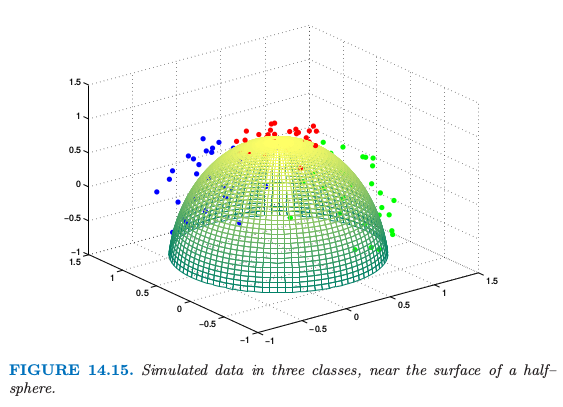
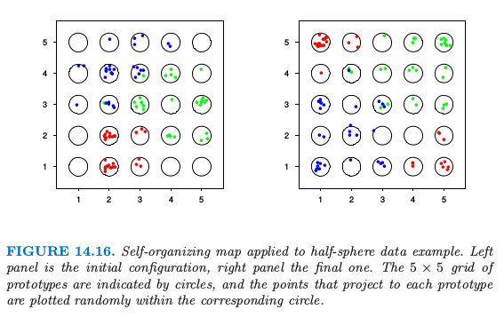
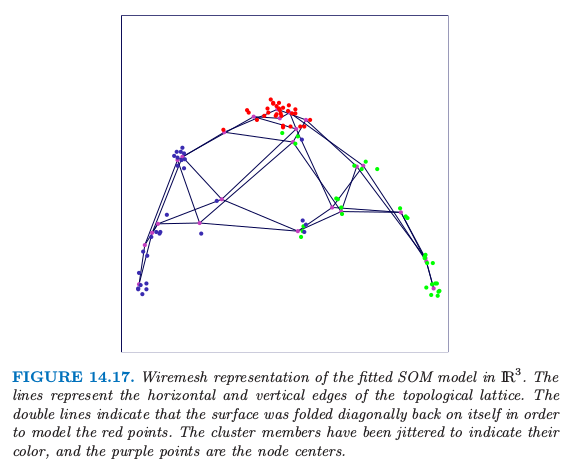
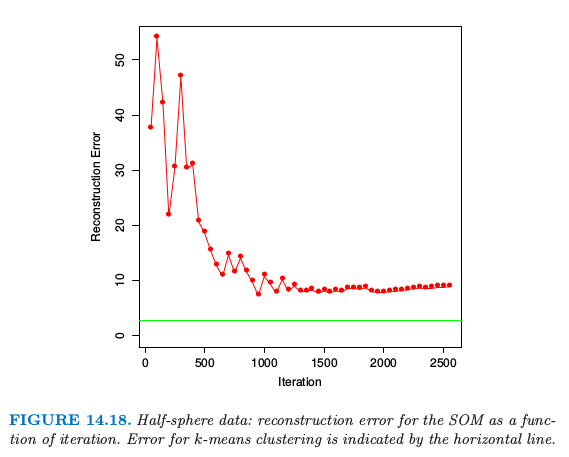
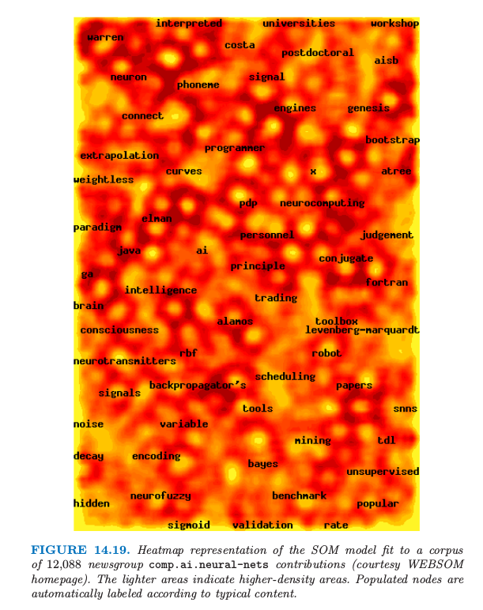
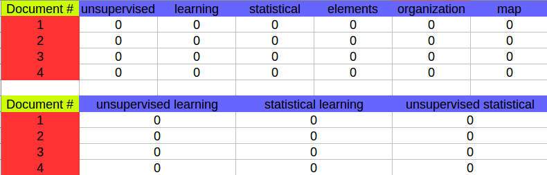

# 14.4 自组织图

| 原文   | [The Elements of Statistical Learning](https://web.stanford.edu/~hastie/ElemStatLearn/printings/ESLII_print12.pdf) |
| ---- | ---------------------------------------- |
| 翻译   | szcf-weiya                               |
| 发布 | 2016-09-30 |
| 更新 | 2019-08-04 12:28:35|
| 状态 | Done |

这个方法可以看成是 $K$ 均值聚类的带约束的版本，其中原型落在特征空间的一维或二维流形中．因为原始的高维观测可以映射到二维的坐标系统中, 所以得到的流形也被称作 **约束拓扑图 (constrained topological map)**．原始的 **自组织图 (self-organizing maps, SOM)** 算法是 online 进行的——每次处理一个观测——后来提出了批量处理的版本．这个技巧也与 **主曲线和主曲面 (principal curves and surfaces)** 有着密切的联系，这将在下一节中进行讨论．

我们考虑 $K$ 个原型 $m_j\in \IR^p$ 的二维长方形网格的 SOM（也有其它的选择，如六边形网格）．这 $K$ 个原型用整数坐标对 $\ell_j\in\cal Q_1\times \cal Q_2$ 进行参量化．这里 $\cal Q_1=\\{1,2,\ldots,q_1\\}$，$\cal Q_2$ 也类似，并且 $K=q_1\cdot q_2$．举个例子， $m_j$ 初始化后落在数据的二维主平面上（下一节进行讨论）．我们可以将这些原型看成是“纽扣 (button)”，以正常的方式“缝 (sewn)”在主成分平面上．SOM 过程试图弯曲平面使得这些纽扣尽可能近似数据点．一旦模型拟合好，这些观测可以映射到二维网格中．

每次处理一个观测 $x_i$．我们在 $\IR^p$ 中寻找离 $x_i$ 的欧式距离最近的原型 $m_j$，接着对于 $m_j$ 所有的邻居 $m_k$，通过下式将 $m_k$ 向 $x_i$ 移动

$$
m_k\leftarrow m_k+\alpha (x_i-m_k)\tag{14.46}\label{14.46}
$$

$m_j$ 的邻居定义为使得 $\ell_j$ 和 $\ell_k$ 间的距离小的所有 $m_k$．最简单的方式是采用欧式距离，通过阈值 $r$ 来决定“小”．邻域经常包含最近的原型 $m_j$ 本身．

注意到这里的距离是定义在原型的整数拓扑坐标 $\cal Q_1\times \cal Q_2$ 的空间中．式 \eqref{14.46} 的更新是将原型往数据点移动，但也是用来维持原型间的光滑的二维空间的关系．

!!! note "weiya 注："
    比如在“瑞士卷”流形上，三维中距离近的点并不意味着流形上距离近。因为最终是要得到低维表示，所以最近邻是定义在低维空间，而不是原始的高维空间，但是对点进行移动操作还是会回到高维空间本身。
    

SOM 算法的效果取决于学习速率 $\alpha$ 和距离阈值 $r$．一般地，$\alpha$ 随着迭代的进行 $\alpha$ 从 1.0 下降至 0.0．类似地，随着迭代的进行，$r$ 从初始值 $R$ 线性降至 1．我们将在下面的例子中阐释一种用来选择 $R$ 的方法．

我们已经描述了 SOM 的最简单的版本．更加复杂的版本会根据距离来更新：

$$
m_k\leftarrow m_k + \alpha h(\Vert \ell_j-\ell_k\Vert)(x_i-m_k)\tag{14.47}
$$
其中 **邻居函数 (neighborhood function)** $h$ 会给距离 $\ell_j$ 更近的 $\ell_k$ 更多的权重．

如果我们取足够小的距离 $r$ 使得每个邻域只包含一个点，则丢失了原型之间的空间联系．在这种情形下，可以证明 SOM 算法是 K 均值聚类的 online 版本，并且最后稳定在通过 K 均值找到的某个局部最小值上．因为 SOM 是 K 均值聚类的约束版本，而在任意给定的问题中检查约束是否合理是很重要的．可以计算这两种方法的重构误差 $\Vert x-m_j\Vert^2$，这需要对所有观测进行求和，于是就可以判断合理性．

举个例子来说明，我们在三维空间中半径为 1 的半球体的表面附近生成 90 个数据点．数据点在各自的类中——红、绿和蓝——落在 $(0,1,0),(0,0,1)$ 以及 $(1,0,0)$ 附近．数据点显示在图 14.15 中了．

根据我们的设定，红色的簇比绿色和蓝色的簇更加紧凑（生成数据的细节将在[练习 14.5](https://github.com/szcf-weiya/ESL-CN/issues/44)中给出．）使用了 $5\times 5$ 的原型网格，初始邻域大小为 $R=2$；这意味着接近 1/3 的原型初始化时落在各自的邻域内．

!!! note "weiya 注：$R = 2$"
    可以简单地数一数邻域里面原型的个数：

    - 四个顶点，$(1, 1), (1, 5), (5, 1), (5,5)$: 6 个
    - 中心点，$(3, 3)$: 13 个
    - $(2, 3)$: 12 个
    - $(1, 3)$: 9 个
    - ....

    平均下来，大概 1/3 的样子。

我们对数据集中的 90 个观测总共进行了 40 次的 pass，并且让 $r$ 和 $\alpha$ 在 3600 次迭代中线性降低．

在图 14.16 中原型用圆圈来表示，映射到每个原型的数据点随机画在对应的圆圈中．左图显示了初始的配置，而右图显示了最终的结果．这个算法能够成功地将类别分开，然而，红色类别的分离表明流形在自身有折叠（图 14.17)．因为没有使用二维的距离，没有迹象能表明 SOM 投射中关于红色簇比其它的簇更紧．

!!! info "weiya 注：Ex. 14.5"
    重现了图 14.16 和图 14.18，详见 [Issue 44: Ex. 14.5](https://github.com/szcf-weiya/ESL-CN/issues/44).

图 14.18 显示了重构误差，重构误差等于每个数据点距其原型的距离的平方的和．为了比较，我们也应用了有 25 个重心的 K 均值聚类，并且在图中用水平线表面其重构误差．我们可以看到 SOM 显著降低了误差，接近了 K 均值解的水平．这表明 SOM 使用的二维约束对于特定的数据集是合理的．

在 SOM 的批量处理版本中，通过下式来更新 $m_j$

$$
m_j=\frac{\sum w_kx_k}{\sum w_k}\tag{14.48}
$$

上式是对映射到 $m_j$ 的邻居 $m_k$ 上的点 $x_k$ 进行求和．权重函数可能是长方形的，也就是，$m_k$ 的权重都等于1，或者像之前一样随着距离 $\Vert \ell_k-\ell_j\Vert$ 光滑下降．如果邻域选得足够小，使得它仅仅包含 $m_k$，在长方形权重下，这退化为前面描述的 $K$ 均值聚类．可以看成是主曲线和主曲面（将在 [14.5 节](14.5-Principal-Components-Curves-and-Surfaces/index.html)中讨论）的离散版本．

## 例子：文件组织与检索

文件检索随着互联网以及 Web 的快速发展变得越来越重要，SOMs 被证明是组织和索引大型的语料库的有用方法．这个例子取自 WEBSOM 的主页 http://websom.hut.fi/ (Kohonen et al., 2000[^1])．图 14.19 展现了对 12088 篇新闻组 `comp.ai.neural-nets` 的文章进行 SOM 拟合的结果．标签是通过 WEBSOM 软件自动产生的，并且提供了结点的主要内容的说明．

在像这样的应用中，文件需要预处理得到特征向量．构造了 term-document 矩阵，其中每一行表示单篇的文章．每一行的值为预先定义的项的相对频率．这些项可以是一大套字典条目（50,000 个单词），或者是更大的双字母组(单词对)的集合，或者是这些的子集．

!!! note "weiya 注"
    term-document 矩阵示意图如下
    
    图中第一个每一行的值是每个单词的相对频率，而第二个每一行的值是双字母组的相对频率．

这些矩阵往往非常稀疏，因此经常预处理来降低特征（列）的个数．有时使用 SVD 来对矩阵降维； Kohonen et al. (2000)[^1] 采用 SVD 的随机版本．这些降维后的向量作为 SOM 的输入．

在这个应用中，作者发展出了“zoom”功能，它允许与图进行交互操作以得到更多的细节．zooming 的最后一层检索到实际的新闻文章，接着便可以进行阅读．

[^1]: Kohonen, T., Kaski, S., Lagus, K., Saloj¨arvi, J., Paatero, A. and Saarela, A. (2000). Self-organization of a massive document collection, IEEE Transactions on Neural Networks 11(3): 574–585. Special Issue on Neural Networks for Data Mining and Knowledge Discovery.
