# 14.5 主成分，主曲线和主曲面

| 原文   | [The Elements of Statistical Learning](https://web.stanford.edu/~hastie/ElemStatLearn/printings/ESLII_print12.pdf#page=553) |
| ---- | ---------------------------------------- |
| 翻译   | szcf-weiya                               |
| 发布 | 2016-11-23 |
|更新|2020-05-15 15:46:43|
|状态| Done|

!!! note "更新笔记"
    @2018-01-18 完成第一小节（不包含例子），并完成[Ex. 14.7](https://github.com/szcf-weiya/ESL-CN/issues/45)
    @2018-01-19 完成主曲线（面）和谱聚类．

主成分已经在 [3.4.1 节](../03-Linear-Methods-for-Regression/3.4-Shrinkage-Methods/index.html)中讨论了，主成分阐释了岭回归的收缩机理．主成分是数据的一系列投影，互相不相关且按照方差大小排序．在下一节我们将要把主成分表示成逼近 $N$ 个点 $x_i\in \IR^p$ 的 **线性流形 (linear manifolds)**．接着在 [14.5.2 节](#_3)讨论非线性的推广．最近提出的关于非线性逼近流形的方法将在 [14.9 节](14.9-Nonlinear-Dimension-Reduction-and-Local-Multidimensional-Scaling/index.html)讨论．

!!! note "weiya 注：流形学习"
    参考[@Jason Gu](https://www.zhihu.com/question/24015486/answer/26524937)的知乎回答,

    > 流形学习（manifold learning）是机器学习、模式识别中的一种方法，在维数约简方面具有广泛的应用。它的主要思想是将高维的数据映射到低维，使该低维的数据能够反映原高维数据的某些本质结构特征。流形学习的前提是有一种假设，即某些高维数据，实际是一种低维的流形结构嵌入在高维空间中。流形学习的目的是将其映射回低维空间中，揭示其本质。

## 主成分

$\IR^p$ 中数据的主成分给出了这些数据在秩 $q\le p$ 下最好的线性逼近．

记观测值为 $x_1,x_2,\ldots,x_N$，然后考虑用秩为 $q$ 的线性模型来表示它们

$$
f(\lambda)=\mu+\mathbf V_q\lambda\tag{14.49}\label{14.49}
$$

其中，$\mu$ 是 $\IR^p $中的位置向量，$\mathbf V_q$ 是有 $q$ 个正交单位列向量的 $p\times q$ 的矩阵，$\lambda$ 是一个 $q$ 维的参数向量．这是一个秩为 $q$ 的仿射超平面的系数表示．图 14.20 和图 14.21 分别展示了$q=1$ 和 $q=2$ 的情形．对数据进行最小二乘拟合这个模型等价最小化 **重构误差 (reconstruction error)**

$$
\underset{\mu,\{\lambda_i\},\mathbf V_q}{\min}\sum\limits_{i=1}^N\Vert x_i-\mu-\mathbf V_q\lambda_i\Vert^2\tag{14.50}
$$

我们可以对上式关于 $\mu$ 和 $\lambda_i$（[练习 14.7](https://github.com/szcf-weiya/ESL-CN/issues/45)）求微分得到

$$
\begin{align}
\hat\mu&=\bar x\tag{14.51}\label{14.51}\\
\hat\lambda_i&=\mathbf V_q^T(x_i-\bar x)\tag{14.52}\label{14.52}
\end{align}
$$

!!! note "weiya注: Ex. 14.7"
    \eqref{14.51} 和 \eqref{14.52} 的解并不是唯一的，$\mu -\bar x$ 属于 $\mathbf I-\V_q\V_q^T$ 的 Null Space，而注意到 $\mathrm{rank}(\mathbf I-\V_q\V_q^T) = p-q >0$（除非 $q=p$），所以解不唯一。
    具体解题过程参见 [Issue: Ex. 14.7](https://github.com/szcf-weiya/ESL-CN/issues/45)

接下来需要去寻找正交矩阵 $\mathbf V_q$:

$$
\underset{\mathbf V_q}{\min}\sum\limits_{i=1}^N\Vert (x_i-\bar x)-\mathbf V_q\mathbf V_q^T(x_i-\bar x)\Vert^2\tag{14.53}\label{14.53}
$$

为了方便，我们假设 $\bar x=0$（否则我们只需要简单地对数据进行中心化 $\tilde x_i=x_i-\bar x$）．$p\times p$ 矩阵 $\mathbf H_q=\mathbf V_q\mathbf V_q^T$ 是 **投影矩阵 (projection matrix)**，并且将每个点 $x_i$ 投影到它的秩为 $q$ 的重构 $\mathbf H_qx_i$ 上，这是 $x_i$ 在由 $\mathbf V_q$ 的列张成的子空间上的正交投影．

!!! note "weiya 注：投影矩阵"
    投影是从一个向量空间到其自身的线性变换，并且投影矩阵满足$\mathbf P^2=\mathbf P$．
    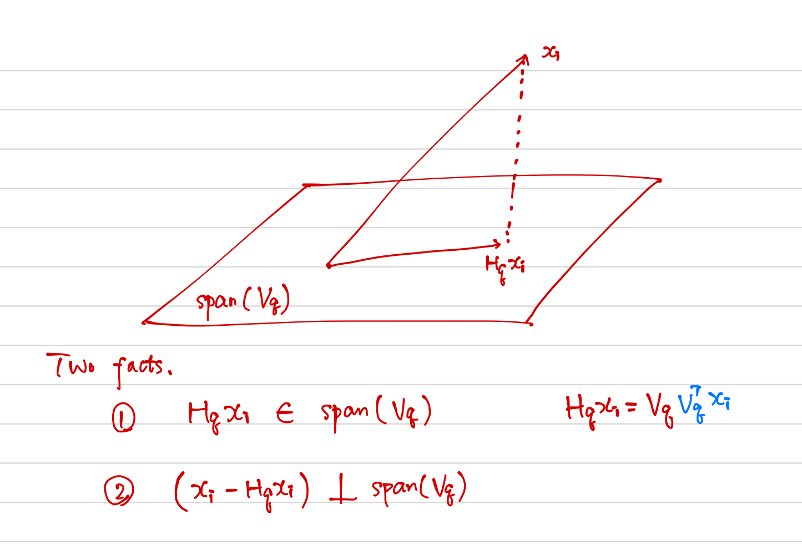
    首先，根据$\mathbf H_qx_i=\mathbf V_q\mathbf V^T_qx_i$可以得出投影点是在$\mathbf V_q$的列所张成的子空间中；其次，对于该子空间中任一点 $\mathbf V_qy$，因为
    $$
    \begin{align}
    (x_i-\mathbf H_qx_i)\cdot \mathbf V_qy_i&=(\mathbf I-\mathbf H_q)x_i\cdot \mathbf V_qy_i\\
    &=x_i^T(\mathbf I-\mathbf H_q)^T\mathbf V_qy_i\\
    &=x_i^T\mathbf O_{p\times q}y_i\\
    &=0
    \end{align}
    $$
    故为正交投影．

\eqref{14.53} 的解可以按如下形式表示．将（中心化的）观测值放进 $N\times p$ 的矩阵 $\mathbf X$ 的行中．构造 $\mathbf X$ 的奇异值分解：

$$
\mathbf{X=UDV^T}\tag{14.54}\label{14.54}
$$

这是数值分析中标准的分解，并且对该分解有很多的算法（比如，Golub and Van Loan, 1983[^1]）．这里 $\mathbf U$ 是$N\times p$ 的正交矩阵 ($\mathbf{U^TU}=\mathbf I_p$)，它的列向量 $\mathbf u_j$ 称为 **左奇异向量 (left singular vectors)**，$\mathbf V$ 是$p\times p$ 的正交矩阵 ($\mathbf V^T\mathbf V=\mathbf I_p$)，其中的列向量 $\mathbf v_j$ 称之为 **右奇异向量 (right singular vectors)**．对每个秩 $q$，\eqref{14.53} 的解 $\mathbf V_q$ 包含 $\mathbf V$ 的前 $q$ 列．$\mathbf{UD}$ 的列称为 $\mathbf X$ 的主成分（见 [3.5.1 节](../03-Linear-Methods-for-Regression/3.5-Methods-Using-Derived-Input-Directions/index.html#_1)）．\eqref{14.52} 中 $N$ 个最优的 $\hat\lambda_i$ 由前 $q$ 个主成分给出（$N\times q$ 的矩阵 $\mathbf U_q\mathbf D_q$ 的 $N$ 个行向量）．

图 14.20 展示了 $\IR^2$ 中的一维主成分分析．

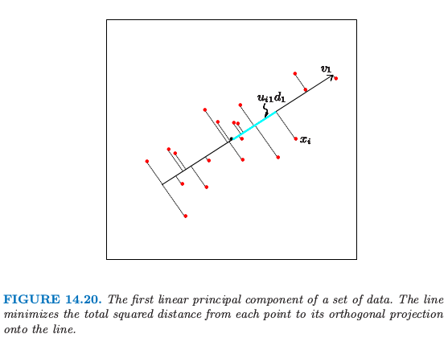

对于每个数据点 $x_i$，在直线上有个离它最近的点，由 $u_{i1}d_1v_1$ 给出．这里 $v_1$ 是该直线的方向，并且 $\hat \lambda_i=u_{i1}d_1$ 衡量了沿着直线离原点的距离．类似地，图 14.21 展示了拟合 half-sphere 数据的二维主成分曲面（左图）．右图显示了数据在前两个主成分上的投影．这个投影是之前介绍的 SOM 方法的初始化的基础．这个过程在分离簇方面表现得非常成功．因为 half-sphere 是非线性的，非线性的投影会做得更好，这将是下一节的主题．

主成分还有许多其它的性质，举个例子，线性组合 $\mathbf Xv_1$ 在特征的所有线性组合中有最大的方差；$\mathbf Xv_2$ 在满足$v_2$ 正交 $v_1$ 的所有线性组合中有最大的方差，以此类推．

### 例子：手写数字

主成分是降低和压缩维度的有效工具．我们用第一章中描述的手写数字的例子来说明这个特点．图 14.22 显示了从 658 个 ‘3’ 中抽取的 130 个 ‘3’ 的样本，每一个都是 **数字化的 (digitized)** $16\times 16$ 的灰度图象．我们看到书写风格、字体粗细以及字体方向上有显著差异．我们将这些图象看成是 $\IR^{256}$ 中的点 $x_i$，并且通过 SVD \eqref{14.54} 来计算它们的主成分．

图 14.23 显示了这些数据的前两个主成分．

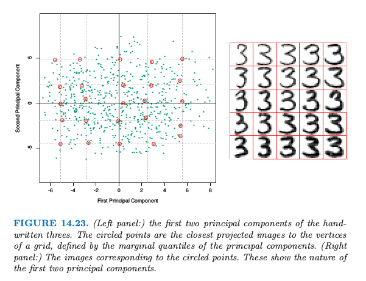

对于前两个主成分 $u_{i1}d_1$ 和 $u_{i2}d_2$，我们计算 5%, 25%, 50%, 75%, 95% 分位数，并且用它们去定义叠加在图中的长方形网格．圆点表明靠近该网格顶点的图象，而距离主要用这些投影点的坐标来衡量，但也给正交子空间中的组分一些权重．右图显示了对应这些圆点的图象．这帮助我们观察前两个主成分的本质．我们看到 $v_1$（水平方向）主要与手写‘3’的下尾有关，而 $v_2$（垂直方向）与字体粗细有关．用 \eqref{14.49} 的参数化模型表示，这两个组分的模型有如下形式

<!--
$$
\begin{align}
\hat f(\lambda)&=\bar x+\lambda_1b_1+\lambda_2v_2\\
&=\includegraphics[height=5.6ex]{../img/14/s1.png}+\lambda_1\cdot
\includegraphics[height=5.6ex]{../img/14/s2.png}+\lambda_2\cdot
\includegraphics[height=5.6ex]{../img/14/s3.png}
\end{align}
$$
-->
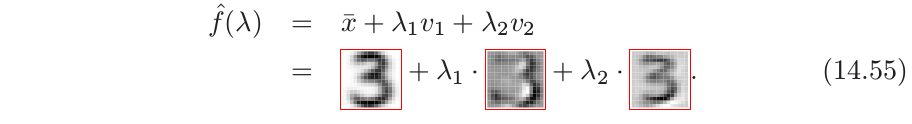

这里我们以图象形式展示了前两个主成分的方向，$v_1$ 和 $v_2$．尽管有 256 个可能的主成分，但大约 50 个主成分解释了 90% 的方差，12 个主成分解释了 63% 的方差．

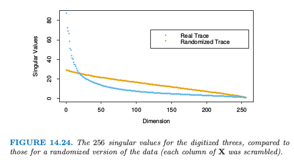

图 14.24 比较了奇异值和相等大小的不相关数据的奇异值，后者通过对 $\mathbf X$ 的每一列进行随机扰动得到．

!!! note "weiya 注：奇异值"
    在 SVD 分解中，$\mathbf{D}$ 为 $p\times p$ 的对角矩阵，对角元 $d_1\ge d_2 \ge \cdots \ge d_p \ge 0$ 称作 $\mathbf{X}$ 的奇异值．如果一个或多个 $d_j=0$，则 $\mathbf{X}$ 为奇异的．

数字图象中的像素点本质上是相关的，而且因为所有这些图象都是同一个数字，因此相关性甚至更强．相对小的主成分子集可以看成表示高维数据的极佳低维特征．

### 例子：Procrustes 转换和形状平均

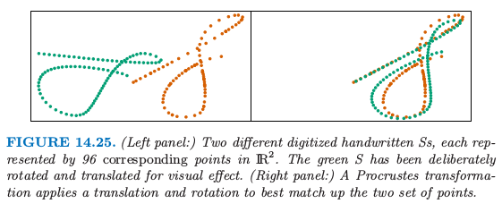

图 14.25 在同一张图中展示了两个集合的点，橘黄色和绿色．这个例子中，这些点表示手写'S'的两个数字化版本，这是从"Suresh"签名中提取的．图 14.26 展示了整个签名（第三和第四幅图）．这些签名是采用 touch-screen 设备（超市中很常见的设备）动态采集的．每个 $S$ 用 $N=96$ 个点来表示，记为 $N\times 2$ 的矩阵 $\mathbf X_1$ 和 $\mathbf X_2$．这些点之间存在对应关系，$\mathbf X_1$ 和 $\mathbf X_2$ 的第 $i$ 行表示沿着两个'S'的同一位置．用 **形态测量 (morphometrics)** 的术语说就是这些点表示两个物体的 landmarks．怎样寻找这样一个 landmark 一般是很困难的，而且因情况而异．在这里，我们采用沿着每个签名的速度信号的 dynamic time warping (Hastie et al., 1992[^2])，但是在这里不展开讨论．

!!! note "weiya 注：warping function"
    听过的一个报告 [Registration Problem in Functional Data Analysis](https://stats.hohoweiya.xyz/2020/01/21/registration/)，其中介绍到为了将曲线 $w_i$ 匹配到参考曲线 $w_j$，我们需要一个 **翘曲函数 (warping function)** $h_i(t)$ 使得
    $$
    w_i^\star(t) = w_i[h_i(t)]
    $$
    以及
    $$
    w_i^\star(t_{j,\text{landmark}}) \approx w_j(t_{j,\text{landmark}})\,.
    $$

右图中，我们已经对绿色点已经采用了 **平移 (translation)** 和 **旋转 (rotation)** 的方式来尽可能与橘黄色点匹配——这称之为 Procrustes 变换（如，Mardia et al., 1979[^3]）．

!!! note "weiya 注：Procrustes 变换"
    **普罗库鲁斯提斯 (Procrustes)** 是希腊神话中非洲的一个土匪，他经常用一个铁床来折磨别人，把抓来的人绑在铁床上，然后根据铁床的长度来裁剪他们的身体长度：那些身材短的人被拉长，那些身材长的人被砍掉多余的部分．

考虑下面的问题：

$$
\underset{\mu, \mathbf R}{\min}\Vert \mathbf X_2-(\mathbf X_1\mathbf R+\boldsymbol 1\mu^T)\Vert_F\tag{14.56}\label{14.56}
$$

其中 $\mathbf X_1$ 和 $\mathbf X_2$ 都是对应点的 $N\times p$ 矩阵，$\mathbf R$ 是标准正交 $p\times p$ 的矩阵，$\mu$ 是 $p$ 维的位置向量．

!!! note "原书注：$\mathbf R$"
    为了简化问题，只考虑包含反射和旋转的正交矩阵（$O(p)$群）；尽管这里不可能有反射，这些方法可以进一步限制为只允许旋转（$SO(p)$群）．

这里 $\Vert \mathbf X\Vert_F^2=\trace(\mathbf X^T\mathbf X)$ 是 Frobenius 矩阵范数的平方．

令 $\bar x_1$ 和 $\bar x_2$ 是矩阵的列均值向量，$\tilde{\mathbf X}_1$ 和 $\tilde{\mathbf X}_2$ 是这些矩阵减去均值得到的．考虑 SVD 分解 $\tilde {\mathbf X}_1^T\tilde{\mathbf X}_2=\mathbf U\mathbf D\mathbf V^T$．则 \eqref{14.56} 的解由下式给出（[练习 14.8](https://github.com/szcf-weiya/ESL-CN/issues/46)）

!!! info "weiya 注：Ex. 14.8"
    已解决，详见 [Issue 46: Ex. 14.8](https://github.com/szcf-weiya/ESL-CN/issues/46).

$$
\begin{align*}
\hat{\mathbf R}&=\mathbf U\mathbf V^T\\
\hat\mu&=\bar x_2-\hat{\mathbf R}\bar x_1
\end{align*}
\tag{14.57}
$$

并且这个最小距离被称为 Procrustes 距离．从该解的形式来看，我们可以将每个矩阵在其列中心点处进行中心化，接着完全忽略掉位置向量．下文假设是这种情形．

**带尺度的 Procrustes 距离 (Procrustes distance with scaling)** 解决了更一般的问题

$$
\underset{\beta,\mathbf R}{\min}\Vert \mathbf X_2-\beta\mathbf X_1\mathbf R\Vert_F\tag{14.58}
$$

其中 $\beta>0$ 是正的标量值．$\mathbf R$ 的解和前面一样，$\hat\beta=\trace(D)/\Vert \mathbf X_1\Vert_F^2$.

与 Procrustes 距离有关的是 $L$ 个形状的 Procrustes 平均，它解决了下面的问题

$$
\underset{\{\mathbf R_\ell\}_1^L,M}{\min}\sum\limits_{\ell=1}^L\Vert \mathbf X_\ell \mathbf R_\ell -\mathbf M\Vert_F^2\tag{14.59}\label{14.59}
$$

也就是，寻找到所有形状的平均 Procrustes 距离平方最近的形状 $\mathbf M$．这可以通过简单的算法实现：

0. 初始化 $\mathbf M=\mathbf X_1$（举个例子）
1. 固定 $\mathbf M$，求解 $L$ 个 Procrustes 旋转问题，得到 $\mathbf X_\ell'\leftarrow \mathbf X\hat{\mathbf R}_\ell$
2. 令 $\mathbf M\leftarrow \frac 1L\sum\limits_{\ell=1}^L\mathbf X_\ell'$

重复步骤 2 和 3 准则直至 \eqref{14.59} 收敛．

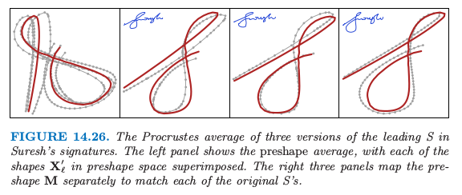

图 14.26 显示了三个形状的简单例子．注意到我们仅仅希望得到旋转的一个解；另外，我们加上约束，使得 $\mathbf M$ 是上三角形式，来强制解是唯一的．我们可以很简单地把缩放合并到定义 \eqref{14.59}；见[练习 14.9](https://github.com/szcf-weiya/ESL-CN/issues/47)．

!!! info "weiya 注：Ex. 14.9"
    已解决，详见 [Issue 47: Ex. 14.9](https://github.com/szcf-weiya/ESL-CN/issues/47).

更一般地，我们可以通过下式来定义一系列形状的 affine-invariant 平均：

$$
\underset{\{\mathbf A_\ell\}_1^L,\mathbf M}{\min}\sum\limits_{\ell=1}^L\Vert\mathbf X_\ell\mathbf A_\ell-\mathbf M\Vert_F^2\tag{14.60}
$$

其中 $\mathbf A_\ell$ 是任意 $p\times p$ 的非奇异矩阵．这里我们要求标准化，使得 $\mathbf M^T\mathbf M=\mathbf I$，来避免平凡解．这个解是吸引人的，并且可以不用迭代便可以计算（[练习 14.10](https://github.com/szcf-weiya/ESL-CN/issues/48)）：

1. 令 $\mathbf H_\ell=\mathbf X_\ell(\mathbf X_\ell^T\mathbf X_\ell)^{-1}\mathbf X_\ell^T$ 为由 $\mathbf X_\ell$ 定义的秩为 $p$ 的投影矩阵
2. $\mathbf M$ 是 $N\times p$ 的矩阵，其由 $\bar{\mathbf H}=\frac{1}{L}\sum\limits_{\ell=1}^L\mathbf H_\ell$ 的最大 $p$ 个特征向量所构成

!!! info "weiya 注：Ex. 14.10"
    已解决，详见 [Issue 48: Ex. 14.10](https://github.com/szcf-weiya/ESL-CN/issues/48).

## 主曲线和主曲面

主曲线推广了主成分直线，用一维光滑曲线来近似 $\IR^p$ 中的数据点．主曲面更一般化，它给出了二维或更高维的流形近似．

我们首先定义随机变量 $X\in \IR^p$ 的主曲线，然后讨论有限数据的情形．令 $f(\lambda)$ 为 $\IR^p$ 中参数化的光滑曲线．因此 $f(\lambda)$ 是有着 $p$ 个坐标的向量函数，每个都是关于单参数 $\lambda$ 的光滑函数．举个例子，可以选择参数 $\lambda$ 为沿着曲线到固定原点的弧长．对于每个数据点 $x$，令 $\lambda_f(x)$ 为曲线上离 $x$ 最近的点．如果满足

$$
f(\lambda) = \E(X\mid \lambda_f(X)=\lambda)\tag{14.61}\label{14.61}
$$

则 $f(\lambda)$ 称为随机向量 $X$ 的分布的主曲线．这也就是说 $f(\lambda)$ 是投影到曲线上的所有数据点的平均，这些点也称为有“责任”的点．这也称作 self-consistency 性质．尽管在实际中，多元连续随机变量的分布有无穷多个主曲线(Duchamp and Stuetzle, 1996[^4])，但是我们主要对光滑的主曲线感兴趣．图 14.27 展示了一个主曲线．

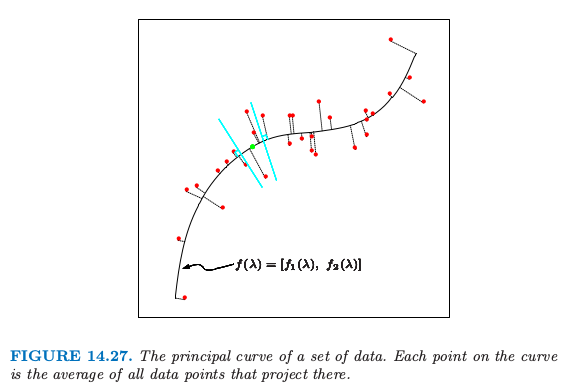

!!! note "weiya 注："
    主成分可以看成是主曲线的特殊情形。
    首先，\eqref{14.49} 可以写成
    $$
    f(\lambda) = [\mu + \V_{q1}\lambda, \mu + \V_{q2}\lambda, \ldots, \mu + \V_{qp}\lambda]\,,
    $$
    其中 $\V_{qi}$ 是 $\V_q$ 的第 $i$ 个行向量.
    其次，对比图 14.20 和图 14.27，

**主点 (Principal points)** 是与之相关的一个有趣的概念．考虑含 $k$ 个原型的集合，对于在分布的支撑集中的每个点 $x$，选出最近的原型，也就是，为之负责的那个原型．这导出了对特征空间的划分，得到 Voronoi 区域．这 $k$ 个点最小化了 $X$ 到其原型的期望距离，它们称为该分布的主点．每个主点是 self-consistent，因为它等于其 Voronoi 区域的 $X$ 的均值．举个例子，当 $k=1$，一个 **[圆形正态分布](https://en.wikipedia.org/wiki/Von_Mises_distribution)** 的主点是均值向量；当 $k=2$ 时，成对的点对称排列在通过均值向量的射线上．主点类似 $K$-means 聚类中的重心的分布．主曲线可以看成是 $k=\infty$ 时的主点，但是限制为光滑曲线，用类似的方式，SOM 限制 K-means 聚类中心的落在一个光滑流形上．

!!! question "weiya 注："
    [Issue 197: Self-consistency of pricipal points? Reasons for k = 1, 2, 3? ](https://github.com/szcf-weiya/ESL-CN/issues/197)

为了寻找某分布的主曲线 $f(\lambda)$，我们考虑坐标函数 $f(\lambda)=[f_1(\lambda),f_2(\lambda),\ldots, f_p(\lambda)]$，并且令$X^T=(X_1, X_2,\ldots, X_p)$．考虑下面的轮换过程：

$$
\begin{align*}
(a) & \hat{f_j}(\lambda)\leftarrow \E(X_j\mid \lambda(X)=\lambda); \;j=1,2,\ldots, p\\
(b) & \hat \lambda_f(x)\leftarrow \argmin_{\lambda'}\Vert x-\hat f(\lambda')\Vert^2
\end{align*}
\tag{14.62} \label{14.62}
$$

第一个等式固定 $\lambda$，并且加上 self-consistentcy 的要求 \eqref{14.61}．第二个等式固定曲线，并在曲线上寻找距离每个点最近的点．在有限的数据情形下，主曲线算法以线性主成分开始，迭代 \eqref{14.62} 中的两步直至收敛．散点图光滑器用于估计步骤 (a) 中的条件期望，这通过将每个 $X_j$ 看成关于弧长 $\hat \lambda(X)$ 的函数来光滑，而且 (b) 中的投影对于每个观测数据点来实现．证明一般情况下的收敛是很困难的，但是可以证明如果散点图光滑中采用线性最小二乘拟合，则该过程将会收敛至第一线性主成分，这等价寻找矩阵最大特征值的幂法．

主曲面与主曲线有着完全相同的形式，不过是在更高维度下的．使用最普遍的是二维主曲面，其坐标函数为

$$
f(\lambda_1,\lambda_2)=[f_1(\lambda_1,\lambda_2),\ldots, f_p(\lambda_1, \lambda_2)]
$$

上述步骤(a)中的估计通过二维曲面光滑器得到．维数大于2的主曲面很少用到，因为在高维光滑的可视化不是很吸引人．

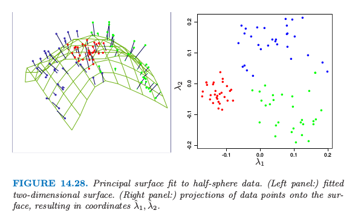

图 14.28 展示了对 half-sphere 数据进行主曲面光滑的结果．图中将数据点看成是估计的非线性坐标 $\hat \lambda_1(x_i), \hat \lambda_2(x_i)$ 的函数．图中的类别划分是很显然的．

!!! note "weiya 注：Recall"
    $$
    m_j=\frac{\sum w_kx_k}{\sum w_k}\tag{14.48}\label{14.48}
    $$

主曲面非常类似 **自组织图 (self-organizing maps)**．如果我们采用核曲面光滑器来估计坐标函数 $f_j(\lambda_1,\lambda_2)$，这与 SOMs 的 batch 版本 \eqref{14.48} 有着相同的形式．SOM 的权重 $w_k$ 恰恰是核的权重．然而，有一个区别，主曲面估计对每个数据点 $x_i$ 估计单独的原型 $f(\lambda_1(x_i),\lambda_2(x_i))$，而 SOM 会在所有数据中间共享一小部分的原型点．结果是，SOM 与主曲面仅仅当 SOM 原型的个数非常大时两者才一致．

两者之间还有一个概念上的区别．主曲面给出了关于坐标函数的整个流形的光滑参量化，而 SOMs 是离散的并且仅仅产生近似数据的那些估计的原型．主曲面的光滑参量化保持局部的距离：在图 14.28 中，红色聚类点比绿色或蓝色聚类点更紧凑．

!!! note "weiya 注：Recall"
    对于 SOM, 因为没有使用二维的距离，没有迹象能表明 SOM 投射中关于红色簇比其它的簇更紧．

在简单的例子中，估计的坐标函数本身是可以知道的：见[练习 14.13](https://github.com/szcf-weiya/ESL-CN/issues/49)．

!!! info "weiya 注：Ex. 14.13"
    已解决，详见 [Issue 49: Ex. 14.13](https://github.com/szcf-weiya/ESL-CN/issues/49).

##　谱聚类

像 K-means 这样传统的聚类方法采用 spherical 或者 elliptical 度量来对数据点进行划分．因此当簇是非凸的时候效果并不好，比如图 14.29 中左上角的同心圆．

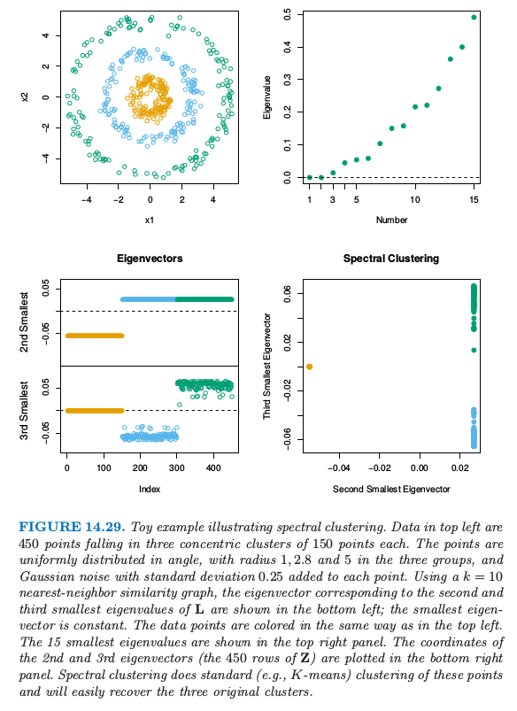

谱聚类是标准聚类方法的推广，而且也是为这些情形所设计的．它与局部多维缩放技巧有着紧密的联系（[14.9 节](14.9-Nonlinear-Dimension-Reduction-and-Local-Multidimensional-Scaling/index.html)）．

出发点是所有观测点对间的成对相似性 $s_{ii'}\ge 0$ 构成的 $N\times N$ 矩阵．我们将这些观测用无向相似性图 $G=\langle V, E \rangle$ 来表示．$N$ 个顶点 $v_i$ 表示观测值，如果成对顶点的相似性为正值（或者超出某个阈值），则它们之间用一条边相连．边的权重为 $s_{ii'}$．我们希望对这个图进行划分，使得不同类之间的边有较低的权重，而在类间有着较高的权重．在谱聚类中，思想是构造相似性图来表示观测点间的局部邻居关系．

更精确地，考虑 $N$ 个点 $x_i\in \IR^p$，令 $d_{ii'}$ 为 $x_i$ 和 $x_{i'}$ 间的欧几里得距离．我们将 **radical-kernel gram** 矩阵作为我们的相似性矩阵；也就是 $s_{ii'}=\exp(-d_{ii'}^2/c)$，其中 $c > 0$ 是缩放参数．

有许多方式来定义相似性矩阵及其反映局部行为的相似性图．最流行的方式是 **mutual K-nearest-neighbor graph**．定义 ${\cal{N}}\_K$ 为邻居点的对称子集；特别地，如果点 $i$ 在 $i'$ 的 $K$-最近邻中，则点对 $(i,i')$ 在 ${\cal{N}}\_K$ 中，反之亦然．接着我们连接所有的对称最近邻，然后给出边的权重 $w_{ii'}=s_{ii'}$；否则边的权重为 $0$．等价地，我们对不属于 $\cal{N}_K$ 的点的成对相关性赋为 $0$，然后画出这个修改版本的矩阵的图．

另外，全连接图包含所有的成对边，权重为 $w_{ii'}=s_{ii'}$，局部行为通过缩放参数 $c$ 来控制．

从相似图得到的边的矩阵 $\mathbf W=\\{w_{ii'}\\}$ 称为 **邻接矩阵 (adjacency matrix)**．结点 $i$ 的 **度(degree)** 为 $g_i=\sum_iw_{ii'}$，这是与该点相连的权重之和．令 $\mathbf G$ 表示对角元为 $g_i$ 的对角矩阵．

最后，graph laplacian 定义为

$$
\mathbf{L=G-W}\tag{14.63}\label{14.63}
$$

这称为未标准化的 graph lapacian，人们提出一系列标准化的版本——对 laplacian 关于结点的度进行标准化，举个例子，$\tilde{\mathbf L}=\mathbf I-\mathbf G^{-1}\mathbf W$．

谱聚类寻找 $\mathbf L$ 最小的 $m$ 个特征值对应的 $m$ 个特征向量 $\mathbf Z_{N\times m}$（忽略平凡的常值特征向量）．采用如 K-means 的标准方法，我们可以对 $\mathbf Z$ 的行聚类得到原始数据点的聚类．

图 14.29 展示了一个例子．左上图显示了 3 个圆形类别中的 450 个模拟数据点．K-means 聚类很明显对于簇外的点不容易进行分类．我们采用 10 最近邻相似图的谱聚类，并且左下图展示了对应 graph laplacian 的第二和第三最小特征值的特征向量．这两个特征向量找出了是哪个簇，并且特征向量矩阵 $\mathbf Y$ 的行的散点图清晰地将簇分隔开．对变换后的点应用 K-means 聚类的过程同样能得到三个类．

为什么谱聚类有效？对于任意向量 $\mathbf f$，我们有

$$
\begin{align*}
\mathbf f^T\mathbf L\mathbf f&=\sum\limits_{i=1}^Ng_if_i^2-\sum\limits_{i=1}^N\sum\limits_{i'=1}^Nf_if_{i'}w_{ii'}\\
& = \frac{1}{2}\sum\limits_{i=1}^N\sum\limits_{i'=1}^Nw_{ii'}(f_i-f_{i'})^2\tag{14.64}\label{14.64}
\end{align*}
$$
公式 \eqref{14.64} 表明如果有较大邻接 $w_{ii'}$ 的数据对的坐标 $f_i$ 和 $f_{i'}$ 很接近，则 $\mathbf f^T\mathbf L\mathbf f$ 将达到较小的值．

因为对于任意的图 $\boldsymbol 1^T\mathbf L\boldsymbol 1=0$，常值向量是特征值为 0 的平凡解．如果图是连接的，这是唯一的 0 特征向量，这个结论并不是很显然（[练习 14.21](https://github.com/szcf-weiya/ESL-CN/issues/183)）．推广这个结论，可以很简单地证明对于有 $m$ 个连接组分的图，能重新排列结点使得 $\mathbf L$ 是成块对角的，其中每个块是连接的组分．于是 $\mathbf L$ 有 $m$ 个特征值为 0 的特征向量，并且特征值为 0 的特征空间由连接组分的指示向量张成．实际上，连接有强有弱，则零特征值也可以用较小的特征值代替．

!!! info "weiya 注：Ex. 14.21"
    已解决，详见 [Issue 183: Ex. 14.21](https://github.com/szcf-weiya/ESL-CN/issues/183).

谱聚类是寻找非凸簇的一种很有趣的方法．当采用标准化后的 graph laplacian 定义，有另外一种方式来看这种方法．定义 $\mathbf P=\mathbf G^{-1}\mathbf W$，我们考虑在图上以转移概率矩阵 $\mathbf P$ 进行随机游走．则谱聚类得到随机游走中类与类之间不发生转移的点集．

在实际中应用谱聚类时必须要处理一系列的问题．我们必须选择相似图的类型——比如，全连接或者最近邻，以及相关的参数比如最近邻的个数 $k$ 或者核的缩放参数 $c$．我们也必须选择从 $\mathbf L$ 中提取的特征向量的个数，以及最后和所有聚类方法一样，选择簇的个数．在图 14.29 这一简单例子中，我们得到 $k\in [5, 200]$ 中良好的结果，值为 200 的对应全连接图．当 $k < 5$，结果变坏．观测图 14.29 的右上图，我们看到最小的三个特征值与剩余部分没有强烈的分离．因此选择多少个特征向量并不清楚．

## 核主成分

谱聚类与 **核主成分 (kernel principal components)** 有关联，这是线性主成分的非线性版本．标准的线性主成分 (PCA) 可以通过协方差矩阵的特征向量得到，并且给出了数据有最大方差的方向．核主成分 (KPCA) 扩充了 PCA 的范围，模仿扩充特征时采用的非线性变换方法，然后在变换后的特征空间中应用 PCA．

在 [18.5.2 节](18-High-Dimensional-Problems/18.5-Classification-When-Features-are-Unavailable/index.html)，我们展示了数据矩阵 $\X$ 的主成分变量 $\Z$ 可以通过内积矩阵 (gram 矩阵) $\K=\X\X^T$ 得到．具体地，对双重中心化的 gram 矩阵进行特征分解

$$
\tilde \K = (\I-\M)\K(\I-\M) = \U\D^2\U^T\,,
$$

其中 $\M=\1\1^T/N$, 然后我们有 $\Z=\U\D$．[练习 18.15](https://github.com/szcf-weiya/ESL-CN/issues/184) 展示了怎么计算这个空间中新观测的投影．

!!! info "weiya 注：Ex. 18.15"
    已解决，详见 [Issue 184: Ex. 18.15](https://github.com/szcf-weiya/ESL-CN/issues/184).

核主成分简单地模仿了这个过程，将核矩阵 $\K=\\{K(x_i,x_{i'})\\}$ 看成隐含特征 $\langle \phi(x_i),\phi(x_i')\rangle$ 的内积矩阵，然后寻找其特征向量．第 $m$ 个组分 $\z_m$（$\Z$ 的第 $m$ 列）的元素（在忽略中心化的情况下）可以写成 $z_{im}=\sum_{j=1}^N\alpha_{jm}K(x_i,x_j)$，其中 $\alpha_{jm} = u_{jm}/d_m$（[练习 14.16](https://github.com/szcf-weiya/ESL-CN/issues/185)）．

!!! info "weiya 注：Ex. 14.16"
    已解决，详见 [Issue 185: Ex. 14.16](https://github.com/szcf-weiya/ESL-CN/issues/185)．

将 $\z_m$ 看成主成分函数 $g_m\in\cH_K$ 在样本处的取值，其中 $\cH_K$ 是由 $K$ 生成的再生核希尔伯特空间（[5.8.1 节](/05-Basis-Expansions-and-Regularization/5.8-Regularization-and-Reproducing-Kernel-Hibert-Spaces/index.html)），这可以帮助我们进一步理解核主成分．第一主成分函数 $g_1$ 求解了

$$
\max_{g_1\in\cH_K}\Var_{\cT}g_1(X) \text{ subject to } \Vert g_1\Vert_{\cH_K}=1\tag{14.66}\label{14.66}.
$$

这里 $\Var_\cT$ 表示在训练数据 $\cT$ 上的样本方差．范数约束 $\Vert g_1\Vert_{\cH_K}=1$ 控制了函数 $g_1$ 的大小及光滑度，这由核 $K$ 控制．在回归情形中，可以证明 \eqref{14.66} 的解是有限维的，并且可以表示为 $g_1(x)=\sum_{j=1}^Nc_jK(x,x_j)$. [练习 14.17](https://github.com/szcf-weiya/ESL-CN/issues/202) 证明了这个解为 $\hat c_j=\alpha_{j1},j=1,\ldots,N$. 第二主成分函数也是类似定义的，但多了额外的限制 $\langle g_1,g_2\rangle_{\cH_K}=0$，以此类推．

!!! note "weiya 注：Ex. 14.17"
    已解决，详见 [Issue 202: Ex. 14.17](https://github.com/szcf-weiya/ESL-CN/issues/202)．

Schölkopf et al. (1999)[^5] 演示了核主成分作为手写数字分类中的特征的应用，并且说明了相对于线性主成分，分类器的表现有改善．

注意到如果我们采用径向核

$$
K(x,x')=\exp(-\Vert x-x'\Vert^2/c)\,\tag{14.67}
$$

则核矩阵 $\K$ 与谱聚类中的相似度矩阵 $\S$ 有着相同的形式．边的权重矩阵 $\W$ 是 $\K$ 的局部化版本，将不是最近邻的成对点的相似度设为 0．

核主成分寻找 $\tilde \K$ 最大特征值对应的特征向量；这等价于寻找

$$
\I - \tilde \K\tag{14.68}
$$

的最小特征值对应的特征向量．这几乎与 Laplacian \eqref{14.63} 一样，区别在于 $\tilde \K$ 的中心化和 $\G$ 对角元有结点的度．

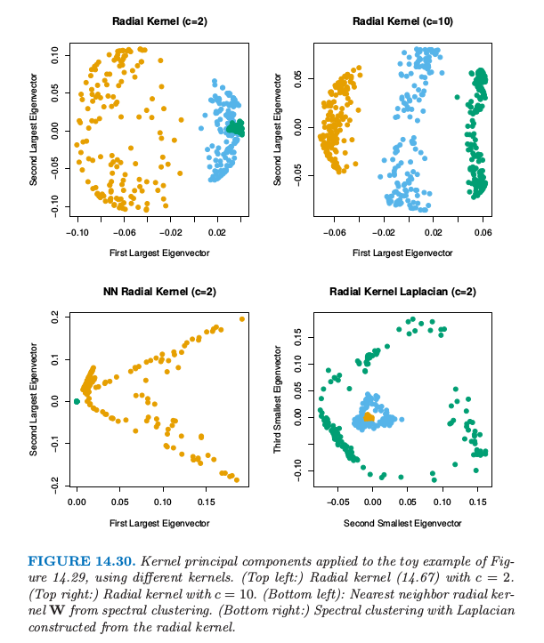

图 14.30 检验了在图 14.29 的小例子中，核主成分的表现效果．左上角我们使用 $c=2$ 的径向核，跟谱聚类中使用的值一样．这并没有将类别分开，但是当 $c=10$（右上图），第一主成分能很好地将类别分开．在左下图采用谱聚类中的最近邻径向核 $\W$ 来应用核 PCA．在右下角我们用核矩阵作为谱聚类中构造 \eqref{14.63} 的相似度矩阵．这两种情形都不能很好地把两个类别分开．调节 $c$ 也没有帮助．

在这个小例子中，我们看到核主成分对于核的尺度以及本性很敏感．我们也看到核的最近邻截断对于谱聚类能否成功很重要．

!!! note "weiya 注："
    粗略地说，谱聚类要求最近邻截断，而核主成分要求中心化的核矩阵．

## 稀疏主成分

我们经常通过查看方向向量 $v_j$，或者称 **载荷 (loadings)**，来判断哪个变量在起作用，进而对主成分进行解释．我们在 $(14.55)$ 中对图象载荷采用了这种方法．如果载荷是稀疏的，这种解释通常会很简单．这一节我们简要讨论能导出具有稀疏载荷的主成分方法．它们都是基于 lasso ($L_1$) 惩罚．

首先以 $N\times p$ 的数据矩阵 $\X$ 开始，其中列进行了中心化．这些方法要么关注主成分的最大方差性质，要么最小重构误差．Joliffe et al. (2003)[^6] 的 SCoTLASS procedure 采用第一种方法，求解

$$
\max\; v^T(\X^T\X)v\,, \text{ subject to }\sum_{j=1}^p\vert v_j\vert\le t, v^Tv=1\,.\tag{14.69}
$$

绝对值约束促使某些载荷为 0，因此 $v$ 是稀疏的．进一步，通过限制第 $k$ 个主成分与前 $k-1$ 个主成分正交来寻找稀疏的主成分．不幸的是，这个问题是非凸的，并且计算很困难．

Zou et al. (2006)[^7] 而是以主成分的回归/重构性质开始，类似 [14.5.1]() 的方法．令 $x_i$ 为 $\X$ 的第 $i$ 行．对于单个主成分，他们的稀疏主成分技巧解决了

$$
\begin{align*}
\min_{\theta,v}\sum_{i=1}^N\Vert x_i-\theta v^Tx_i\Vert_2^2&+\lambda \Vert v\Vert_2^2 + \lambda_1\Vert v\Vert_1\tag{14.70}\\
&\text{subject to }\Vert \theta\Vert_2=1
\end{align*}
$$

下面更具体地观察它的组成．

- 如果 $\lambda$ 和 $\lambda_1$ 都是 0，并且 $N>p$，易证 $v=\theta$，并且这是最大主成分方向．
- 当 $p>>N$，解不一定是唯一的，除了 $\lambda > 0$．对于任何 $\lambda > 0$ 以及 $\lambda_1=0$，$v$ 的解与最大主成分方向成比例．
- $v$ 的第二个惩罚鼓励载荷的稀疏性．

对于多重组分，稀疏主成分过程最小化

$$
\sum_{i=1}^N\Vert x_i-\bTheta\V^Tx_i\Vert^2+\lambda \sum_{k=1}^K\vert v_k\vert^2_2 + \sum_{k=1}^K\lambda_{1k}\Vert v_k\Vert_1\,,\tag{14.71}\label{14.71}
$$

约束为 $\bTheta^T\bTheta=\I_K$．这里 $\V$ 是 $p\times K$ 的矩阵，其列向量为 $v_k$，$\bTheta$ 也是 $p\times K$.

准则 \eqref{14.71} 关于 $\V$ 和 $\bTheta$ 不是联合凸的，但是当固定一个参数，这关于另一参数是凸的．固定 $\bTheta$ 然后对 $\V$ 最小化等价于 $K$ 个 elastic net 问题（[18.4 节](/18-High-Dimensional-Problems/18.4-Linear-Classifiers-with-L1-Regularization/index.html)），并且可以有效地解决．另一方面，固定 $\V$ 然后对 $\Theta$ 最小化是 Procrustes 问题 \eqref{14.56} 的一个版本，并且可以通过简单的 SVD 进行求解（[练习 14.12](https://github.com/szcf-weiya/ESL-CN/issues/186)）．这些步骤交替进行直至收敛．

!!! info "weiya 注：Ex. 14.12"
    已解决，详见 [Issue 186: Ex. 14.12](https://github.com/szcf-weiya/ESL-CN/issues/186)．

图 14.31 展示了采用 \eqref{14.71} 进行系数主成分分析的例子，取自 Sjöstrand et al. (2007)[^8]．在一项涉及 569 名老人的研究中，**胼胝体 (corpus callosum， CC)** 的 **矢状面横截面 (mid-sagittal cross-section)** 的形状与不同的临床参数有关．这个例子中，对形状数据应用 PCA，这在形态学中是很流行的工具．对于这样的应用，沿着形状的外围，识别出一系列的标记 (landmarks)，图 14.32 展示了一个例子．

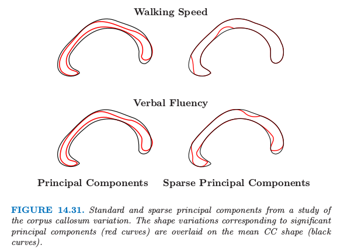

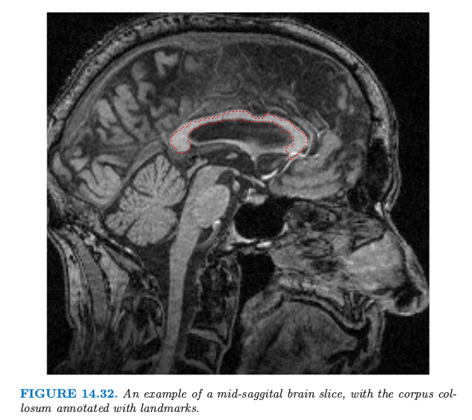

它们是通过允许旋转的 Procrustes 分析后继续对齐得到的，这里 Procrustes 还允许放缩．PCA 使用的特征是每个标记 (landmarks) 的坐标对的序列，放到单个向量中．

在这个分析中，标准主成分和稀疏主成分都进行了计算，并且识别出了显著与不同临床参数有关的组分．这张图像中，对应显著主成分（红色曲线）的形状变体画在了均值 CC 的上面．与 CC 有关的慢速步行在连接行动控制和大脑的感知中心的区域中更细（表现出萎缩症）．与 CC 有关的低语言流利度在连接听觉、视觉、认知中心的区域中更细．稀疏主成分过程对这一重要差异提供了一个更简洁，并且可能更有信息量的描绘．

[^1]: Golub, G. and Van Loan, C. (1983). Matrix Computations, Johns Hopkins University Press, Baltimore.
[^2]: Hastie, T., Kishon, E., Clark, M. and Fan, J. (1992). A model for signature verification, Technical report, AT&T Bell Laboratories. http://www-stat.stanford.edu/~hastie/Papers/signature.pdf .
[^3]: Mardia, K., Kent, J. and Bibby, J. (1979). Multivariate Analysis, Academic Press.
[^4]: Duchamp, T. and Stuetzle, W. (1996). Extremal properties of principal curves in the plane, Annals of Statistics 24: 1511–1520.
[^5]: Schölkopf, B., Smola, A. and M¨uller, K.-R. (1999). Kernel principal component analysis, in B. Sch¨olkopf, C. Burges and A. Smola (eds), Advances in Kernel Methods—Support Vector Learning, MIT Press, Cambridge, MA, USA, pp. 327–352.
[^6]: Joliffe, I. T., Trendafilov, N. T. and Uddin, M. (2003). A modified principal component technique based on the lasso, Journal of Computational and Graphical Statistics 12: 531–547.
[^7]: Zou, H., Hastie, T. and Tibshirani, R. (2006). Sparse principal component analysis, Journal of Computational and Graphical Statistics 15(2): 265–28.
[^8]: Sjöstrand, K., Rostrup, E., Ryberg, C., Larsen, R., Studholme, C., Baezner, H., Ferro, J., Fazekas, F., Pantoni, L., Inzitari, D. and Waldemar, G. (2007). Sparse decomposition and modeling of anatomical shape variation, IEEE Transactions on Medical Imaging 26(12): 1625–1635.