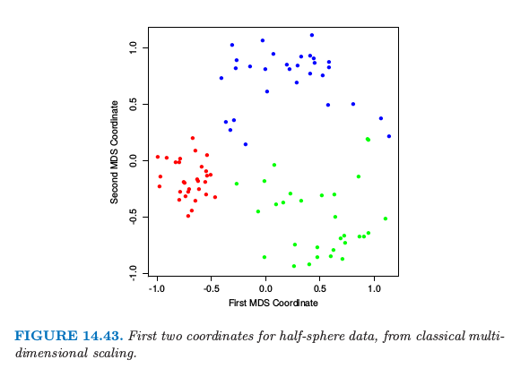

# 14.8 多维缩放

| 原文   | [The Elements of Statistical Learning](https://web.stanford.edu/~hastie/ElemStatLearn/printings/ESLII_print12.pdf#page=589) |
| ---- | ---------------------------------------- |
| 翻译   | szcf-weiya                               |
| 发布 | 2016-09-30 |
|更新|2020-01-17 21:27:12|
|状态|Done|

自组织图和主曲线以及主曲面都是将 $\IR^p$ 中的数据点映射到低维流形中．**多维缩放 (MDS, Multidimensional scaling)** 的目标也是类似的，但是是以一种不同的方式来解决这个问题．

我们以观测值 $x_1, x_2,\ldots, x_N\in \IR^p$ 开始，令 $d_{ij}$ 为观测 $i$ 和 $j$ 之间的距离．通常我们选择欧式距离 $d_{ij}=\Vert x_i-x_j\Vert$，但是也可能采用其它的距离．

!!! note "weiya 注："
    在有关 Phylogeny tree 的问题中，比如 Microbiome Data，经常用 UniFrac 距离，由此得到的多维缩放也被叫做 UniFrac PCoA，因为 MDS 也被称作 [PCoA (Principal Coordinate Analysis)](https://en.wikipedia.org/wiki/Multidimensional_scaling).

另外，在有些应用中，我们可能甚至没有数据点 $x_i$，仅仅有 **不相似性 (dissimilarity)** 的测量 $d_{ij}$（见 [14.3.10节](14.3-Cluster-Analysis/index.html)）．举个例子，在一项酒的口感的试验中，$d_{ij}$ 可能是某个体对酒 $i$和 $j$ 口感不同的一个度量，并且该个体对所有酒 $i$ 和 $j$ 都采用这样的度量．MDS 仅仅需要不相似性 $d_{ij}$，这与需要数据点 $x_i$ 的 SOM 和主曲线、主曲面不同．

多维缩放寻找值 $z_1,z_2,\ldots,z_N\in \IR^k$ 来最小化 **压力函数(stress function)**

$$
S_M(z_1,z_2,\ldots,z_N)=\sum\limits_{i\neq i'}(d_{ii'}-\Vert z_i-z_i'\Vert)^2\tag{14.98}
$$

!!! note "weiya 注：原书脚注"
    有些作者将压力定义为 $S_M$ 的平方根；因为这个不影响优化，所以我们保留平方，以便跟其它准则进行比较．

这被称为 **最小二乘缩放 (least squares scaling)** 或者 **Kruskal-Shephard 缩放**．思想是寻找尽可能数据的保距（成对距离）低维近似．注意到近似是对距离而言，而不是平方距离（这会导致计算有点复杂）．可以采用梯度下降法来进行最小化 $S_M$．

最小二乘缩放的一个变种被称为 Sammon mapping，它是对下式进行最小化

$$
S_{Sm}(z_1,z_2,\ldots,z_N)=\sum\limits_{i\neq i'}\frac{(d_{ii'}-\Vert z_i-z_i'\Vert)^2}{d_{ii'}}\tag{14.99}
$$

这里更重视保留越小的成对距离．

在 **经典缩放 (classical scaling)** 中，我们从相似性　$s_{ii'}$　开始：经常使用中心化后的内积　$s_{ii'}=\langle x_i-\bar x,x_{i'}-\bar x\rangle$．问题则变成了在　$z_1,z_2,\ldots,z_N\in \IR^k$ 上最小化下式

$$
S_C(z_1,z_2,\ldots, z_N)=\sum\limits_{i,i'}(s_{ii'}-\langle z_i-\bar z, z_{i'}-\bar z\rangle)^2\tag{14.100)}
$$

这是很吸引人的，因为有个用特征向量表示的显式解：见[练习 14.11](https://github.com/szcf-weiya/ESL-CN/issues/203)．如果我们有距离数据，而不是内积数据，并且是欧式距离，则可以将它们转换为中心化的内积，参见[第 18 章](/18-High-Dimensional-Problems/18.5-Classification-When-Features-are-Unavailable/index.html)中的式 \eqref{18.31}．

!!! note "weiya 注："
    $$
    \tilde\K = (\I-\M)\B(\I-\M)\,;\tag{18.31}\label{18.31}
    $$

如果事实上相似性为中心化的内积，则经典缩放正好与主成分等价，主成分本质上是线性降维技术．

!!! note "weiya 注："
    等价性的论证详见 [Issue 215: Classical MDS versus PCA](https://github.com/szcf-weiya/ESL-CN/issues/215).

经典缩放不等价于最小二乘缩放；它们的损失函数不同，并且映射可以是非线性的．

最小二乘缩放和经典缩放都被称作 **度量 (metric)** 缩放方法，在某种意义下，实际的非相似性或者相似性是近似的．Shephard-Kruskal 非度量缩放有效地只使用了秩（排名）．非度量缩放在 $z_i$ 和任意的递增函数 $\theta$ 上最小化压力函数

$$
S_{NM}(z_1,z_2,\ldots, z_N)=\frac{\sum_{i\neq i'}[\Vert z_i-z_{i'}\Vert - \theta(d_{ii'})]^2}{\sum_{i\neq i'}\Vert z_i-z_{i'}\Vert^2}\qquad (14.101)
$$

当 $\theta$ 固定，我们通过梯度下降在 $z_i$上最小化．当 $z_i$ 固定，采用 **保序回归 (isotonic regression)** 来寻找对 $\Vert z_i-z_{i'}\Vert$ 最好的单调近似 $\theta(d_{ii'})$．一直迭代这些步骤直到解达到稳定．

!!! info "weiya 注: Isotonic Regression"
    [这篇博客](https://stats.hohoweiya.xyz/2020/02/20/multiple-isotonic-regression/)简单讨论了 Isotonic Regression，并记录了 ICSA-2019 会议上讲 Multiple Isotonic Regression 的 talk.

和自组织图和主曲面一样，多维缩放也是在低维坐标系统中表示高维数据．主曲面和 SOM 则更进一步，采用低维流形来近似原来的数据，在低维的坐标系统中进行参量化．在主曲面和 SOM 中，原特征空间中相离比较近的点在流形上也映射在一起，但是特征空间中距离远的点也可能映射到一起．这在多维缩放中不太可能发生，因为它明确地试图保持所有的成对距离．

图 14.43 显示了对半球例子的经典缩放的前两个 MDS 坐标．簇之间的分类是很明显的，并且红色簇紧的特性也是显然的．

