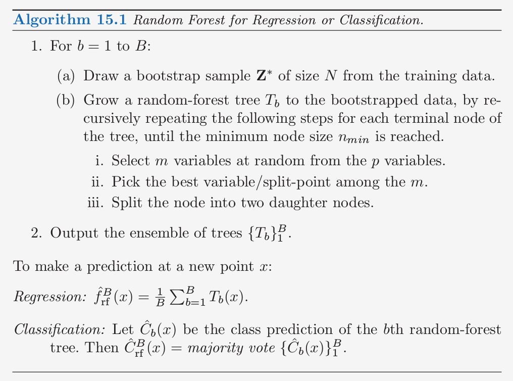
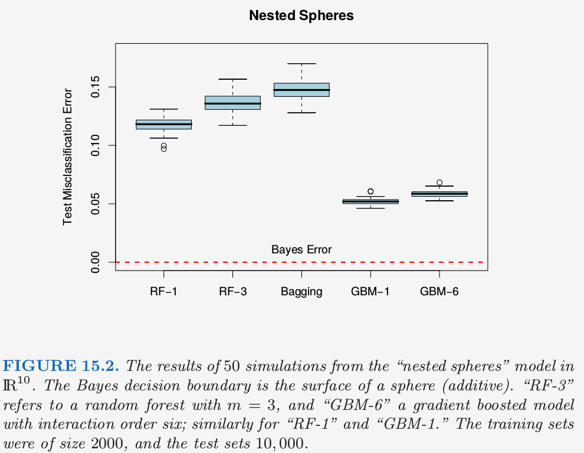

# 15.2 随机森林的定义

| 原文   | [The Elements of Statistical Learning](https://web.stanford.edu/~hastie/ElemStatLearn/printings/ESLII_print12.pdf#page=606) |
| ---- | ---------------------------------------- |
| 翻译   | szcf-weiya                               |
| 发布 | 2017-06-09 |
|更新| 2019-04-19 20:38:52|
|状态|Done|

Bagging 的核心思想是对许多有噪声但近似无偏的模型进行平均，也因此降低了方差．树是用于 bagging 的理想模型，因为它们可以捕捉数据中复杂的交叉项，而且如果树长得足够深的话，会有相对较低的偏差．因为树是充满噪声的，所以通过平均可以很大程度地改善它们．而且，因为 bagging 中产生的每棵树是同分布的，$B$ 棵这样的树的平均的期望与它们中的任一个是相同的．这意味着经过 bagged 的树的偏差与单个(bootstrap)树的偏差是一样的，而且唯一改善的希望是通过降低方差．这与 boosting 是相反的，在 boosting 中树以一种自适应的方式减小偏差，因此不是同分布的．

$B$ 棵独立同分布、方差为 $\sigma^2$ 的随机变量的平均方差为 $\frac{1}{B}\sigma^2$．如果变量是简单的同分布（不一定独立），有着正的成对相关系数 $\rho$，则平均的方差为（[练习 15.1](https://github.com/szcf-weiya/ESL-CN/issues/23)）
$$
\rho\sigma^2+\frac{1-\rho}{B}\sigma^2 \tag{15.1}\label{15.1}
$$

!!! info "weiya 注：Ex. 15.1"
    已解决，详见 [Issue 23: Ex. 15.1](https://github.com/szcf-weiya/ESL-CN/issues/23)．

当 $B$ 增大时，第二项消失，但是第一项还在，而且成对 bagged 的树的相关系数的大小限制了平均的好处．随机森林的想法（算法 15.1）是通过降低树之间的相关系数来改善方差的降低，而不使方差增长过大．这可以通过在生成树的过程中对输入变量进行随机选择来实现．

特别地，当在一个 bootstrapped 数据集中生成树时：

> 在每次分割时，随机选择 $m\le p$ 个输入变量作为候选变量用来分割

一般地，$m$ 取为 $\sqrt{p}$，或者甚至小到取 1．

生成 $B$ 棵这样的树 $\\{T(x;\Theta_b)\\}_1^B$，随机森林（回归）预测变量为

$$
\hat f_{rf}^B(x) = \frac{1}{B}\sum\limits_{b=1}^BT(x;\Theta_b)\tag{15.2}
$$

如 [10.9 节](/10-Boosting-and-Additive-Trees/10.9-Boosting-Trees/index.html)一样，$\Theta_b$ 根据分离变量、每个结点的分离值以及终止结点的值来表征第 $b$ 个随机森林树．直观上，降低 $m$ 会降低任意两棵树之间的相关系数，也因此通过 \eqref{15.1} 来降低平均的方差．

并非所有的估计都可以通过像这样震荡数据来改善．似乎强非线性估计，比如树，改善最大．对于其 bootstrapped 树，$\rho$一般很小（一般是 0.05 或更小；见图 15.9），而 $\sigma^2$ 不比原树的方差要大．另一方面，bagging 不会改变线性估计，比如样本均值（因此也不会改变方差）；其bootstrapped 均值之间的成对相关系数大约为 50%（[练习 15.4](https://github.com/szcf-weiya/ESL-CN/issues/191)）．

!!! note "weiya 注："
    Bagging 可以看成是特殊的随机森林，即 $m=p$ 的随机森林．

随机森林很流行．Leo Breiman 的合作者 Adele Cutler 维护一个随机森林的网站 [http://www.math.usu.edu/~adele/forests/](http://www.math.usu.edu/~adele/forests/)．R 语言中有一个 `randomForest` 的包，由 Andy Liaw 维护，可以从 `CRAN` 网站上下载．

!!! note "原书脚注："
    令人悲伤的是，Leo Breiman 逝世于 2005 年 7 月。

这些作者们声称随机森林取得了巨大的成功：“更精确”，“更有解释性”，以及类似这样的．在我们的经验中，随机森林确实做得很好，只需要非常少的调参．随机森林在 `spam` 测试集上取得了 4.88% 的误分类率，与其他方法相比表现得很好，没有显著性地比 gradient boosting (4.5%) 差．Bagging 达到 5.4%，显著地比其他方法要差，所以这个例子中额外的随机会有帮助．

图 15.1 展示了这三个方法在 2500 棵树上测试误差的变化．在这种情形下，尽管 10 折交叉验证选择了所有的 2500 棵树，但有证据表明 gradient boosting 开始过拟合．

图 15.2 展现了在 nested spheres 问题上随机森林与 gradient boosting 模拟的结果．这里 boosting 很容易地比随机森林表现要好．注意到这里较小的 $m$ 会更好，尽管部分原因是因为真实的判别边界是可加的．

!!! note "weiya注"
    nested spheres问题在 [10.1 boosting方法](/10-Boosting-and-Additive-Trees/10.1-Boosting-Methods/index.html)中定义，即
    特征 $X_1,\ldots,X_{10}$ 是标准独立高斯分布，目标 $Y$ 定义如下
    $$
    Y=
    \left\{
    \begin{array}{ll}
    1&\text{if } \sum_{j=1}^{10}X_j^2>\chi_{10}^2(0.5)\\
    -1 & \text{otherwise}
    \end{array}
    \right.
    \tag{10.2}
    $$

图 15.3 比较了在一个回归问题中随机森林与（带收缩的）boosting，该问题采用加利福利亚住房数据（[10.14.1 节](https://esl.hohoweiya.xyz/10-Boosting-and-Additive-Trees/10.14-Illustrations/index.html)）．

表现出的两个很强的特点是

- 随机森林在大概 200 棵树时稳定了，而在 1000 棵树的时候 boosting 仍然在改善．boosting 被收缩放慢了，同时也因为树更小的事实．
- 这里 boosting 比随机森林更好．在 1000 项的时候，弱 boosting 模型（深度为 4 的 GBM）比更强的随机森林（RF $m=6$）有更小的误差；对均值绝对误差进行 Wilcoxon 检验得到 $p$ 值为 0.007．对于较大的 $m$，随机森林不会表现得更好．
