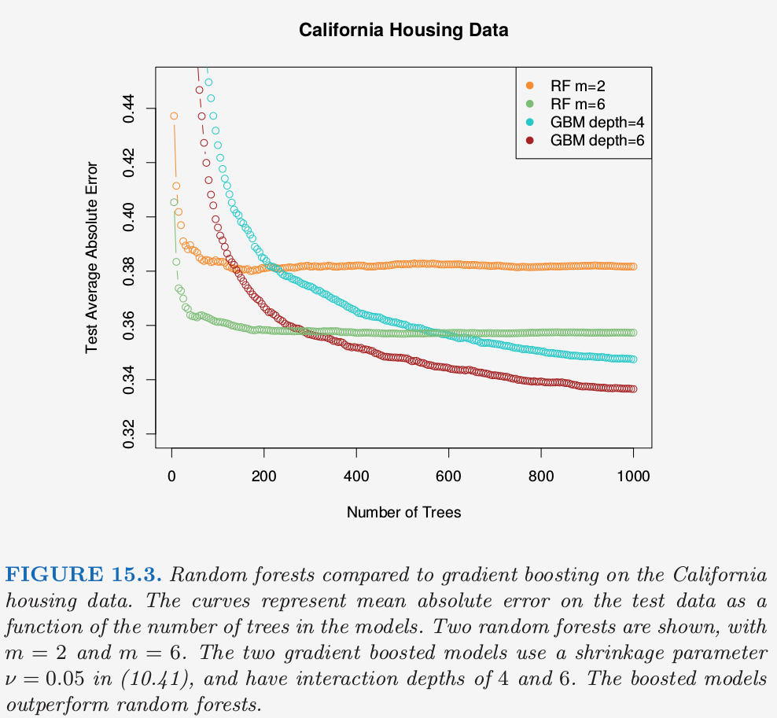
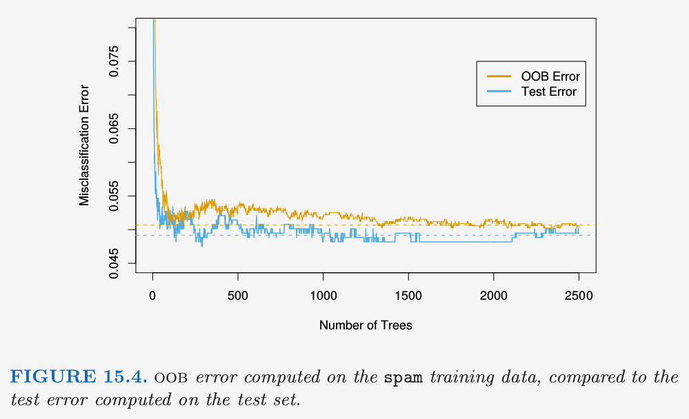
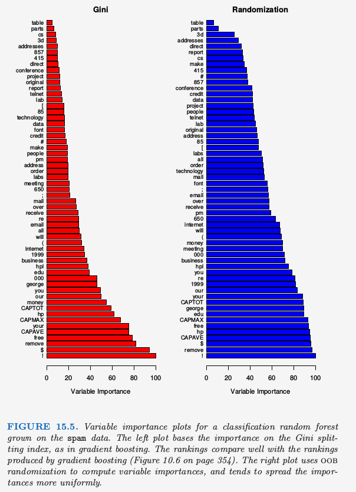
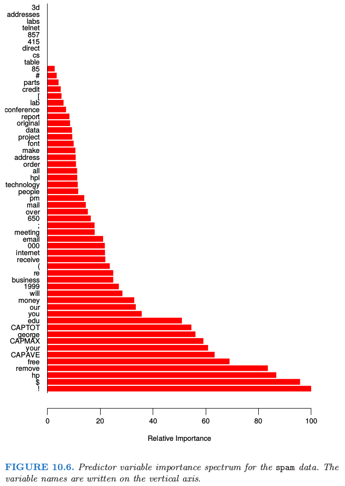
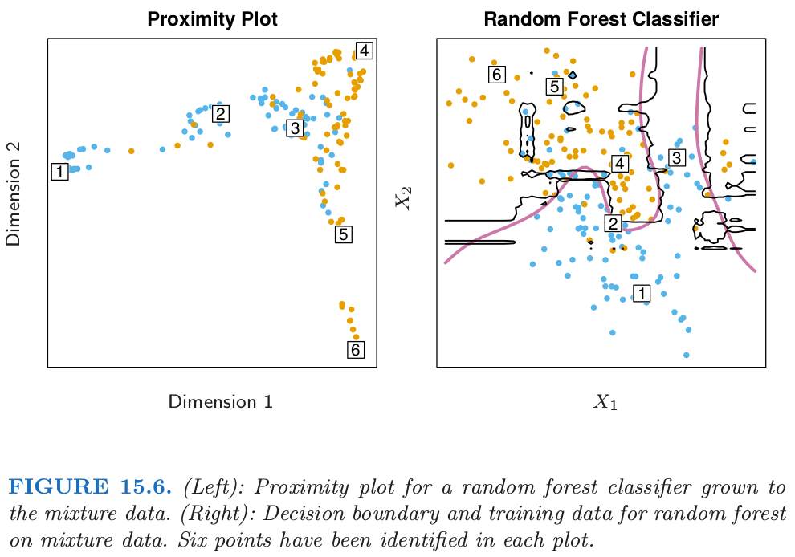
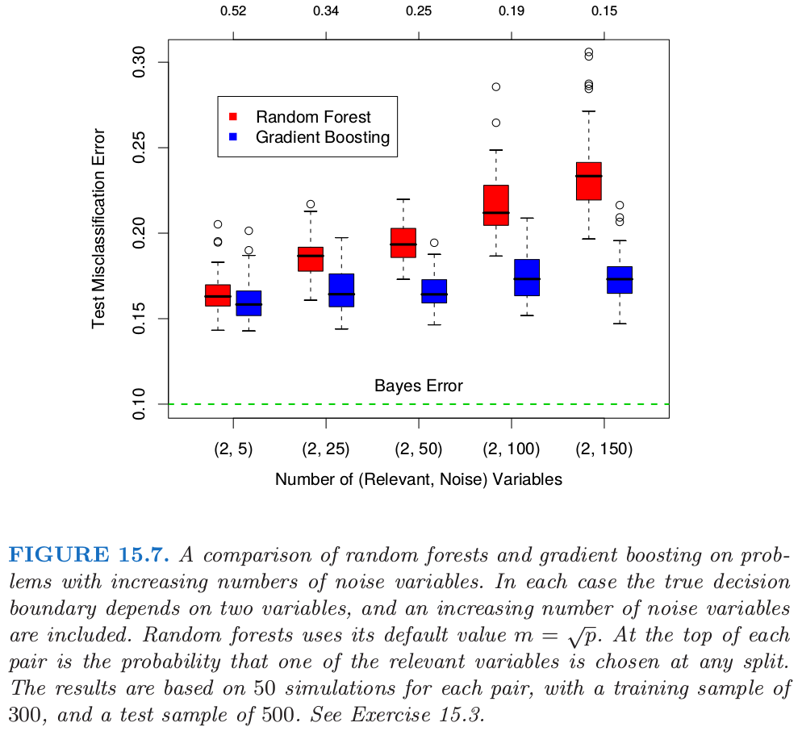
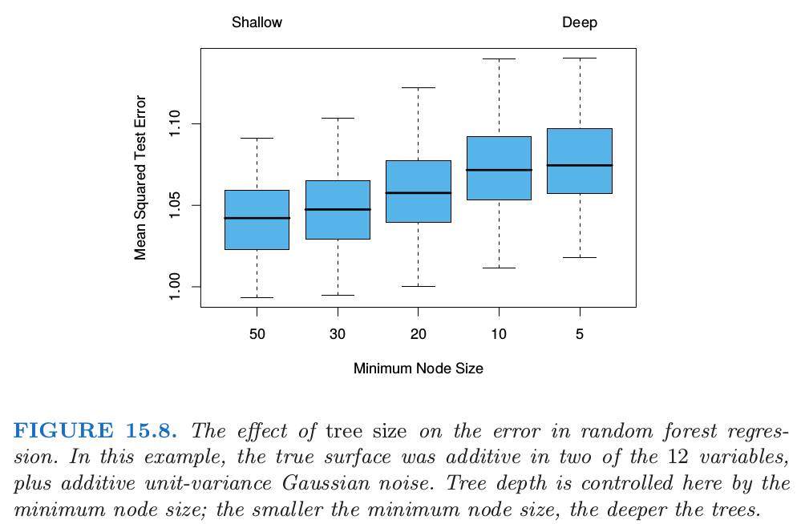

# 15.3 随机森林的细节

| 原文   | [The Elements of Statistical Learning](https://web.stanford.edu/~hastie/ElemStatLearn/printings/ESLII_print12.pdf#page=611) |
| ---- | ---------------------------------------- |
| 翻译   | szcf-weiya                               |
| 发布 | 2017-06-09 |
| 更新 | 2020-02-27 21:30:29|
| 状态 | Done|

我们忽略了随机森林用于分类和回归的区别．当用于分类，随机森林从每棵树中得到类别投票，接着采用多数投票来分类（见 [8.7 节](../08-Model-Inference-and-Averaging/8.7-Bagging/index.html) bagging 类似的讨论）．当用于回归时，如式 \eqref{15.2}，在目标点 $x$ 处每棵树的预测被简单地平均．

!!! note "weiya 注：Recall"
    $$
    \hat f_{rf}^B(x) = \frac{1}{B}\sum\limits_{b=1}^BT(x;\Theta_b)\tag{15.2}\label{15.2}
    $$

另外，发明者给出下面两条推荐：

- 对于分类，$m$ 的默认值为 $\lfloor \sqrt p \rfloor$，且最小的结点数为 1．
- 对于回归，$m$ 的默认值为 $\lfloor p/3\rfloor$，且最小的结点数为 5．

实际中这些参数的最优值取决于具体问题，并且它们应当被视为 **调整参数 (tunning parameters)**．在图 15.3 中，$m=6$ 比默认值 $\lfloor 8/3\rfloor =2$ 更好．

!!! note "Recall"
    

## 集外样本

随机森林一个重要的特征是它对 **集外( out-of-bag, OOB)** 样本的使用：

> 对于每个观测 $z_i=(x_i, y_i)$，仅通过对部分树的平均来构造随机森林预测量，这部分的树是对应那些 $z_i$ 不出现的自助样本．

OOB 误差估计几乎等价于通过 $N$ 折交叉验证得到的估计；见[练习 15.2](https://github.com/szcf-weiya/ESL-CN/issues/21)．因此与许多其它的非线性估计量不同，随机森林可以逐步拟合，同时交叉验证也将沿着拟合进度逐步进行．一旦OOB误差稳定，训练可以终止．

!!! note "weiya 注："
    这里我的理解是，$B$ 可以逐步增大，每次都可以计算 OOB 误差，而 OOB 误差近似为 CV 误差，就相当于逐步计算 CV 误差了。而有些非线性方法需要拟合完成后才能回过头来计算 CV 误差，从这点看这是随机森林的优势。

图 15.4 展示了`spam`数据的 OOB 误分类误差，与测试误差进行比较．尽管这里平均了 2500 棵树，但从图中可以看出似乎 200 棵树就足够了．



## 变量重要性

随机森林的变量重要性图象可以用 gradient-boosted 模型完全一样的方式来作出（[10.13 节](/10-Boosting-and-Additive-Trees/10.3-Forward-Stagewise-Additive-Modeling/index.html)）．在每棵树的每个分割点，分割准则的改进是重要性度量，而重要性度量归功于分离变量，并且对于每个变量，这种改进在森林中的每棵树上都有积累．图 15.5 的左图展现了用这种方式计算的 `spam` 数据的变量重要度；可以与 gradient boosting 对应的图 10.6 进行比较．



!!! note "Recall"
    

Boosting 完全忽略了一些变量，而随机森林不会．备选的分离变量选择增加了任意单个变量被包含进随机森林的概率，而 boosting 中没有这种选择．

随机森林也采用 OOB 样本来构造不同的变量重要性度量，这显然是用来衡量每个变量的预测强度．当生成第 $b$ 棵树时，得到 OOB 样本，记录预测的准确度．接下来随机打乱第 $j$ 个变量在 OOB 样本中的顺序，并且再一次计算准确度．对所有的树应用这种随机打乱计算平均降低的准确度，然后用作对随机森林中第 $j$ 个变量的重要性的度量．这些量被表示成图 15.5 右图的最大值的比例．

!!! note "weiya 注：Permutation Importance"
    这种方法计算得到的重要度也被称为 Permutation Importance，这个基于分割准则的改进得到的重要度不同，[Permutation Importance vs Random Forest Feature Importance (MDI) &mdash; scikit-learn 0.22.1 documentation](https://scikit-learn.org/stable/auto_examples/inspection/plot_permutation_importance.html)比较了这两者的区别，并用实例说明了后者相对前者可能会放大变量的重要度。

尽管这两种方法的排名类似，但右图中的重要性在变量间更加均匀．随机化有效取消了单个变量的影响，这很像在线性模型中设置对应变量的系数为 0（[练习 15.7](https://github.com/szcf-weiya/ESL-CN/issues/220)）．如果这个变量不可用，这并不能度量该变量对预测的影响，因为如果模型去掉该变量重新拟合，其它的变量可以作为替代品使用．

## 邻近图

随机森林宣扬的一个输出是 **邻近图 (proximity plot)**．图 15.6 展示了第 2 章中 2.3.3 节的混合数据的邻近图．



在生成随机森林时，便会积累训练数据 $N\times N$ 的邻近矩阵．对于每棵树，任意一对 OOB 观测值共享一个终止结点时其邻近值增加 1．这个邻近矩阵接着用多维缩放（[14.8 节](/14-Unsupervised-Learning/14.8-Multidimensional-Scaling/index.html)）表示成两维．这个想法是即使数据可能是高维的，其中涉及混合变量等等，但邻近图会给出随机森林分类器中彼此充分靠近的观测的标示．

不管什么数据，随机森林的邻近图经常看起来非常类似，这也让人怀疑其效用．这些图趋向于星形，每个类别一个臂，当分类效果越好，图就会越清楚．

因为混合数据是二维的，我们可以将邻近图中的点映射到原始坐标中，然后更好地理解它们所代表的．似乎在每个类的纯区域中的点映射到星状图的末端，而靠近判别边界的点映射到中心．当我们考虑到邻近矩阵的构造时便会知道这不奇怪．在纯区域中的相邻点经常最终会共享一个“桶(bucket)”，因为当终止结点是纯的，它不再被随机森林的生成树算法而分割．另一方面，属于不同类别的相互靠近的点有时会共享一个终止结点，但不是总是．

!!! note "weiya 注："
    结合图 15.6 理解。

## 随机森林和过拟合

当变量个数很大时，而相关变量很少，$m$ 较小时的随机森林可能表现很差．在每个分割处，相关变量被选择的概率很小．图 15.7 展示了支持这个断言的模拟的结果．细节在图题和 [练习 15.3](https://github.com/szcf-weiya/ESL-CN/issues/221) 中给出．

!!! info "weiya 注：Ex. 15.3"
    已解决，详见 [Issue 221: Ex. 15.3](https://github.com/szcf-weiya/ESL-CN/issues/221). 



在图中的顶部我们可以看到相关变量在随机森林任意分割时被选到的超几何概率（这个模拟中，相关变量个数相同）．当概率变小，boosting和随机森林的差别变大．当相关变量个数变多，随机森林的表现在噪声变量增加时出奇地鲁棒．举个例子，当有 6 个相关变量，100 个噪声变量，假设 $m=\sqrt{6+100}\approx 10$ 相关变量在任意分割点被选择到的概率为 0.46．

!!! note "weiya 注:"
    按图中一样固定相关变量的个数为2，则概率的具体计算公式如下
    $$
    \frac{\binom{2}{1}\binom{n_{noise}}{m-1}+\binom{2}{2}\binom{n_{noise}}{m-2}}{\binom{2+n_{noise}}{m}}
    $$
    其中$n_{noise}$为噪声变量的个数，$m$为随机森林的参数．
    比如
    $$
    \frac{\binom{2}{1}\binom{5}{1}+\binom{2}{2}}{\binom{7}{2}}=0.52
    $$
    更一般地，设$n_1$为相关变量的个数，$n_2$为噪声变量的个数，$m=\lfloor \sqrt{n_1+n_2}\rfloor)$，则
    $$
    \frac{\sum\limits_{i=1}^{min(n_1,m)}\binom{n_1}{i}\binom{n_2}{m-i}}{\binom{n_1+n_2}{m}}\,.
    $$
    可以用下面的 Julia 代码计算
```julia
f(n1, n2; m = round(Int, sqrt(n1 + n2))) = sum([binomial(n1, i) * binomial(n2,m-i ) for i=1:min(n1, m)]) / binomial(n1+n2, m)
f(6, 100) #0.4565650244108061
```

根据图 15.7，与 boosting 相比，这不会损害随机森林的表现．这种鲁棒性大部分是因为误分类代价相对于每棵树中概率估计的偏差和方差的不敏感性．我们在下一节考虑用于回归的随机森林．

另外一个断言是随机森林不会过拟合数据．这显然是正确的，因为增大 $B$ 不会使得随机森林序列过拟合；像 bagging 一样，随机森林估计式 \eqref{15.2} 在 $\Theta$ 的 $B$ 个实现中取平均，这是对下面期望的近似

$$
\hat f_{rf}(x) = \E_\Theta T(x;\Theta)=\lim_{B\rightarrow \infty}\hat f(x)_{rf}^B\tag{15.3}
$$

这里 $\Theta$ 的分布是在训练数据的条件上的．然而，这个极限可以过拟合数据；充分生长的树的平均可以导致模型太丰富(too rich)，并且产生额外的方差．Segal (2004)[^1]展示了通过控制随机森林中单个生成树的深度可以小幅度改善效果．我们的经验是采用充分生长的模型很少要付出太大代价，并且会少一个调整参数．

图 15.8 显示了在一个简单的回归例子中控制深度对模型的影响．分类器对方差不够敏感，很少在随机森林的分类中看到过拟合的影响．



[^1]: Segal, M. (2004). Machine learning benchmarks and random forest regression, Technical report, eScholarship Repository, University of California. http://repositories.edlib.org/cbmb/bench rf regn .
