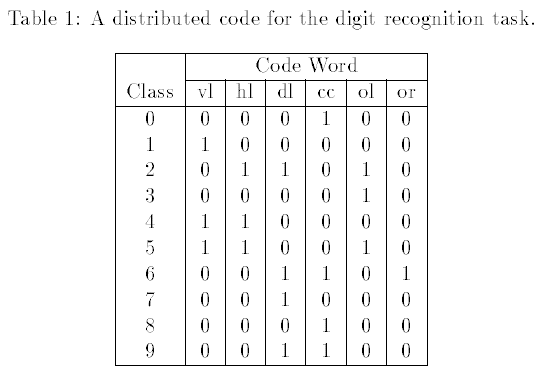

# 16.1 导言

| 原文   | [The Elements of Statistical Learning](https://web.stanford.edu/~hastie/ElemStatLearn/printings/ESLII_print12.pdf#page=624) |
| ---- | ---------------------------------------- |
| 翻译   | szcf-weiya                               |
| 发布 | 2017-02-08 |
| 更新 |2018-07-18, 2018-08-18|
| 状态| Done|

**集成学习 (ensemble learning)** 的思想是通过结合一系列简单基础模型的优点来建立一个预测模型．我们已经看到很多这类的例子．

[8.7 节](../08-Model-Inference-and-Averaging/8.7-Bagging/index.html)的 bagging 和[第 15 章](../15-Random-Forests/15.1-Introduction/index.html)的随机森林都是用于分类的集成学习的方法，其中树的每个 committee 对预测的类别都有一个投票．[第 10 章](../10-Boosting-and-Additive-Trees/10.1-Boosting-Methods/index.html)中的 boosting 一开始也是以一种 committee 的方法提出来的，尽管不同于随机森林，weak learners 的 committee 随着时间不断进化，并且成员进行带有权重的投票．Stacking（[8.8 节](../08-Model-Inference-and-Averaging/8.8-Model-Averaging-and-Stacking/index.html)）是结合一系列拟合模型优点的新方式．事实上，可以将任何字典方法看成集成学习，其中基函数充当 **弱学习器 (weak learners)**，比如回归样条．

非参回归的贝叶斯方法也可以看成是集成学习的方法：关于参数设定的后验分布，对一系列大量的候选模型进行平均（比如，Neal and Zhang，2006[^1]）．

集成学习可以分成两个任务：从训练集中建立基学习器的总体，然后结合它们形成复合预测．这章中我们进一步讨论 boosting 技术；它通过在 weak learners 的高维空间中通过一个正规化和有监督的搜索来建立集成模型．

集成学习的一个很早的例子是使用 **error-correcting output codes** (Dietterich and Bakiri, 1995[^2], ECOC) 对多个类别进行分类．考虑 $10$ 个类别的数字分类问题，编码矩阵 $\mathbf{C}$ 由表 16.1 给出

> 表 16.1 对于 $10$ 个类别的数字分类问题的 15 位 error-correcting output codes 矩阵 $\mathbf C$ 的部分．每一列定义了一个两个类别的分类问题．

注意到编码矩阵的第 $\ell$ 列 $\mathbf C_\ell$ 定义了一个两个类别的变量可以将所有的原始类别合并成两个大类．这个方法按照下列步骤进行：

1. 对每个由编码矩阵的列定义的 $L=15$ 个两类别的学习问题，单独进行学习分类器．
2. 在每一个测试点 $x$ 上，$\hat p_\ell (x)$ 是第 $\ell$ 个响应变量的预测概率．
3. 定义 $\delta_k(x)=\sum_{\ell=1}^L\vert C_{k\ell}-\hat p_\ell(x)\vert$，是第 $k$ 个类别的判别函数，其中 $C_{k\ell}$ 是表 16.1 第 $k$ 行和第 $\ell$ 列的值．

!!! note "weiya 注："
	关于 $\delta_k(x)$ 的定义，可以这样理解．首先，$\hat p_\ell (x)$ 值越大，表示越倾向于类别 $1$，越小则越倾向于类别 $0$，于是 $\vert C_{k\ell}-\hat p_\ell(x) \vert$ 表示预测正确时的程度，值越小表示得到的预测会越正确．因此，最后类别为使得 $\delta_k(x), k=1,2,\ldots, 10$ 中最小的$k$．

$\mathbf C$ 的每一行是表示该类的二进制编码．每一行的位数比必要的二进制位数更多，而且冗余的“error-correcting”位数在一些不精确的情形下是允许的，而且可以提高模型的效果．事实上，上面的全编码矩阵 $\mathbf C$ 在任意两列中最小的 Hamming 距离为 7．注意到即使响应指示变量编码（[4.2 节](../04-Linear-Methods-for-Classification/4.2-Linear-Regression-of-an-Indicator-Matrix/index.html)）是多余的，因为 $10$ 个类别仅仅需要 $[\log_210=4]$ 位来实现唯一表示．Dietterich and Bakiri (1995)[^2] 证明了将分类树作为基分类器会使得不同的多类别问题有显著性提高．

!!! note "weiya 注："
	查看 Dietterich and Bakiri (1995)，其中提到无多余编码列的方法被称作 distributed output code，比如图中用了 6 列（虽然不是更少的 4 列），
	
	而 ECOC 的区别在于采用了 error-correcting codes，这种编码能够 correct error．举个简单的例子，比如需要发送信号 $0$，如果重复 3 次发送，即使出了一次错误，接收时变成了 $001$，或 $010$ 等，但采用多数原则，仍认为原信号为 $0$，这样就达到了 correct error 的效果．原文称，如果 ECOC 矩阵中最小的 Hamming 距离为 $d$，则至少可以 correct $\lfloor \frac{d-1}{2}\rfloor$ 位错误．关于 error-correcting codes，推荐 MARK WILDON 的 Lecture Notes——[ERROR CORRECTING CODES MT361/MT461/MT5461](http://www.ma.rhul.ac.uk/~uvah099/Maths/Codes11/MT3612011Notes.pdf)．
	
James and Hastie (1998)[^4] 分析 ECOC 方法，而且证明了随机编码分配和最优结构化 error-correcting 编码．他们也提出这种编码的好处在于降低方差（和 bagging 和随机森林一样），因为不同的编码问题会引出不同的树，另外上面解码步骤 (3) 跟平均(averaging)有相似的影响．

!!! note "weiya 注"
		Hamming 距离为两个向量不匹配的值的个数．

[^1]: Neal, R. and Zhang, J. (2006). High dimensional classification with bayesian neural networks and dirichlet diffusion trees, in I. Guyon, S. Gunn, M. Nikravesh and L. Zadeh (eds), Feature Extraction, Foundations and Applications, Springer, New York, pp. 265–296.
[^2]: Dietterich, T. and Bakiri, G. (1995). Solving multiclass learning problems via error-correcting output codes, Journal of Artificial Intelligence Research 2: 263–286. [下载](../references/Dietterich1995.pdf)
[^4]: James, G. and Hastie, T. (1998). The error coding method and PICTs, Journal of Computational and Graphical Statistics 7(3): 377–387.
