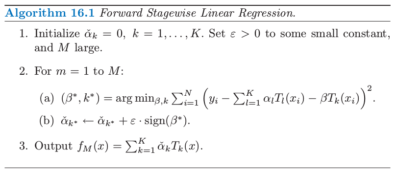
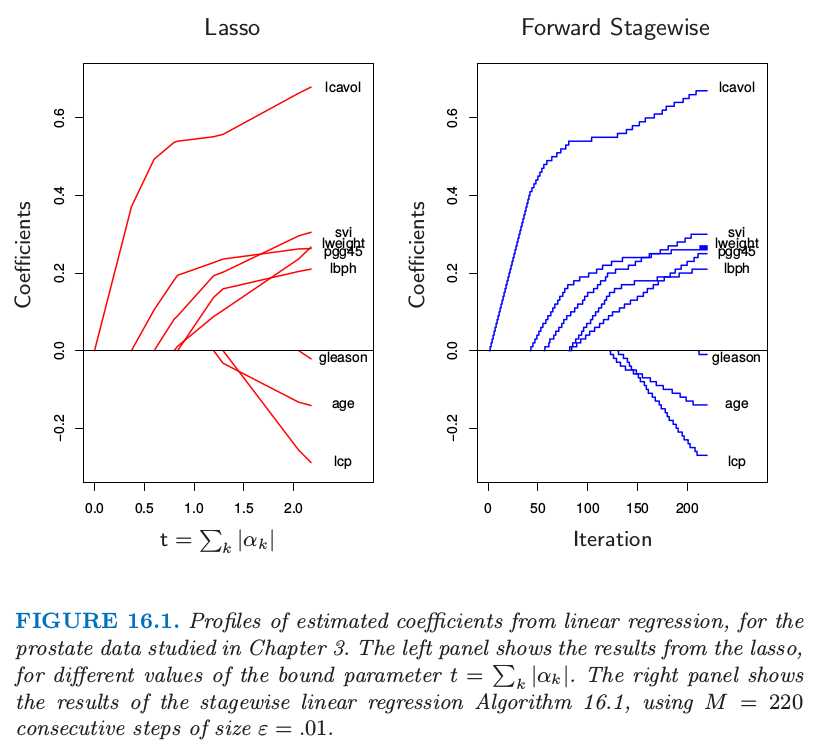
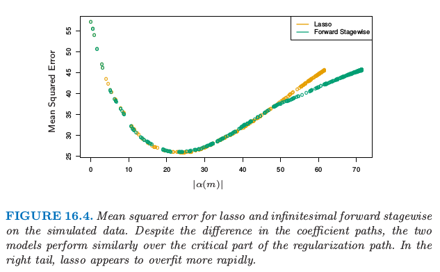

# 16.2 Boosting 和正则化路径

| 原文   | [The Elements of Statistical Learning](https://web.stanford.edu/~hastie/ElemStatLearn/printings/ESLII_print12.pdf#page=626) |
| ---- | ---------------------------------------- |
| 翻译   | szcf-weiya                               |
| 发布 | 2017-03-10 |
| 更新 | 2018-07-19|
|状态|Done|

在[这本书第一版](https://www.springer.com/gp/book/9780387216065)的第 10.12.2 节中，我们表明了由 **gradient boosting** 算法产生的模型序列与在高维特征空间中正则化模型是相似的．这最初是通过观测到 boosted 版本的线性模型和 lasso 之间（[第 3.4.2 节](../03-Linear-Methods-for-Regression/3.4-Shrinkage-Methods/index.html)）有着紧密联系得到的．我们和其他人一起研究这些联系，并且在这里放上我们对这个领域当前的思考．我们从最初的动机开始，这更自然地适合于本章的 **集成学习 (ensemble learning)**．

## 带惩罚的回归

**Gradient boosting** 的收缩策略 \eqref{10.41} 的成功直觉上可以通过类比含有很多基展开的带惩罚的线性回归得到．

!!! note "Recall"
    $$
    f_m(x)=f_{m-1}(x)+\nu\cdot \sum\limits_{j=1}^J\gamma_{jm}I(x\in R_{jm})\tag{10.41}\label{10.41}
    $$

考虑所有可能的 $J$ 个终止结点的回归树 $\cal T=\{T_k\}$ 的字典作为 $\IR^p$ 的基函数，这在训练数据上可以实现．线性模型为

$$
f(x)=\sum\limits_{k=1}^K\alpha_kT_k(x)\tag{16.1}\label{16.1}
$$

其中 $K=\mathrm{card}(\cal T)$．假设系数通过最小二乘进行估计．因为这些树的个数可能比最大训练集还要大很多，所以需要一些正则化．令 $\hat\alpha(\lambda)$ 是下式的解

$$
\underset{\alpha}{\min}\left\{\sum\limits_{i=1}^N(y_i-\sum\limits_{k=1}^K\alpha_kT_k(x_i))^2+\lambda\cdot J(\alpha)\right\}\tag{16.2}\label{16.2}
$$

$J(\alpha)$ 是关于系数的函数，并且一般惩罚较大的值．比如

$$
\begin{align}
J(\alpha) &=\sum\limits_{k=1}^K\vert \alpha_k\vert^2\qquad \text{岭回归}\tag{16.3}\\
J(\alpha) &=\sum\limits_{k=1}^K\vert\alpha_K\vert\qquad\text{lasso}\tag{16.4}\label{16.4}
\end{align}
$$

这些都在 [3.4 节](../03-Linear-Methods-for-Regression/3.4-Shrinkage-Methods/index.html)介绍了．正如这里讨论的那样，从中等大的 $\lambda$ 到较大的 $\lambda$ 的 lasso 问题的解是趋向于稀疏的；许多 $\hat\alpha_k(\lambda)=0$．也就是，只有所有候选树的一小部分会选进模型 \eqref{16.1}．这似乎是合理的，因为似乎只有所有候选树的一小部分对任意特定的目标函数的近似是恰当的．然而，对于不同的目标值，相关的子集也会不一样．

!!! note "weiya 注："
    换句话说，对于某个 $y_i$，与该目标相关的候选树的子集为 $C_i$，这会随着目标值的不同而发生变化．

那些没有设为 $0$ 的系数被 lasso 收缩了，因为它们的绝对值比对应最小二乘值要小：$\vert\hat\alpha_k(\lambda)\vert < \vert\hat\alpha_k(0)\vert$．当 $\lambda$ 增大时，系数都进行了收缩，每一个最终都变为 $0$．

由于非常多的基函数 $T_k$，直接求解含有 lasso 惩罚 \eqref{16.4} 的 \eqref{16.2} 是不可能的．然而，存在可行的向前逐步策略，对 lasso 的效果有非常好的近似，并且与增强和向前逐步算法 10.2 非常相似．算法 16.1 给出了细节．尽管是用树的基函数 $T_k$ 表示的，算法也可以用来任意基函数的集合中．第 $1$ 行所有系数初始化为 $0$；这对应了 \eqref{16.2} 式的 $\lambda=\infty$． 每个接下来的步骤中，第 2(a) 行选择对当前残差拟合得最好的树 $T_{k^\*}$．其对应的系数 $\check{\alpha}\_{k^\*}$ 接着在第 2(b) 步增长或减小一个无穷小量，而所有其他的系数 $\check{\alpha}_{k\neq k^*}$ 都保持不变．原则上，这个过程可以一直迭代到所有的残差为 $0$，或者 $\beta^\*=0$．第二种情况会发生在 $K < N$ 的情形下，并且在那时候，参数值表示最小二乘的解．这对应了 \eqref{16.2} 式的 $\lambda=0$．

对算法 16.1 迭代 $M < \infty$ 次后，许多系数会变成 $0$，也就是，它们不会再增长．其他的系数的绝对值会趋向于比对应的最小二乘解来得小，$\vert \check{\alpha}_k(M)\vert<\vert \hat{\alpha}_k(0)\vert$．因此，这个 $M$ 次迭代的解定性地来看，表现得像是 lasso，其中 $M$ 与 $\lambda$ 成反比．

图 16.1 展示了一个例子，采用[第 3 章](../03-Linear-Methods-for-Regression/3.1-Introduction/index.html)研究的前列腺数据．这里，不是采用树 $T_k(X)$ 作为基函数，而是采用原始变量 $X_k$ 本身；也就是，多元线性回归模型．左图展示了在不同的参数上界 $t=\sum_k\vert \alpha_k\vert$ 情形下，lasso 估计的系数的曲线．右图则显示了算法 16.1 逐步的结果，其中 $M=250，\epsilon=0.01$．【图 16.1 的左右图分别与图 3.10 和图 3.19 的右图一样．】两幅图的相似性令人震惊．

在一些情形下，相似性不仅仅是定性的．举个例子，如果所有的基函数  $T_k$ 互不相关，则当 $\epsilon\downarrow 0, M\uparrow $，使得 $M\epsilon\rightarrow t$ 时，算法 16.1 得到在参数 $t=\sum_k\vert \alpha_k\vert$ 时跟 lasso 一样的解（对于沿着路径的所有解也是一样的）．当然，基于树的回归因子并不是不相关的．然而，当系数 $\hat\alpha_k(\lambda)$ 都是 $\lambda$ 的单调函数时，解的集合也是一样的．当变量间的相关性较低时，也经常是这种情形．当 $\hat\alpha_k(\lambda)$ 不是关于 $\lambda$ 的单调函数，则解的集合不是相同的．算法 16.1 解的集合正则参数的值趋向于没有 lasso 改变得快．

Efron et al. (2004)[^1]通过在 $\varepsilon$ 极限的情形下特征化解的路径，精确地描述了这种联系．他们证明对于 lasso 和向前逐步法，系数的路径都是分段线性函数．这能够帮助提出高效的算法，使得整个路径计算时仅用到单个最小二乘拟合相同的花费．这个 **最小角回归 (least angle regression)** 算法在 [3.8.1 节](../03-Linear-Methods-for-Regression/3.8-More-on-the-Lasso-and-Related-Path-Algorithms/index.html)有更多的细节描述．

Hastie et al. (2007)[^2]证明了这个无穷小量向前逐步算法（$FS_0$）拟合了 lasso 的单调版本，在给定系数路径的 **角长度 (arc length)** 的增长下，最优化了每一步的损失函数（参见 [16.2.3 节]()和 [3.8.1 节](../03-Linear-Methods-for-Regression/3.8-More-on-the-Lasso-and-Related-Path-Algorithms/index.html)）．对于 $\epsilon > 0$ 的情形角长度为 $M\epsilon$，也因此与步数成比例．

带收缩 \eqref{10.41} 的 boosting 树算法（算法 10.3）非常近似算法 16.1，

!!! note "weiya 注：Recall"
    

其中学习速率参数 $\nu$ 对应 $\epsilon$．对于平方误差损失，唯一的区别在于每一次迭代时最优树的选取是通过标准的自上而下的贪婪生成树的算法．对于其他的损失函数，比如 AdaBoost 的指数损失和二项误差，Rosset et al. (2004a)[^3]展示了类似我们在这里看到的结果．因此，可以将带收缩的 boosting 树看成在所有可能树（$J$ 个终止结点）上的单调 ill-posed 回归的形式，其中将 lasso 的惩罚作为正则化项．我们将在 [16.2.3 节]()继续讨论这个话题．

无收缩的选择（式子 \eqref{10.41} 中 $\nu=1$）类似向前逐步回归，并且其更 aggressive 的最优子集选择，其中对于非零系数的个数加上惩罚 $J(\alpha)=\sum_k\vert \alpha_k\vert^0$．对于少量的主要变量，最优子集方法经常取得很好的效果．但是在有较多强变量的情形下，众所周知，最优子集选择非常 greedy（Copas, 1983[^4]），与其他不太 aggressive 的算法，如 lasso 或岭回归相比，经常得到很差的结果．当采用 boosting 的收缩得到重大的改善是这种方式的又一个说明．

## "Bet on Sparsity" 原则

如上一节所述，boosting 带收缩的向前逐步策略近似最小化了与 lasso $L_1$ 惩罚相同的损失函数．这个模型建立比较慢，在模型空间中寻找，并且添加从重要预测变量中导出的收缩的基函数．相反地，如 [12.3.7 节](../12-Support-Vector-Machines-and-Flexible-Discriminants/12.3-Support-Vector-Machines-and-Kernels/index.html)所介绍，$L_2$ 惩罚在计算上更容易处理．有了基函数及与特定半正定核一致的 $L_2$ 惩罚，则不用显式搜寻单个基函数就能求解对应的优化问题．

然而，有时 boosting 的表现高于某些过程（如支持向量机）的程度会很大，很大程度上是因为 $L_1$ 和 $L_2$ 惩罚的区别．$L_1$ 的收缩能更好地适应稀疏的情形（在所有可能选择中，非零系数的基函数的个数很少）．

我们可以通过一个简单的例子来验证这个结论，这个例子取自 Friedman et al. (2004)[^11]．假设我们有 $10000$ 个数据点，且我们的模型是一百万棵树的线性组合．如果这些树的真实总体系数服从高斯分布，则我们知道在贝叶斯情景下，最优的预测器是岭回归（[练习 3.6](https://github.com/szcf-weiya/ESL-CN/issues/96)）．

!!! info "weiya 注：Ex. 3.6"
    已解决，详见[Issue 96: Ex. 3.6](https://github.com/szcf-weiya/ESL-CN/issues/96)．

也就是，当拟合系数时，我们应该使用 $L_2$ 惩罚，而不是 $L_1$ 惩罚．另一方面，如果这里只有少量的（比如，$1000$）系数非零，则 lasso （$L_1$ 惩罚）会表现得很好．我们将这个看成是 **稀疏 (sparse)** 的情形，而第一种情形（高斯系数）是 **稠密 (dense)** 的．注意到尽管在稠密情形下，$L_2$ 惩罚是最好的，但没有方法能做得很好，因为数据太少，但却要从中估计大量的非零系数．这是维数的灾难造成的损失．稀疏设定中，我们可以用 $L_1$ 惩罚做得很好，因为非零稀疏的个数很少．但 $L_2$ 惩罚便不行．

换句话说，$L_1$ 惩罚的使用遵循称作 “bet on sparsity” 的这一高维问题的准则：

> 采用在稀疏问题中表现得好的方法，因为没有方法能在稠密问题中表现得好．

下面的评论需要一些限定条件：

- 对于给定的应用，稀疏度（稠密度）取决于未知真实函数的个数，以及选定的字典集 $\cal T$．
- 稀疏和稠密的概念相对于训练数据集的大小和（或）噪信比 (NSR)．越大的训练集允许我们估计更小标准差的系数．同样地，在小 NSR 的情形中，当给定样本大小我们能识别出相对于大 NSR 情形下更多的非零系数．
- 字典集的大小也很重要．增大字典集的大小可能导出我们函数的更稀疏的表示，但是寻找问题会变得更困难，导致更高的方差．

图 16.2 用模拟实验解释了在线性模型的情形下这些结论．我们在分类和回归问题中比较了岭回归和 lasso．每次实验中有 $300$ 个独立高斯变量以及 $50$ 个观测．在最上面的一行，$300$ 个系数都是非零的，是从高斯分布中生成的．在中间的一行，只有 $10$ 个是非零的并且从高斯分布中生成，最后一行有 $30$ 个非零高斯系数．对于回归，对线性预测变量 $\eta(X) = X^T\beta$ 加上标准高斯噪声来得到连续的响应值．对于分类，线性预测变量通过 logit 的逆变换转换为概率，并生成一个二值响应变量．图中展现了五个不同的噪信比，这通过在生成响应变量前通过缩放 $\eta(X)$ 得到．两种情形下，都定义 $NSR = \Var(Y\mid \eta(X))/\Var(\eta(X))$．岭回归和 lasso 的系数路径都采用对应自由度 $df$ 从 $1$ 到 $50$ 变化的 $\lambda$ 范围中的 $50$ 个值（更多细节见第 3 章）．这些模型在某个大的测试集（高斯变量时取无穷大，二值变量取 $5000$）上取值，并且在每种情形下选择 $\lambda$ 使得测试误差最小．我们报告回归问题中 **解释的方差的百分比 (Percentage Squared Prediction Explained)**，以及分类问题中 **解释的误分类率的百分比 (Percentage Misclassification Error Explained)**（相对于基础误差率 $0.5$）．这里每种情形有 $20$ 次模拟实验．

!!! note "weiya 注："
    此处 Percentage Squared Prediction Explained 应该指的是
    $$
    R^2 = \frac{\mathrm{ESS}}{\mathrm{TSS}} = \frac{\mathrm{TSS} - \mathrm{RSS}}{\mathrm{TSS}} = 1- \frac{\sum (y_i-\hat y_i)^2}{\sum (y_i-\bar y)^2}\,.
    $$
    类似地对于分类问题的 Percentage Misclassification Error Explained 为
    $$
    1 - \frac{\sum I(\hat y_i\neq y_i)}{\sum I(\bar y \neq y_i)}\,.
    $$

注意到对于分类问题，我们采用均方误差损失来拟合二值响应变量．也要注意到我们不采用训练数据来选择 $\lambda$，而是报告在不同情形下每种方法可能的最优表现．$L_2$ 惩罚无论在哪都表现得很差．Lasso 只在两种情形下表现得很好（稀疏系数）．如期望中的一样，随着 NSR 变大（分类也一样），以及随着模型越来越稠密，模型的表现越来越差．分类的差异不如回归差．

这些实验结果有很多理论结果的支撑（Donoho and Johnstone, 1994[^5]; Donoho and Elad, 2003[^6]; Donoho, 2006b[^7]; Candes and Tao, 2007[^8]），它们支持了在稀疏设定中 $L_1$ 估计的优越性．

[^1]: Efron, B., Hastie, T., Johnstone, I. and Tibshirani, R. (2004). Least angle regression (with discussion), Annals of Statistics 32(2): 407–499.
[^2]: Hastie, T., Taylor, J., Tibshirani, R. and Walther, G. (2007). Forward stagewise regression and the monotone lasso, Electronic Journal of Statistics 1: 1–29.
[^3]: Rosset, S., Zhu, J. and Hastie, T. (2004a). Boosting as a regularized path to a maximum margin classifier, Journal of Machine Learning Research 5: 941–973.
[^4]: Copas, J. B. (1983). Regression, prediction and shrinkage (with discussion), Journal of the Royal Statistical Society, Series B, Methodological 45: 311–354.
[^5]: Donoho, D. and Johnstone, I. (1994). Ideal spatial adaptation by wavelet shrinkage, Biometrika 81: 425–455.
[^6]: Donoho, D. and Elad, M. (2003). Optimally sparse representation from overcomplete dictionaries via l 1 -norm minimization, Proceedings of the National Academy of Sciences 100: 2197–2202.
[^7]: Donoho, D. (2006b). For most large underdetermined systems of equations, the minimal l 1 -norm solution is the sparsest solution, Communications on Pure and Applied Mathematics 59: 797–829.
[^8]: Candes, E. and Tao, T. (2007). The Dantzig selector: Statistical estimation when p is much larger than n, Annals of Statistics 35(6): 2313–2351.

## 正则化路径，过拟合和 Margin

经常可以观察到 boosting “不会过拟合”，或者更精确地，“很慢才会过拟合”．这个现象的部分原因在介绍随机森林时已经给出——误分类率对方差比均方误差对方差更不敏感，并且分类问题是 boosting 的主要研究对象．这节我们将说明 boosted 模型的正则路径表现很好，而且对于特定的损失函数，它们有很吸引人的极限形式．

图 16.3 显示了模拟回归设定中 lasso 和无穷小向前逐步法 ($FS_0$) 的参数路径．数据包含 $1000$ 个高斯变量构成的字典集，划分成大小为 $20$ 的小块中，每个小块中的元素强相关 $\rho=0.95$，但是小块之间不相关．生成的模型中有 $50$ 个变量有非零系数，这是从每个小块中抽取得到的，并且系数值也是从标准正态分布中选取的．最后，加上高斯噪声，使得噪信比为 $0.72$（[练习 16.1](https://github.com/szcf-weiya/ESL-CN/issues/152)）．

!!! info "weiya 注：Ex. 16.1"
    已解决，用 `R` 语言写了数据模拟的生成过程，详见 [Issue 152: Ex. 16.1](https://github.com/szcf-weiya/ESL-CN/issues/152)．

$FS_0$ 算法是算法 16.1 的极限形式，其中步长 $\varepsilon$ 收缩到 $0$（[3.8.1 节](../03-Linear-Methods-for-Regression/3.8-More-on-the-Lasso-and-Related-Path-Algorithms/index.html)）．变量的分组是想模仿相邻树的相关性，并且向前逐步算法的设定是作为带收缩的梯度加速的理想版本．对于这些算法，系数路径可以精确计算出来，因为他们都是分段线性的（见 [3.8.1 节](../03-Linear-Methods-for-Regression/3.8-More-on-the-Lasso-and-Related-Path-Algorithms/index.html)的 LARS 算法）．

这里系数曲线仅仅在路径的前期是相似的．对于后期，向前逐步路径趋向于单调的，且更光滑，而这些对于 lasso 而言都是振荡的．这是因为变量集间的强相关性——lasso 某种程度上受到多重共线性的影响（[练习 3.28](https://github.com/szcf-weiya/ESL-CN/issues/123)）．

这两种模型的表现很相似（图 16.4），并且它们达到相同的最小值．在向前逐步算法的后期需要更长时间来过拟合，这是更光滑的路径的可能的结果．

Hastie et al. (2007)[^2] 证明了 $FS_0$ 求解了平方误差损失下 lasso 问题的单调版本．令 $\cal T^\alpha=\cal T\cup\\{-\cal T\\}$ 是通过加入 $\cal T$ 中每个基元素的负值得到的增广字典．我们考虑非负系数 $\alpha_k\ge 0$ 的模型 $f(x)=\sum_{T_k\in {\cal T}^\alpha}\alpha_kT_k(x)$．在增广空间中，lasso 的系数路径是正的，而 $FS_0$ 的则是单调非降的．

单调的 lasso 路径可以用微分方程表示：

$$
\frac{\partial \alpha}{\partial \ell} = \rho^{ml}(\alpha(\ell))\tag{16.6}\label{16.6}
$$

以及初始条件为 $\alpha(0)=0$，其中 $\ell$ 是路径 $\alpha(\ell)$ 的 $L_1$ 弧长（[练习 16.2](https://github.com/szcf-weiya/ESL-CN/issues/153)）．

!!! info "weiya 注：Ex. 16.2"
    已解决，详见 [Issue 153: Ex. 16.2](https://github.com/szcf-weiya/ESL-CN/issues/153)．

对于单调的 lasso，路径的 $L_1$ 弧长每增加一个单位，移动方向（速度矢量）$\rho^{ml}(\alpha(\ell))$ 便会以最优二次速率降低损失．因为 $\rho^{ml}(\alpha(\ell))\ge 0\;\forall k, \ell$，则解路径为单调的．

Lasso 也可以类似表示成 \eqref{16.6} 式的微分方程的解，不同的是当路径的 $L_1$ 范数增加一个单位是，移动方向会最优地降低损失．结果使得它们不一定是正的，因此 lasso 路径不需要是单调的．

在增广的字典中，限制参数为正的是很自然的，因为它避免了明显的矛盾．它也更自然与 tree boosting 联系在一起——我们总是发现树与当前残差正相关．

有很多迹象表明 boosting 表现很好（对于二分类问题），因为它有 **最大化 margin** 的特点，很像 [4.5.2 节](../04-Linear-Methods-for-Classification/4.5-Separating-Hyperplanes/index.html)和 [12 章](../12-Support-Vector-Machines-and-Flexible-Discriminants/12.1-Introduction/index.html)的支持向量机．Schapire et al. (1998)[^9] 定义拟合模型 $f(x)=\sum_k\alpha_kT_k(x)$ 的标准化 $L_1$ margin 为

$$
m(f) = \underset{i}{\min}\frac{y_if(x_i)}{\sum_{k=1}^K\vert \alpha_k\vert}\tag{16.7}
$$

这里最小值是在训练样本中取，并且 $y_i\in\\{-1,+1\\}$．与支持向量机的 $L_2$ margin \eqref{4.40} 不同的是，$L_1$ margin $m(f)$ 用 $L_\infty$ 的单位（最大的坐标距离）衡量了到最近的训练点的距离．

!!! note "Recall: $L_2$ margin \eqref{4.40}"
    $$
    \begin{align}
    {\beta^*}^T(x-x_0)&=\frac{1}{\Vert\beta\Vert}(\beta^Tx+\beta_0)\notag\\
    &=\frac{1}{\Vert f'(x)\Vert}f(x)\tag{4.40}\label{4.40}
    \end{align}
    $$

Schapire et al. (1998)[^9] 证明了对于可分数据，Adaboost 在每步迭代都增加 $m(f)$，收敛到 margin-symmetric 的解．Rätsch and Warmuth (2002)[^10] 证明了带收缩的 Adaboost 渐近收敛到 $L_1$-margin-maximizing 的解．Rosset et al. (2004a)[^3] 考虑对一般损失函数 \eqref{16.2} 形式的正则化模型．他们证明了当 $\lambda\downarrow 0$ 时，对于特定的损失函数，解收敛到 margin-maximizing 的情形．特别地，他们证明 Adaboost 的指数损失属于这种情形，二项偏差也是这种情形．

综合本节的结果，我们得到下面关于 boosted 分类器的总结：

**Boosted 分类器的序列构成 $L_1$ 正则的单调路径，它是某个 margin-maximizing 的解．**

当然，margin-maximizing 的终止路径可以变成非常差的、过拟合的解，如图 16.5 的例子一样．早停意味着选择路径上的某个点，而且应该跟验证集一起实现．

[^9]: Schapire, R., Freund, Y., Bartlett, P. and Lee, W. (1998). Boosting the margin: a new explanation for the effectiveness of voting methods, Annals of Statistics 26(5): 1651–1686.
[^10]: Rätsch, G. and Warmuth, M. (2002). Maximizing the margin with boost- ing, Proceedings of the 15th Annual Conference on Computational Learning Theory, pp. 334–350.
[^11]: Friedman, J., Hastie, T., Rosset, S., Tibshirani, R. and Zhu, J. (2004). Discussion of three boosting papers by Jiang, Lugosi and Vayatis, and Zhang, Annals of Statistics 32: 102–107.