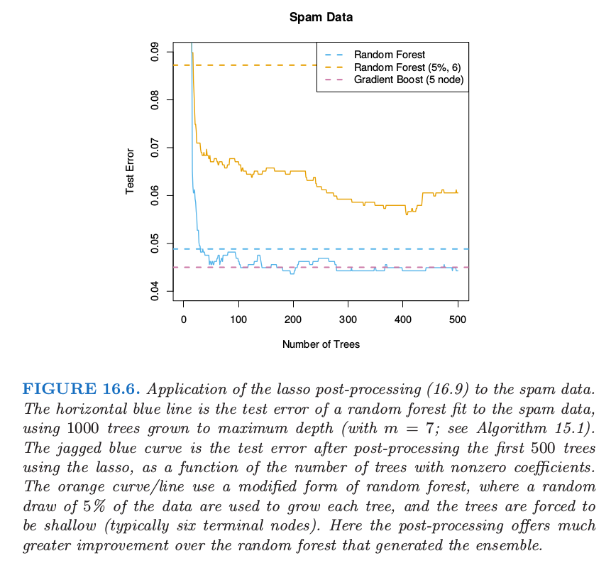
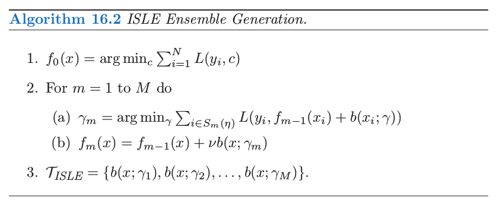
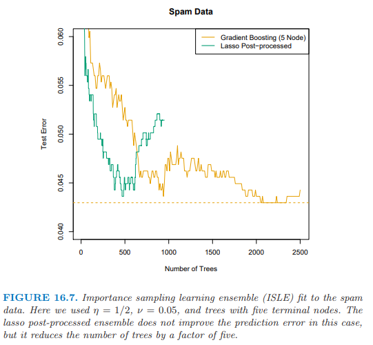
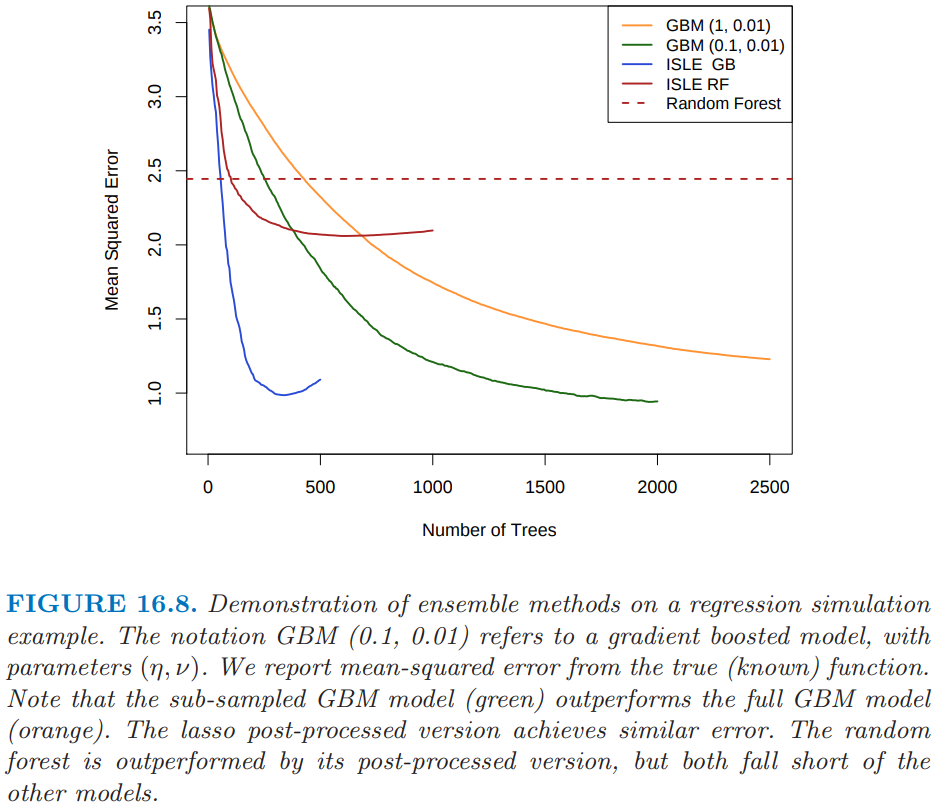

# 16.3 学习集成

| 原文   | [The Elements of Statistical Learning](../book/The Elements of Statistical Learning.pdf) |
| ---- | ---------------------------------------- |
| 翻译   | szcf-weiya                               |
| 时间   | 2017-09-25                               |
| 更新|2018-08-17|
|状态|Done|

前面章节的知识可以用来产生更高效的集成模型。我们继续考虑下面形式的函数

$$
f(x)=\alpha_0+\sum\limits_{T_k\in \cal T}\alpha_kT_k(x)\tag{16.8}
$$

其中$\cal T$是基函数的字典，一般是树。对于gradient boosting和随机森林，$\vert\cal T\vert$非常大，而且最后的模型一般会涉及上千棵树。

Friedman and Popescu (2003)提出混合的方式，它将这个过程分解为下面两步：

- 从训练集中导出有限的基函数字典集$\cal T_L=\\{T_1(x), T_2(x),\ldots, T_M(x)\\}$;
- 通过在字典集中拟合 lasso 路径来构造 $f_\lambda(x)$ 函数族。
$$
\alpha(\lambda)=arg\;\underset{\alpha}{min}\sum\limits_{i=1}^NL[y_i, \alpha_0+\sum\limits_{m=1}^M\alpha_mT_m(x_i)]+\lambda\sum\limits_{m=1}^M\vert \alpha_m\vert\tag{16.9}
$$

在这种简单的形式里面，将 $\cal T_L$ 看成是由梯度 boosting 算法或者随机森林算法得到的树的集合，该模型可以看成是 post-processing boosting 或者是随机森林的某种方式。通过对这些树进行 lasso 路径拟合，一般我们会得到更加简化的集合，它会大大减少未来预测的计算量和存储量。在下一节，我们将讨论这种方法的变种，进而降低 $\cal T_L$ 的相关性，并且提高 lasso post processor 的表现。

作为初步的说明，我们将这个过程应用到对 spam 数据集成的随机森林上。

图 16.6 展示了 lasso post-processing 对随机森林（蓝色曲线）有了较大程度的改善，并且将森林降至了 $40$ 棵树，而不是原来的 $1000$ 棵。这个 post-processed 表现与 gradient boosting 相当。橘黄色曲线展示了修改版的随机森林，它是为了更大程度上降低树之间的相关性。这里训练样本 $5\%$ 的子样本（无放回）用来生成每棵树，并且每棵树限制得很低（大约 6 个终止结点）。这种情形下post-processing 有更显著的改善，而且训练花费大概降低了 $100$ 倍。然而，这个 post-processed 模型的表现有点比蓝色曲线差。

## 学习一个好的集成

并非所有的集成采用 post-processing 都表现得很好。采用基函数，我们想要一个能够覆盖所需要的空间的集合，为了实现有效性，其post-processor与其它的显著不同。

Friedman and Popescu (2003)从数字正交（numerical quadrature）和重要性采样中获得启发。他们将未知的函数看成如下的积分

$$
f(x)=\int\beta(\gamma)b(x;\lambda)d\lambda\tag{16.10}
$$

其中$\gamma\in \Gamma$标记了$b(x;\lambda)$。举个例子，如果基函数为树，则 $\gamma$ 标记了分离变量，分离点以及终止结点里面的值。数字正交（numerical quadrature）意味着寻找 $M$ 个赋值点 $\gamma_m\in\Gamma$ 的集合，以及对应的权重 $\alpha_m$ 使得 $f_M(x)=\alpha_0+\sum\limits_{m=1}^M\alpha_mb(x;\gamma_m)$ 在 $x$ 的定义域内近似 $f(x)$。重要度采样意味着随机对 $\gamma$ 采样，但是对于空间 $\Gamma$ 的相关区域赋予更大的权重。Friedman and Popescu (2003) 建议采用损失函数(16.9)来衡量相关性（的缺失）：

$$
Q(\lambda)=\underset{c_0,c_1}\sum\limits_{i=1}^NL(y_i, c_0+c_1b(x_i;\gamma))\tag{16.11}
$$

上式在训练数据上取值。

如果选择了单个的基函数（比如，一棵树），则会有全局最小点$\gamma^\*=\text{arg min}_{\gamma\in \Gamma}Q(\lambda)$。在选择$\gamma$的时候引进随机性必然会得到次优值，$Q(\lambda)\ge Q(\lambda^\*)$。他们提出采样模式$\cal S$的特征长度$\sigma$的自然度量，

$$
\sigma=E_{\cal S}[Q(\lambda)-Q(\lambda^\*)]\tag{16.12}
$$

- $\sigma$太窄意味着许多 $b(x;\gamma_m)$ 很接近或者近似为 $b(x;\gamma^\*)$；
- $\sigma$ 太宽意味着 $b(x;\gamma_m)$ 过于分散，但是可能包含其他许多无关的情形。

Friedman and Popescu (2003)提出采用sub-sampling作为引入随机性的机制，得到了他们的集成生成算法16.2。

$S_m(\lambda)$指的是大小为$N\cdot \eta (\eta\in [0, 1])$的训练观测值的子样本，一般是无放回采样。 他们的模拟建议取$\eta\le 1/2$，并且对于大$N$取$\eta\in 1/\sqrt{N}$。降低$\eta$会提高随机性，也因此提高宽度$\sigma$。参数$\nu\in[0, 1]$对随机过程引入*memory*；$\nu$越大，越能避免$b(x;\gamma)$与之前找到的一致。一系列熟悉的随机化模式是算法16.2的特殊情形：

- Bagging：$\eta=1$，但是是有放回地采样，并且有 $\nu=0$。Friedman and Hall (2007) 认为 $\eta=\frac 12$ 时无放回抽样等价于 $\eta=1$ 时的采样，并且前者更有效。
- Random forest 的采样也类似，只是通过分离变量的选择引入了更多的随机性。在算法 16.2 中降低 $\eta<\frac 12$ 与随机森林中减低 $m$ 有类似的效果，但是不会有 15.4.2 节中讨论的潜在的偏差问题。
- Gradient boosting，收缩为 (10.41) 时采用 $\eta=1$，但是一般不会得到充分大的 $\sigma$。
- Stochastic gradient boosting (Friedman, 1999) 完全遵循这个方法。

作者建议 $\nu=0.1$ 且 $\eta\le \frac 12$，并且称他们的结合过程（ensemble 的产生和后处理）为 Importance sampled learning ensemble (ISLE)。

图 16.7 展示了 ISLE 在垃圾短信数据上的表现。它不能提高预测表现。却能得到更简单的模型。注意到实际中后处理包括 (16.9) 式正规参数 $\lambda$ 的选取，这可以通过交叉验证来选择。这里我们仅仅简单地通过展示测试数据上整个路径来表明后处理的影响。

图 16.8 显示了回归例子上不同的 ISLE。生成函数为

$$
f(X)=10\cdot \prod\limits_{j=1}^5e^{-2X_j^2}+\sum\limits_{j=6}^{35}X_j\tag{16.13}
$$

其中 $X\sim U[0,1]^{100}$（最后 65 个元素是噪声变量）。响应变量 $Y=f(X)+\varepsilon$，其中 $\varepsilon\sim N(0,\sigma^2)$；我们选择 $\sigma=1.3$ 是的信噪比大致为 2。我们采用大小为 1000 的训练样本，并且通过在 500 个样本的测试集上平均来估计 $\E(\hat f(X)-f(X))^2$。子采样的 GBM 曲线（浅蓝色）是在 10.12 节讨论的 stochastic gradient boosting (Friedman, 1999) 的例子，并且在这个例子上比 gradient boosting 要好。

## 规则增强

这里我们描述一种对增强树模型的修改模型，它针对单个规则（Friedman and Popescu, 2003）。我们在 9.3 节 PRIM 方法的讨论中碰到过规则。想法是通过从集合中的每棵树构造一系列规则来增强树。

图 16.9 描述了一棵小树，带编号的结点。下面的规则可以从这棵树导出：

$$
\begin{align*}
R_1(X) &= I(X_1<2.1)\\
R_2(X) &= I(X_1\ge 2.1)\\
R_3(X) &= I(X_1\ge 2.1)\cdot I(X_3\in\{S\})\\
R_4(X) &= I(X_1\ge 2.1)\cdot I(X_3\in\{M,L\})\\
R_5(X) &= I(X_1\ge 2.1)\cdot I(X_3\in\{S\})\cdot I(X_7<4.5)\\
R_6(X) &= I(X_1\ge 2.1)\cdot I(X_3\in\{S\})\cdot I(X_7\ge 4.5)
\end{align*}
\tag{16.14}
$$

关于规则 1, 4, 5 和 6 的线性回归等价于树本身（练习 16.3）；因此 (16.14) 是这棵树过充分的基。

对于一个 ensemble $\cal T$，我们可以构造规则的 mini-ensemble ${\cal T}_{RULE}^m$，并且然后结合形成更大的 ensemble

$$
{\cal T}_{RULE}=\bigcup\limits_{m=1}^M{\cal T}^m_{RULE}\tag{16.15}
$$

然后像其它 ensemble 一样处理，并且通过 lasso 或者类似的正则化过程进行 post-processed。

对于从更复杂的树导出规则的这种方式有许多优点：

- 模型空间被增大了，并且可以得到更好的表现。
- 规则比树更好解释，所以有更简单模型的潜力。
- 经常通过分开加入变量 $X_j$ 来增广 ${\cal T}_{RULE}$，因此允许 ensemble 能够很好地建立线性模型。

Friedman and Popescu (2008) 在一系列例子中展示了这个过程的能力，包括模拟例子 (16.13)。图 16.10 展示了从该模型得到的 20 次实现的真实模型的均方误差的箱线图。采用 `Rulefit` 软件所有模型都能拟合，这个软件可以在 ESL 主页找到，它采用自动的模型运行。

如在图 16.8 中使用的同样的训练集，基于规则的模型能够达到 1.06 的均方误差。尽管这比图中最优的要略差，但是结果是不可比的，因为这里用的交叉验证是来选择最终模型的。