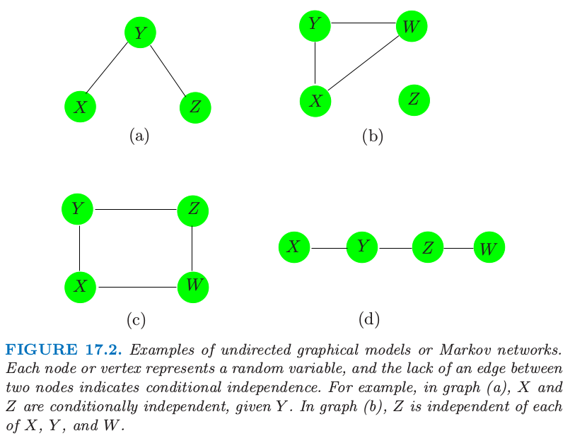

# 17.2 马尔科夫图及其性质

| 原文   | [The Elements of Statistical Learning](https://web.stanford.edu/~hastie/ElemStatLearn/printings/ESLII_print12.pdf#page=646) |
| ---- | ---------------------------------------- |
| 翻译   | szcf-weiya                               |
| 发布 | 2016-09-30 |
| 更新 |2018-06-11|
|状态|Done|

这部分我们讨论图作为随机变量集的联合分布的模型的基本性质．我们将下面两部分的讨论放在后面的章节中，其中一部分是 (a) 根据数据对边的参数的估计和参量化，另一部分是 (b) 估计图的拓扑结构．

图 17.2 显示了无向图的四个例子．图 $\cal G$ 包含数据对 $(V,E)$，其中 $V$ 是顶点的集合，$E$ 为边的集合（用顶点对定义）．对于两个结点 $X$ 和 $Y$，如果存在一条边将它们连起来，则这两个结点称为 **邻接 (adjacent)**，记做 $X\sim Y$．**路径 (path)** $X_1,X_2,\ldots, X_n$ 是相连的顶点集，也就是 $X_{i-1}\sim X_i,i=2,\ldots,n$．**完全图 (complete graph)** 是每个顶点对都被一条边相连的图．**子图 (subgraph)** $U\in V$ 是顶点集及其边的子集．举个例子，图 17.2(a) 的 $(X,Y,Z)$ 构成路径但不是完全图．

> 图 17.2. 无向图模型或者马尔科夫网络的例子．每个结点或顶点表示一个随机变量，两个结点之间缺失边表示条件独立．举个例子，在图 (a) 中，在给定 $Y$ 的情况下，$X$ 和 $Z$ 是独立的．在图 (b) 中，$Z$ 与 $X,Y,W$ 中的每一个都是独立的．

假设我们有图 $\cal G$，它的顶点集合 $V$ 表示联合分布为 $P$ 的随机变量集．在马尔科夫图 $\cal G$ 中，某条边的缺失表示在给定其他结点的变量时，对应的随机变量是条件独立的．这可以用下面的记号来表示：
$$
\text{No edge joining X and Y}\Leftrightarrow X\bot Y\mid \text{rest}\tag{17.1}
$$
其中 “rest” 表示图中所有的其他结点．举个例子，在图 17.2 (a) 中 $X\bot Z\mid Y$．这也称作 $\cal G$ 的 **逐对马尔科夫独立 (pairwise Markov independencies)**．

如果 $A,B$ 和 $C$ 为子图，且若 $A$ 和 $B$ 的任一路径都交于 $C$ 中的结点，则称 $C$ **分离 (separate)** $A$ 和 $B$．举个例子，$Y$ 分离图 17.2 (a) 和 (d) 的 $X$ 和 $Z$，并且 $Z$ 分离 (d) 中的 $Y$ 和 $W$．图 17.2 (b) 的 $Z$ 与 $X,Y,W$ 不相连，则我们称这两个集合被空集分离．在图 17.2 (c) 中，$C=\{X,Z\}$ 分离 $Y$ 和 $W$．

分离集有良好的性质，它们将图分解成条件独立的部分．特别地，在含有 $A,B$ 和 $C$ 子图的图 $\cal G$，
$$
\text{if C separates A and B then }A\bot B\mid C\tag{17.2}
$$
这称作 $\cal G$ 的 **全局马尔科夫性质 (global Markov properties)**．事实上，图的 **逐对马尔科夫性质 (pairwise Markov properties)** 和 **整体马尔科夫性质 (global Markov properties)** 是等价的（对于有正分布的图）．也就是，**相关概率分布 (associated probability distribution)** 满足逐对马尔科夫独立性和全局马尔科夫假设的图的集合是相同的．这个结果对于从简单成对性质中推断整体独立关系是很有用的．举个例子，在图 17.2 (d) 中 $X\bot Z\mid\\{Y,W\\}$，因为这是一个马尔科夫图，且 $X$ 和 $Z$ 之间没有连接．但是 $Y$ 也将 $X$ 从 $Z$ 和 $W$ 中分离，因此由整体马尔科夫假设我们得出 $X\bot Z\mid Y$ 和 $X\bot W\mid Y$．类似地，我们有 $Y\bot W\mid Z$．

!!! note "weiya 注：三种等价的 Markov 性质"
	<!--pairwise Markov properties: 寻找缺失边，在给定其他结点的情况下，缺失边的两个顶点相互独立；
	global Markov properties: 寻找分离集，在给定分离集的情况下，被分离的子图相互独立；-->
	pairwise Markov properties: 对于所有的非邻接顶点 $i$ 和 $j$，$a$ 为剩余结点的集合，则 $X_i\ind X_j\mid X_a$，

	global Markov properties: 对于所有的不相交的子集 $a$, $b$ 和 $c$，若 $a$ 分离 $b$ 和 $c$，则 $X_b\ind X_c\mid X_a$，

	local Markov properties: 对于每个顶点 $i$，$a=\mathrm{bd}(i)$ 是边界集，$b$ 为剩余结点的集合，则 $X_i\ind X_b\mid X_a$．

全局马尔科夫性质允许我们将图分解成更小的易控制的片段，因此在计算和解释性上有本质上的简化．基于这个目的，我们将图分解成 **团 (clique)**．团是一个完全子图——所有顶点都与其他点邻接的顶点集；如果一个团，没有其他顶点可以加进去仍保持是一个团的称为最大团．图 17.2 的最大团为

- $(a)\; \\{X,Y\\},\\{Y,Z\\}$
- $(b)\; \\{X,Y,W\\},\\{Z\\}$
- $(c)\; \\{X,Y\\},\\{Y,Z\\},\\{Z,W\\},\\{X,W\\}$
- $(d)\; \\{X,Y\\},\\{Y,Z\\},\\{Z,W\\}$

尽管接下来连续和离散的分布都要考虑，但是大部分的发展是针对后者的（离散分布）．马尔科夫图 $\cal G$ 上的概率密度函数 $f$ 可以表示成
$$
f(x)=\frac{1}{Z}\prod\limits_{C\in\cal C}\psi_C(x_C)\tag{17.3}
$$

其中 $\cal C$ 为最大团的集合，并且正函数 $\psi_C(\cdot)$ 称为 **团势 (clique potentials)**．这些不是一般的密度函数，而是表示 $X_C$ 中依赖性的 **亲和力 (affinities)**，依赖性越强，$x_C$ 得分越高．<!--这通过对特定的实例 $x_C$ 打更高的分实现．-->

!!! note "原书脚注："
	如果团是分离的，则势可以是密度，但一般不是这种情形．

下值

$$
Z=\sum\limits_{x\in \cal X}\prod\limits_{C\in \cal C}\psi_C(x_C)\tag{17.4}
$$

是标准化常数，也称作 **分割 (partition)** 函数．另外，式 $(17.3)$ 表明图的独立性由乘积中的团定义．这个结果对于有着正分布的马尔科夫网络 $\cal G$ 成立，也称作 Hammersley-Cliffodinyrd 定理（Hammersley and Clifford, 1971[^1]; Clifford, 1990[^2]）．

!!! note "weiya 注"
	一般地，对于取值为 $x_i$ 的随机变量 $X_i$ 的集合，**势函数 (potential function)** 为 $H(x_1,x_2,\ldots)$，**分割函数 (partition function)** 定义如下
	$$
	Z(\beta)=\sum\limits_{x_i}exp(-\beta H(x_1,x_2,\ldots))
	$$

很多图的估计和计算的方法首先将图分解成最大团．然后在单个团中计算相关的量，接着在整个图上进行累加．一个著名的例子是根据联合分布计算边缘和低阶概率的 join tree（或 junction tree）算法．可以在 Pearl (1986)[^3]，Lauritzen and Spiegelhalter (1988)[^4]，Pearl (1988)[^5]，Shenoy and Shafer (1988)[^6]，Jensen et al. (1990)[^7]，或者 Koller and Friedman (2007)[^8] 中找到具体细节．

!!! tip "weiya 注：junction tree"
	Søren Højsgaard 的 [Notes: Graphical Models with R](../references/GMwR-notes.pdf#page=22) 中通过一个简单的三结点的有向图展示了如何通过 Message Passing in Junction Tree 计算边缘分布的概率．Søren Højsgaard et al. 的 [Graphical Models with R](../references/Graphical-Models-with-R.pdf#page=64) 介绍了更一般的 Message Passing in Junction Tree，主要分为两个过程，work inwards towards root 和 work outwards from root．另外，可以参考 Mark A. Paskin 的 [A Short Course on Graphical Models](http://ai.stanford.edu/~paskin/gm-short-course/)．

图模型并不总能唯一确定联合概率分布的高阶依赖结构．考虑图 17.3 的三结点完全图．它可以表示下面任一分布的依赖性结构
$$
\begin{align*}
f^{(2)}(x,y,z)&=\frac{1}{Z}\psi(x,y)\psi(x,z)\psi(y,z)\\
f^{(3)}(x,y,z)&=\frac{1}{Z}\psi(x,y,z)
\end{align*}
\tag{17.5}
$$
第一个仅仅明确了二阶依赖性（并且可以用更少的参数表示）．离散数据的图模型是 loglinear models for multiway contingency tables 的一种特殊情形（如，Bishop et al., 1975[^9]）；这种情形下 $f^{(2)}$ 被称作“无二阶交叉”模型．

> 图 17.3. 没有唯一地指定变量的联合分布中的高阶依赖性结构的完全图．

本章的剩余部分我们关注 **成对马尔科夫图 (pairwise Markov graphs)** (Koller and Friedman, 2007[^8])．对于每条边都有势能函数（如上面 $f^{(2)}$ 的成对变量），且用至多二阶的交叉项来表示．这些在参数上是很简洁的，更容易处理，并且给出由图结构表示的最小复杂性．连续和离散数据的模型都仅仅是（关于**边集 (edge set)**中变量的）成对边缘分布的函数．

[^1]: Hammersley, J. M. and Clifford, P. (1971). Markov field on finite graphs and lattices, unpublished.
[^2]: Clifford, P. (1990). Markov random fields in statistics, in G. R. Grimmett and D. J. A. Welsh (eds), Disorder in Physical Systems. A Volume in Honour of John M. Hammersley, Clarendon Press, Oxford, pp. 19–32.
[^3]: Pearl, J. (1986). On evidential reasoning in a hierarchy of hypotheses, Artificial Intelligence 28: 9–15.
[^4]: Lauritzen, S. and Spiegelhalter, D. (1988). Local computations with proba- bilities on graphical structures and their application to expert systems, J. Royal Statistical Society B. 50: 157–224.
[^5]: Pearl, J. (1988). Probabilistic reasoning in intelligent systems: networks of plausible inference, Morgan Kaufmann, San Francisco, CA.
[^6]: Shenoy, P. and Shafer, G. (1988). An axiomatic framework for Bayesian and belief-function propagation, AAAI Workshop on Uncertainty in AI, North-Holland, pp. 307–314.
[^7]: Jensen, F. V., Lauritzen, S. and Olesen, K. G. (1990). Bayesian updating in recursive graphical models by local computation, Computational Statistics Quarterly 4: 269–282.
[^8]: Koller, D. and Friedman, N. (2007). Structured Probabilistic Models, Stanford Bookstore Custom Publishing. (Unpublished Draft).
[^9]: Bishop, Y., Fienberg, S. and Holland, P. (1975). Discrete Multivariate Analysis, MIT Press, Cambridge, MA. [下载](../references/Discrete-Multivariate-Analysis.pdf)