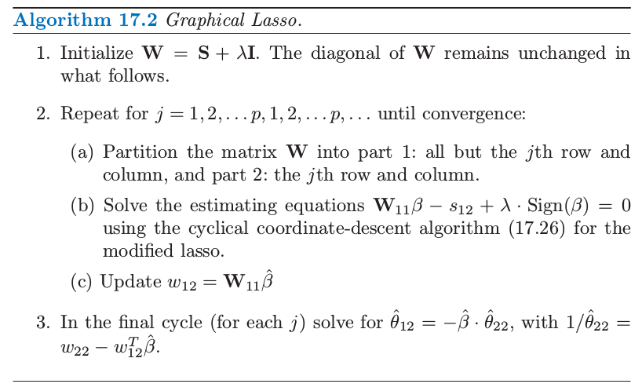
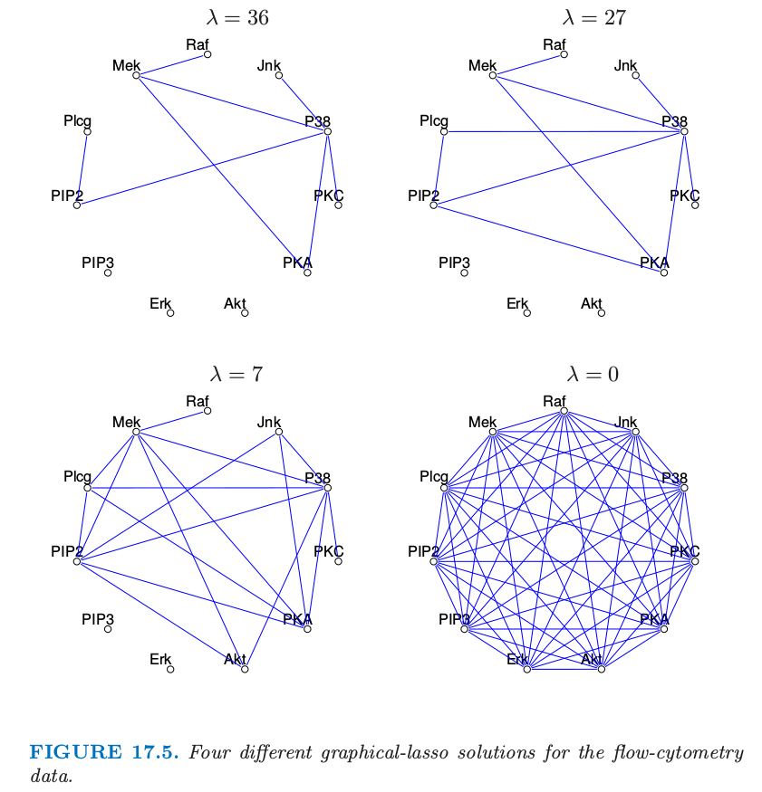

# 17.3 连续变量的无向图模型

| 原文   | [The Elements of Statistical Learning](https://web.stanford.edu/~hastie/ElemStatLearn/printings/ESLII_print12.pdf#page=649) |
| ---- | ---------------------------------------- |
| 翻译   | szcf-weiya                               |
| 发布 | 2016-09-30 |
|更新|2019-07-25 21:17:03|
|状态|Done|

这里我们考虑所有变量都是连续变量的马尔科夫网络．这样的图模型几乎总是用到高斯分布，因为它有方便的分析性质．我们假设观测值服从均值为 $\mu$，协方差为 $\mathbf \Sigma$ 的多元高斯分布．因为高斯分布至多表示二阶的关系，所以它自动地编码了一个成对马尔科夫图．

!!! note "weiya 注："
	因为在高斯分布的密度函数中，指数项中关于随机变量的阶数最多是二次，所以说它至多能表示二阶的关系．

图 17.1 的图是高斯图模型的一个例子．

> 图 17.1. 稀疏无向图的例子，从 flow-cytometry 数据集中估计得到，含有 $p=11$ 个蛋白质在 $N=7466$ 个细胞中的测量值．网络结构是通过本章后面将要讨论的图 lasso 过程进行估计的．

高斯分布有个性质是所有的条件分布也是高斯分布．协方差矩阵的逆 $\mathbf\Sigma^{-1}$ 包含变量之间的 **偏协方差 (partial covariances)** 信息；也就是，在给定其它变量的条件下，$i$ 与 $j$ 的协方差．特别地，如果 $\mathbf {\Theta=\Sigma^{-1}}$ 的第 $ij$ 个元素为 0，则变量 $i$ 和 $j$ 在给定其它变量情况下是条件独立的．（[练习 17.3](https://github.com/szcf-weiya/ESL-CN/issues/136)）

!!! info "weiya 注：Ex. 17.3"
	已解决，详见 [Issue 136: Ex. 17.3](https://github.com/szcf-weiya/ESL-CN/issues/136)

验证某个变量在给定剩余变量的条件下的条件分布是有好处的，其中 $\mathbf\Theta$ 的作用显而易见．假设我们进行分割 $X=(Z,Y)$，其中 $Z=(X_1,\ldots,X_{p-1})$ 包含前 $p-1$ 个变量并且 $Y=X_p$ 是最后一个．于是我们在给定 $Z$ 下有条件分布（比如，Mardia et al., 1979[^1]）

[^1]: Mardia, K., Kent, J. and Bibby, J. (1979). Multivariate Analysis, Academic
Press.

$$
Y\mid Z=z\sim N(\mu_Y+(z-\mu_Z)^T\mathbf \Sigma^{-1}_{ZZ}\sigma_{ZY},\sigma_{YY}-\sigma_{ZY}^T\mathbf\Sigma_{ZZ}^{-1}\sigma_{ZY})\tag{17.6}\label{17.6}
$$
其中我们将 $\mathbf \Sigma$ 分割成
$$
\mathbf\Sigma=
\Big(
\begin{array}{ll}
\mathbf \Sigma_{ZZ}&\sigma_{ZY}\\
\sigma_{ZY}^T&\sigma_{YY}
\end{array}
\Big)
\tag{17.7}\label{17.7}
$$
\eqref{17.6} 的条件均值与 $Y$ 在 $Z$ 上的总体多重线性回归有完全一样的形式，回归系数为 $\beta=\mathbf\Sigma^{-1}\_{ZZ}\sigma_{ZY}$．如果我们对 $\mathbf\Theta$ 用同样的方式进行分割，因为 $\mathbf{\Sigma\Theta=I}$，由分块矩阵的求逆公式有
$$
\theta_{ZY}=-\theta_{YY}\cdot\mathbf\Sigma_{ZZ}^{-1}\sigma_{ZY}\tag{17.8}
$$
其中 $1/\theta_{YY}=\sigma_{YY}-\sigma_{ZY}^T\mathbf\Sigma_{ZZ}^{-1}\sigma_{ZY}>0$．因此
$$
\begin{align*}
\beta&=\mathbf\Sigma_{ZZ}^{-1}\sigma_{ZY}\\
&=-\theta_{ZY}/\theta_{YY}
\end{align*}
\tag{17.9}\label{17.9}
$$
我们可以从这里学到两件事情：

- \eqref{17.6} 中的 $Y$ 对 $Z$ 的依懒性只与均值项有关．显然，$\beta$ 中的 $0$ 元素，也是 $\theta_{ZY}$ 中的 $0$ 元素，意味着 $Z$ 中的对应元素与 $Y$ 在给定其余变量<!--（$Z$中其它元素）-->的条件下是独立的．
- 我们可以通过多重线性回归学习这个依赖性结构．

因此 $\mathbf\Theta$ 捕捉了所有二阶信息（结构上的和定量的），这些信息是描述每个顶点在给定剩余点时的条件分布所需要的，这也称为高斯图模型的“自然”参数．

!!! note "原书脚注："
	从高斯图模型得到的分布是 Wishart 分布．它属于指数族，其中自然 (natural, or "canonical") 参数为 $\mathbf\Theta=\mathbf\Sigma^{-1}$. 实际上，偏最大化的对数似然 \eqref{17.11} 是 Wishart 对数似然（忽略常数差异）．

另外一个（不同）图模型为 **协方差图 (covariance)** 或者 **相关网络 (relevance network)**，其中如果顶点的对应变量间的协方差（不是偏协方差）为 $0$ 则用双向边连接这些顶点．这在基因问题中很常见，特别地见 Butteet et al. (2000)[^2]．这些模型的负对数似然是非凸的，使得计算更加有挑战（Chaudhuri et al.，2007[^3]）．

[^2]: Butte, A., Tamayo, P., Slonim, D., Golub, T. and Kohane, I. (2000). Discovering functional relationships between RNA expression and chemotherapeutic susceptibility using relevance networks, Proceedings of the National Academy of Sciences pp. 12182–12186.
[^3]: Chaudhuri, S., Drton, M. and Richardson, T. S. (2007). Estimation of a covariance matrix with zeros, Biometrika 94(1): 1–18.

## 图结构已知时参数的估计

给定 $X$ 的一些观测值，我们想要估计无向图的参数，该无向图近似了它们的联合分布．首先假设图是完全的（全连通）．我们假设有 $N$ 个多维正态观测值 $x_i,i=1,\ldots,N$，均值为$\mu$，协方差为$\mathbf \Sigma$．令

$$
\mathbf S = \frac{1}{N}\sum_{i=1}^N(x_i-\bar x)(x_i-\bar x)^T\tag{17.10}
$$

为观测值的协方差矩阵，$\bar x$ 为样本均值向量．忽略掉常数，其对数似然可以写成
$$
\ell(\mathbf \Theta)=\mathrm{log \;det}\mathbf\Theta-\mathrm{trace}(\mathbf{S\Theta})\tag{17.11}\label{17.11}
$$
\eqref{17.11} 中我们已经对均值参数 $\mu$ 进行了偏 (partially) 最大化．$-\ell(\mathbf \Theta)$ 是 $\mathbf \Theta$ 的凸函数．可以很简单地证明 $\mathbf\Sigma$ 的极大似然估计为 $\mathbf S$．

现在为了使图更有用（特别在高维数据集中）假设某些边是缺失的，举个例子，图 17.1 中 `PIP3` 和 `Erk` 之间的边是某条缺失边．正如我们所见，对于高斯分布这意味着 $\mathbf{\Theta=\Sigma^{-1}}$ 对应的值为 $0$．因此我们现在想要在某些预先定义的参数为 $0$ 的子集的约束下最大化 \eqref{17.11}．这是等值约束凸优化问题，研究者们已经提出了许多解决它的方法，特别地，**迭代比例拟合过程 (iterative proportional fitting procedure)**（Speed and Kiiveri，1996[^4]）．该方法及其它方法在 Whittaker (1990)[^5] 和 Lauritzen (1996)[^6] 中作了总结．这些方法研究简化问题，这产生于将图分解成最大团的过程中，正如在之前的章节中描述的那样．这里我们列出一种简单的轮换方法，用不同的方式来研究稀疏性．这种方式的效果会在我们讨论图结构估计问题时变得明显．

[^4]: Speed, T. and Kiiveri, H. T. (1986). Gaussian Markov distributions over finite graphs, Annals of Statistics 14: 138–150.
[^5]: Whittaker, J. (1990). Graphical Models in Applied Multivariate Statistics, Wiley, Chichester.
[^6]: Lauritzen, S. and Spiegelhalter, D. (1988). Local computations with probabilities on graphical structures and their application to expert systems, J. Royal Statistical Society B. 50: 157–224.

受 \eqref{17.6} 和 \eqref{17.9} 式的启发，这个思想基于线性回归．特别地，假设我们想要估计与给定顶点 $i$ 相连的顶点的边参数 $\theta_{ij}$，那些没有相连的边为 $0$．于是这似乎表明，顶点 $i$ 在与其相关的结点上的线性回归可能会提供一个合理的估计．但是这忽略了回归中预测变量的依赖性结构．事实表明，如果我们进行回归时采用当前（基于模型的）对预测变量叉积矩阵的估计，这会给出了正确的解，并且能精确地解出带约束的最大似然问题．我们现在给出细节．

为了约束对数似然 \eqref{17.11}，我们对缺失边加上拉格朗日常数
$$
\ell_C(\mathbf \Theta)=\mathrm{log\; det}\mathbf\Theta-\mathrm{trace}(\mathbf{\mathbf S\Theta})-\sum\limits_{(j,k)\not\in E}\gamma_{jk}\theta_{jk}\tag{17.12}\label{17.12}
$$
最大化 \eqref{17.12} 的梯度等式可以写成
$$
\mathbf{\Theta^{-1}-S-\Gamma=0}\tag{17.13}\label{17.13}
$$
这利用了 $\mathrm{log\; det}\mathbf\Theta$ 的导数等于 $\mathbf \Theta^{-1}$ 的事实（如，Boyd and Vandenberghe, 2004，p641[^7]）．$\mathbf\Gamma$ 为所有含缺失边的非零拉格朗日参数值．

[^7]: Boyd, S. and Vandenberghe, L. (2004). Convex Optimization, Cambridge University Press. [下载](../references/Convex-Optimization.pdf)

我们将要展示我们可以怎么应用回归来求解 $\mathbf\Theta$ 以及每次求解它的逆 $\mathbf{W=\Theta^{-1}}$ 的一行和一列．为了简单我们关注最后一行和最后一列．则 \eqref{17.13} 的右上块可以写成
$$
w_{12}-s_{12}-\gamma_{12}=0\tag{17.14}\label{17.14}
$$
这里我们将矩阵分块成如 \eqref{17.7} 所示：第一部分为前 $p-1$ 列和行，第 2 部分为第 $p$ 行和列．$\mathbf W$ 和它的逆 $\mathbf\Theta$ 以同样的方式分块，我们有
$$
\Big(\begin{array}{ll}
\mathbf W_{11}& w_{12}\\
w_{12}^T&w_{22}
\end{array}\Big)
\Big(\begin{array}{ll}
\mathbf\Theta_{11}& \theta_{12}\\
\theta_{12}^T&\theta_{22}
\end{array}\Big)
=\Big(\begin{array}{ll}
\mathbf I& 0\\
0^T& 1
\end{array}\Big)
\tag{17.15}
$$
这意味着
$$
\begin{align}
w_{12}&=-\mathbf W_{11}\theta_{12}/\theta_{22}\tag{17.16}\label{17.16}\\
&=\mathbf W_{11}\beta\tag{17.17}\label{17.17}
\end{align}
$$
其中和 \eqref{17.9} 一样 $\beta=-\theta_{12}/\theta_{22}$．现在将 \eqref{17.17} 替换 \eqref{17.14} 式，我们有
$$
\mathbf W_{11}\beta-s_{12}-\gamma_{12}=0\tag{17.18}\label{17.18}
$$
这些可以解释成 $X_p$ 在其他预测变量上的约束回归的 $p-1$ 个估计等式，除了观测均值的叉积矩阵 $\mathbf S_{11}$ 替换成了 $\mathbf W_{11}$ ，这也是根据模型对当前协方差的估计．

我们可以通过简单的子集回归来求解 \eqref{17.18}．假设 $\gamma_{12}$ 中有 $p-q$ 个非零元——比如，$p-q$ 条边约束为 0．这 $p-q$ 行没有包含任何信息，而且可以移除掉．更进一步，我们可以通过移除 $p-q$ 个 $0$ 元素将 $\beta$ 退化成 $\beta^\*$，得到退化的 $p\times p$ 的等式系统

$$
\mathbf  W^*_{11}\beta^*-s_{12}^*=0\tag{17.19}
$$

解为 $\hat\beta^\*=\mathbf {W_{11}^\*}^{-1}s_{12}^\*$．再加上 $p-q$ 个 $0$ 元得到 $\hat\beta$．

尽管从 \eqref{17.16} 看出似乎我们只恢复了$\theta_{12}$ 乘以缩放因子 $1/\theta_{22}$，但可以很简单地证明
$$
\frac{1}{\theta_{22}}=w_{22}-w_{12}^T\beta\tag{17.20}
$$
(采用分块矩阵求逆)．因为 \eqref{17.13} 的 $\mathbf\Gamma$ 对角元为 0，则 $w_{22}=s_{22}$．

这导出了在缺失边的约束下，用来估计 $\hat{\mathbf W}$ 和它的逆 $\mathbf {\hat\Theta}$ 的算法 17.1 中给出的简单迭代过程．

注意到这个算法概念上是说得通的．图估计的问题不是 $p$ 个独立的回归问题，而是 $p$ 个成对问题．步骤 (b) 中公共 $\mathbf W$ 的应用，而不是观测的叉积矩阵，将问题以合适的方式结合在一起．惊讶的是，我们在文献中找不到这个过程．然而这与 Dempster(1972)[^8] 的协方差选择过程有关，而且在分割上与 Chaudhuri et al. (2007)[^3] 提出的用过协方差图的迭代条件拟合过程很相似．

[^8]: Dempster, A. (1972). Covariance selection, Biometrics 28: 157–175.

> 图 17.4. 一个简单的用于说明的图，以及经验协方差阵．

这里是个小例子，选自 Whittaker(1990)[^5]．假设我们的模型如图 17.4 描述，经验协方差阵为 $\mathbf S$．我们应用算法 (17.1) 来解决这个问题；举个例子，在步骤 (b) 对变量 1 的修改后的回归中，删掉变量 3．这个过程很快收敛到解

注意到 $\hat{\mathbf\Sigma} ^{-1}$ 的 0 元素，对应缺失边 (1,3) 和 (2,4)．也注意到 $\hat{\mathbf \Sigma}$ 中对应的元素是唯一与 $\mathbf S$ 不同的元素．$\mathbf \Sigma$ 估计是有时称为    $\mathbf S$ 的正定“补 (completion)”．

!!! info "weiya 注："
	[这篇笔记](../notes/Graph/alg-17-1/index.html)记录了算法 17.1 的具体实现过程．

## 图结构的估计

大多数情况下，我们不知道哪些边要从图中去掉，因此想试图从数据本身找出．最近几年很多作者提出用于这个目的的 $L_1$ (lasso) 正则化．

!!! note "weiya 注："
	省略图中的边，有点类似于做变量选择，而 lasso 正是应对变量选择的“绝世武功”!:joy:

Meinshausen and Bühlmann (2006)[^9] 对这个问题采取简单的方式：不是试图完全估计 $\mathbf \Sigma$ 或者 $\mathbf \Theta=\mathbf \Sigma^{-1}$，他们仅仅估计非零的组分 $\theta_{ij}$．为了实现这点，它们将每个变量看成响应变量而其它的变量作为预测变量进行拟合 lasso 回归．如果变量 $i$ 在变量 $j$ 上的估计系数为非零，或者（并且）$j$ 变量在 $i$ 上的估计系数为非零，则组分 $\theta_{ij}$ 估计为非零．它们证明这个过程渐近地一致估计了 $\mathbf\Theta$ 的非零元的集合．

我们可以采取更有系统的含有 lasso 惩罚的方法，接着上一节的讨论．考虑最大化带惩罚的对数似然
$$
\mathrm{log\; det}\mathbf\Theta-\mathrm{trace}(\mathbf{S\Theta})-\lambda\Vert\mathbf \Theta\Vert_1\tag{17.21}
$$
其中 $\Vert\Theta\Vert^{-1}$ 为 $L_1$ 范数——$\mathbf \Sigma^{-1}$ 的元素的绝对值之和，并且我们忽略了常数值．这个带惩罚的似然函数的负值是关于 $\mathbf \Theta$ 的凸函数．

!!! note "weiya 注："
	注意区分矩阵的 $L_1$ 范数和 $p$ 范数
	$$
	\Vert A\Vert_p=\underset{x\neq 0}{\mathrm{sup}}\frac{\Vert Ax\Vert_p}{\Vert x\Vert_p}\\
	\Vert A\Vert_1 = \underset{1\le j\le n}{\mathrm{max}}\sum\limits_{i=1}^m\vert a_{ij}\vert\\
	\Vert A\Vert_\infty = \underset{1\le i\le n}{\mathrm{max}}\sum\limits_{j=1}^n\vert a_{ij}\vert\\
	\Vert A\Vert_2 \le \Big(\sum\limits_{i=1}^m\sum\limits_{j=1}^m\vert a_{ij}\vert^2\Big)^{1/2}
	=\Vert A\Vert_F
	$$

事实证明，可以采用 lasso 得到含惩罚的对数似然的精确的最大值点．特别地，我们仅仅需要把算法 17.1 中修改的回归步骤 (b) 换成修改的 lasso．下面是具体细节．

梯度等式 \eqref{17.13} 的类似形式为
$$
\mathbf{\Theta^{-1}-S}-\lambda\cdot \mathrm{Sign}(\mathbf \Theta)=0\tag{17.22}
$$
这里我们采用 **次梯度 (sub-gradient)** 记号，如果 $\theta_{jk}\neq 0$，则 $\mathrm{Sign}(\theta_{jk})=\mathrm{sign}(\theta_{jk})$，如果 $\theta_{jk}=0$，则 $\mathrm{Sign}(\theta_{jk})\in[-1,1]$．继续上一节的讨论，我们得到 \eqref{17.18} 的相似形式
$$
\mathbf W_{11}\beta-s_{12}+\lambda\cdot \mathrm{Sign}(\beta)=0\tag{17.23}
$$
（回忆 $\beta$ 和 $\theta_{12}$ 有相反的符号）．我们将会看到这个系统完全等价于 lasso 回归的估计等式．

考虑一般的回归设定，输出变量为 $\mathbf y$，且预测矩阵为 $\mathbf Z$．lasso 对下式进行最小化
$$
\frac{1}{2}(\mathbf y-\mathbf Z\beta)^T(\mathbf y-\mathbf Z\beta)+\lambda\cdot\Vert\beta\Vert_1\tag{17.24}
$$
梯度表达式为
$$
\mathbf{Z^TZ}\beta-\mathbf{Z^Ty}+\lambda\cdot \mathrm{Sign}(\beta)=0\tag{17.25}
$$
所以乘上因子 $1/N$，$\mathbf {Z^Ty}$ 是 $s_{12}$ 的类比，并且我们用 $\mathbf W_{11}$ 替换 $\mathbf{Z^TZ}$，从我们当前的模型估计叉积矩阵．

这一过程称为 **graphical lasso**，由 Friedman et al. (2008b)[^9] 提出，这建立在 Banerjee et al. (2008)[^10]．这总结在算法 17.2 中．

[^9]: Friedman, J., Hastie, T. and Tibshirani, R. (2008b). Sparse inverse covariance estimation with the graphical lasso, Biostatistics 9: 432–441.
[^10]: Banerjee, O., Ghaoui, L. E. and d’Aspremont, A. (2008). Model selection through sparse maximum likelihood estimation for multivariate gaussian or binary data, Journal of Machine Learning Research 9: 485–516.

Friedman et al. (2008b)[^9] 采用成对坐标下降方法（[3.8.6 节](../03-Linear-Methods-for-Regression/3.8-More-on-the-Lasso-and-Related-Path-Algorithms/index.html)）来在一步求解修改的 lasso 问题．下面是图 lasso 算法的成对坐标下降细节．令 $\mathbf {V=W_{11}}$，更新式有如下形式
$$
\hat\beta_j\leftarrow S(s_{12j}-\sum\limits_{k\neq j}V_{kj}\hat\beta_k,\lambda)/V_{jj}\tag{17.26}
$$
$j=1,2,\ldots,p-1,1,2,\ldots,\ldots,p-1,\ldots$，其中 $S$ 为软阈限算子
$$
S(x,t)=\mathrm{sign}(x)(\vert x\vert-t)_+\tag{17.27}
$$
这个过程对预测变量循环直到收敛．

可以简单地证明得到解矩阵 $\mathbf W$ 的对角元 $w_{jj}$ 为 $s_{jj}+\lambda$，这些是在算法 17.2 的步骤 1 中固定的．

!!! note "原书脚注："
    可以提出问题 (17.21) 的另一个构造，我们不对 $\mathbf \Theta$ 的对角元进行惩罚．则解矩阵的对角元 $w_{jj}$ 为 $s_{jj}$，算法的剩余部分没有改变．

Graphical lasso 算法非常快，可以在一分钟之内求解含 1000 个结点的中等稀疏的问题．可以很简单地修改算法得到特定边的惩罚参数 $\lambda_{jk}$；因为 $\lambda_{jk}=\infty$ 会强制使 $\hat\theta_{jk}$ 为 0，这个算法归入到算法 17.1 中．通过将稀疏逆协方差矩阵问题作为一系列回归，可以快速地计算并且验证解的路径作为惩罚参数$\lambda$ 的函数．更多的细节可以在 Friedman et al. (2008b)[^9] 中找到．

图 17.1 显示了将图 lasso 应用到 flow-cytometry 数据集中的结果．这里 lasso 惩罚参数 $\lambda$ 设为14．实际中检验随着 $\lambda$ 变化而得到的不同的图是很有用的．图 17.5 显示了 4 个不同的解．当惩罚参数增大时图变得更稀疏．

> 图 17.5. flow-cytometry 数据的 4 个不同的图 lasso 解．

最后注意到图模型中有些点的值可以没有观测，也就是，缺失或者隐藏．如果一个点上只有一些值缺失，EM 算法可以用来插补缺失值（[练习 17.9](https://github.com/szcf-weiya/ESL-CN/issues/137)）．

!!! note "weiya 注: Ex. 17.9"
	已解决，详见 [Issue 137: Ex. 17.9](https://github.com/szcf-weiya/ESL-CN/issues/137)．

然而，有时整个点是隐藏的．在高斯模型中，如果一个点所有的值都缺失，由于线性，可以简单地对缺失的结点进行平均，使得在观察到的结点上产生另一个高斯模型．因此隐藏结点的引入不会扩大观测点的最终模型；实际上，在协方差上加了额外的结构．然而在离散模型中（接下来讨论），固有的非线性使隐藏单元成为扩展模型的有力方式．
