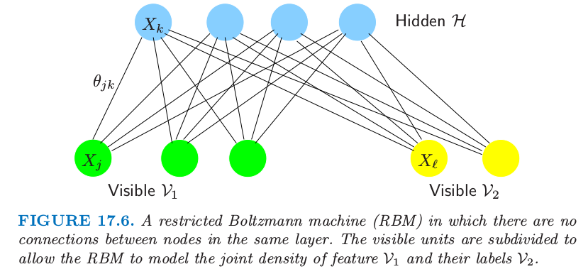
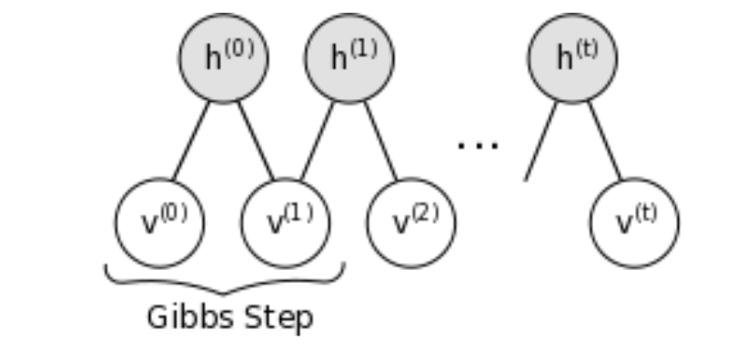

# 17.4 离散变量的无向图模型

| 原文   | [The Elements of Statistical Learning](https://web.stanford.edu/~hastie/ElemStatLearn/printings/ESLII_print12.pdf#page=657) |
| ---- | ---------------------------------------- |
| 翻译   | szcf-weiya                               |
| 发布 | 2016-09-30 |
| 更新 | 2017-08-27, 2018-07-09|
| 状态 |Done|

> 写在前面
>
> 这一节中我觉得最有应用价值的是 RBM，这跟深度学习很相关，在 LISA lab, University of Montreal 编的那本 Deep Learning Tutorial (Release 0.1) 中，有一节就是讲如何用 RBM 做手写数字识别．那段程序大概六个月前就已经接触了，但一直没搞清楚它在干嘛:disappointed:．其实，本节最后作者提到的用 RBM 做手写数字识别中的某一步其实就是那段程序干的事情．事实上，那段程序并没有真正地完成识别问题，仅仅是其中的一步——“采用对比发散训练包含 784 个可见单元和 500 个隐藏单元的RBM，来建立图像集的模型”，后续步骤还应该有“将这个 RBM 的隐藏状态作为训练第二个 RBM 的数据，第二个 RBM 含 500 个可见单元和 500 个隐藏单元．最后，第二个 RBM 的隐藏状态用作训练含 2000 个隐藏单元的RBM的输入特征，并且用上标签数据．” 或许，这导致当时没有理解程序所要完成的目标的原因吧:confounded:  
>
> 程序可以在[这里](https://github.com/szcf-weiya/ESL-CN/tree/master/code/rbm) 中找到，或者参考[官方教程](http://deeplearning.net/tutorial/deeplearning.pdf)．
>
> 另外，在我的[英文博客](https://stats.hohoweiya.xyz//statisticallearning/2017/08/17/Restricted-Boltzmann-Machines/)中有RBM 的简要总结，欢迎提出宝贵建议:joy:
> @2017.08.27

离散变量的无向马尔科夫网络是很流行的，而且特别地，二值变量的成对马尔科夫网络更普遍．在统计力学领域有时称为 Ising 模型，在机器学习领域称为 **玻尔兹曼机 (Boltzmann machines)**，其中顶点称为“**结点 (nodes)**”或“**单元 (units)**”，取值为 0 或 1.

另外，每个结点处的值可以 **被观测到 (visible)** 或者 **观测不到 (hidden)**．结点通常由层来构成，这类似神经网络．玻尔兹曼机对于非监督学习和监督学习都是很有用的，特别对有结构化输入数据，比如图像，但是也受到计算上的限制．图 17.6 显示了一个约束的玻尔兹曼机（后面讨论），其中一些变量是隐藏的，而且只有一些结点对是相连的．我们所有 $p$ 个结点都是可见的简单情形，并且边的对 $(j,k)$ 取自 $E$．

用 $X_j$ 标记结点 $j$ 处的二值变量，它们联合分布的 Ising 模型由下式给出
$$
p(X,\mathbf\Theta)=\exp\left[\sum\limits_{(j,k)\in E}\theta_{jk}X_jX_k-\Phi(\mathbf{\Theta})\right]\text{  for  }X\in{\cal X}\tag{17.28}\label{17.28}
$$
其中 ${\cal X}=\\{0,1\\}^p$．和上一节的高斯模型一样，只对成对交叉项进行建模．Ising 模型是在统计力学中发展的，而且现在更一般地用来建立成对交叉的联合影响．$\Phi\mathbf{(\Theta)}$ 为 **分割函数 (partition function)** 的对数，而且由下式定义
$$
\Phi(\mathbf \Theta)=\log\sum\limits_{x\in\cal X}\left[\exp\left(\sum\limits_{(j,k)\in E}\theta_{jk}x_jx_k\right)\right]\tag{17.29}
$$

!!! note "weiya 注：Recall"
	$$
	\begin{align*}
	f^{(2)}(x,y,z)&=\frac{1}{Z}\psi(x,y)\psi(x,z)\psi(y,z)\\
	f^{(3)}(x,y,z)&=\frac{1}{Z}\psi(x,y,z)
	\end{align*}
	\tag{17.5}\label{17.5}
	$$

分割函数保证在样本空间中概率相加起来为 1．$\theta_{jk}X_jX_k$ 项表示（对数）势函数 \eqref{17.5} 的特定参量化，而且因为技术上的原因需要包含 **常值结点 (constant node)** $X_0\equiv 1$，即与其他结点都有边相连.（[练习 17.10](https://github.com/szcf-weiya/ESL-CN/issues/139)）．
 
!!! note "weiya 注：Ex. 17.10"
	已解决，详见 [Issue 139: Ex. 17.10](https://github.com/szcf-weiya/ESL-CN/issues/139)．

在统计领域中，这个模型等价于 **多路计数表 (multiway tables of counts)** 的 **一阶交叉泊松对数线性模型 (first-order-interaction Poisson log-linear model)**（Bishop et al.，1975[^1] ;McCullagh and Nelder,1989[^2]; Agresti, 2002[^3]）．

!!! note "weiya 注：multiway tables of counts"
	Agresti (2002) 在 p17 介绍到，如果一个 **列联表 (contigency table)** 对两个（类别型）变量进行交叉分类，则称为 two-way table；如果对三个变量交叉分类，则称为 three-way table，以此类推. 

[^1]: Bishop, Y., Fienberg, S. and Holland, P. (1975). Discrete Multivariate Analysis, MIT Press, Cambridge, MA.
[^2]: McCullagh, P. and Nelder, J. (1989). Generalized Linear Models, Chapman and Hall, London.
[^3]: Agresti, A. (1996). An Introduction to Categorical Data Analysis, Wiley, New York.

Ising 模型暗示着每个结点在其它结点条件下有逻辑斯蒂形式（[练习 17.11](https://github.com/szcf-weiya/ESL-CN/issues/140)）
$$
\Pr(X_j=1\mid X_{-j}=x_{-j})=\frac{1}{1+\exp(-\theta_{j0}-\sum_{(j,k)\in E}\theta_{jk}x_k)}\tag{17.30}\label{17.30}
$$
其中 $X_{-j}$ 记除了 $j$ 的所有结点．因此参数 $\theta_{jk}$ 衡量了在给定其它结点条件下，$X_j$ 在 $X_k$ 上的依赖性．

!!! note "weiya 注：Ex. 17.11"
	已解决，详见 [Issue 140: Ex. 17.11](https://github.com/szcf-weiya/ESL-CN/issues/140)．

## 当图结构已知时估计参数

从模型中给出一些数据，我们可以怎么估计参数？假设我们有观测 $x_i=(x_{i1},x_{i2},\ldots,x_{ip})\in\\{0,1\\}^p,i=1,\ldots,N$．对数似然为
$$
\begin{align}
\ell(\mathbf\Theta)&=\sum\limits_{i=1}^N\log \Pr\nolimits_{\mathbf\Theta}(X_i=x_i)\notag\\
&=\sum\limits_{i=1}^N\Big[\sum\limits_{(j,k)\in E}\theta_{jk}x_{ij}x_{ik}-\Phi(\mathbf\Theta) \Big]\tag{17.31}
\end{align}
$$
对数似然的梯度为
$$
\frac{\partial\ell(\mathbf\Theta)}{\partial\theta_{jk}}=\sum\limits_{i=1}^Nx_{ij}x_{ik}-N\frac{\partial \Phi(\mathbf\Theta)}{\partial\theta_{jk}}\tag{17.32}
$$
并且
$$
\begin{align}
\frac{\partial \Phi(\mathbf\Theta)}{\partial \theta_{jk}}&=\sum\limits_{x\in\cal X}x_jx_k\cdot p(x,\mathbf\Theta)\notag\\
&=\E_{\mathbf\Theta}(X_jX_k)\tag{17.33}
\end{align}
$$
令梯度等于 0 得到
$$
\hat \E(X_jX_k)-\E_{\mathbf \Theta}(X_jX_k)=0\tag{17.34}\label{17.34}
$$
其中我们定义
$$
\hat \E(X_jX_k)=\frac{1}{N}\sum\limits_{i=1}^Nx_{ij}x_{ik},\tag{17.35}
$$
这是关于数据的经验分布取期望．注意 \eqref{17.34} 式，我们看到极大似然估计简单地把结点之间的内积估计和观测的内积匹配上了．这是指数族模型得分（梯度）等式的标准形式，其中令充分统计量等于模型下的期望．

为了寻找极大似然估计，我们可以利用梯度搜索或者牛顿法．然而 $\E_{\mathbf \Theta}(X_jX_k)$ 的计算涉及 $p(X,\mathbf\Theta)$ 在 $X$ 的 $\vert{\cal X}\vert=2^p$ 种可能值中的 $2^{p-2}$ 种情形，

!!! note "weiya 注：$2^{p-2}$"
	可以这样理解，因为 $X_jX_k$ 的取值有四种情形，则对每一种 $X_jX_k$，总共有$2^p/4=2^{p-2}$种可能．

而且对于大的 $p$ 一般是不可行的（比如，大于 30）．对于小 $p$，有一系列标准的统计方法可以使用：

- **泊松对数线性建模 (Poisson log-linear modeling)**， 其中我们将问题看成是大规模回归问题（[练习 17.12](https://github.com/szcf-weiya/ESL-CN/issues/141)）．响应变量 $\mathbf y$ 是数据的多路表的每个单元中的 $2^p$ 维计数的向量．

!!! note "原书脚注："
	每个单元的计数看成是单个的独立泊松变量．在总数 $N$ 的条件下能得到对应 \eqref{17.28} 的多项式模型（在这个框架下也是泊松分布）．

<!--
不矛盾！！其实就是 $N=2^p$.

!!! note "weiya 注：翻译疑问"
	“The response vector y is the vector of $2^p$ counts in each of the cells of the multiway tabulation of the data.” 这里我理解为 $2^p$ 维，因为有 $2^p$ 个单元，每个单元是指代观测点的个数，但这样似乎与 [练习 17.12](https://github.com/szcf-weiya/ESL-CN/issues/141) 矛盾．或者只是记号本身有点差异？

-->

!!! note "weiya 注：Ex. 17.12"
	已解决，详见 [Issue 141: Ex. 17.12](https://github.com/szcf-weiya/ESL-CN/issues/141).

预测矩阵 $\mathbf Z$ 有 $2^p$ 个行，以及 $1+p+p^2$ 个表征每个单元的列，尽管这个数字取决于图的稀疏程度．计算代价本质是该规模下回归问题的代价，即为 $O(p^42^p)$ 并且对于 $p < 20$ 是可行的．**牛顿更新 (Newton updates)**一般通过 **迭代重赋权最小二乘法 (iteratively reweighted least squares)** 来计算，并且步数通常是在个位数之内．详见 Agresti (2002)[^3] 和 McCullagh and Nelder(1989)[^2]．标准软件（比如 `R` 语言的 `glm` 包）可以用来拟合这个模型．

- **梯度下降 (Gradient descent)** 至多需要 $O(p^22^{p-2})$ 的计算量来计算梯度，但是可能会比二阶牛顿法需要更多的梯度步数．然而，可以处理稍微大点的 $p\le 30$ 的问题．计算量可以通过（采用 junction-tree 算法）找出稀疏图中特别的团结构来降低．这里没有给出细节．

- **迭代比例过滤 (Iterative proportional fitting, IPF)** 在梯度式 \eqref{17.34} 中采用 **循环坐标下降 (cyclical coordinate descent)**．每一步更新一个参数使得梯度等式正好为 0．循环进行直到所有梯度为 0．一个完整的周期与梯度赋值花费同样的计算量，但是可能更有效．Jirouśek and Přeučil (1995)[^4] 采用 junction trees 实现了 IPF 的一个有效版本．

[^4]: Jirouśek, R. and Přeučil, S. (1995). On the effective implementation of the iterative proportional fitting procedure, Computational Statistics and Data Analysis 19: 177–189.

当 $p$ 变大 $(>30)$ 可以采用其它的方法来近似梯度

- 均值域近似（Peterson and Anderson, 1987[^5]）用 $\E_{\mathbf\Theta}(X_j)\E_{\mathbf \Theta}(X_k)$ 来估计 $\E_{\Theta}(X_jX_k)$，并且将输入变量用它们的均值替换，得到一系列关于参数 $\theta_{jk}$ 的非线性等式．
- 为了得到近似解，吉布斯采样（[8.6 节](../08-Model-Inference-and-Averaging/8.6-MCMC-for-Sampling-from-the-Posterior/index.html)）可以用来近似 $\E_{\mathbf\Theta}(X_jX_k)$，即对估计模型 $\Pr_{\mathbf\Theta}(X_j\mid X_{-j})$ 逐步抽样（见 Ripley (1996)[^6]）

[^5]: Peterson and Anderson, J. R. (1987). A mean field theory learning algorithm for neural networks, Complex Systems 1: 995–1019.
[^6]: Ripley, B. D. (1996). Pattern Recognition and Neural Networks, Cambridge University Press.

我们没有讨论 **可分解模型 (decomposable models)**，因为此时极大似然估计不需要任何迭代就可以在闭形式中找到．举个例子，这些模型来自树：截断树拓扑的特殊图．当关心计算易处理性，树是一个有用的模型类，因为它们回避本节中提出的计算上的考虑．详见 Whittaker(1990)[^7] 的第 12 章的例子．

##　隐藏结点

我们可以通过引入潜在或隐藏结点来增加离散马尔科夫网络的复杂性．假设变量的子集 $X_{\cal H}$ 是未观测的或者“隐藏的”，并且剩余的变量 $X_{\cal V}$ 是观测的或者“可见的”．则观测数据的对数似然为
$$
\begin{align}
\ell(\mathbf\Theta)&=\sum_{i=1}^N\mathrm{log}[\Pr\nolimits_{\mathbf\Theta}(X_{\cal V}=x_{i\cal V})]\notag\\
&=\sum_{i=1}^N\left[\mathrm{log}\sum\limits_{x_{\cal H}\in{\cal X_H}}\exp\sum\limits_{(j,k)\in E}(\theta_{jk}x_{ij}x_{jk}-\Phi(\mathbf\Theta))\right]\tag{17.36}
\end{align}
$$
对 $x_{\cal H}$ 求和意味着我们对隐藏单元的所有可能 $\\{0,1\\}$ 值进行求和．梯度为
$$
\frac{d\ell(\mathbf\Theta)}{d\theta_{jk}}=\hat \E_{\cal V}\E_{\mathbf \Theta}(X_jX_k\mid X_{\cal V})-\E_{\mathbf\Theta}(X_jX_k)\tag{17.37}\label{17.37}
$$
第一项是当 $X_jX_k$ 都可见时的经验均值；如果其中一个或都隐藏，则在给定可见数据下进行第一次插值，然后在隐藏变量上平均．第二项是 $X_jX_k$ 的无条件期望．

第一项中的内层期望可以用条件期望的基本法则和伯努利随机变量的性质进行赋值．具体地，对于观测 $i$，
$$
\E_{\mathbf\Theta}(X_jX_k\mid X_{\cal V}=x_{i\cal V}) =
\left\{
\begin{array}{ll}
x_{ij}x_{ik}& \text{if }j,k\in\cal V\\
x_{ij}\Pr\nolimits_{\cal\mathbf\Theta}(X_k=1\mid X_{\cal V}=x_{i\cal V})&\text{if }j\in\cal V,k\in\cal H\\
\Pr\nolimits_{\mathbf\Theta}(X_j=1,X_k=1\mid X_{\cal V}=x_{i\cal V})&\text{if }j,k\in{\cal H}\end{array}
\right.
\tag{17.38}\label{17.38}
$$

!!! note "weiya 注：推导 \eqref{17.38}"
	参见[评论](http://disq.us/p/22yh4r6).

现在需要进行两个独立的吉布斯采样；第一个是从上面的模型中采样估计 $\E_{\mathbf \Theta}(X_jX_k)$，第二个是估计 $\E_{\mathbf\Theta}(X_jX_k\mid X_{\cal V}=x_{i\cal V})$．对于后者，固定（“夹住”）可见单元为观测值，并且仅仅对隐藏变量进行取样．吉布斯采样必须对训练集中的每一个观测进行，在梯度搜索的每一阶段．结果是这个过程可以变得非常慢，甚至对于中等规模的模型也是如此．在 [17.4.4 节]()我们考虑进一步的模型约束来使得计算可行．

## 图结构的估计

Lee et al. (2007)[^7] 和 Wainwright et al. (2007)[^8] 建议使用二值成对马尔科夫网络的 lasso 惩罚．第一篇作者们提出共轭梯度法来精确最大化含惩罚的对数似然．瓶颈是梯度中 $\E_{\mathbf\Theta}(X_jX_k)$ 的计算；通过 junction tree 算法的精确计算对于稀疏图是可行的但是对稠密的图变得难以处理．

[^7]: Lee, S.-I., Ganapathi, V. and Koller, D. (2007). Efficient structure learning of markov networks using l 1 -regularization, in B. Schölkopf, J. Platt and T. Hoffman (eds), Advances in Neural Information Processing Systems 19, MIT Press, Cambridge, MA, pp. 817–824.
[^8]: Wainwright, M. J., Ravikumar, P. and Lafferty, J. D. (2007). High-dimensional graphical model selection using l 1 -regularized logistic regression, in B. Schölkopf, J. Platt and T. Hoffman (eds), Advances in Neural Information Processing Systems 19, MIT Press, Cambridge, MA, pp. 1465–1472.

第二个篇文章提出近似的解法，类似对于高斯图模型的 Meinshausen and Bühlmann (2006)[^9] 的方法．它们将每个结点看成其他结点的函数的 $L_1$ 惩罚逻辑斯蒂回归，接着以某种方式对称边的参数．举个例子，如果 $\hat\theta_{jk}$ 为从输出变量为结点 $j$ 的逻辑斯蒂回归模型中得到的 $j$-$k$ 边参数的估计，“最小”的对称化设定 $\hat\theta_{jk}$ 为 $\tilde\theta_{jk}$ 或 $\tilde\theta_{kj}$ 中绝对值最小的，类似地定义“最大”准则．他们证明在确定条件下，随着样本大小变为无穷大，两种近似都能估计正确的非零边．Hoefling and Tibshirani(2008)[^10] 将 graphical lasso 应用到离散马尔科夫网络，得到比共轭梯度稍快的过程，但是依旧必须处理 $\E_{\mathbf\Theta}(X_jX_k)$ 的计算．他们也在大量的模拟研究中比较了精确解和近似解，并且发现“最小”和“最大”近似仅仅比精确解略微不精确，对于估计非零边和估计边参数的真实值都是这样，而且快很多．此外，他们可以处理稠密图的情形，因为他们不需要计算 $\E_{\mathbf\Theta}(X_jX_k)$.

[^9]: Meinshausen, N. and Bühlmann, P. (2006). High-dimensional graphs and variable selection with the lasso, Annals of Statistics 34: 1436–1462.
[^10]: Hoefling, H. and Tibshirani, R. (2008). Estimation of sparse Markov networks using modified logistic regression and the lasso, submitted.

最后，我们指出高斯和二值模型的关键区别．在高斯情况下，$\mathbf\Sigma$ 和其逆经常都是感兴趣的，而且 graphical lasso 过程都实现了这两个的估计．然而，Meinshausen and Bühlmann (2006)[^9] 对于高斯图模型的近似类似 Wainwright et al. (2007)[^8] 对二值情形的近似，却仅仅得到 $\mathbf\Sigma^{-1}$ 的估计．相反地，在二值数据的马尔科夫模型中，$\mathbf\Theta$ 是我们感兴趣的，而它的逆不是我们感兴趣的．Wainwright et al. (2007)[^8] 近似的方法有效地估计 $\mathbf\Theta$，因此是二值问题的吸引人的解决方案．

## 限制玻尔兹曼机

这节我们考虑受神经网络影响的一种特殊的图模型结构，该结构中，单元是按层进行组织的．**限制玻尔兹曼机 (RBM)** 包含一层可见单元和一层隐藏单元，单层之间没有联系．如果隐藏单元的连接被移除掉，计算条件期望变得很简单（如在式 \eqref{17.37} 和 \eqref{17.38}）．

!!! note "weiya 注："
		这样 \eqref{17.38} 式变成，对于观测 $i$，
		$$
		\E_{\Theta}(X_jX_k\mid X_{\cal V}=x_{i\cal V})=
		\left\{
			\begin{array}{ll}
			x_{ij}x_{ik}&\text{if }j,k\in\cal V\\
			\Pr\nolimits_{\Theta}(X_j=1,X_k=1\mid X_{\cal V}=x_{i\cal V})&\text{if }j,k\in\cal H
			\end{array}
			\right.
		$$

图 17.6 显示了一个例子；可见层被分成了输入变量 $\cal V_1$ 和输出变量 $\cal V_2$，且有一个隐藏层 $\cal H$．我们将这样一个网络表示成

$$
{\cal V}_1\leftrightarrow {\cal H\leftrightarrow\cal V}_2\tag{17.39}
$$

> 图 17.6. 同一层中的结点没有连接的 **限制玻尔兹曼机 (RBM)**．可见单元细分成了 $\cal V_1$ 和 $\cal V_2$，允许 RBM 建立特征 $\cal V_1$ 和标签 $\cal V_2$ 之间的联合密度．

举个例子， $\cal V_1$ 可以是手写字体图像的二值像素，$\cal V_2$ 可以有10个单元，每个单元是观测的类别标签 0-9 中的一个．

这个模型的约束形式简化了估计 \eqref{17.37} 中期望的吉布斯采样，因为每一层的变量在给定其它层中的变量时相互独立．因此它们可以采用由式 \eqref{17.30} 给出的条件概率一起取样．

虽然这样得到的最终模型没有玻尔兹曼机一般，但是仍然很有用；举个例子，可以经过学习从图像中提取有趣的特征．通过对图 17.6 中 RBM 的每一层中的变量进行交替取样，从联合密度模型中产生样本是可能的．如果可见层的 $\cal V_1$ 部分在交替取样时固定为特定的特征向量，从给定 $\cal V_1$ 的标签分布中取样是可能的．另外测试项的分类也可以通过比较观测到的特征和每个类别标签的（未标准化）联合密度来实现．我们不需要计算分割函数因为对于所有的组合都是一样的．

正如所注意到的约束玻尔兹曼机有与单层隐藏层神经网络一样的一般形式（[11.3 节](../11-Neural-Networks/11.3-Neural-Networks/index.html)）．神经网络中边是有向的，隐藏单元经常是实值的，并且拟合准则不一样．神经网络在输入特征的情况下，最小化目标与模型预测之间的误差（交叉熵）．相反地，约束玻尔兹曼机最大化所有可见单元（也就是，特征和目标）的联合分布的对数似然．可以从输入特征中提取对预测标签有用的信息，但是，与监督学习方法不同，可能也使用一些隐藏单元对特征向量中的结构进行建模，而这与预测标签不是直接相关的．然而，这些特征当与从隐藏层中导出的特征结合起来会变得有用．

不幸的是，约束玻尔兹曼机中的吉布斯采样会非常慢，因为需要花费很长时间达到稳态．当网络参数变得更大，这些链混合得更慢，并且我们需要更多的步骤来得到无条件的估计．Hinton (2002)[^11] 根据经验注意到当我们通过在数据中启动马尔科夫链并仅仅运行几步（不是直到收敛）来估计 \eqref{17.37} 中的第二个期望，学习仍然有用．他称这个为 **对比发散 (contrastive divergence)**：我们给定 $\cal V_1,V_2$ 对 $\cal H$ 取样，然后给定 $\cal H$ 对 $\cal V_1,V_2$ 取样，最后再次给定 $\cal V_1,V_2$ 对$ \cal H$ 取样．思想是，当参数与解相差很多，迭代吉布斯取样达到稳态是浪费的，因为仅仅一个迭代就能发现改变估计的一个好方向．

!!! note "weiya 注"
		
		截图自[http://deeplearning.net/tutorial/](http://deeplearning.net/tutorial/)

我们现在给出说明 RBM 用法的一个例子．采用 **对比发散 (CD)**，训练 RBM 来识别 MNIST 数据集中的手写字体是可能的（LeCun et al.，1998[^12]）．$2000$ 个隐藏单元，$784$ 个表示二值像素强度的单元，以及表示标签的 10-way multinomial（weiya 注：取值为0-9）可见单元，RBM 可以在测试集值达到 $1.9\%$ 的错误率．这比支持向量机达到的 $1.4\%$ 略高一点，与通过向后传播训练的神经网络得到的误差率相当．然而，用 $500$ 个从图像中得到的不含任何标签信息的特征来替换 784 个像素强度，RBM 的误差率会降至 $1.25\%$．首先，采用对比发散训练包含 784 个可见单元和 500 个隐藏单元的 RBM，来建立图像集的模型．然后第一个 RBM 的隐藏状态作为训练第二个 RBM 的数据，第二个 RBM 含 500 个可见单元和 500 个隐藏单元．最后，第二个 RBM 的隐藏状态用作训练含 2000 个隐藏单元的 RBM 的输入特征．这种以贪婪、逐层的方式来学习特征的细节及证明在 Hinton et al. (2006)[^13] 中给出．图 17.7 给出了以这种方式学习的复合模型的一个表示，也显示了一些它能够应付的变形的字体的例子．

> 图 17.7 约束玻尔兹曼机处理手写字体数字的例子．网络用左边的原理图来描述．右边显示了一些该模型分类正确的难的测试图像．

[^11]: Hinton, G. (2002). Training products of experts by minimizing contrastive divergence, Neural Computation 14: 1771–1800.
[^12]: Le Cun, Y., Bottou, L., Bengio, Y. and Haffner, P. (1998). Gradient-based learning applied to document recognition, Proceedings of the IEEE 86(11): 2278–2324.
[^13]: Hinton, G., Osindero, S. and Teh, Y.-W. (2006). A fast learning algorithm for deep belief nets, Neural Computation 18: 1527–1554. [下载](../references/Hinton2006.pdf)