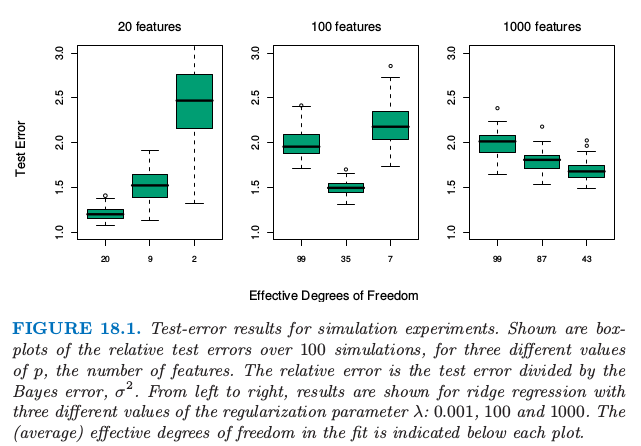

# 当p远大于N

| 原文   | [The Elements of Statistical Learning](../book/The Elements of Statistical Learning.pdf) |
| ---- | ---------------------------------------- |
| 翻译   | szcf-weiya                               |
| 时间   | 2017-03-14:2017-03-14                    |
| 更新   | 2017-08-09; 2017-12-28                  |

!!! note "更新笔记"
    @2017-12-28 使用R Notwbook记录了模拟本节中的例子的具体过程，详见[**这里**](http://rmd.hohoweiya.xyz/ex18_1.nb.html)。

这章中我们讨论特征的个数$p$远大于观测的数目$N$的预测问题，通常写成$p>>N$。这样的问题变得越来越重要，特别是在基因和其他计算生物的领域中。我们将会看到这种情形下，高方差和过拟合是主要的考虑对象。最终，经常选择简单、高正则化的方式。本章的第一部分集中在分类和回归的情形中，而第二部分讨论特征选择和评估的更基本的问题。

首先，图18.1总结了一个小型的仿真结果，展示了$p>>N$时，“欠拟合更好(less fitting is better)”的原则。对于$N=100$个样本中的每一个样本，我们生成$p$个成对相关系数为0.2的标准高斯特征$X$。输出$Y$根据下面线性模型产生，

$$
Y=\sum\limits_{j=1}^pX_j\beta_j+\sigma\varepsilon\qquad (18.1)
$$

其中$\varepsilon$由标准高斯分布产生。对于每个数据集，系数$\beta_j$也从标准高斯分布中产生。我们研究三种情形：$p=20,100,1000$。在每种情形下标准误差的选取$\sigma$都使得信噪比$Var[E(Y\mid X)]/\sigma^2$等于2。结果是，单变量回归系数显著的个数分别为9，33和331，这是在100次模拟中平均得到的。$p=1000$的情形是用来模拟高维数据，这些数据可能是基因数据或者蛋白质数据。

!!! note
    如果$\vert\hat\beta_j/\widehat{se}_j\vert\ge 2$，则称回归系数显著，其中$\hat\beta_j$为估计的（单变量）系数，$\widehat{se}_j$是它的标准误差估计。

> 图18.1. 模拟实验的测试误差结果。显示了3个不同$p$值（特征的数目）下，100次模拟的相对测试误差的箱线图。相对误差是测试误差除以贝叶斯误差$\sigma^2$。从左到右，显示了三个不同的正则化参数$\lambda:0.001,100,1000$的岭回归的结果。拟合中的（平均）有效自由度在每张图的下面标出来了。

我们对数据进行岭回归拟合，采用三个不同的正则参数$\lambda:0.001,100,1000$。当$\lambda=0.001$，这近似与最小二乘一样，仅仅有一点正则来保证当$p>N$时，问题不是奇异的。图18.1显示了在每个情形下不同的估计达到的相对测试误差的箱线图。在每个岭回归拟合中使用的对应的平均自由度（采用p68的公式(3.50)计算的）也标出来了。自由度是一个比$\lambda$更有解释性的参数。从图中我们看到，在$p=20$时，$\lambda=0.001$(20df)的岭回归最优；当$p=100$时 $\lambda=100$(35df)最优，并且当 $p=1000$时 $\lambda=1000$(43df)最优。

这里是这些结果的解释。当$p=20$时，我们拟合所有的情形，并且可以以低偏差尽可能地识别更多的显著系数。当$p=100$时，我们可以采用中等程度的收缩识别一些非零的系数。最后，当$p=1000$时，即使有许多非零系数，我们并不希望找到它们，并且我们需要收缩它们。为了说明这个结论，令$t_j=\hat\beta_j/\widehat{se}_j$，其中$\hat\beta_j$是岭回归估计，并且$\widehat{se}_j$是标准误差的估计。接着在这三种情形中取最优的岭回归参数，$\vert t_j\vert$为2.0,0.6和0.2，并且超过2的$\vert t_j\vert$的平均个数等于9.8,1.2和0.0。

$\lambda=0.001$的岭回归成功利用了当$ p < N$时的特征的相关性，但是当$ p >> N$时不能这样处理。在后者的情形下，在相对较少的样本中没有足够的信息来有效估计高维协方差阵。这种情形下，更大的正则化会有更好的预测表现。

因此高维数据需要$N>p$情形的过程的改动，或者全新的过程。这章中我们讨论对于高维分类和回归问题时的两种方式的例子；这些方法趋向于有更重的正则化，使用科学的语境知识来建议这种正则化的适当形式。这章以对特征选择和多重测试的讨论而结束。
