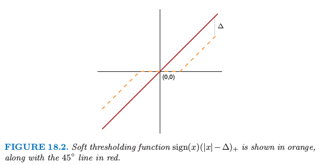
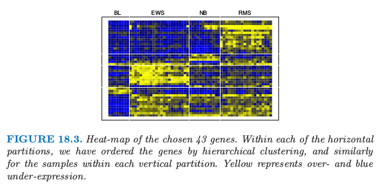

# 18.2 对角线性判别分析和最近收缩重心

| 原文   | [The Elements of Statistical Learning](https://web.stanford.edu/~hastie/ElemStatLearn/printings/ESLII_print12.pdf) |
| ---- | ---------------------------------------- |
| 翻译   | szcf-weiya                               |
| 发布 | 2017-03-14 |
|更新|2019-08-17 11:41:10|
|状态|Done|

**基因表达阵列 (gene expression arrays)** 是生物中一项重要的新的技术，并且在[第 1 章](../01-Introduction/2016-07-26-Chapter-1-Introduction/index.html)和[第 14 章](/14-Unsupervised-Learning/14.3-Cluster-Analysis/index.html)有讨论．我们下一个例子的数据构造了 2308 个基因（列）和 63 个样本（行）的矩阵，这是从一系列微阵列实验中得到的．每个表达值是对数比率 $\log(R/G)$．$R$ 是目标样本中 gene-specific RNA 在微阵列上特定位点杂化的量，而 $G$ 是参考样本中对应的 RNA 杂化的量．样本来自儿童身上发现的小、圆蓝色细胞肿瘤(SRBCT)，并且分成 4 个主要的类别：BL (Burkitt lymphoma), EWS (Ewing’s sarcoma), NB (neuroblastoma), 和 RMS (rhabdomyosarcoma)．另外有包含 20 个观测的额外数据集．我们将不再讨论其背景．

因为 $p >> N$，我们不能对数据采用 **全线性判别分析(LDA)**；需要进行一些正则化．我们这里描述的方法类似在[第 4.3.1 节](../04-Linear-Methods-for-Classification/4.3-Linear-Discriminant-Analysis/index.html#_1)中描述的方法，但是为了达到特征选择要有更重要的改动．正则化的最简单的形式假设特征在每一类中独立，也就是，类内协方差阵是对角阵．尽管事实上特征很少在一个类别中独立，但当 $p >> N$ 时，我们没有充足的数据来估计它们的依赖性．独立性的假设很大程度上降低了模型中参数的个数，并且经常导出更有效和更有解释性的分类器．

因此我们考虑 **对角协方差 (diagonal-covariance)** LDA 准则来对类别分类．类别 $k$ 的 **判别得分(discriminant score)** \eqref{4.12} 是

!!! note "Recall: \eqref{4.12}"
    $$
    \delta_k(x)=-\frac{1}{2}\log\vert\Sigma_k\vert-\frac{1}{2}(x-\mu_k)^T\Sigma_k^{-1}(x-\mu_k)+\log\pi_k\tag{4.12}\label{4.12}
    $$

$$
\delta_k(x^*)=-\sum\limits_{j=1}^p\frac{(x_j^*-\bar x_{kj})^2}{s_j^2}+2\log\pi_k\tag{18.2}\label{18.2}
$$

这里 $x^\*=(x_1^\*,x_2^\*,\ldots,x_p^\*)^T$ 是测试观测表达值的向量，$s_j$ 为第 $j$ 个基因的混合类内标准误差，并且 $\bar x_{kj}=\sum_{i\in C_k}x_{ij}/N_k$ 是 $N_k$ 个属于类别 $k$ 的基因 $j$ 的平均，其中 $C_k$ 是类别 $k$ 的索引集．我们称 $\tilde x_k=(\bar x_{k1},\bar x_{k2},\ldots,\bar x_{kp})^T$ 为类别 $k$ 的重心．式 \eqref{18.2} 的第一部分是 $x^\*$ 到第 $k$ 个类别重心的（负）标准平方距离．第二部分是基于类别 **先验概率 (prior probability)** $\pi_k$ 的矫正，其中 $\sum_{k=1}^K\pi_k=1$．分类规则于是为

$$
C(x^*)=\ell\text{ if } \delta_{\ell}(x^*)=\max_k\delta_k(x^*)\tag{18.3}
$$

我们看到对角 LDA 分类器经过合适的标准化后等价于 **最近重心分类器 (nearest centroid classifier)**．这也是朴素贝叶斯分类器的一个特殊情形，正如在[第 6.6.3 节](../06-Kernel-Smoothing-Methods/6.6-Kernel-Density-Estimation-and-Classification/index.html#_4)中描述的那样．它假设每个类别的特征是有相同方差的独立高斯分布．

<!--
已解决，因为 $s_j$ 跟类别无关。
!!! question "weiya 注："
    \eqref{18.2} 也假设了每个类别的特征有相同的方差？不然应该会有 $\log \vert \Sigma_k\vert$ 这一项。
-->

对角 LDA 分类器在高维设定中通常很有效．在 Bickel and Levina(2004)[^1] 等人的工作中称为 **独立规则(independent rule)**，理论上证明了在高维问题中经常比标准线性回归表现要好．这里对角 LDA 分类器在 20 个测试样本中产生 5 个误分类误差．这种对角 LDA 分类器的缺点是要使用所有的特征（基因），因此对于解释不是很方便．进一步正则化，我们可以做得更好——不管是测试误差还是解释性．

我们想通过某种方式自动去掉对类别预测不再起作用的项来正则化．为了实现这一点，我们分别对每个特征，将每个类的均值收缩到整体均值．这可以得到 **最近重心分类器 (nearest centroid classifer)** 的正则化版本，或者等价为对角协方差形式的 LDA 的正则化版本．我们称这个过程为 **最近收缩重心 (nearest shrunken centroids, NSC)**．

收缩过程按如下定义．令

$$
d_{kj}=\frac{\bar x_{kj}-\bar x_j}{m_k(s_j+s_0)}\tag{18.4}\label{18.4}
$$

其中 $\bar x_j$ 是基因 $j$ 的整体均值，$m_k^2=1/N_k-1/N$，且 $s_0$ 是一个小的正值，一般取为 $s_j$ 的中值．这个常值防止因分母接近 0 导致太大的 $d_{kj}$．类内方差为常值 $\sigma^2$，分子中差异 $\bar x_{kj}-\bar x_j$的方差为 $m_k^2\sigma^2$，因此便有了如分母中的标准化．

> 软阈值函数 $\sign(x)(\vert x\vert-\Delta)\_+$ 用橘黄色表示，并且图中也画出了 $45^\circ$ 的直线．

如图 18.2，我们采用 **软阈值 (soft thresholding)** 将 $d_{kj}$ 收缩到 0

$$
d_{kj}'=\sign(d_{kj})(\vert d_{kj}\vert-\Delta)_+\tag{18.5}
$$

这里 $\Delta$ 是需要确定的参数；我们在例子中采取 10 折交叉验证（见图 18.4 的上图）．

> 图 18.4.（上）：SRBCT 数据的误差曲线．图中显示了训练，10 折交叉验证和测试误分类率随着阈值参数 $\Delta$ 变化的曲线．通过 CV 选择的值 $\Delta=4.34$，得到 43 个所选基因的一个子集．（下）：SRBCT 数据（灰色）的四个重心轨迹 $d_{kj}$，这是相对于整体重心来说．每个重心有 2308 个组分，并且我们看到相当大的噪声．蓝色的条状是这些重心的收缩版本 $d_{kj}'$，这是通过对灰色的条状软阈值得到的，采用 $\Delta=4.3$．

每个 $d_{kj}$ 减少 $\Delta$ 的绝对值的量，并且如果值小于 $0$ 则设为 $0$．图 18.2 显示了软阈值函数；同样的阈值也用在了[5.9 节](../05-Basis-Expansions-and-Regularization/5.9-Wavelet-Smoothing/index.html)的小波系数中．另一种方式是采用 **硬阈值 (hard thresholding)**

$$
d_{kj}'=d_{kj}\cdot I(\vert d_{kj}\vert\ge \Delta)\tag{18.6}
$$

我们倾向于软阈值，因为这是一个更光滑的处理并且一般效果更好．$\bar x_{kj}$ 的收缩版本接着通过反解 \eqref{18.4} 的转换得到

$$
\bar x_{kj}'=\bar x_j'+m_k(s_j+s_0)d_{kj}'\tag{18.7}\label{18.7}
$$

我们用收缩重心 $\bar x_{kj}'$ 代替判别得分 \eqref{18.2} 的原始 $x_{kj}$．估计量 \eqref{18.7} 可以认为是类别均值的 lasso 风格的估计量（[练习 18.2](https://github.com/szcf-weiya/ESL-CN/issues/83)）．

!!! info "weiya 注：Ex. 18.2"
    已解决，详见 [Issue 83: Ex. 18.2](https://github.com/szcf-weiya/ESL-CN/issues/83).

注意到对于某基因，只有当至少有一个类对应的 $d'\_{kj}$ 非零，该基因才会在分类规则中起作用，因此大量的基因经常被丢弃．这个例子中，除了 43 个基因其他的都被丢弃了，这剩下的小基因集能够表征类别，且具有可解释性．图 8.13 在热图中展示出这些基因．

图 18.4（上图）演示了收缩的影响．没有收缩时我们在测试数据上有 5/20 的误差，并且在训练和 CV 数据上有一些误差．当 $\Delta$ 在相当宽的区域中，收缩重心达到零测试误差．图 18.4 的下图显示了 SRBCT 数据（灰色）的四个重心，这是相对整体重心来说．蓝色条状是这些重心的收缩版本，这是通过取 $\Delta=4.3$ 对灰色条状进行软阈值得到的．判别分数 \eqref{18.2} 可以用来构造类别概率估计：

$$
\hat p_k(x^*)=\frac{e^{\frac{1}{2}\delta_k(x^*)}}{\sum_{\ell=1}^Ke^{\frac{1}{2}\delta_\ell(x^*)}}\tag{18.8}
$$

!!! note "Recall"
    $$
    \hat\gamma_{im}=\frac{\hat\alpha_m\phi(x_i;\hat\mu_m,\hat\Sigma_m)}{\sum_{k=1}^M\hat\alpha_k\phi(x_i;\hat\mu_k,\hat\Sigma_k)}\tag{6.33}
    $$

这些可以用来评估分类，或者决定不对某个样本分类．

注意到特征选择的其它形式也可以用在这种设定中，包括硬阈值．Fan and Fan (2008)[^2] 理论上证明了高维问题中用对角线性判别分析进行某些特征选择的重要性．

[^1]: Bickel, P. J., Ritov, Y. and Tsybakov, A. (2008). Simultaneous analysis of lasso and Dantzig selector, Annals of Statistics. to appear.
[^2]: Fan, J. and Fan, Y. (2008). High dimensional classification using features annealed independence rules, Annals of Statistics. to appear.
