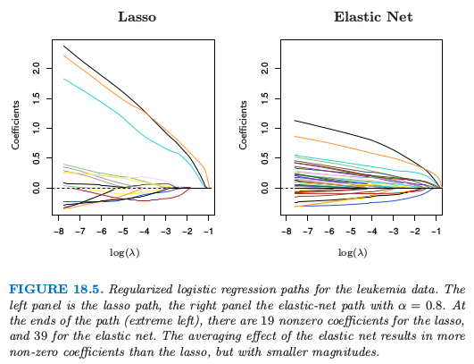
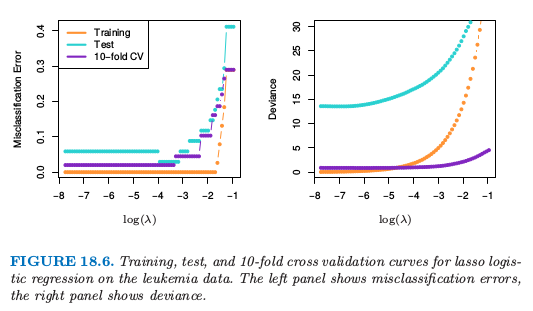
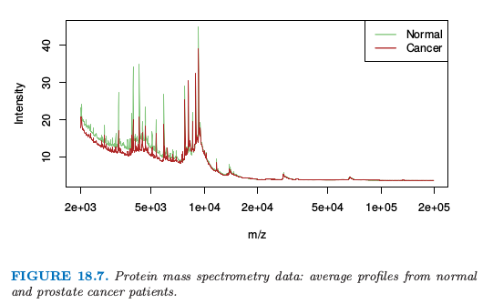
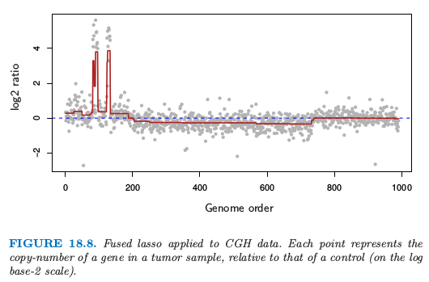

# 18.4 $L_1$正则的线性分类器

| 原文   | [The Elements of Statistical Learning](https://web.stanford.edu/~hastie/ElemStatLearn/printings/ESLII_print12.pdf#page=680) |
| ---- | ---------------------------------------- |
| 翻译   | szcf-weiya                               |
| 发布 | 2016-09-30 |
|更新|2019-08-17 18:38:07|
|状态|Done|

[18.3 节](../18-High-Dimensional-Problems/18.3-Linear-Classifiers-with-Quadratic-Regularization/index.html)的方法使用 $L_2$ 惩罚来对参数进行正则化，正如在岭回归中一样．所有的估计参数都是非零的，因此没有进行特征选择．在这一节我们讨论采用 $L_1$ 惩罚的正则，并因此进行自动的特征选择．

!!! note "weiya 注"
	特征选择意味着选择变量（特征），在 $L_2$ 正则化中，没有参数的系数为 $0$，也就是没有剔除任何参数，所以说没有用到特征选择；而在 $L_1$ 正则中，存在参数的系数为 $0$，也就是会对特征进行选择．换句话说，特征选择的效果就是取部分的特征，于是那部分的特征所对应的系数为 $0$．

回忆 [3.4.2 节](../03-Linear-Methods-for-Regression/3.4-Shrinkage-Methods/index.html)的 lasso，

$$
\underset{\beta}{\min}\frac{1}{2}\sum\limits_{i=1}^N\left(y_i-\beta_0-\sum\limits_{j=1}^px_{ij}\beta_j\right)^2+\lambda\sum\limits_{j=1}^p\vert\beta_j\vert\tag{18.18}
$$

!!! note "weiya 注：Recall"
	$$
	\hat{\beta}^{lasso}=\underset{\beta}{\arg\min}\Big\{\sum\limits_{i=1}^N(y_i-\beta_0-\sum\limits_{j=1}^px_{ij}\beta_j)^2+\lambda\sum\limits_{j=1}^p\vert\beta_j\vert\Big\}\tag{3.52}\label{3.52}
	$$

我们写成了 \eqref{3.52} 的拉格朗日形式．正如这里讨论的，使用充分大的调整参数 $\lambda$，使用 $L_1$ 惩罚使得部分的解参数 $\hat\beta_j$ 恰恰为 $0$．

在 [3.8.1 节](../03-Linear-Methods-for-Regression/3.4-Shrinkage-Methods/index.html)我们已经讨论了 LARS 算法，这是个计算所有 $\lambda$ 的 lasso 解的有效过程．当 $p > N$ 时（和本章一样），随着 $\lambda$ 趋于 $0$，lasso 精确地拟合了训练数据．事实上，通过凸对偶，可以证明当 $p > N$ 时，对于所有 $\lambda$，非零参数的个数至多为 $N$（举个例子，Rosset and Zhu, 2007[^1]）．因此 lasso 提供了特征选择的形式．

Lasso 回归可以通过对输出编码为 $\pm 1$ 来应用到两类别分类问题中，并且对预测变量加上一个截距（通常为 $0$）．对于多余两个的类别，有多种可能的方式，包括在 [18.3.3 节](/18-High-Dimensional-Problems/18.3-Linear-Classifiers-with-Quadratic-Regularization/index.html)讨论的 OVA 和 OVO 方法．我们在 [18.3 节](/18-High-Dimensional-Problems/18.3-Linear-Classifiers-with-Quadratic-Regularization/index.html)中对癌症数据应用 OVA 方法．结果显示在表 18.1 的第 4 行中．它的效果是最好的．

分类问题的更自然的方式是使用 lasso 惩罚来正则化逻辑斯蒂回归．文献中已经提出一些实现方法，包括类似 LARS（Park and Hastie，2007[^2]）的路径算法．因为路径是分段光滑但是是非线性的，精确的算法比 LARS 算法更慢，并且当 $p$ 很大时不是很适用．

Friedman et al. (2010)[^3] 提出了用于拟合 $L_1$ 惩罚的逻辑斯蒂和多项式回归模型的非常快速的算法．他们应用 [18.3.2 节](../18-High-Dimensional-Problems/18.3-Linear-Classifiers-with-Quadratic-Regularization/index.html)中 \eqref{18.10} 中的对称多项式逻辑斯蒂回归模型，并且最大化带惩罚的对数似然

!!! note "weiya 注：Recall"
	$$
	\Pr(G=k\mid X=x)=\frac{\exp(\beta_{k0}+x^T\beta_k)}{\sum_{\ell=1}^K\exp(\beta_{\ell0}+x^T\beta_\ell)}\tag{18.10}\label{18.10}
	$$

$$
\underset{\{\beta_{0k},\beta_k\in R^p\}_1^K}{\max}\Big[\sum\limits_{i=1}^N\log\;\Pr(g_i\mid x_i)-\lambda\sum\limits_{k=1}^K\sum\limits_{j=1}^p\vert\beta_{kj}\vert\Big]\tag{18.19}
$$

!!! note "weiya 注：Recall"
	$$
	\underset{\{\beta_{0k},\beta_k\}_1^K}{\max}\left[\sum\limits_{i=1}^N\log\;\Pr(g_i\mid x_i)-\frac{\lambda}{2}\sum\limits_{k=1}^K\Vert\beta_k\Vert\right]_2^2\tag{18.11}\label{18.11}
	$$

这与式子 \eqref{18.11} 相对应．这个算法通过 **坐标轮换 (cyclical coordinate descent)**（[3.8.6 节](../03-Linear-Methods-for-Regression/3.8-More-on-the-Lasso-and-Related-Path-Algorithms/index.html)）计算出了在预先选择的 $\lambda$ 序列上的精确解，并且研究了 $p > > N$ 时解是稀疏的事实，以及 $\lambda$ 邻域的解趋向于非常相似的特点．这个方法用在表 18.1 的第 7 行中，通过交叉验证来选取全局调整参数 $\lambda$．它的表现与最优方法很相似，除了这里自动特征选择一起选择了 $269$ 个基因．类似的方法也用在了 Genkin et. al (2007)[^5]；尽管他们从贝叶斯角度提出模型，但事实上他们计算 **后验的众数 (posterior mode)**，解决了惩罚的最大似然问题．

> 白血病数据的正则化逻辑斯蒂回归路径．左图是 lasso 路径，右图是 $\alpha=0.8$ 的弹性网路径．在路径的终端（最左端），lasso 有 19 个非零系数，弹性网有 39 个非零系数．弹性网的平均效应导致比 lasso 更多的非零系数，但是规模更小．

在基因应用中，变量间通常有强相关关系；基因趋向于在分子通路上起作用．Lasso 惩罚某种程度上不受强相关的变量集的选择的影响（[练习 3.28](https://github.com/szcf-weiya/ESL-CN/issues/123)）．另一方面，岭惩罚趋向于将相关变量的系数相互收缩（[练习 3.29](https://github.com/szcf-weiya/ESL-CN/issues/124)）．**弹性网 (elastic net)** 惩罚 (Zou and Hastie, 2005[^4]) 是一种妥协的方式，其形式为

$$
\sum\limits_{i=1}^p(\alpha\vert\beta_j\vert+(1-\alpha)\beta_j^2)\tag{18.20}
$$

第二项鼓励高相关的特征进行平均，而第一项鼓励在平均特征系数中的稀疏解．弹性网惩罚可以用到任何线性模型中，特别是用于回归或分类中．

因此上述的带弹性网惩罚的多项式问题变成

$$
\underset{\{\beta_{0k,\beta_k\in \IR^p}\}_1^K}{\max}\Big[\sum\limits_{i=1}^N\log\Pr(g_i\mid x_i)-\lambda\sum\limits_{k=1}^K\sum\limits_{j=1}^p(\alpha\vert\beta_{kj}\vert)+(1-\alpha)\beta_{kj}^2\Big]\tag{18.21}
$$

参数 $\alpha$ 决定了惩罚的混合程度，并且经常在定性基础上预先选取．当 $p > N$ 时，弹性网得到大于 $N$ 个的非零参数，这是相比于 lasso 的潜在优点．表 18.1 的第 8 行采用这个模型，通过交叉验证选择 $\alpha$ 和 $\lambda$．我们采用 $0.05$ 到 $1.0$ 之间的 $20$ 个 $\alpha$ 值，以及包含整个值域的在对数尺度下均匀分布的 $100$ 个 $\lambda$ 值．对于所有的 tied solution，位于 $\alpha\in [0.75,0.80], \lambda < 0.001$ 之间的值给出了最小的 CV 误差．尽管在所有方法中有最低的测试误差，但是边界分布是小的并且不显著．有趣的是，当 CV 对每个 $\alpha$ 单独计算，在 $\alpha=0.10$ 时达到最小的测试误差，但是这不是在 $2$ 维 CV 中选择的值．

图 18.5 展示了在两类别白血病数据上 (Golub et al., 1999[^9]) lasso 和弹性网的系数路径．在 38 个样本上有 7129 个基因表达测量值，其中 27 个在类 ALL (急性淋巴细胞白血病) 中，11 个在类 AML (急性髓性白血病) 中．还有一个有 34 个样本的测试集 $(20, 14)$．因为数据是线性可分的，则在 $\lambda=0$ 处解没有定义（[练习 18.11](https://github.com/szcf-weiya/ESL-CN/issues/159)），并且在很小的 $\lambda$ 处有退化．左图中有 19 个非零系数，而右图有 39 个．图 18.6（左图）显示了在训练和测试数据上 lasso 逻辑斯蒂回归的误分类误差，以及在训练数据上 $10$ 折交叉验证．右图采用二项偏差来衡量误差，并且更加光滑．即使单个曲线相对光滑（如，图 7.1），越小的样本大小会导致曲线中采样方差相对较大．这些图都表明 $\lambda\downarrow 0$ 的极限解是足够的，在测试集上得到 $3/34$ 的误分类误差．弹性网的对应图像定性上很像，但没有显示出来．

对于 $p > > N$，系数的极限对于所有的正则化逻辑斯蒂回归模型都是发散的，所以在实际的软件实现中，会显式地或隐式地设定最小的 $\lambda>0$．然而，**重标准化 (renormalized)** 的系数会收敛，并且这些极限解可以看成是线性最优分离超平面 (SVM) 一个有趣的替代解．当 $\alpha=0$ 时，解的极限与 SVM 重合（见[18.3.2 节](../18-High-Dimensional-Problems/18.3-Linear-Classifiers-with-Quadratic-Regularization/index.html)的最后），但是会选择所有的 7129 个基因．当 $\alpha=1$ 时，解的极限与 $L_1$ 分类超平面重合（Rosset et al., 2004a），并且至多包含 38 个基因．当 $\alpha$ 从 $1$ 递减，弹性网的解或包含更多分离超平面中的基因．

## 应用 lasso 的方法到蛋白质质谱

蛋白质质谱已经成为分析血液中蛋白质的流行手段，并且可以用来诊断疾病或者理解潜在的过程．

对于每个血清样本 $i$，我们观察许多个 **时间长度 (time of flight)** 为 $t_j$ 时的强度 $x_{ij}$．这个强度与在机器的一次循环操作中从发射器到检测器所经历的大概时间 $t_j$ 内观察到的粒子个数有关．时间长度与血液中的组分蛋白的 mass over charge 比例 ($m/z$) 有已知的关系．因此质谱中在特定时间 $t_j$ 的波峰的识别告诉我们存在对应 mass 和 charge 的某个蛋白质．蛋白质的识别可以接着通过其他方式确定．

图 18.7 显示了取自 Adam et al. (2003)[^10] 的一个例子．它显示了正常人和前列腺癌患者的平均光谱．

总共有 16898 个 $m/z$，取值从 $2000$ 到 $40,000$．完整数据集包含 157 个健康的病人和 167 个癌症患者，并且目标是寻找 $m/z$ 个点来在两个群中间进行判别．这是函数型数据的例子，预测变量可以看成是 $m/z$ 的一个函数．在最近今年里这个问题引起很大的研究兴趣，见 Petricoin et al. (2002)[^11]．

首先对数据进行标准化（减去基准线并且正规化），并且我们关注 $m/z$ 位于 $2000$ 到 $40,000$ 的数据（对超出这个范围的谱不感兴趣）．然后我们对数据应用最近收缩重心法和 lasso 回归，这两种方法的结果都在表 18.2 中．

对数据充分拟合，lasso 回达到比较低的测试误差率．然而，这或许不会给出科学有用的解．理想情况下，蛋白质质谱法将生物样品分解为其组分蛋白，并且它们应该出现在质谱的波峰．lasso 不会对波峰进行特殊对待，所以并不奇怪只有一些非零的 lasso 权重分布在质谱波峰的附近．而且，同一蛋白质在不同质谱中会在不同的 $m/z$ 处达到波峰．为了识别共同的波峰，样本与样本间要进行某些程度的 $m/z$ **变换 (warping)**。

为了解决这个问题，我们对每个质谱应用标准的波峰提取算法，在 217 个训练质谱中得到总数为 5178 个波峰．我们的想法是将所有病人的波峰的集合放在一起，因此构造了共同的波峰集．为了这个目的，我们对沿着 $\log\; m/z$ 坐标的波峰的位置进行 **系统聚类 (hierarchical clustering)**．我们在高度为 $\log(0.005)^3$ 处水平切分树状图，并且计算每个得到的簇中波峰位置的平均．这个过程得到 728 个共同的簇以及对应的波峰中心．

给定这些 728 个共同波峰，我们确定在每个质谱中出现的波峰，并且如果出现，确定波峰的高度．如果没有找到波峰，则设其高度为 0．这得到 $217\times 728$ 维波峰高度作为特征的矩阵，这将用在 lasso 回归中．我们对这 728 个共同波峰的测试质谱进行打分．

对波峰应用 lasso 的预测结果展示在表 18.2 的最后一行中：它确实表现很好，但是没有原始波峰上的 lasso 一样好．然而，这个拟合模型对生物学家更合适，因为得到了 35 个波峰的位置，这可以用于后续研究．另一方面，结果表明在质谱的波峰间可能有有用的判别信息，并且表中第 (2) 行的 lasso 方法得到的位置也值得进一步检验．

## 对于函数型数据的 Fused Lasso

在上一个例子中，特征有一个自然的顺序，这个顺序是由 mass-to-charge 比率 $m/z$ 决定的．更一般地，我们可能有函数形特征 $x_i(t)$，它们根据某些指标变量 $t$ 进行排序．我们已经讨论了探索这个结构的一些方法．

!!! note "weiya 注: 函数型数据 (functional data)"
	函数型数据最明显的特征：
	
	- 定量
	- 频率
	- 相似性
	- 光滑性

	参考 Giles Hooker 的 [A Short Course: Functional Data Analysis](http://faculty.bscb.cornell.edu/~hooker/ShortCourseHandout.pdf)．

我们可以用关于 $t$ 的基函数的系数来表示 $x_i(t)$，比如样条，小波或者傅里叶基，接着将它们的系数看成是预测变量，然后进行回归．等价地，可以用这些基底来表示原始特征的系数．这些方法在 [5.3 节](../05-Basis-Expansions-and-Regularization/5.3-Filtering-and-Feature-Extraction/index.html)中有描述．

对于分类问题，我们讨论类似 [12.6 节](../12-Support-Vector-Machines-and-Flexible-Discriminants/12.6-Penalized-Discriminant-Analysis/index.html)中带惩罚的判别分析．这用一个惩罚来显式地控制系数向量的光滑度．

上述方法趋向于对系数均匀地光滑．这里我们展示一种更自适应的策略来修改 lasso 惩罚使其考虑到特征的顺序．fused lasso (Tibshirani et al., 2005[^6]) 求解

$$
\underset{\beta\in \IR^p}{\min}\Big\{\sum\limits_{i=1}^N(y_i-\beta_0-\sum\limits_{j=1}^px_{ij}\beta_j)^2+\lambda_1\sum\limits_{j=1}^p\vert \beta_j\vert +\lambda_2\sum\limits_{j=1}^{p-1}\vert \beta_{j+1}-\beta_j\vert\Big\}\tag{18.22}\label{18.22}
$$

这个准则关于 $\beta$ 是严格凸的，所以存在唯一的解．第一项惩罚项鼓励更稀疏的解，而第二项鼓励解在第 $j$ 处光滑．

\eqref{18.22} 式的 **差异惩罚 (difference penalty)** 假设指标 $j$ 是等距的．如果潜在指标变量 $t$ 有非均匀的值 $t_j$，\eqref{18.22} 更自然的推广是基于 **划分差异 (divided differences)**

$$
\lambda_2\sum\limits_{j=1}^{p-1}\frac{\vert \beta_{j+1}-\beta_j\vert}{\vert t_{j+1}-t_j\vert}\tag{18.23}
$$

这意味着对序列中的每一项有一个惩罚修正．

当预测矩阵 $\mathbf X=\mathbf I_N$ 是 $N\times N$ 的单位阵，会得到一个特别有用的特殊情形．这是 fused lasso 的特殊情形，用来近似序列 $\\{y_i\\}_1^N$．Fused lasso signal approximator 求解

$$
\underset{\beta\in \IR^p}{\min}\Big\{\sum\limits_{i=1}^N(y_i-\beta_0-\beta_i)^2+\lambda_1\sum\limits_{i=1}^N\vert \beta_i\vert +\lambda_2\sum\limits_{i=1}^{N-1}\vert \beta_{i+1}-\beta_i\vert\Big\} \tag{18.24}
$$

图 18.8 展示了取自 Tibshirani and Wang (2007)[^7] 的例子．图中的数据来自 Comparative Genomic Hybridization (CGH) 数组，衡量在瘤样本和正常样本中每个基因的复制数近似的对数比（以 $2$ 为底）．横轴表示每个基因在染色体上的位置．想法是在癌症细胞中，基因通常是放大（重复）或者删除，检测这些事件是很有趣的．而且，这些事件趋向于发生在邻近的区域中．从 fused lasso signal approximator 中估计的光滑信号用深红色表示（选择合适的 $\lambda_1$ 和 $\lambda_2$）．显著非零的区域可以用来检测基因在瘤中增加或减少的位置．

也存在二维版本的 fused lasso，其中参数都列在像素网格中，并且将惩罚应用到与目标像素的上下左右点的一阶差上．这对于图象的降噪或分类是很有用的．Friedman et al. (2007)[^8] 提出了对于一维和二维 fused lasso 的快速广义坐标下降算法．

[^1]: Rosset, S. and Zhu, J. (2007). Piecewise linear regularized solution paths, Annals of Statistics 35(3): 1012–1030.
[^2]: Park, M. Y. and Hastie, T. (2007). l1-regularization path algorithm for generalized linear models, Journal of the Royal Statistical Society Series B 69: 659–677.
[^3]: Friedman, J., Hastie, T. and Tibshirani, R. (2010). Regularization paths for generalized linear models via coordinate descent, Journal of Statistical Software 33(1): 1–22.
[^4]: Zou, H. and Hastie, T. (2005). Regularization and variable selection via the elastic net, Journal of the Royal Statistical Society Series B. 67(2): 301–320.
[^5]: Genkin, A., Lewis, D. and Madigan, D. (2007). Large-scale Bayesian logistic regression for text categorization, Technometrics 49(3): 291–304.
[^6]: Tibshirani, R., Hastie, T., Narasimhan, B. and Chu, G. (2003). Class prediction by nearest shrunken centroids, with applications to DNA microarrays, Statistical Science 18(1): 104–117.
[^7]: Tibshirani, R. and Wang, P. (2007). Spatial smoothing and hot spot detection for CGH data using the fused lasso, Biostatistics 9: 18–29.
[^8]: Friedman, J., Hastie, T., Hoefling, H. and Tibshirani, R. (2007). Pathwise coordinate optimization, Annals of Applied Statistics 2(1): 302–332.
[^9]: Golub, T., Slonim, D., Tamayo, P., Huard, C., Gaasenbeek, M., Mesirov, J., Coller, H., Loh, M., Downing, J., Caligiuri, M., Bloomfield, C. and Lander, E. (1999). Molecular classification of cancer: Class discovery and class prediction by gene expression monitoring, Science 286: 531–536.
[^10]: Adam, B.-L., Qu, Y., Davis, J. W., Ward, M. D., Clements, M. A., Cazares, L. H., Semmes, O. J., Schellhammer, P. F., Yasui, Y., Feng, Z. and Wright, G. (2003). Serum protein fingerprinting coupled with a pattern-matching algorithm distinguishes prostate cancer from benign prostate hyperplasia and healthy mean, Cancer Research 63(10): 3609–3614.
[^11]: Petricoin, E. F., Ardekani, A. M., Hitt, B. A., Levine, P. J., Fusaro, V., Steinberg, S. M., Mills, G. B., Simone, C., Fishman, D. A., Kohn, E. and Liotta, L. A. (2002). Use of proteomic patterns in serum to identify ovarian cancer, Lancet 359: 572–577.