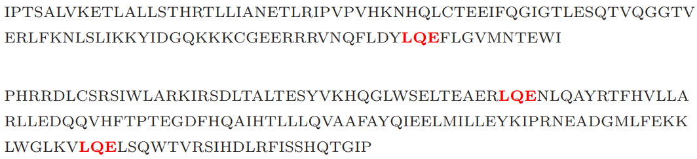
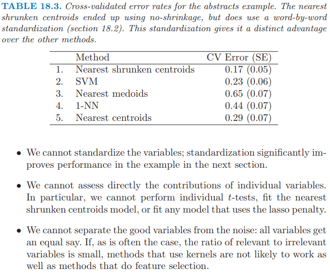
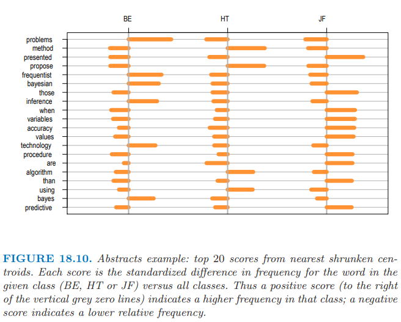

# 18.5 当特征不可用时的分类

| 原文   | [The Elements of Statistical Learning](https://web.stanford.edu/~hastie/ElemStatLearn/printings/ESLII_print12.pdf) |
| ---- | ---------------------------------------- |
| 翻译   | szcf-weiya                               |
| 发布 | 2017-08-10 |
|更新|2019-08-05 21:00:43|
|状态|Done|

!!! note "proximity matrix"
    关系矩阵，近似性矩阵，样品间的相似性矩阵．

现实中很多研究对象都很抽象，定义一个特征向量不是很显然的．但是只要我们能够得到 $N\times N$ 的 **相似性矩阵 (proximity matrix)**，我们就可以将相似性解释为内积，这样许多分类器都可以用上去了．蛋白质结构属于这一类问题，我们将在下面第一节讨论．

在其它的一些应用中，比如文本分类，特征向量是存在的，但是非常高维．这种情形我们不希望计算如此高维的数据，而是存储成对文本间的内积矩阵．通常这些内积可以通过采样技巧来近似．

成对距离有着相似的目的，因为这可以转换成中心化后的内积．[第 14 章](/14-Unsupervised-Learning/14.1-Introduction/index.html)讨论了更多关于相似性矩阵的细节．

## 例子：字符串核和蛋白质分类

计算生物学中一个重要的问题是根据序列相似性将蛋白质分到函数型和结构型类别中．蛋白质分子是一串氨基酸，通过长度（氨基酸分子的个数）和组成成分进行区分．在我们考虑的例子中，长度介于 75-160 个，有 20 种不同的氨基酸，用不同的字母来表示．下面是两个例子，长度分别是 110 和 153:

衡量两个蛋白质分子间的相似度有很多种方法．这里我们考虑基于某匹配的子串（比如上面标红的 LQE）个数的度量．

为了构造特征，统计字符串中长度为 $m$ 的序列出现的次数，并且计算长度为 $m$ 的所有可能序列的个数．正式的表述是，对于字符串 $x$，我们定义特征映射

$$
\Phi_m(x)=\{\phi_a(x)\}_{a\in\cal A_m}\tag{18.25}
$$

其中 $\cal A_m$ 是长度为 $m$ 的子序列的集合，而 $\phi_a(x)$ 为 “a” 出现在字符串 $x$ 出现的次数．应用这个，我们定义内积

$$
K_m(x_1,x_2)=\langle \Phi_m(x_1),\Phi_m(x_2) \rangle\tag{18.26}\label{18.26}
$$

它衡量了两个字符串 $x_1$ 和 $x_2$ 的相似性．举个例子，这个可以用到支持向量机中，将字符串划分到不同的蛋白质类．

所有可能序列 $a$ 的个数为 ${\cal A}_m=20^m$，对于中等大小的 $m$，这个值可以非常大，并且大部分子序列与我们训练集中的子序列并不匹配．事实证明，我们可以高效地运用树结构来计算 $N\times N$ 的内积矩阵或者字符串核 $\mathbf K_m$ \eqref{18.26}，而不用实际计算单个向量．这个方法，以及接下来的数据，来自 Leslie et. al (2004)[^1]．

数据中包含两个类别的 1708 个蛋白质——阴性 (1663) 和阳性 (45)．上面这两个该数据集中的例子，称为 $x_1$ 和 $x_2$，这两条字符串中已经标出 LQE 的子序列．可能存在 $20^3$ 种子序列，所以 $\Phi_3(x)$ 是一个长度为 $8000$ 的向量．对于这个例子，$\phi_{LQE}(x_1)=1,\phi_{LQE}(x_2)=2$．

!!! note "weiya 注：ROC curve"
    ROC 是 receiver operating characteristics 的首字母缩写，用来同时展现分类器的 specificity 和 sensitivity，横轴一般为 specificity (或 false positive rate， 其中 specificity = 1 - false positive rate)，纵轴一般为sensitivity (或 true positive rate，其中 sensitivity = true positive rate)，通过在不同的阈值下计算这两个值，就可以得到 ROC 曲线．分类器的整体表现可以由 ROC 曲线下的面积 AUC (area under the curve) 给出．

使用 Leslie et. al (2004)[^1] 的软件，我们计算 $m=4$ 时的核，它可以用在支持向量分类器中来在 $20^4=160000$ 维特征空间中寻找 **最大边缘解 (maximal margin solution)**．我们采用 10 折交叉验证来计算在所有训练数据中的 SVM 预测值．图 18.9 中的橘黄色曲线显示了支持向量分类器的 ROC 曲线，通过改变交叉验证的支持向量分类器的预测变量的阈值计算得到．曲线下的面积为 0.84．Leslie et. al (2004)[^1] 表明字符串核方法是有竞争力的，但是准确性或许没有专门用于蛋白质匹配的方法高．

仅仅使用核矩阵的信息，许多分类器都可以进行计算；下一节给出了一些细节．图 18.9 展示了最近重心分类器（绿色），基于距离的 1-最近邻（蓝色）. 它们的表现类似支持向量机．

## 分类和其它使用内积核和成对距离的模型

除了支持向量机，还有很多分类器可以仅需要内积矩阵来实现．这也意味着它们也能像 SVM 那样“核化 (kernelized)”．

一个显然的例子是最近邻分类器，因为我们可以将成对内积转化成成对距离：

$$
\Vert x_i-x_i'\Vert^2=\langle x_i,x_i\rangle + \langle x_i',x_i'\rangle - 2\langle x_i,x_i'\rangle\,.\tag{18.27}\label{18.27}
$$

1-NN 的变种已经用在了图 18.9 中，它得到了构造 ROC 曲线需要的连续判别分数．这个对距离加权的 1-NN 运用了测试点到每个类别最近点的距离；见[练习 18.14](https://github.com/szcf-weiya/ESL-CN/issues/199)．

最近重心分类器也很容易．对于训练数据点 $(x_i,g_i),i=1,\ldots,N$, 测试点 $x_0$，以及类别标签 $\bar x_k,k=1,\ldots,K$，我们可以写成

$$
\Vert x_0-\bar x_k\Vert^2 = \langle x_0, x_0\rangle - \frac{2}{N_k}\sum_{g_i=k}\langle x_0,x_i\rangle + \frac{1}{N_k^2}\sum_{g_i=k}\sum_{g_{i'}=k}\langle x_i,x_{i'}\rangle\,,\tag{18.28}\label{18.28}
$$

因此我们可以计算测试点到每个重心的距离，然后采用最近重心分类器．这意味着像 $K$-means 的聚类方法也可以实现，仅需要采用数据点的内积．

带平方正则项的逻辑斯蒂回归和多项式回归也可以用内积核来实现；见 [12.3.3 节](/12-Support-Vector-Machines-and-Flexible-Discriminants/12.3-Support-Vector-Machines-and-Kernels/index.html)和[练习 18.13](https://github.com/szcf-weiya/ESL-CN/issues/122)．[练习 12.10](https://github.com/szcf-weiya/ESL-CN/issues/201)　推导了使用内积核的线性判别分析．

!!! info "weiya 注：Ex. 18.13"
    已解决，详见 [Issue 122: Ex. 18.13](https://github.com/szcf-weiya/ESL-CN/issues/122).

主成分也可以用内积核来计算；因为这通常很有用，所以这里给出细节．首先假设我们有中心化的数据矩阵 $\X$，并令 $\X=\U\D\V^T$ 为其 SVD 分解 \eqref{18.12}．

!!! note "weiya 注：Recall"
    $$
    \begin{align}
    \mathbf X & = \mathbf {UDV^T}\tag{18.12}\label{18.12}\\
    & = \mathbf{RV^T}\tag{18.13}
    \end{align}
    $$

则 $\Z=\U\D$ 为主成分变量的矩阵（见 [14.5.1 节](/14-Unsupervised-Learning/14.5-Principal-Components-Curves-and-Surfaces/index.html)）．但如果 $\K=\X\X^T$，则有 $\K=\U\D^2\U^T$，因此我们可以从 $\K$ 的特征分解计算出 $\Z$．如果 $\X$ 没有中心化，则可以用 $\tilde \X = (\I-\M)\X$ 来中心化，其中 $\M=\frac 1N\1\1^T$ 是均值算子．因此我们可以根据未中心化的内积矩阵计算 **二次中心化 (double centered)** 核 $(\I-\M)\K(\I-\M)$ 的特征向量来求主成分．[练习 18.15](https://github.com/szcf-weiya/ESL-CN/issues/184) 进一步讨论了这一点，并且 [14.5.4 节](/14-Unsupervised-Learning/14.5-Principal-Components-Curves-and-Surfaces/index.html)讨论了一般核时 **kernel PCA** 的细节，比如用于 SVMs 中的 **径向核 (radial kernel)**．

!!! info "weiya 注：Ex. 18.15"
    已解决，详见 [Issue 184: Ex. 18.15](https://github.com/szcf-weiya/ESL-CN/issues/184).

如果我们只有成对数据的欧式距离（的平方），

$$
\Delta_{ii'}^2 = \Vert x_i-x_{i'}\Vert^2\,,
$$

事实上我们也可以完成上面的所有任务．策略是将成对距离转换为中心化的内积，然后像上面的过程一样进行．我们可以写成

$$
\Delta_{ii'}^2=\Vert x_i-\bar x\Vert^2+\Vert x_{i'}-\bar x\Vert^2-2\langle x_i-\bar x,x_{i'}-\bar x\rangle\,.\tag{18.30}\label{18.30}
$$

定义 $\B=\\{-\Delta_{ii'}^2/2\\}$，我们可以二次中心化 $\B$:

$$
\tilde\K = (\I-\M)\B(\I-\M)\,;\tag{18.31}\label{18.31}
$$

可以很简单地检验 $\tilde K_{ii'}=\langle x_i-\bar x, x_{i'}-\bar x\rangle$，即中心化的内积矩阵．

!!! note "weiya 注：\eqref{18.31}"
    $$
    \begin{align*}
    K_{ii'} &= \left(B_{ii'}-\frac 1N\sum_iB_{ii'}\right) - \frac 1N\sum_{i'}\left(B_{ii'}-\frac 1N\sum_iB_{ii'}\right)\\
    &= \left(\langle x_i-\bar x,x_{i'}-\bar x\rangle-\frac 12\Vert x_i-\bar x\Vert^2 + \frac{1}{2N}a\right)-\frac 1N\sum_{i'}\left( \langle x_i-\bar x,x_{i'}-\bar x\rangle-\frac 12\Vert x_i-\bar x\Vert^2 + \frac{1}{2N}a\right)\\
    &= \langle x_i-\bar x,x_{i'}-\bar x\rangle\,,
    \end{align*}
    $$
    where $a = \sum_i\Vert x_i-\bar x\Vert^2$.

距离和内积也可以用来计算每个类的 [medoid](https://en.wikipedia.org/wiki/Medoid)--到该类中其它观测点平均距离最近的观测．这可以用于分类（最近 medoid），也可以导出 $k$-medoid 聚类（[14.3.10 节](/14-Unsupervised-Learning/14.3-Cluster-Analysis/index.html)）．像蛋白质这种抽象的数据点，medoids 相较于均值有更现实的优点．medoid 是训练样本中的一个，并且可以呈现出来．我们在下一节尝试过最近 medoid（表 18.3），但表现令人失望．

根据内积核和距离，考虑我们不能做什么是很有用的：

- 我们不能标准化变量，在下一节例子中标准化能够显著提高效果
- 我们不能直接评估单个变量的贡献．特别地，我们不能进行 $t$ 检验，拟合 nearest shrunken centroids 模型，也不能拟合任何带 lasso 惩罚的模型
- 我们不能将好的变量从噪声变量中分离开：每个变量有相同的权重．如果相关变量与不相关变量的比率很小（经常是这种情形），采用核的方法不可能像特征选择的方法那么好．

## 例子：摘要分类

这个有点心血来潮的例子用来解释核方法的局限性．我们收集了 48 篇文章的摘要，分别来自 Bradley Efron (BE), Trevor Hastie and Rob Tibshirani (HT)（经常共同作者），以及 Jerome Friedman (JF)．我们从这些摘要中提取所有单词（无重复），并且定义 $x_{ij}$ 为摘要 $i$ 中单词 $j$ 出现的次数．这是所谓的 bags of word 表示．引号，括号，以及特殊字符首先从摘要中删除，然后所有字符转换成小写．我们也去掉单词 "we"，因为这会不公平地将 HT 摘要判别出来．

我们首先对数据应用 nearest shrunken centroid 分类器，采用 10 折交叉验证．实际上没有收缩，所以用了所有的特征，见表 18.3 的第一行．误差率为 17%；特征数可以大约降至 500 而不影响准确度．注意到 nearest shrunken classifier 需要原始特征矩阵 $\X$ 来单独地对每个特征进行标准化．图 18.10 展示了前 20 个判别单词，正的得分表示在这一类出现的次数多余其它类．

有些单词确实有意义：比如 "frequentist" 和 "Bayesian" 反映 Efron 关注统计推断．然而，许多单词意想不到，并且反映了个人的写作风格：比如，Friedman 用 "presented" 而 HT 用 "propose".

我们接着用线性核且无正则化的支持向量机，采用 "all pairs" (ovo) 的方法来处理这三个类（SVM 的正则化没有改善表现）．结果展示在表 18.3 中．这比 nearest shrunken centroid 分类器要差．

刚刚提到的，表 18.3 第一行代表 nearest shrunken centroid（无正则化）．用 $s_j$ 表示特征 $j$ 的 **合并类内标准差 (pooled within-class standard deviation)**，$s_0$ 为 $s_j$ 的中值．则第一行也表示对每个特征用 $s_j+s_0$ 标准化后的 nearest centroid 分离器．（回忆 \eqref{18.4}）

!!! note "weiya 注：Recall"
    $$
    d_{kj}=\frac{\bar x_{kj}-\bar x_j}{m_k(s_j+s_0)}\tag{18.4}\label{18.4}
    $$

第 (3) 行表明 nearest medoids 的表现很差，这有点让我们吃惊．这或许是因为样本量太小而维度太高，medoids 方差比均值会更大．1-最近邻分类器的效果也很差．

nearest centroid 分类器的效果也展示在表 18.3 中的第 (5) 行：比 nearest medoids 要好，但是比 nearest shrunken centroids 差（即使没有收缩）．区别似乎是在 nearest shrunken centroids 中每个特征进行了标准化．这个标准化在这里很重要，并且要求能够使用单个特征的取值．nearest centroids 采用 spherical 度量，并且要求特征变量有相似的单位．支持向量机估计特征的线性组合，并且可以很好地处理未标准化的特征．

[^1]: Leslie, C., Eskin, E., Cohen, A., Weston, J. and Noble, W. S. (2004). Mismatch string kernels for discriminative protein classification, Bioinformatics 20(4): 467–476.