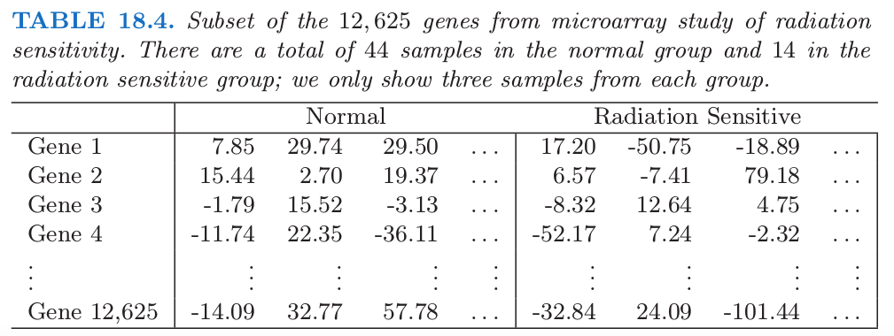
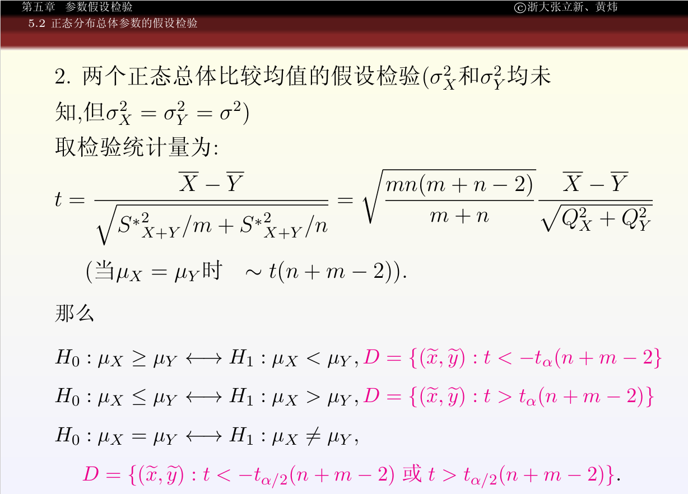
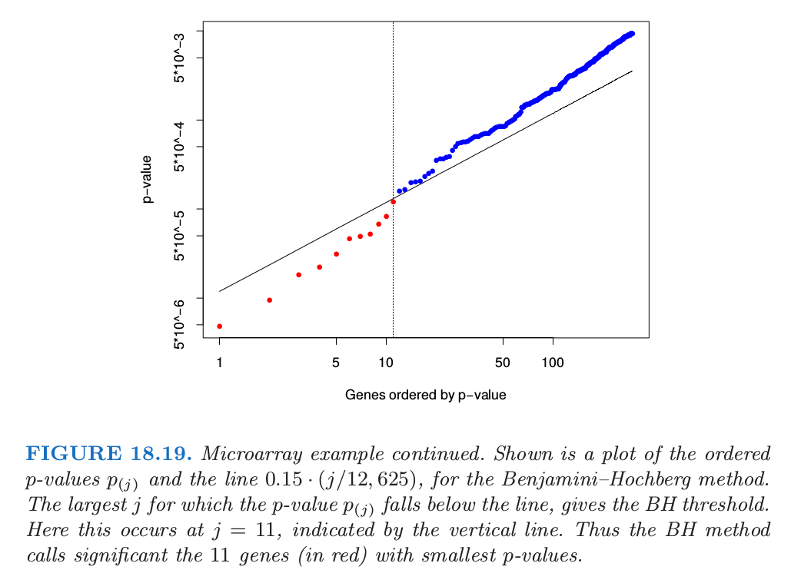
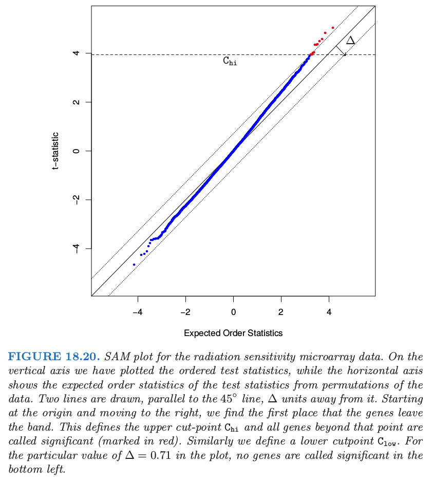

# 18.7 特征评估和多重检验问题

| 原文   | [The Elements of Statistical Learning](https://web.stanford.edu/~hastie/ElemStatLearn/printings/ESLII_print12.pdf) |
| ---- | ---------------------------------------- |
| 翻译   | szcf-weiya                               |
| 发布 | 2017-06-09 |
|更新|2017-12-29; 2018-05-17|
|状态|Done|

在本章的第一部分中我们讨论了 $p>>N$ 情形下的预测模型．这里我们考虑在评估 $p$ 个特征中每一个特征的显著性的这一基本问题．考虑 [18.4.1 节](../18-High-Dimensional-Problems/18.4-Linear-Classifiers-with-L1-Regularization/index.html)中蛋白质质谱的例子．在这个问题中，对病人作预测时，研究者可能不关心他是否患有前列腺癌．感兴趣的而是识别出哪种蛋白质在正常群体和癌症群体中的含量有差异，由此加深对疾病的了解，这对药物的研制有指导意义．因此我们的目标是评估单个特征的显著性．这个评估通常不用在本章中第一部分使用多变量预测模型来实现．特征评估问题将我们的关注点从预测移到传统的统计学话题——多重假设检验．在本章接下来的章节中，我们将用 $M$ 来表示特征的个数，而不是 $p$，因为我们将频繁用 $p$ 表示 $p$ 值．

举个例子，考虑表 18.4 的微阵列数据，数据取自一项癌症患者对电离辐射治疗的敏感性的研究 (Rieger et al.，2004[^1])．每一行包含 58 个病人样本的基因表达值：44 个样本取自有正常反应的病人，而 14 个样本取自对电离辐射有严重反应的病人．测量值是在 oligo-nucleotide 微阵列上得到的．试验的目的是在对电离辐射敏感的病人群体中找出基因表达值不同的基因．总共有 $M=12625$ 个基因，为了说明，表中显示了部分基因和样本．

为了识别出有用的基因，我们对每个基因构造两样本 $t$ 统计量

$$
t_j = \frac{\bar x_{2j}-\bar x_{1j}}{se_j}\tag{18.38}
$$

其中，$\bar x_{kj} = \sum_{i\in C_\ell}x_{ij}/N_\ell$．这里 $C_\ell$ 是在群 $\ell$ 中 $N_\ell$ 个样本的指标集，其中 $\ell = 1$ 表示正常的群体，而 $\ell=2$ 表示敏感的群体．$se_j$ 是基因 $j$ 的混合群内标准误差：

$$
se_j=\hat \sigma_j\sqrt{\frac{1}{N_1}+\frac{1}{N_2}};\;\hat\sigma_j^2=\frac{1}{N_1+N_2-2}(\sum\limits_{i\in C_1}(x_{ij}-\bar x_{1j})^2+\sum\limits_{i\in C_2}(x_{ij}-\bar x_{2j})^2)
$$

!!! note "Recall"
    

图 18.18 的直方图用橘黄色显示了 12625 个 $t$ 统计量，取值范围为 -4.7 到 5.0．如果 $t_j$ 服从正态分布，我们可以认为任何绝对值大于 2 的 $t$ 统计量为显著的．这对应的显著水平为 $5\%$. 这里有 1189 个基因的 $\vert t_j\vert \ge 2$．然而，,即使分组与任何基因都不相关，12625 个基因中我们也可能希望很多大的值是随机出现的．举个例子，如果基因是独立的（实际上它们当然不是），假阳性的基因个数会服从均值为 $12625\cdot 0.05=631.3$，标准差为 24.5 的二项分布；实际的 1189 超出这个范围．

!!! note "weiya 注：标准差的计算"

    $$
    \sqrt{np(1-p)}=\sqrt{12625*0.95*0.05}=24.5
    $$

那我们怎么能够评估所有 12625 个基因的结果呢？这称为 **多重检验(multiple testing)** 问题．我们可以像上面一样开始，计算每个基因的 $p$ 值．当假设特征服从正态分布，这个可以使用理论上的 $t$ 分布概率实现．一个吸引人的替代方案是使用 **置换分布(permutation distribution)**，因为它避免了数据分布的假设．（理论上）我们计算样本的所有 $K = \binom{58}{14}$ 种排列，并且对于每个排列 $k$ 计算 $t$ 统计量 $t_j^k$．于是基因 $j$ 的 $p$ 值为

$$
p_j=\frac{1}{K}\sum\limits_{k=1}^KI(\vert t_j^k\vert > \vert t_j\vert)\tag{18.40}\label{18.40}
$$

当然，$\binom{58}{14}$ 是很大的数（大约 $10^{13}$），因此我们不能列举出所有可能的排列．相反地，我们取可能的排列的一个随机样本，这里我们取一个 $K=1000$ 种排列的随机样本．为了利用基因都是相似的这一事实（比如，在同一尺度下测量），我们可以将所有基因混合一起计算 $p$ 值

$$
p_j=\frac{1}{MK}\sum\limits_{j'=1}^M\sum\limits_{k=1}^KI(\vert t_{j'}^k\vert>\vert t_j\vert)\tag{18.41}
$$

这也给出了比 \eqref{18.40} 式更细致的 $p$ 值，因为在混合零分布中比单一的零分布使用了更多的值．

采用这个 $p$ 值的集合，我们要检验下面的假设

$$
H_{0j} = \text{治疗对基因 }j\text{ 无作用}\\
H_{1j} = \text{治疗对基因 }j\text{ 有作用}\\
\text{for } j=1,2,\ldots, M
$$

如果 $p_j<\alpha$，我们在 $\alpha$ 的水平下拒绝 $H_{0j}$．这个检验的第一类错误等于 $\alpha$，也就是，错误拒绝 $H_{0j}$ 的概率为 $\alpha$.

现在考虑更多的检验，我们应该采用什么作为误差的整体衡量不是很清楚．令 $A_j$ 为 $H_{0j}$ 被错误拒绝的事件，由定义知 $\Pr(A_j)=\alpha$．**FWER(family-wise error rate)** 是至少存在一个被错误拒绝的概率，并且经常用它作为整体错误的衡量．具体地，如果 $A=\cup_{j=1}^MA_j$ 是至少有一个被错误拒绝的事件，于是 FWER 为 $\Pr(A)$．一般地，对于较大的 $M$，$\Pr(A) > > \alpha$，并且取决于检验之间的相关性．如果检验之间互相独立，且第一类错误概率为 $\alpha$，则 FWER 为 $(1-(1-\alpha)^M)$．另一方面，如果检验之间有正依赖，即 $\Pr(A_j\mid A_k)>\Pr(A_j)$，则 FWER 会小于 $(1-(1-\alpha)^M)$．测试之间的正依赖在实际中经常发生，特别是基因研究中．

做多重检验的一个很简单的方式是 Bonferroni 方法．它让每个个体的检验更加严格，使得 FWER 至多等于 $\alpha$: 如果 $p_j<\alpha/M$， 我们拒绝 $H_{0j}$．可以很简单地证明这会使得 FWER $\le\alpha$（练习 [18.16](https://github.com/szcf-weiya/ESL-CN/issues/228)）．Bonferroni 方法在 $M$ 相对较小的情形下有用，但是对于大的 $M$ 则太过保守，也就是，得到的显著基因数目过少．

!!! info "weiya 注：Ex. 18.16"
    已解决，详见 [Issue 228: Ex. 18.16](https://github.com/szcf-weiya/ESL-CN/issues/228)

在我们的例子中，如果在 $\alpha=0.05$ 水平下检验，则我们需要采用的阈值为 $0.05/12625=3.9\times 10^{-6}$．在 12625 个基因的 $p$ 值中没有比这还小．

有许多对该方法的变形，通过调整单个 $p$ 值使得 FWER 至多为 $\alpha$，一些方法避免了对独立性的假设，比如，Dudoit et al. (2002b)[^2]．

!!! note "weiya 注：Holm's procedure"
    Efron, B., & Hastie, T. (2016). Computer Age Statistical Inference. Cambridge University Press, 493. 介绍了一种可以改善 Bonferroni 方法的策略，

    1. 将 $p$ 值从小到大排序， $p_{(1)} < p_{(2)} < \cdots < p_{(N)}$
    2. 找出最小的指标 $i_0$ 满足 $p_{(i)} > \alpha / (N-i+1)$
    3. 则拒绝所有小于 $i < i_0$ 对应的零假设，而接受所有 $i \ge i_0$ 的零假设。 

## FDR

多重检验的另一种不同的方式不是试图控制 FWER，而是关注假阳性基因的比例．正如我们将要看到的，这个方法在实际中有很强的吸引力．

表 18.5 总结了 $M$ 个假设检验的理论结果．注意到 FWER 为 $\Pr(V\ge 1)$．

这里我们关注 **误发现率 FDR (false discovery rate)**

$$
\mathrm{FDR}=\E(V/R)\tag{18.43}\label{18.43}
$$

在微阵列中，这是被错误称为显著的基因占所有被称为显著的 $R$ 个基因的比例的期望．这个期望从数据所产生的总体中取．Benjamini and Hochberg (1995)[^3]第一次提出误发现率的记号，并且给出了一个检验过程（算法 18.2），该过程中 FDR 被用户所定义的层次 $\alpha$ 所界定．Benjamini–Hochberg (BH) 过程是基于 $p$ 值；这些可以从检验估计量（如，高斯）的渐近近似得到，或者通过排列分布获得，这里采取排列分布．

如果假设是独立的，Benjamini and Hochberg (1995)[^3] 证明了不管零假设对的个数、也不管零假设为错的时候 $p$ 值的分布，这个过程有如下性质

$$
\mathrm{FDR}\le \frac{M_0}{M}\alpha\le \alpha\tag{18.45}\label{18.45}
$$

为了解释这个性质，我们取 $\alpha=0.15$．图 18.19 展示了有序 $p$ 值 $p_{j}$，以及斜率为 $0.15/12625$ 的直线．

从左边开始，并且向右移动，BH 方法找到使得 $p$ 值落在直线下方的最后一个点．这发生在 $j=11$ 处，所以我们拒绝这 11 个有更小 $p$ 值的假设．注意到第 11 小的 $p$ 值的截断值为 0.00012，且第 11 大的 $\vert t_j\vert$ 为 4.101．因此我们拒绝这 11 个 $\vert t_j\vert\ge 4.101$ 的基因．

从我们简短的描述中，BH 过程怎么进行的不是很清楚；也就是，为什么对应的 FDR 至多 0.15（该例中的 $\alpha$）．实际上，这一事实的证明相当复杂 (Benjamini and Hochberg, 1995[^3])

更直接的方式是 plug-in 方法．不是从某个 $\alpha$ 的值开始，我们固定一个 $t$ 统计量的截断点，如上面出现的 4.101．等于或大于 4.101 的 $\vert t_j\vert$ 观测值的个数为 11．在总的排列数据中，大于等于 4.101 的 $t_j^k$ 有 1518 个，对于每个排列平均为 $1518/1000=1.518$．因此 FDR 的直接估计为 $\widehat{\mathrm{FDR}}=1.518/11\sim 14\%$．注意到 14% 近似等于上面使用的 $\alpha=0.15$（差异是由于离散化)．这个过程在算法 18.3 中有描述．概述如下：

> 算法 18.3 FDR 的 plug-in 估计等价于采用 (18.40) $p$ 值的排列的算法 18.2 的 BH 过程．

BH 方法和 plug-in 估计之间的对应不是巧合．[练习 18.17](https://github.com/szcf-weiya/ESL-CN/issues/132) 证明一般情形它们是等价的．

!!! note "weiya 注：Ex. 18.17"
    已解决，详见 [Issue 132: Ex. 18.17](https://github.com/szcf-weiya/ESL-CN/issues/132)，但结论与题目中稍有出入，有进一步完善的空间．

注意到这个过程不需要引用 $p$ 值，而是直接处理检验统计量．

plug-in 估计基于下列的近似

$$
\E(V/R)\approx\frac{E(V)}{E(R)}\tag{18.47}
$$

而且一般地，$\widehat{\mathrm{FDR}}$ 是 FDR 的一致估计(Storey, 2002[^4]; Storey et al., 2004[^5])．注意到分子 $\widehat{\E(V)}$ 实际上估计了 $(M/M_0)\E(V)$，因为排列分布使用了 $M$ 而非 $M_0$ 个零假设．因此如果有了 $M_0$ 的一个估计，FDR 的良好估计可以从 $(\hat M_0/M)\cdot \widehat{\mathrm{FDR}}$ 中得到．[练习 18.19](https://github.com/szcf-weiya/ESL-CN/issues/133) 展示了估计 $M_0$ 的一种方式．最保守的 FDR 估计方法是用 $M_0=M$（向上偏）．等价地，$M_0$ 的估计可以通过关系 \eqref{18.45} 用来改善 BH 方法．

!!! info "weiya 注：Ex. 18.19"
    已解决，详见 [Issue 133: Ex. 18.19](https://github.com/szcf-weiya/ESL-CN/issues/133)．

读者可能会惊讶我们选了一个较大的数 0.15 作为 FDR 的界 $\alpha$．我们必须记住 FDR 不同于第一类误差，后者经常选择 0.05．对于科学家，FDR 是假阳性在被统计学家称为显著的基因中比例的期望．微阵列实验表明 FDR 达到 0.15 仍然有用，特别是当我们探索自然时．

## 对称分割点和 SAM 过程

在上面描述的检验方法中，我们采用检验统计量 $t_j$ 的绝对值，因此对于统计量的正值和负值有相同的截断点．在一些试验中，可能会出现大部分或者所有的差异表达基因在正方向上变化（或者所有都在负方向）．对于这种情形，对两种情形分布导出截断点是有利的．

微阵列的显著性分析 (SAM, significance analysis of microarrays) 提供了一种方式．SAM 方法的基本思想展现在图 18.20 中．在竖轴上，我们画出有序检验统计量 $t_{(1)}\le t_{(2)}\le \ldots t_{(M)}$，而横轴展示了从数据的排列中得到的有序统计量的期望：$\tilde t_{(j)}=(1/K)\sum_{k=1}^Kt_{(j)}^k$，其中 $t_{(1)}^k\le t_{(2)}^k\le \cdots\le t_{(M)}^k$ 是排列 $k$ 的有序检验统计量．

图中作出了平行于角平分线，间距为 $\Delta$ 的两条横线．从原点开始向右移动，寻找离开该带的第一个点．这定义了上截断点 $C_{hi}$，并且所有高出该点的基因称为显著（标记为红色）．类似地，在左下角寻找下截断点 $C_{low}$．因此每个调整参数 $\Delta$ 定义了上下截断点，对于每个截断点，$\widehat{\mathrm{FDR}}$ 的 plug-in 估计和前面一样．一般地，计算一系列的 $\Delta$ 和与之相关的 $\widehat{\mathrm{FDR}}$，主观上从中选择一组值．

SAM 的优势在于截断点的可能的不对称性．在图 18.20 的例子中，当 $\Delta=0.71$，我们得到 11 个显著基因；它们都位于右上方．位于左下方的数据点从未离开带状区域，也因此有 $C_{low}=-\infty$．因此，对于该 $\Delta$，在左（负）侧没有被称为显著的基因．我们不会如 18.7.1 节中一样在这些截断点上加上对称性，因为这里没有理由假设在两端有相似的行为．

似然比检验中，这个方法和非对称方法之间存在联系．假设我们在无影响的零假设下有对数似然 $\ell_0(t_j)$，并且在备择假设下有对数似然 $\ell(t_j)$．则似然比检验意味着如果对于某些 $\Delta$，

$$
\ell(t_j)-\ell_0(t_j)>\Delta \tag{18.48}
$$

则拒绝零假设．

取决于这些似然，特别是相对值，这可以导出 $t_j$ 的阈值与 $-t_j$ 的阈值不同．当

$$
\vert t_{(j)}-\tilde t_{(j)}\vert >\Delta\tag{18.49}
$$

再次，每个 $t_{(j)}$ 的阈值取决于对应的零假设的 $\tilde t_{(j)}$ 值．

## FDR 的贝叶斯解释

这里有个 FDR 的有趣的贝叶斯解释，在 Storey (2002)[^4] 和 Efron and Tibshirani (2002)[^6] 中发展起来．首先我们需要定义 **正误发现率 pFDR (positive false discovery rate)**

$$
\mathrm{pFDR}=\E\left[\frac VR\mid R>0\right]
$$

多出来的“正的”表示我们只关心在有发现的条件下估计误差率．这是 FDR 的修改版本，它会有一个很简洁的贝叶斯表示．注意到通常的 FDR（式 \eqref{18.43}）当 $\Pr(R=0)>0$ 时没有定义．

令 $\Gamma$ 为单个测试的拒绝域；在上面的例子中我们采用 $\Gamma=(-\infty,-4.10)\cup (4.10,\infty)$．假设对独立同分布的统计量 $t_1,\ldots,t_M$ 及拒绝域 $\Gamma$ 进行了 $M$ 个相同的简单假设检验．定义随机变量 $Z_j$，如果第 $j$ 个假设是对的，则等于 0，否则等于 1．我们假设对于某分布 $F_0$ 和 $F_1$，每对 $(t_j,Z_j)$ 是独立同分布的随机变量，满足

$$
t_j\mid Z_j\sim (1-Z_j)\cdot F_0+Z_j\cdot F_1\tag{18.51}\label{18.51}
$$

这表明每个测试统计量 $t_j$ 都来自两个分布中的其中一个：如果零假设是对的，则为 $F_0$，否则为 $F_1$．令 $\Pr(Z_j=0)=\pi_0$，我们有边缘分布：

$$
t_j\sim\pi_0\cdot F_0+(1-\pi_0)\cdot F_1\tag{18.52}
$$

接下来可以证明 (Efron et al., 2001[^7]; Storey, 2002[^4]):

$$
\mathrm{pFDR}(\Gamma)=\Pr(Z_j=0\mid t_j\in\Gamma)\tag{18.53}
$$

因此在混合模型 \eqref{18.51} 的假设下，如果测试统计量落在该测试的拒绝域中，也就是，如果我们拒绝原假设时，则 pFDR 是零假设为真的后验概率.（[练习 18.20](https://github.com/szcf-weiya/ESL-CN/issues/135)）．

!!! note "weiya 注：Ex. 18.20"
    已解决，详见 [Issue 135: Ex. 18.20](https://github.com/szcf-weiya/ESL-CN/issues/135).

误发现率提供了基于整个拒绝域（比如 $\vert t_j\vert \ge 2$）的检验的准确性的度量．但是如果这样一个检验的 FDR 为 $10\%$，则 $t_j=5$ 的基因会比 $t_j=2$ 的基因更显著．因此导出 FDR 的局部版本（比如特定基因）是我们感兴趣的．检验统计量 $t_j$ 的 q-value 定义为在所有拒绝 $t_j$ 的区域中最小的 FDR．也就是，对于对称的拒绝域，$t_j=2$ 的 q-value 定义为拒绝域 $\Gamma=\\{-(\infty,-2)\cup(2,\infty)\\}$的 FDR．因此 $t_j=5$ 的 FDR 要小于 $t_j=2$ 时的 FDR，这反映了 $t_j=5$ 比 $t_j=2$ 时更显著．$t=t_0$ 时的局部误分类率定义为

$$
\Pr(Z_j=0\mid t_j=t_0)\tag{18.54}
$$

这是 $t_j=t_0$ 附近无穷小拒绝域中正的 FDR．

[^1]: Rieger, K., Hong, W., Tusher, V., Tang, J., Tibshirani, R. and Chu, G. (2004). Toxicity from radiation therapy associated with abnormal transcriptional responses to DNA damage, Proceedings of the National Academy of Sciences 101: 6634–6640.
[^2]: Dudoit, S., Yang, Y., Callow, M. and Speed, T. (2002b). Statistical methods for identifying differentially expressed genes in replicated cDNA microarray experiments, Statistica Sinica pp. 111–139.
[^3]: Benjamini, Y. and Hochberg, Y. (1995). Controlling the false discovery rate: a practical and powerful approach to multiple testing, Journal of the Royal Statistical Society Series B. 85: 289–300.
[^4]: Storey, J. (2002). A direct approach to false discovery rates, Journal of the Royal Statistical Society B. 64(3): 479–498.
[^5]: Storey, J., Taylor, J. and Siegmund, D. (2004). Strong control, conservative point estimation, and simultaneous conservative consistency of false discovery rates: A unified approach., Journal of the Royal Statistical Society, Series B 66: 187–205.
[^6]: Efron, B. and Tibshirani, R. (2002). Microarrays, empirical Bayes methods, and false discovery rates, Genetic Epidemiology 1: 70–86.
[^7]: Efron, B., Tibshirani, R., Storey, J. and Tusher, V. (2001). Empirical Bayes analysis of a microarray experiment, Journal of the American Statistical Association 96: 1151–1160.