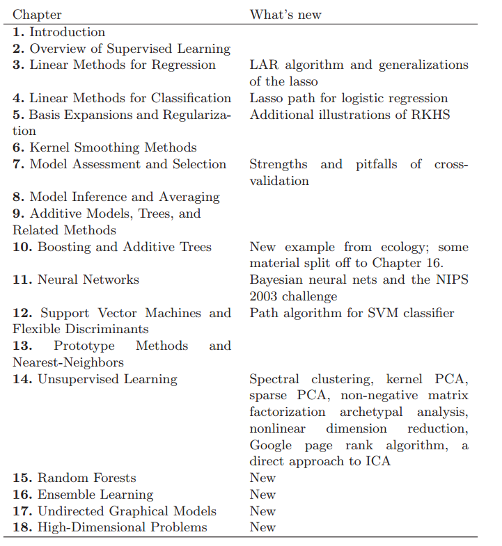

# 第二版序言

原文     | [The Elements of Statistical Learning](../book/The Elements of Statistical Learning.pdf)
      ---|---
翻译     | szcf-weiya
 发布 | 2016-09-30 
更新 | 2018-02-14
状态| Done

> In God we trust, all others bring data.
> –William Edwards Deming (1900-1993)

<!-- 
我们相信上帝，所有的其他都带来数据。
——威廉·爱德华兹·戴明（1900-1993）
-->

<!--
> We have been gratified by the popularity of the first edition of *The Elements of Statistical Learning*. This, along with the fast pace of research in the statistical learning field, motivated us to update our book with a second edition.
-->

第一版《统计学习的基础》的欢迎程度让我们很满意。随着统计学习领域的迅速发展，激励我们出版第二版来更新我们的书。

<!--
> We have added four new chapters and updated some of the existing chapters. Because many readers are familiar with the layout of the first edition, we have tried to change it as little as possible. Here is a summary of the main changes:
-->

我们增加了四个新的章节，并且更新了一些已经存在的章节。因为很多读者熟悉第一版书的布局，所以我们尽可能地做出很小的改变。下面是对主要改变的概要：

- 第一章：导言
- 第二章：监督学习的综述
- 第三章：回归的线性方法（**新：**LAR算法和lasso的一般化）
- 第四章：分类的线性方法（**新：**逻辑斯蒂回归的lasso轨迹）
- 第五章：基本的扩展和正则化（**新：**RKHS的补充说明）**RKHS（再生核希尔伯特空间）**
- 第六章：核光滑方法
- 第七章：模型评估与选择（**新：**交叉验证的长处与陷阱）
- 第八章：模型推论与平均
- 第九章：补充的模型、树以及相关的方法
- 第十章：Boosting和Additive Trees（**新：**生态学的新例子，一些材料分到了16章）
- 第十一章：神经网络（**新：**贝叶斯神经网络和2003年神经信息处理系统进展大会(NIPS)的挑战）
- 第十二章：支持向量机和灵活的判别式（**新：**SVM分类器的路径算法）
- 第十三章：原型方法和邻近算法
- 第十四章：非监督学习（**新：**谱聚类，核PCA，离散PCA，非负矩阵分解原型分析，非线性降维，谷歌pagerank算法，ICA的一个直接方法）
- 第十五章：随机森林
- 第十六章：实例学习
- 第十七章：无向图模型
- 第十八章：高维问题

**Some further notes:**

<!--
> Our first edition was unfriendly to colorblind readers; in particular, we tended to favor red/green contrasts which are particularly troublesome. We have changed the color palette in this edition to a large extent, replacing the above with an orange/blue contrast.
-->

- 我们的第一版对色盲读者不是很友好，特别地，过去我们倾向于偏爱红绿对比，但是红绿对比很讨厌。我们已经在这一版中很大程度地改变了色板，用橘黄色和蓝色对比代替了红绿对比。

<!--
> We have changed the name of Chapter 6 from “Kernel Methods” to “Kernel Smoothing Methods”, to avoid confusion with the machinelearning kernel method that is discussed in the context of support vector machines (Chapter 11) and more generally in Chapters 5 and 14.
-->

- 我们已经将第六章的标题名从“核方法(Kernel Methods)”改为“核光滑方法(Kernel Smoothing Methods)”，这是为了避免与在第十一章中讨论的支持向量机以及在第五章和第十四章讨论的更一般方法混淆。

<!--
> In the first edition, the discussion of error-rate estimation in Chapter 7 was sloppy, as we did not clearly differentiate the notions of conditional error rates (conditional on the training set) and unconditional rates. We have fixed this in the new edition.
-->

- 在第一版中，在第七章中对误差率的估计太草率，因为我们没有清晰地区分条件误差率（在训练集的条件下）和非条件误差率。我们在这一版中修正了这个问题。

<!--
> Chapters 15 and 16 follow naturally from Chapter 10, and the chapters are probably best read in that order.
-->

- 第十五和第十六章自然地承接第十章，而且这个顺序或许更适合阅读。

<!--
> In Chapter 17, we have not attempted a comprehensive treatment of graphical models, and discuss only undirected models and some new methods for their estimation. Due to a lack of space, we have specifically omitted coverage of directed graphical models.
-->

- 十七章中，我们不试图讨论一个广泛的图的模型，而只是讨论无向图和一些对他们估计的新方法。限于篇幅，我们特别地忽略掉有向图模型的讨论。

<!--
> Chapter 18 explores the “p  N” problem, which is learning in high dimensional feature spaces. These problems arise in many areas, including genomic and proteomic studies, and document classification.
-->

- 第十八章中探讨了“$p>>N$”的问题，这是高维特征空间的学习问题。很多领域都产生这些问题，包括基因和蛋白质方面的研究，以及文本分类。

<!--
>We thank the many readers who have found the (too numerous) errors in the first edition. We apologize for those and have done our best to avoid errors in this new edition. We thank Mark Segal, Bala Rajaratnam, and Larry Wasserman for comments on some of the new chapters, and many Stanford graduate and post-doctoral students who offered comments, in particular Mohammed AlQuraishi, John Boik, Holger Hoefling, Arian Maleki, Donal McMahon, Saharon Rosset, Babak Shababa, Daniela Witten, Ji Zhu and Hui Zou. We thank John Kimmel for his patience in guiding us through this new edition. RT dedicates this edition to the memory of Anna McPhee.

>Trevor Hastie
>Robert Tibshirani
>Jerome Friedman
>Stanford, California
>August 2008
-->

我们感谢在第一版中发现错误的众多读者。我们向你们道歉并且争取在这一版中避免错误。我们对在新的章节提出意见的Mark Segal, Bala Rajaratnam和Larry Wasserman 表示感谢，还有许多提出意见的斯坦福的毕业生和博士后表示感谢，特别是Mohammed AlQuraishi, John Boik, Holger Hoefling, Arian Maleki, Donal McMahon, Saharon Rosset, Babak Shababa, Daniela Witten, Ji Zhu and Hui Zou. 我们感谢John Kimmel在整个第二版中引导我们的耐心。同时也将这一版纪念Anna McPhee。

_Trevor Hastie_

_Robert Tibshirani_

_Jerome Friedman_

_Stanford, California_

_August 2008_
