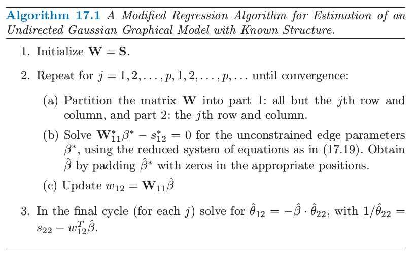
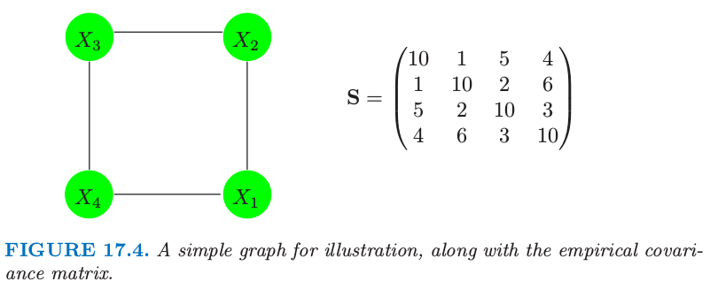
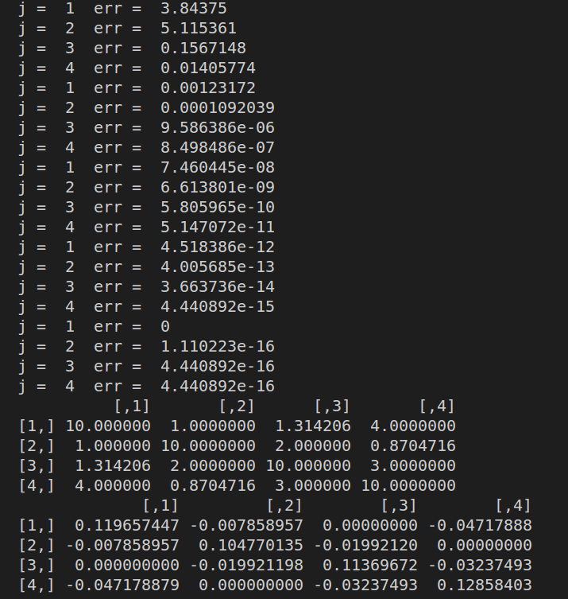
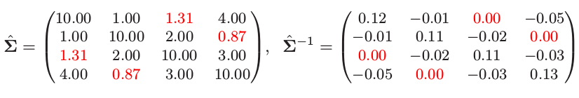

# 算法：Alg. 17.1

| 原文   | [17.3 连续变量的无向图模型](../../17-Undirected-Graphical-Models/17.3-Undirected-Graphical-Models-for-Continuous-Variables/index.html) |
| ---- | ---------------------------------------- |
| 作者   | szcf-weiya                               |
| 发布 | 2018-06-15 |
| 更新 | 2018-07-08|

这篇笔记记录了用 R 语言实现算法 17.1 并应用到实际数据的具体过程。

## 实现过程

具体细节详见 [17.3 连续变量的无向图模型](../../17-Undirected-Graphical-Models/17.3-Undirected-Graphical-Models-for-Continuous-Variables/index.html)，这里只贴出算法：



这个算法是针对图模型结构已知的情形。对于 2(b) 中的 “reduced system of equations”，我们需要根据具体模型缺失边的情况来确定出

$$
\mathbf  W^*_{11}\beta^*-s_{12}^*=0\tag{17.19}
$$

对于书中给出的例子



根据具体缺失边的情况，分别给出 $\mathbf W^\*\_{11}$ 和 $s_{12}^*$：

```r
## W11.star, s12.star based on the known graph structure
if (j == 1)
{
    W.11.star = W[-c(1,3), -c(1,3)]
    s.12.star = S[1, -c(1,3)] # edge 1-3
}
else if (j == 2)
{
    W.11.star = W[-c(2,4), -c(2,4)]
    s.12.star = S[2, -c(2,4)] # edge 2-4
}
else if (j == 3)
{
    W.11.star = W[-c(3,1), -c(3,1)]
    s.12.star = S[3, -c(1,3)] # edge 3-1
}
else if (j == 4)
{
    W.11.star = W[-c(2,4), -c(2,4)]
    s.12.star = S[4, -c(2,4)] # edge 2-4
}
```

为了让程序更有适用性，我们采用邻接矩阵来表示边的缺失，则上面代码可以简化为

```r
adj = matrix(c(0, 1, 0, 1,
               1, 0, 1, 0,
               0, 1, 0, 1,
               1, 0, 1, 0), ncol = 4)
## use adjacency matrix
edge.idx = which(adj[j,] != 0)
W.11.star = W[edge.idx, edge.idx]
s.12.star = S[j, edge.idx]
```

更新 $w_{12}$，

```r
## solve reduced system of equations
beta.star = solve(W.11.star, s.12.star)
## update
if (j == 1 || j == 4)
{
    beta.hat[-2] = beta.star
}
else if (j == 2)
{
    beta.hat[-3] = beta.star
}
else if (j == 3)
{
    beta.hat[-1] = beta.star
}
W.reorder[p, -p] = W.11 %*% beta.hat
W.reorder[-p, p] = W.11 %*% beta.hat
W.backup = W
W = W.reorder[order(idx), order(idx)]
```

采用邻接矩阵，计算 `beta.hat` 的代码可以简化为

```r
beta.hat.add.j = matrix(rep(0,p),ncol=1)
beta.hat.add.j[edge.idx] = beta.star
beta.hat = beta.hat.add.j[-j]
```

当 $\mathbf W$ 收敛后，计算 $\hat{\mathbf\Sigma} ^{-1}$：

```r
## final cycle
if (finalcycle)
{
    theta22 = 1/(S[j, j] - sum(W.reorder[p,-p]*beta.hat))
    theta12 = -1.0 * beta.hat * theta22
    Omega[j, j] = theta22
    Omega[j, -j] = theta12
    Omega[-j, j] = theta12
}
```

个人感觉整个实现过程需要特别注意算法中 ２(b) 步的 “reduced system of equations”，我们是要删去还有缺失边的信息，因为根据式 (17.12) 缺失边会有额外的拉格朗日常数惩罚

$$
\ell_C(\mathbf \Theta)=\mathrm{log\; det}\mathbf\Theta-\mathrm{trace}(\mathbf{\mathbf S\Theta})-\sum\limits_{(j,k)\not\in E}\gamma_{jk}\theta_{jk}\tag{17.12}
$$

完整代码参见 [GitHub](https://github.com/szcf-weiya/ESL-CN/tree/master/docs/notes/Graph/alg-17-1.R)。

## 结果

运行结果如下：



可以发现与书中的结果是一致的


