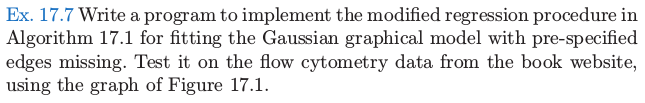
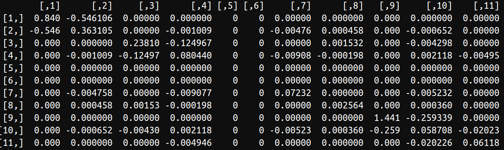

# 习题：Ex. 17.7

| 原文   | [Issue 138: Ex. 17.7](https://github.com/szcf-weiya/ESL-CN/issues/138) |
| ---- | ---------------------------------------- |
| 作者   | szcf-weiya                               |
| 发布 | 2018-07-08 |

## 问题描述



数据下载链接：[Protein flow cytometry data](https://web.stanford.edu/~hastie/ElemStatLearn/)

## 解答

大体思路与[算法：Alg. 17.1](alg-17-1/index.html)相同，不再赘述。不过需要注意处理孤立点

```r
if(length(edge.idx) == 0)
    next
```

## 结果

运行结果为



完整代码参见 [GitHub](https://github.com/szcf-weiya/ESL-CN/tree/master/docs/notes/Graph/ex-17-7.R)。