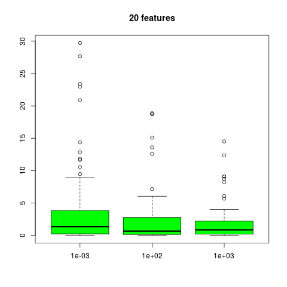
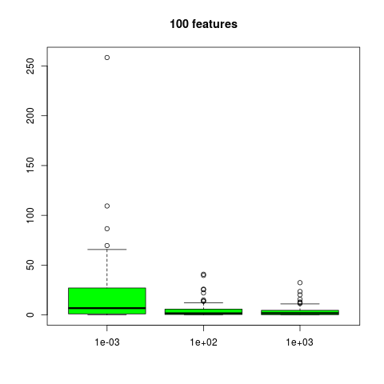

# 模拟：Fig. 18.1

| R Notebook   | [模拟：Fig. 13.5](http://rmd.hohoweiya.xyz/ex18_1.html) |
| ---- | ---------------------------------------- |
| 作者   | szcf-weiya                               |
| 发布 | 2017-12-29 |
| 更新 | 2018-02-04 |

本笔记是[ESL18.1节](https://esl.hohoweiya.xyz/18%20High-Dimensional%20Problems/18.1%20When%20p%20is%20Much%20Bigger%20than%20N/index.html)例子的模拟。

## 生成数据

生成$N$个样本，每个样本都是$p$个成对相关系数为0.2的标准高斯特征$X$.

```R
genX <- function(p, N = 100){
  # mu
  mu = numeric(p)
  # due to var(x_j) = 1
  # covariance matrix equals to correlation matrix
  Sigma = matrix(0.2, nrow=p, ncol=p)
  diag(Sigma) = 1
  library(MASS)
  X = mvrnorm(N, mu, Sigma)
  if (is.null(dim(X)))
    X = matrix(X, ncol = p)
  return(X)
}
```

为了生成$Y$，根据下式

$$
Y = \sum\limits_{j=1}^pX_j\beta_j+\sigma\varepsilon
$$

首先需要生成标准高斯的参数$\beta_j$，并根据
$$
\frac{Var[E(Y\mid X)]}{Var(\varepsilon)}=\frac{Var(f(X))}{Var(\varepsilon)}=2
$$
来确定$\sigma$，从而确定误差项。

```R
genY <- function(X){
  N = nrow(X)
  p = ncol(X)
  beta = rnorm(p, 0, 1)
  fX = X %*% as.matrix(beta, ncol = 1)
  #fX = rowSums(fX)
  epsi.var = var(as.vector(fX))/2 # not for test, just for train
  epsi = rnorm(N, 0, sqrt(epsi.var))
  Y = fX + epsi
  res = list(Y=Y, epsi.var=epsi.var)
  return(res)
}
```

## 简单线性回归

```R
for (p in c(20, 100, 1000)) {
  X = genX(p)
  Y = genY(X)$Y
  model = lm(Y~X)
  # count the number of significant terms
  coef.mat = coef(summary(model))
  sig.level = 0.05
  coef.p = coef.mat[, 4]
  # remove the intercept
  if (names(coef.p)[1] == "(Intercept)")
    coef.p = coef.p[-1]
  coef.p[which(is.nan(coef.p))] = 1 # replace NaN with 1
  sig.num = sum(coef.p < sig.level)
  cat("p = ", p, " sig.num = ", sig.num, "\n")
}
```

其实当$p=100,1000$时，进行简单线性回归通常会得到0残差，所以标准差的估计都是`NA`，这样看来统计其显著变量个数意义是不大的，故推测原文中其实是对单变量回归模型而言的。

## 单变量线性回归

```R
for (p in c(20, 100, 1000)){
  num = 0
  for (j in 1:100){
    X = genX(p)
    Y = genY(X)$Y
    for (i in 1:p){
      model = lm(Y~1+X[,i])
      coef.mat = coef(summary(model))
      #score = abs(coef.mat[2, 1]/coef.mat[2, 2])
      if(coef.mat[2, 4] < 0.05)
        num = num + 1
    }
  }
  num = num/100
  cat("p = ", p, " num of significant term: ", num ,"\n")
}
```

模拟100次，统计单变量回归系数显著的个数，分别为9.55, 29.82和290.9，与原文中的结果9, 33, 331非常接近。

## 岭回归

```R
test.err.full = matrix(0, nrow=0, ncol=3)
epsi.var.full = c()
for (p in c(20, 100, 1000)){
  X = genX(p)
  Y.res = genY(X)
  Y = Y.res$Y
  epsi.var = Y.res$epsi.var
  epsi.var.full = c(epsi.var.full, epsi.var)
  model = lm.ridge(Y~X, lambda=c(0.001, 100, 1000))
  # calculate test error
  #X.test = genX(p)
  #Y.test = genY(X.test)
  #pred = cbind(1, X.test) %*% t(coef(model))
  #test.err = numeric(3)
  #for (i in 1:ncol(pred))
  #{
  #  test.err[i] = sum((Y.test - pred[,i])^2)/nrow(pred)
  #}
  #test.err.full = rbind(test.err.full, test.err)

  for (j in 1:100){
    x.test = genX(p, N=1)
    y.test = sum(x.test * rnorm(p)) + rnorm(1, 0, sqrt(epsi.var))
    pred = as.matrix(cbind(1, x.test)) %*% t(coef(model))
    test.err = (pred - y.test)^2
    test.err.full = rbind(test.err.full, test.err)
  }
}
t1 = test.err.full[1:100, ]
t2 = test.err.full[101:200, ]
t3 = test.err.full[201:300, ]
```

作图

```R
boxplot(t1/epsi.var.full[1], main = "20 features", col = "green")
boxplot(t2/epsi.var.full[2], main = "100 features", col = "green")
boxplot(t3/epsi.var.full[3], main = "1000 features", col = "green")
```






结果与原文图18.1有较大差异，需要进一步查找该差异。
