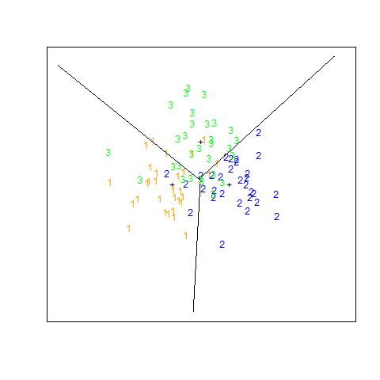

# 模拟：Fig. 4.5

| 正文 | [4.3 线性判别分析](../../04-Linear-Methods-for-Classification/4.3-Linear-Discriminant-Analysis/index.html) |
| ---- | ---------------------------------------- |
| 作者   | szcf-weiya                               |
| 时间   | 2018-03-11                               |

## 理论推导

首先我们得推导出协方差相等均值不等的高斯数据情形下的线性判别边界，回忆 (4.11) 式，若满足下式，则将待预测点 $x$ 划为第 2 类，否则化为第 1 类

!!! note "weiya 注：Recall (4.11)"
    $$
    x^T\hat{\boldsymbol\Sigma}^{-1}(\hat\mu_2-\hat\mu_1)>\frac{1}{2}\hat\mu^T_2\hat\Sigma^{-1}\hat\mu_2-\frac{1}{2}\hat\mu_1^T\hat{\boldsymbol\Sigma}^{-1}\hat\mu_1+\log(N_1/N)-\log(N_2/N)\qquad (4.11)
    $$

可以写成

$$
x^T\hat{\boldsymbol\Sigma}^{-1}(\hat\mu_2-\hat\mu_1) > \frac 12(\hat\mu_1+\hat\mu_2)^T\hat{\boldsymbol\Sigma}^{-1}(\hat\mu_2-\hat\mu_1)+\log(N_1/N)-\log(N_2/N)
$$

当 $N_1=N_2$时，有

$$
(x^T - \frac 12(\hat\mu_1+\hat\mu_2)^T) \hat{\boldsymbol\Sigma}^{-1}(\hat\mu_2-\hat\mu_1) > 0
$$

换句话说，线性判别边界为

$$
(x - \frac 12(\hat\mu_1+\hat\mu_2))^T \hat{\boldsymbol\Sigma}^{-1}(\hat\mu_2-\hat\mu_1) = 0
$$

## 利用 `lda()` 的结果计算

关键点在于怎么根据 `R` 中 `lda()` 的返回结果写出判别边界，不然就得自己编写代码计算（下一节介绍）。所以我选择去阅读源代码，不过源代码中最后做预测时都是计算后验概率，似乎不能从中得到我们想要的有关判别边界的信息，但返回结果确实已经包含了判别边界的信息。摘录部分源代码

```r
predict.lda <- function(object, newdata, prior = object$prior, dimen,
			method = c("plug-in", "predictive", "debiased"), ...)
{
    ...
    
    ## remove overall means to keep distances small
    means <- colSums(prior*object$means)
    scaling <- object$scaling
    x <- scale(x, center = means, scale = FALSE) %*% scaling
    
    ...
}
```

我们主要关注预测部分的代码，注意到在预测时，其首先计算了混合密度，然后对 `x` 进行中心化，不难发现如下的对应关系


1. `object$scaling` 对应 $\hat{\boldsymbol\Sigma}^{-1}(\hat\mu_2-\hat\mu_1)$；
2. `colSums(prior*object$means)` 对应 $\frac 12(\hat\mu_1+\hat\mu_2)$ （代码中 `prior = c(0.5, 0.5)`）；
3. `scale(x, center = means, scale = FALSE)` 对应 $x - \frac 12(\hat\mu_1+\hat\mu_2)$。

考虑二维情形，记 $c = (c_1, c_2)'$ 为 `lda()`返回的系数向量，即 `object$scaling`，另外 `mu1 = object$means[1, ]; mu2 = object$means[2, ]` 分别为第 1 类和第 2 类的（二维）均值向量。预测点为 $(x, y)$，则判别边界为

$$
c_1(x-\mu_x)+c_2(y-\mu_y)=0
$$

假设先验 `prior = c(0.5, 0.5)` 且 $c_2\neq 0$，则

$$
y = -\frac{c_1}{c_2}x+\frac{1}{c_2}(c_1\mu_x+c_2\mu_y)
$$

其中 $\mu_x=\frac 12(\mu_{1x}+\mu_{2x})$，$\mu_y=\frac 12(\mu_{1y}+\mu_{2y})$

所以可以用下面代码计算判别边界的截距和斜率

```r
calcLD <- function(object) {
  mu = object$means
  mu.pool = colSums(mu)/2 ## (mu1+mu2)/2
  scaling = object$scaling
  intercept = sum(scaling * mu.pool)/scaling[2]
  slope = -1* scaling[1]/scaling[2]
  return(c(intercept, slope))
}
``` 


## 直接计算判别边界

以第 1 类和第 2 类为例，按照上面推导的公式一步步计算，最后返回判别边界的截距和斜率

!!! note "weiya 注："
    这部分参考了多元分析的[课件](../../references/module7.pdf)。

```r
## sample mean
zmu1 = colMeans(dm1)

## sample variance
zs1 = var(dm1)
zs12 = (zs1+zs2)/2 ## ((n1-1)S1+(n2-1)S2)/(n1+n2-2)

## #############################
## coef:
##   a = S^{-1}(mu1-mu2)
## #############################
za12 = solve(zs12) %*% (zmu1-zmu2)

## ############################
## constant
##    0.5*a'(mu1+mu2)
## ############################
c12 = sum(za12 * (zmu1+zmu2)/2)

calcLD2 <- function(za, c) {return(c(c/za[2], -za[1]/za[2]))}
calcLD2(za12, c12)
```

将直接计算的结果与上述通过 `lda()` 的返回结果计算得到的判别边界完全一致！！


## 绘图

直接将上述计算得到的截距和斜率代入 `abline()` 函数中，便可以得到判别边界

!!! tip "weiya 注：绘图技巧"
    直接用 `abline()` 绘图时，会充满整个区域，这与原书图 4.5 不符，可以在 `abline()` 前加上 `clip()` 来预先选定绘图区域。这个技巧参考[how-to-define-graphical-bounds-of-abline-linear-regression-in-r](https://stackoverflow.com/questions/26472563/how-to-define-graphical-bounds-of-abline-linear-regression-in-r)

图 4.5 的右图重现代码为

```r
plot(dm1[, 1], dm1[, 2], col = "orange", pch="1", 
     xlim = c(-5, 5), ylim = c(-5, 5), 
     xaxt="n", yaxt="n", xlab = "", ylab = "")
points(dm2[, 1], dm2[, 2], col = "blue", pch="2")
points(dm3[, 1], dm3[, 2], col = "green", pch="3")
points(rbind(mu1, mu2, mu3), pch="+", col="black")
clip(-5,5,-5,0) 
abline(calcLD(m12))
clip(-5,0,-5,5)
abline(calcLD(m13))
clip(0,5,-5,5)
abline(calcLD(m23))
```

即



## TODO

实现左图，主要是画图

目前遇到的难点

1. 无法在同一张图中画出三个 `contour`