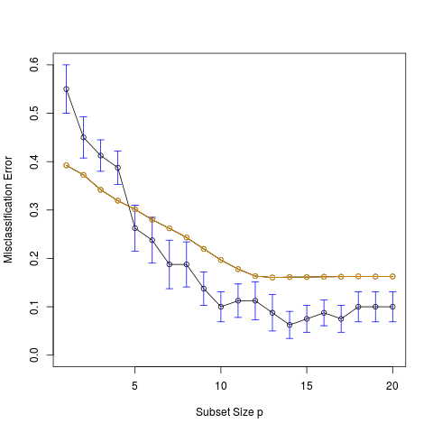

# 模拟：Fig. 7.9

| 原文   | [7.10 交叉验证](../../07-Model-Assessment-and-Selection/7.10-Cross-Validation/index.html) |
| ---- | ---------------------------------------- |
| 作者   | szcf-weiya                               |
| 发布 | 2018-12-14 |

本笔记是 [ESL 7.10 交叉验证](../../07-Model-Assessment-and-Selection/7.10-Cross-Validation/index.html) 中图 7.9 的模拟，这也是 [模拟：Fig. 7.3](sim7_3/index.html) 的继续。

## 生成数据

这部分代码与 [模拟：Fig. 7.3](sim7_3/index.html) 相同，但这里我们只考虑 case 2 的情形。

```r
# generate dataset
genX <- function(n = 80, p = 20){
  X = matrix(runif(n*p, 0, 1), ncol = p, nrow = n)
  return(X)
}
# generate response
genY <- function(X, case = 1){
  n = nrow(X)
  Y = numeric(n)
  if (case == 1){ # for the left panel of fig. 7.3
    Y = sapply(X[, 1], function(x) ifelse(x <= 0.5, 0, 1))
  }
  else {
    Y = apply(X[, 1:10], 1, function(x) ifelse(sum(x) > 5, 1, 0))
  }
  return(Y)
}
set.seed(1111)
X = genX()
Y = genY(X, case = 2)
```

## 最优子集回归的预测

采用`leaps`包中的`regsubsets`函数进行最优子集回归，因为该类没有对应`predict`函数，于是编写自己的预测函数，这部分代码也与 [模拟：Fig. 7.3](sim7_3/index.html) 相同。

```r
## use leaps package to do best subset selection
library(leaps)
## predict test dataset by using the best subset model with size p
predict.regsub <- function(model, p, X.test){
  which = summary(model)$which
  coef.raw = coef(model, p)
  # construct coef vector
  if (length(coef.raw) == p+1)
  {
    coef.vec = numeric(1+ncol(X.test)) # include intercept
    coef.vec[1] = coef.raw[1]
    flag = 1
  }
  else
  {
    coef.vec = numeric(ncol(X.test))
    flag = 0
  }
  j = flag + 1 # point to raw coef
  for (i in c(1:ncol(X.test)) + flag){
    if (which[p, i]){
      coef.vec[i] = coef.raw[j]
      j = j + 1
    }
  }
  # for simplicity, consider intercept; and in fact, every regsubset models have intercept
  pred = apply(cbind(1, X.test), 1, function(x) sum(x*coef.vec))
  return(pred)
}
```

## 交叉验证

根据单个训练集进行估计，
```r
reg.pred = matrix(nrow = nrow(X.test), ncol = 20)
# divide into 10 fold randomly
parts = matrix(sample(80, 80), nrow = 8, ncol = 10)
# store prediction
cl.pred = matrix(nrow = 80, ncol = 20)
cv.err = matrix(nrow = 10, ncol = 20)
for (i in 1:10)
{
    X.test = X[parts[,i], ]
    X.train = X[-parts[,i], ]
    Y.train = Y[-parts[,i]]
    reg.sub = regsubsets(X.train, Y.train, nvmax = 20)
    for (j in 1:20){
        rawpred = predict.regsub(reg.sub, j, X.test)
        cl.pred[parts[,i], j] = sapply(rawpred, function(x) ifelse(x > 0.5, 1, 0))        
        cv.err[i, j] = mean((cl.pred[parts[,i],j] - Y[parts[,i]])^2)
    }
}
# # for each subset size
cverr = numeric(20)
for (j in 1:20)
{
    cverr[j] = mean((cl.pred[,j] - Y)^2)
}
cverr = apply(cv.err, 2, mean)
sd2.err = apply(cv.err, 2, var)
se.err = sqrt( sd2.err / 10 )
```

## 画图

采用下面代码绘制不同 subset size 情形下交叉验证误差以及一个标准误差的变化范围，

```r
plot(cverr, type = "o", ylim = c(0, 0.6), ylab = "Misclassification Error", xlab = "Subset Size p")
for(i in 1:20)
{
    lines(c(i, i), c(cverr[i] - se.err[i], cverr[i] + se.err[i]), col = "blue", pch = 3)
    lines(c(i-0.2, i+0.2), c(cverr[i] - se.err[i], cverr[i] - se.err[i]), col = "blue", pch = 3)
    lines(c(i-0.2, i+0.2), c(cverr[i] + se.err[i], cverr[i] + se.err[i]), col = "blue", pch = 3)
}
```

另外加上 [模拟：Fig. 7.3](sim7_3/index.html) 中图四的预测误差的变化曲线（橙黄色），得到下面的图像，



可以看出，此次模拟很好地重现了原书 Fig. 7.9 曲线的变化趋势。