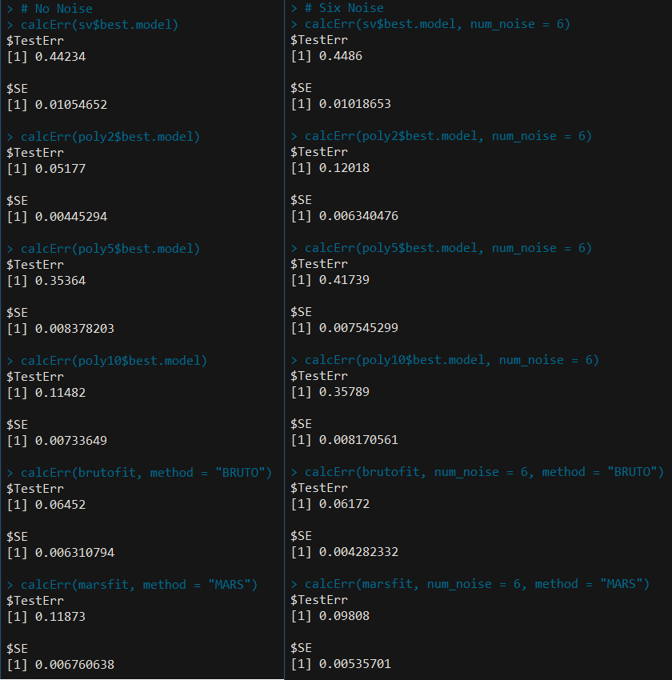

# 模拟：Tab. 12.2

|  原文  | [12.3 支持向量机和核](../../12-Support-Vector-Machines-and-Flexible-Discriminants/12.3-Support-Vector-Machines-and-Kernels/index.html) |
| ---- | ---------------------------------------- |
| 作者   | szcf-weiya                               |
| 时间   | 2018-03-02                               |
| 更新| 2021-05-06 22:48:00|
|状态|Done| 

## 背景重述

在两个类别中产生 $100$ 个观测值。第一类有 $4$ 个标准正态独立特征 $X_1,X_2,X_3,X_4$。第二类也有四个标准正态独立特征，但是条件为 $9\le \sum X_j^2\le 16$。这是个相对简单的问题。同时考虑第二个更难的问题，用 $6$ 个标准高斯噪声特征作为增广特征。

## 生成数据

```r
## #####################################
## generate dataset
## 
## `No Noise Features`: num_noise = 0
## `Six Noise Features`: num_noise = 6
## #####################################
genXY <- function(n = 100, num_noise = 0)
{
  ## class 1
  m1 = matrix(rnorm(n*(4+num_noise)), ncol = 4 + num_noise)
  ## class 2
  m2 = matrix(nrow = n, ncol = 4 + num_noise)
  for (i in 1:n) {
    while (TRUE) {
      m2[i, ] = rnorm(4 + num_noise)
      tmp = sum(m2[i, 1:4]^2)
      if(tmp >= 9 & tmp <= 16)
        break
    }
  }
  X = rbind(m1, m2)
  Y = rep(c(1, 2), each = n)
  return(data.frame(X = X, Y = as.factor(Y)))
}
```

## 模型训练

1. SVM直接调用`e1071`包中的`svm`函数
2. BRUTO和MARS都是调用`mda`包，且由于两者都是用于回归，所以转换为分类时，是比较拟合值与类别标签的距离，划分到越靠近的那一类
3. 原书中提到实验中MARS不限定阶数，但实际编程时，设置阶数为10

## 交叉验证选择合适的 $C$

我分两步进行选择：

1. 粗选：在较大范围内寻找最优的 $C$
2. 细分：在上一步选取的最优值附近进行细分

注意避免最优值取在边界值。以 SVM/poly5 为例进行说明，其他类似

```r
## SVM/poly5
set.seed(123)
poly5 = tune.svm(Y~., data = dat, kernel = "polynomial", degree = 5, cost = 2^(-4:8))
summary(poly5)
```


此时选取的最优 $C$ 为 $32$，进一步细化

```r
set.seed(1234)
poly5 = tune.svm(Y~., data = dat, kernel = "polynomial", degree = 5, cost = seq(16, 64, by = 2))
summary(poly5)
```


所以 $C$ 取 $28$。

类似地，得到其它方法的最优 $C$，比如某次实验结果如下：

|Method|best cost|
|---|---|
|SV Classifier|2.6 |  
|SVM/poly 2| 1|
|SVM/poly 5| 28|
|SVM/poly 10| 0.5|

!!! tip
    当然，实际中我们并不需要重新设置参数来训练模型，因为`tune.svm()`的返回结果就包含了最优模型，直接调用，比如`poly5$best.model`


## 计算测试误差

```r
predict.mars2 <- function(model, newdata)
{
  pred = predict(model, newdata)
  ifelse(pred < 1.5, 1, 2)
}

calcErr <- function(model, n = 1000, nrep = 50, num_noise = 0, method = "SVM")
{
  err = sapply(1:nrep, function(i){
    dat = genXY(n, num_noise = num_noise)
    datX = dat[, -ncol(dat)]
    datY = dat[, ncol(dat)]
    if (method == "SVM")
      pred = predict(model, newdata = datX)
    else if (method == "MARS")
      pred = predict.mars2(model, newdata = datX)
    else if (method == "BRUTO")
      pred = predict.mars2(model, newdata = as.matrix(datX))
    sum(pred != datY)/(2*n) # Attention!! The total number of observations is 2n, not n
  })
  return(list(TestErr = mean(err),
              SE = sd(err)))
}
```

值得说明的是，对于 BRUTO 和 MARS，因为程序是将其视为回归模型处理的，需要进一步转换为类别标签。因为程序中类别用 $1$ 和 $2$ 编号，所以判断拟合值是否大于 $1.5$，大于则划为第二类，否则第一类。

## 结果



将之与表 12.2 进行比较，可以看出各个方法的误差率及标准差的相对大小都比较一致。

## 贝叶斯误差率

### 二分类

首先介绍 **贝叶斯检验 (Bayes Test)**，令 $X$ 是观测向量，我们要确定其分类，$w_1$ 或 $w_2$，设 $q_i(X)$ 是给定 $X$ 时 $w_i$ 的后验概率，则判别规则可写成

$$
\DeclareMathOperator*{ogtrless}{\gtrless}
q_1(X) \ogtrless\limits_{w_2}^{w_1} q_2(X).
$$

设 $w_i$ 的先验为 $P_i$，条件密度函数为 $p_i(X)$，则根据贝叶斯定理

$$
q_i(X)=\frac{P_ip_i(X)}{p(X)},
$$

其中 $p(X)$ 为混合密度函数，有

$$
P_1p_1(X) \ogtrless\limits_{w_2}^{w_1} P_2p_2(X).
$$

根据上述判别规则进行分类，我们有给定 $X$ 时的条件误差 

$$
r(X) = \min\{q_1(X), q_2(X)\}
$$

而 **贝叶斯误差 (Bayes error)** 则是总误差，即

$$
\begin{align*}
\varepsilon & = \E[r(X)] = \int r(X)p(X)dX\\
& = \int \min[P_1p_1(X), P_2p_2(X)]dX\\
& = P_1\int_{L_2}p_1(X)dX+P_2\int_{L_1}p_2(X)dX\\
& = P_1\varepsilon_1 + P_2\varepsilon_2
\end{align*}.
$$

其中区域 $L_1$ 满足 $P_1p_1(X)>P_2p_2(X)$，而 $L_2$ 满足 $P_1p_1(X) < P_2p_2(X)$.

回到我们的例子，对于类别 $1$，
$$
\sum X_j^2\sim \chi^2(4)
$$
对于类别 $2$，
$$
\sum X_j^2\sim \frac{\chi^2(4)I(9\le\chi^2(4)\le 16)}{\int_9^{16} f(t)dt}
$$
其中 $f(t)$ 是 $\chi^2(4)$ 的密度函数，则

$$
\begin{align*}
\varepsilon_1 &= \int_0^9 0 dx +\int_{16}^\infty 0 dx = 0\\
\varepsilon_2 &= \int_9^{16}f(t)dt
\end{align*}
$$

于是贝叶斯误差率为

$$
\varepsilon = \frac 12 \cdot 0 +
\frac{1}{2}\int_{9}^{16}f(t)dt\approx 0.029
$$

### K分类

一般地，对于 $K$ 分类问题，令 $\pi_1,\ldots,\pi_K$ 为 $K$ 个类别的先验概率，它们满足 $\pi_i\ge 0,\sum\pi_i=1$。当观测到 $x$，则其属于类别 $i$ 的后验概率为

$$
\pi_i(x) = \frac{\pi_i f_i(x)}{\sum \pi_jf_j(x)}\,.
$$

如果将属于类别 $i$ 的观测划分到 $j$，产生的误差为

$$
r_j(x) = \sum_{i=1}^Kp_i(x)L(i, j)\,.
$$

最小化的解即为贝叶斯判别规则，

$$
\delta^\star: i\rightarrow \argmin_j r_j(x)\,,
$$

这个解也最小化了 $\E r_j(x)$，如下述定理 (p228 of TPE) 所述，


该最小值即为贝叶斯误差率，或者通常称为 Bayes risk,

$$
R = \E r^\star(x)\,.
$$

如果损失函数为误分类损失，即

$$
L(i, j) = 
\begin{cases}
1 &\text{if } i=j\\
0 &\text{otherwise}
\end{cases}\,,
$$

则

$$
\delta^\star: i\rightarrow \argmin_j p_j(x)\,.
$$

而对于平方误差，

$$
L(i, j) = (i - j)^2\,,
$$

其解为 

$$
j^\star = \sum_{i=1}^Kip_i(x)\triangleq \E i\,.
$$


## 参考文献

- [probability - Calculating the error of Bayes classifier analytically - Cross Validated](https://stats.stackexchange.com/questions/4949/calculating-the-error-of-bayes-classifier-analytically)
- Fukunaga, K. (2013). Introduction to statistical pattern recognition. Elsevier.
- [Cover, T., & Hart, P. (1967). Nearest neighbor pattern classification. IEEE Transactions on Information Theory, 13(1), 21–27.](https://doi.org/10.1109/TIT.1967.1053964)

!!! tip
    完整代码可以参见[skin-of-the-orange.R](https://github.com/szcf-weiya/ESL-CN/blob/master/docs/notes/SVM/skin-of-the-orange.R)