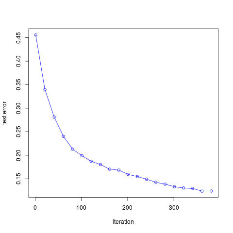

# 模拟Eq. 10.2

| cnblogs   | [AdaBoost对实际数据分类的Julia实现](http://www.cnblogs.com/szcf715/p/8183230.html) |
| ---- | ---------------------------------------- |
| 作者   | szcf-weiya                               |
| 时间   | 2018-01-03                               |
| 更新 | 2018-02-28 |

本节是对[10.1节](../../10-Boosting-and-Additive-Trees/10.1-Boosting-Methods/index.html)中式(10.2)的模拟。

## 问题

特征$X_1,\ldots,X_{10}$是标准独立高斯分布，目标$Y$定义如下
$$
Y=
\left\{
\begin{array}{ll}
1&\text{if } \sum_{j=1}^{10}X_j^2>\chi_{10}^2(0.5)\\
-1 & \text{otherwise}
\end{array}
\right.
\qquad (10.2)
$$

考虑2000个训练情形，每个类别大概有1000个情形，以及10000个测试观测值。若分类器选为“stump”（含两个终止结点的分类树）。

## Julia实现

Julia的具体细节参见[官方manual](https://docs.julialang.org/en/stable/manual/)。

首先我们定义模型的结构，我们需要两个参数，弱分类器的个数`n_clf`和存储`n_clf`个弱分类器的`n_clf`$\times 4$的矩阵。因为对于每个弱分类器——两个终止结点的stump，我们需要三个参数确定，分割变量的编号`idx`，该分割变量对应的cutpoint值`val`，以及分类的方向`flag`（当`flag`取1时则所有比cutpoint大的观测值分到树的右结点，而`flag`取0时分到左结点），另外算法中需要确定的`alpha`参数，所以一个stump需要四个参数。下面代码默认弱分类器个数为10。

```julia
struct Adaboost
    n_clf::Int64
    clf::Matrix
end

function Adaboost(;n_clf::Int64 = 10)
    clf = zeros(n_clf, 4)
    return Adaboost(n_clf, clf)
end
```

训练模型
```julia
function train!(model::Adaboost, X::Matrix, y::Vector)
    n_sample, n_feature = size(X)
    ## initialize weight
    w = ones(n_sample) / n_sample
    threshold = 0
    ## indicate the classification direction
    ## consider observation obs which is larger than cutpoint.val
    ## if flag = 1, then classify obs as 1
    ## else if flag = -1, classify obs as -1
    flag = 0
    feature_index = 0
    alpha = 0
    for i = 1:model.n_clf
        ## step 2(a): stump
        err_max = 1e10
        for feature_ind = 1:n_feature
            for threshold_ind = 1:n_sample
                flag_ = 1
                err = 0
                threshold_ = X[threshold_ind, feature_ind]

                for sample_ind = 1:n_sample
                    pred = 1
                    x = X[sample_ind, feature_ind]
                    if x < threshold_
                        pred = -1
                    end
                    err += w[sample_ind] * (y[sample_ind] != pred)
                end
                err = err / sum(w)
                if err > 0.5
                    err = 1 - err
                    flag_ = -1
                end

                if err < err_max
                    err_max = err
                    threshold = threshold_
                    flag = flag_
                    feature_index = feature_ind
                end
            end
        end
        ## step 2(c)
        #alpha = 1/2 * log((1-err_max)/(err_max))
        alpha = 1/2 * log((1.000001-err_max)/(err_max+0.000001))
        ## step 2(d)
        for j = 1:n_sample
            pred = 1
            x = X[j, feature_index]
            if flag * x < flag * threshold
                pred = -1
            end
            w[j] = w[j] * exp(-alpha * y[j] * pred)
        end
        model.clf[i, :] = [feature_index, threshold, flag, alpha]
    end
end
```

预测模型

```julia
function predict(model::Adaboost,
                 x::Matrix)
    n = size(x,1)
    res = zeros(n)
    for i = 1:n
        res[i] = predict(model, x[i,:])
    end
    return res
end

function predict(model::Adaboost,
                 x::Vector)
    s = 0
    for i = 1:model.n_clf
        pred = 1
        feature_index = trunc(Int64,model.clf[i, 1])
        threshold = model.clf[i, 2]
        flag = model.clf[i, 3]
        alpha = model.clf[i, 4]
        x_temp = x[feature_index]
        if flag * x_temp < flag * threshold
            pred = -1
        end
        s += alpha * pred
    end

    return sign(s)

end
```

接下来应用到模拟例子中

```julia
function generate_data(N)
    p = 10
    x = randn(N, p)
    x2 = x.*x
    c = 9.341818 #qchisq(0.5, 10)
    y = zeros(Int64,N)
    for i=1:N
        tmp = sum(x2[i,:])
        if tmp > c
            y[i] = 1
        else
            y[i] = -1
        end
    end
    return x,y
end

function test_Adaboost()
    x_train, y_train = generate_data(2000)
    x_test, y_test = generate_data(10000)
    m = 1:20:400
    res = zeros(size(m, 1))
    for i=1:size(m, 1)
        model = Adaboost(n_clf=m[i])
        train!(model, x_train, y_train)
        predictions = predict(model, x_test)
        println("The number of week classifiers ", m[i])
        res[i] = classification_error(y_test, predictions)
        println("classification error: ", res[i])
    end
    return hcat(m, res)
end
```

作出误差随迭代次数的图象如下



可以发现，随着迭代次数的增加，误差率不断下降，与图10.2的结果是一致的。

完整代码参见[这里](https://github.com/szcf-weiya/ESL-CN/tree/master/code/boosting)

## R语言实现

```r
## generate dataset
genData <- function(N, p = 10)
{
  p = 10
  x = matrix(rnorm(N*p),nrow = N)
  x2 = x^2
  y = rowSums(x2)
  y = sapply(y, function(x) ifelse(x > qchisq(0.5, 10), 1, -1))
  return(list(x = x, y = y))
}
set.seed(123)
train.data = genData(2000)
table(train.data$y)
# y
# -1    1 
# 980 1020

AdaBoost <- function(x, y, m = 10)
{
  p = ncol(x)
  N = nrow(x)
  res = matrix(nrow = m, ncol = 4)
  ## initialize weight
  w = rep(1, N)/N
  ## indicate the classification direction
  ## consider observation obs which is larger than cutpoint.val 
  ## if flag = 1, then classify obs as 1
  ## else if flag = -1, classify obs as -1
  flag = 1
  cutpoint.val = 0
  cutpoint.idx = 0
  for (i in 1:m)
  {
    ## step 2(a): stump
    tol = 1e10
    for (j in 1:p)
    {
      for (k in 1:N)
      {
        #err = 0
        flag.tmp = 1
        cutpoint.val.tmp = x[k, j]
        # for (kk in 1:N)
        # {
        #   pred = 1
        #   xx = x[kk, j]
        #   if (xx < cutpoint.val.tmp)
        #     pred = -1
        #   err = err + w[kk] * as.numeric(y[kk] != pred) 
        # }
        xj = x[, j]
        pred = sapply(xj, function(x) ifelse(x < cutpoint.val.tmp, -1, 1))
        err = sum(w*as.numeric(y != pred))
      }
      if (err > 0.5)
      {
        err = 1 - err
        flag.tmp = -1
      }
      if (err < tol)
      {
        tol = err
        cutpoint.val = cutpoint.val.tmp
        cutpoint.idx = j
        flag = flag.tmp
      }
    }
    ## step 2(c)
    #alpha = 0.5 * log((1-tol)/tol)
    alpha = 0.5 * log((1+1e-6-tol)/(tol+1e-6))
    ## step 2(d)
    for (k in 1:N)
    {
      pred = 1
      xx = x[k, cutpoint.idx]
      if (flag * xx < flag * cutpoint.val)
        pred = -1
      w[k] = w[k] * exp(-alpha*y[k]*pred)
    }
    res[i, ] = c(cutpoint.idx, cutpoint.val, flag, alpha)
  }
  colnames(res) = c("idx", "val", "flag", "alpha")
  model = list(M = m, G = res)
  class(model) = "AdaBoost"
  return(model)
}

print.AdaBoost <- function(model)
{
  cat(model$M, " weak classifers are as follows: \n\n")
  cat(sprintf("%4s%12s%8s%12s\n", colnames(model$G)[1], colnames(model$G)[2], colnames(model$G)[3], colnames(model$G)[4]))
  for (i in 1:model$M)
  {
    cat(sprintf("%4d%12f%8d%12f\n", model$G[i, 1], model$G[i, 2], model$G[i, 3], model$G[i, 4]))
  }
}

predict.AdaBoost <- function(model, x)
{
  n = nrow(x)
  res = integer(n)
  for (i in 1:n)
  {
    s = 0
    xx = x[i, ]
    for (j in 1:model$M)
    {
      pred = 1
      idx = model$G[j, 1]
      val = model$G[j, 2]
      flag = model$G[j, 3]
      alpha = model$G[j, 4]
      cutpoint = xx[idx]
      if (flag * cutpoint < flag*val)
        pred = -1
      s = s + alpha*pred
    }
    res[i] = sign(s)
  }
  return(res)
}

testAdaBoost <- function()
{
  ## train datasets
  train.data = genData(2000)
  x = train.data$x
  y = train.data$y
  ## test datasets
  test.data = genData(10000)
  test.x = test.data$x
  test.y = test.data$y
  
  m = seq(1, 400, by = 20)
  err = numeric(length(m))
  for (i in 1:length(m))
  {
    model = AdaBoost(x, y, m = m[i])
    res = table(test.y, predict(model, test.x))
    err[i] = (res[1, 2] + res[2, 1])/length(test.y)
    cat(sprintf("epoch = %d, err = %f", i, err[i]))
  }
  return(err)
}
```

运行速度要比Julia的慢很多。