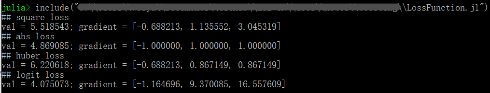

# 损失函数的梯度总结及Julia实现


| 作者   | szcf-weiya<mailto: szcfweiya@gmail.com>                               |
| ---- | ---------------------------------------- |
| 时间   | 2017-08-27                               |
| 更新 | 2018-03-01 |

[10.10节](../../10-Boosting-and-Additive-Trees/10.10-Numerical-Optimization-via-Gradient-Boosting/index.html)的表10.2总结出了经常用到的损失函数的梯度


将上述几种损失函数及其梯度用如下的Julia程序表达出来。

首先声明`LossFunction`抽象类

```julia
abstract type LossFunction end
```

然后依次声明平方误差损失类`SquareLoss`、绝对值损失类`AbsLoss`、Huber损失类`HuberLoss`。以及用于logistic回归的`LogisticLoss`。


```julia
function sigmoid(x)
    return 1./(1+exp.(-x))
end

type SquareLoss <: LossFunction
    obj::Function
    gradient::Function

    function obj(y::Array, y_pred::Array)
        return 0.5 * sum(abs2, y - y_pred)
    end

    function gradient(y::Array, y_pred::Array)
        return (y_pred - y)
    end

    function SquareLoss()
        loss = new(obj, gradient)
        return loss
    end
end

type AbsLoss <: LossFunction
    obj::Function
    gradient::Function

    function obj(y::Array, y_pred::Array)
        return sum(abs, y - y_pred)
    end

    function gradient(y::Array, y_pred::Array)
        return sign.(y_pred - y)
    end

    function AbsLoss()
        loss = new(obj, gradient)
        return loss
    end
end

type HuberLoss <: LossFunction
    obj::Function
    gradient::Function

    function obj(y::Array, y_pred::Array; alpha::Float64 = 0.2)
        delta = quantile(abs.(y-y_pred), alpha)
        res = ones(size(y, 1))
        for i=1:size(y,1)
            if (abs(y[i]-y_pred[i]) < delta)
                res[i] = abs2(y[i]-y_pred[i])
            else
                res[i] = 2*delta*abs(y[i]-y_pred[i])-abs2(delta)
            end
        end
        return sum(res)
    end

    function gradient(y::Array, y_pred::Array; alpha::Float64=0.2)
        delta = quantile(abs.(y-y_pred), alpha)
        res = ones(size(y, 1))
        for i = 1:size(y, 1)
            if (abs(y[i]-y_pred[i]) < delta)
                res[i] = y_pred[i]-y[i]
            else
                res[i] = delta*sign(y_pred[i]-y[i])
            end
        end
        return res
    end

    function HuberLoss()
        loss = new(obj, gradient)
        return loss
    end
end

type LogisticLoss <: LossFunction
    obj::Function
    gradient::Function

    function obj(y::Array, y_pred::Array)
        logistic_pred = sigmoid(y_pred)
        l = - y .* log.(logistic_pred)
        r = - (1-y) .* log.(1-logistic_pred)
        loss = sum(l+r)
        return loss
    end

    function gradient(y::Array, y_pred::Array)
        p = sigmoid(y_pred)
        return (p - y)./(p.*(1-p))
    end

    function LogisticLoss()
        loss = new(obj, gradient)
        return loss
    end
end
```

测试代码如下
```julia
## test
x = randn(3)
y = randn(3)
println("## square loss")
s = SquareLoss()
sg = s.gradient(x, y)
@printf("val = %.6f; gradient = [%.6f, %.6f, %.6f]\n", s.obj(x, y), sg[1], sg[2], sg[3])
println("## abs loss")
a = AbsLoss()
ag = a.gradient(x, y)
@printf("val = %.6f; gradient = [%.6f, %.6f, %.6f]\n", a.obj(x, y), ag[1], ag[2], ag[3])
println("## huber loss")
h = HuberLoss()
hg = h.gradient(x, y)
@printf("val = %.6f; gradient = [%.6f, %.6f, %.6f]\n", h.obj(x, y), hg[1], hg[2], hg[3])
println("## logit loss")
l = LogisticLoss()
lg = l.gradient(x, y)
@printf("val = %.6f; gradient = [%.6f, %.6f, %.6f]\n", l.obj(x, y), lg[1], lg[2], lg[3])
```

结果如下

