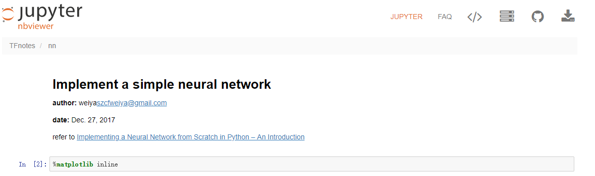

# Ipython Notebook列表

| 作者   | szcf-weiya                               |
| ---- | ---------------------------------------- |
| 时间   | 2018-03-03                               |

为了方便浏览，用`nbviewer`展示Ipython Notebook，下面列出具体的链接（点击图片即可访问）

## [Notebook for Simple Neural Network](http://nbviewer.jupyter.org/github/szcf-weiya/TFnotes/blob/master/nn/nn.ipynb)

## [Notebook for Section 11.6](http://nbviewer.jupyter.org/github/szcf-weiya/ESL-CN/blob/master/code/nn/Implementation-for-Section-6.ipynb)

test modified 