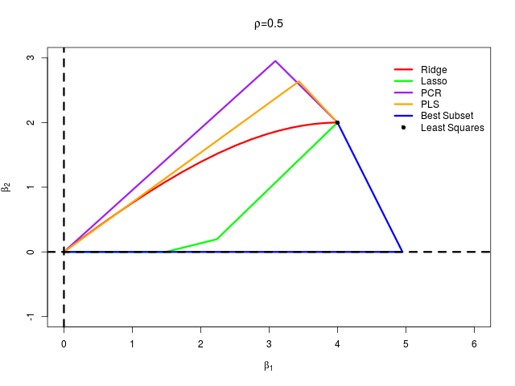
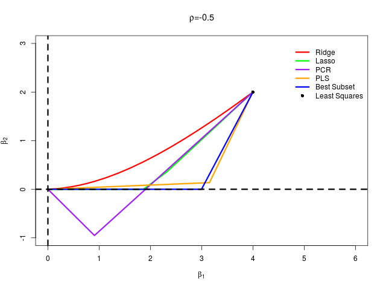

# 模拟：Fig. 3.18

| 原文   | [3.6 选择和收缩方法的比较](../../03-Linear-Methods-for-Regression/3.6-A-Comparison-of-the-Selection-and-Shrinkage-Methods/index.html) |
| ---- | ---------------------------------------- |
| 作者   | szcf-weiya                               |
| 发布 | 2018-03-25 |

首先生成数据，然后通过最小二乘、岭回归、lasso、主成分回归、偏最小二乘以及最优子集回归这六种方法计算各自的 $\beta_1$　和 $\beta_2$，从而绘制曲线

## 生成数据

```r
genXY <- function(rho = 0.5,  # correlation
                 N = 100, # number of sample
                 beta = c(4, 2)) # true coefficient
{
  # covariance matrix
  Sigma = matrix(c(1, rho,
                   rho, 1), 2, 2)
  library(MASS)
  X = mvrnorm(N, c(0, 0), Sigma)
  Y = X[, 1] * beta[1] + X[, 2] * beta[2]
  return(list(X=X, Y=Y))
}
```

## 六种方法

### 最小二乘

这个最简单

```r
ols.fit = lm(Y ~ 0 + X)
ols.beta = coef(ols.fit)
ols.beta = as.matrix(t(ols.beta))
```

###　lasso

调整不同 $\lambda$，得到不同的　$\beta_1$　和 $\beta_2$，调用 `glmnet` 包进行求解

```r
## create grid to fit lasso/ridge path
grid = 10^seq(10, -2, length = 100)
library(glmnet)
lasso.fit = glmnet(X, Y, alpha = 1, lambda = grid)
## extract beta
lasso.beta = as.matrix(lasso.fit$beta) # convert dsCMatrix to regular matrix
lasso.beta = t(lasso.beta)
attr(lasso.beta, "dimnames") = list(NULL,
                                    c("X1","X2"))
```

值得说明的是，返回的　`beta`　是　`dsCMatrix`　格式的，注意转换。

### 岭回归

这跟 lasso 一样，可以用同一个函数进行求解

```r
ridge.fit = glmnet(X, Y, alpha = 0, lambda = grid)
ridge.beta = as.matrix(ridge.fit$beta) # convert dsCMatrix to regular matrix
ridge.beta = t(ridge.beta)
attr(ridge.beta, "dimnames") = list(NULL,
                                    c("X1", "X2"))
```

### 主成分回归

这个可以通过 `pls` 包中的 `pcr` 函数直接求解，

```r
library(pls)
pcr.fit = pcr(Y ~ X, scale = FALSE)
pcr.beta = pcr.fit$coefficients
pcr.beta = rbind(c(0, 0), pcr.beta[,,1], pcr.beta[,,2]) # c(0, 0) for zero PC
```

当然，我也自己写了主成分回归的 `mypcr` 函数

```r
## get PCs
pc = prcomp(X, scale = FALSE)
pc.m = pc$rotation
## scores
pc.z = pc$x
## use one pc
mypcr.fit.1 = lm(Y ~ 0+pc.z[,1])
## use two pc
mypcr.fit.2 = lm(Y ~ 0+pc.z)
## original beta
mypcr.beta.1 = coef(mypcr.fit.1) * pc.m[, 1]
mypcr.beta.2 = t(pc.m %*% coef(mypcr.fit.2))
mypcr.beta = rbind(c(0, 0), mypcr.beta.1, mypcr.beta.2)
attr(mypcr.beta, "dimnames") = list(NULL,
                                    c("X1", "X2"))
```

最终，表明两个函数结果完全一致。

### 偏最小二乘

这个直接利用 `pls` 包中的 `plsr` 函数便可以得到

```r
pls.fit = plsr(Y ~ X, scale = FALSE)
pls.beta = pls.fit$coefficients
pls.beta = rbind(c(0, 0), pls.beta[,,1], pls.beta[,,2])
```  

### 最优子集

通过调用 `leaps` 中的 `regsubsets` 函数可以计算得到

```r
library(leaps)
bs.fit = regsubsets(x = X, y = Y, intercept = FALSE)
if (summary(bs.fit)$which[1, 1])
{
bs.beta = c(coef(bs.fit, 1), 0)
} else {
bs.beta = c(0, coef(bs.fit, 1))
}
bs.beta = rbind(c(0, 0), bs.beta, coef(bs.fit, 2))
attr(bs.beta, "dimnames") = list(NULL,
                                c("X1","X2"))  
```


## 画图

为了方便比较，我将上述各种方法包装成 `select.vs.shrink()` 函数，返回值便是各种方法的 `beta`。另外，定义其 `class` 为
`selectORshrink`，从而可以方便写出下面的绘图函数

```r
plot.selectORshrink <- function(obj, rho = 0.5)
{
  plot(0, 0,
       type = "n",
       xlab = expression(beta[1]),
       ylab = expression(beta[2]),
       main = substitute(paste(rho,"=",r), list(r=rho)),
       xlim = c(0, 6),
       ylim = c(-1, 3))
  par(lwd = 3, cex = 1)
  lines(obj$ridge, col = "red")
  lines(obj$lasso, col = "green")
  lines(obj$pcr, col = "purple")
  lines(obj$pls, col = "orange")
  lines(obj$subset, col = "blue")
  points(obj$ols, col = "black", pch = 16)
  abline(h=0, lty = 2)
  abline(v=0, lty = 2)
  legend(4.8, 3,
         c("Ridge", "Lasso", "PCR", "PLS", "Best Subset", "Least Squares"),
         col = c("red", "green", "purple", "orange", "blue", "black"),
         lty = c(1,1,1,1,1,NA),
         pch =c(NA,NA,NA,NA,NA, 16),
         box.col = "white",
         box.lwd = 0,
         bg = "transparent")
}
```

## 结果

在 $\rho=\pm 0.5$ 两种情形下分别生成模拟数据，绘制图象

```r
## case 1
set.seed(1234)
data = genXY()
X = data$X
Y = data$Y
res1 = select.vs.shrink(X, Y)
png("res_rho_05.png", width = 640, height = 480)
plot(res1, rho = 0.5)
dev.off()
## case 2
set.seed(1234)
data2 = genXY(rho = -0.5)
X2 = data2$X
Y2 = data2$Y
res2 = select.vs.shrink(X2, Y2)
png("res_rho_-05.png", width = 640, height = 480)
plot(res2, rho = -0.5)
dev.off()
```

结果得到





可以看出完美重现了原书 Fig. 3.18。
