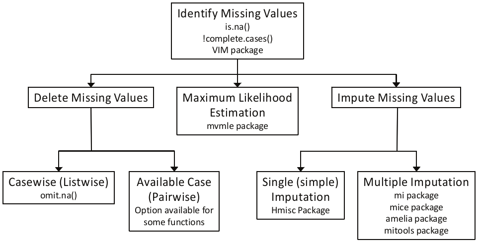
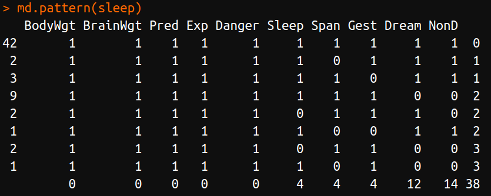
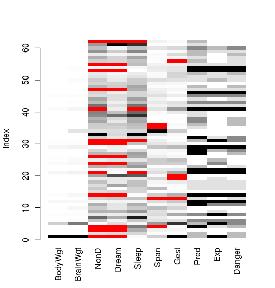
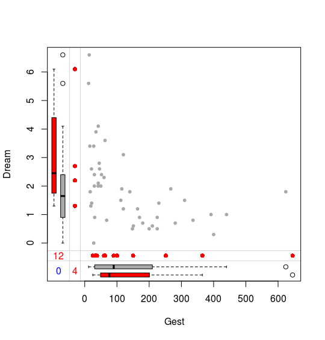
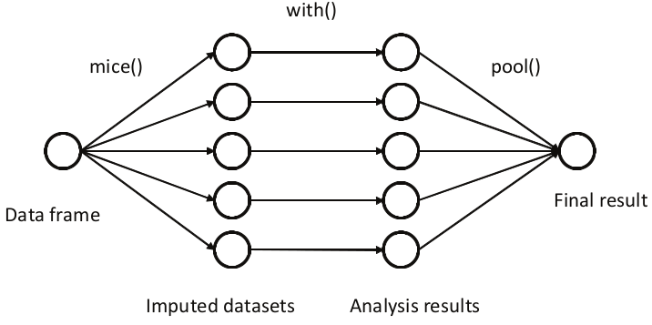

# R 语言处理缺失数据

| 原文   | [9.6 缺失数据](../../09-Additive-Models-Trees-and-Related-Methods/9.6-Missing-Data/index.html) |
| ---- | ---------------------------------------- |
| 作者   | szcf-weiya                               |
| 发布 | 2018-03-17 |


本文主要参考 [R in Action](../../references/r-in-action-en.pdf) 一书中的第 15 章，限于篇幅，这里仅列出主要代码，以及作必要简短的说明，更多细节详见原书。

## 处理缺失数据的步骤

1. 识别缺失数据
2. 检查缺失数据的原因
3. 删除带有缺失数据的情形，或者用合适的值替换（插补）缺失数据

缺失数据的类型

1. 完全随机缺失 MCAR
2. 随机缺失 MAR
3. 非随机缺失 NMAR

R 语言处理缺失数据的一般步骤



## 识别缺失数据

常用识别缺失数据的命令，以`VIM`包中的`sleep`数据集为例

```r
# load the dataset
data(sleep, package="VIM")
# list the rows that do not have missing values
sleep[complete.cases(sleep),]
# list the rows that have one or more missing values
sleep[!complete.cases(sleep),]
```

## 探索缺失数据的模式

### 表格化缺失数据

用 1 和 0 来表征数据缺失与否，举个例子

```r
library(mice)
data(sleep, package="VIM")
md.pattern(sleep)
```



### 可视化缺失数据

采用上述的表格不够直观，可以通过`VIM` 包来对缺失数据进行可视化处理，如

```r
library("VIM")
aggr(sleep, prop=FALSE, numbers=TRUE)
```


或者

```r
matrixplot(sleep)
```



图中灰色图象颜色越深表示值越大，越浅表示值越小，而红色表示缺失值。除此之外，还可以对变量的缺失情况能够两两比较

```r
marginplot(sleep[c("Gest","Dream")], pch=c(20),
           col=c("darkgray", "red", "blue"))
```




### 相关性

首先将原始矩阵用 0 和 1 来编码，1 表示缺失，然后计算与原始变量的相关性，帮助找出与缺失值相关的变量，比如

```r
x <- as.data.frame(abs(is.na(sleep)))
y <- x[which(sd(x) > 0)]
cor(y)
## or
cor(sleep, y, use="pairwise.complete.obs")
```

## 多重插补

通过 `mice` 包实现的多重插补的示意图如下



举个例子，

```r
library(mice)
data(sleep, package="VIM")
imp <- mice(sleep, seed=1234)
fit <- with(imp, lm(Dream ~ Span + Gest))
pooled <- pool(fit)
summary(pooled)
```
