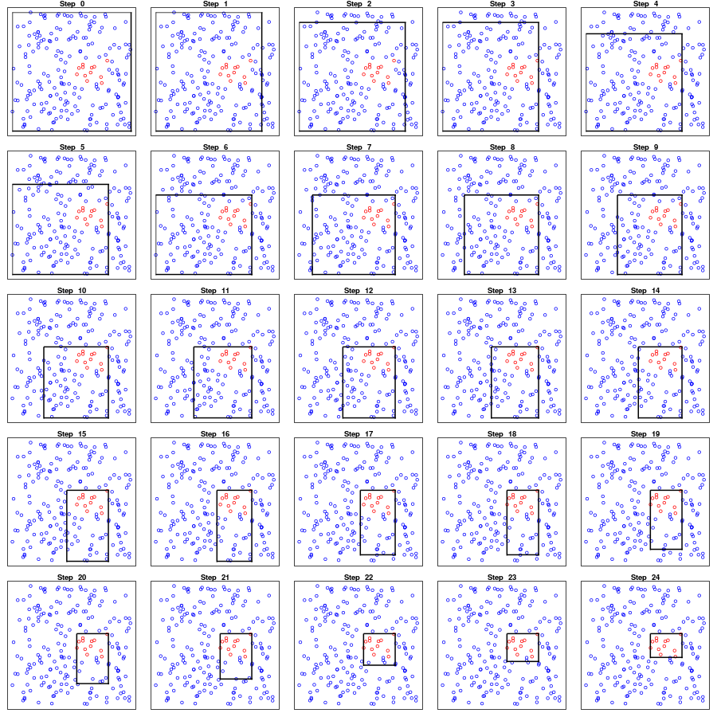
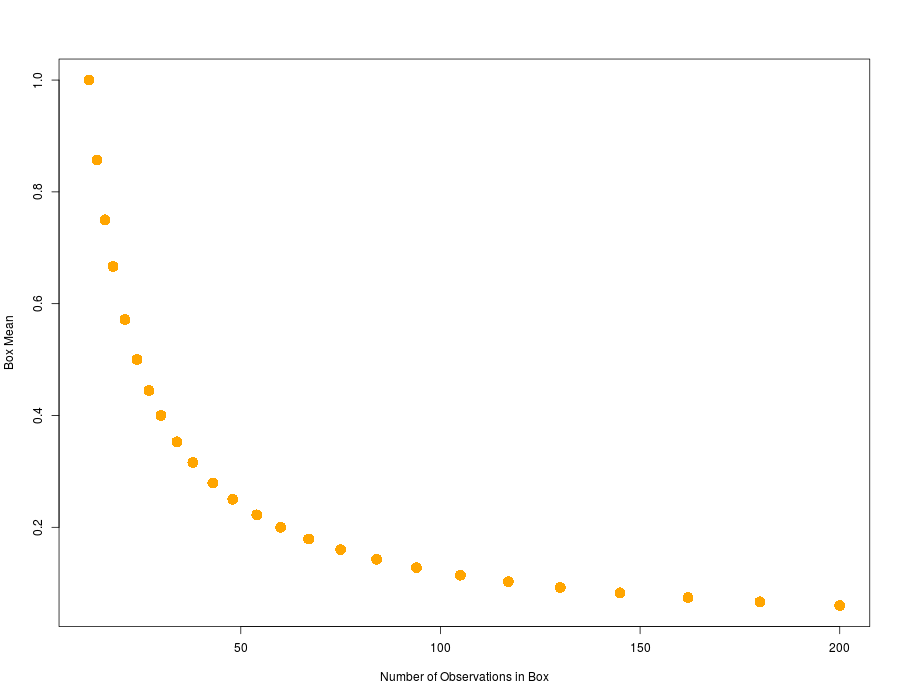

# 模拟：Fig. 9.7

| 原文   | [9.3 PRIM](../../09-Additive-Models-Trees-and-Related-Methods/9.3-PRIM/index.html) |
| ---- | ---------------------------------------- |
| 作者   | szcf-weiya                               |
| 发布 | 2018-03-17 |


## 生成数据

首先生成在单位方格中均匀分布的点，

```r
## generate data
N = 200
set.seed(123)
x1 = runif(N, 0, 1)
x2 = runif(N, 0, 1)
cl = ifelse(x1<0.8 & x1>0.5 & x2>0.4 & x2 < 0.6, 1, 0)
df = data.frame(x1, x2, cl)
```

## 作图函数

为了作出类似图 9.3 的图，自定义如下绘图函数

```r
## plot box
plot.box <- function(df, id, fcut){
  plot(0:1, 0:1, type = "n", 
       xaxt="n", yaxt="n", 
       xlab = "", ylab = "",
       main = paste("Step ", id))
  df1 = df[df$cl==1, ]
  df0 = df[df$cl==0, ]
  points(df0$x1, df0$x2, col="blue")
  points(df1$x1, df1$x2, col="red")
  ## face 1 & 3
  clip(0, 1, fcut[4], fcut[2])
  abline(v = c(fcut[1], fcut[3]), lwd=2)
  ## face 2 & 4
  clip(fcut[3], fcut[1], 0, 1)
  abline(h = c(fcut[2], fcut[4]), lwd=2)
}
```

## 主函数 PRIM

这里例子中没有体现出 PRIM 的 “pasting” 特点，只需要不断进行 “peeled”。

```r
simplePRIM <- function(df, alpha=0.1, n1=5, n2=5){
  par(mfrow=c(n1, n2), mar=c(1,1,1,1))
  nstep = 0
  box = df
  fcut = c(1, 1, 0, 0)
  fmu = numeric(n1*n2)
  fn = numeric(n1*n2)
  for (nstep in 0:(n1*n2-1)){
    fn[nstep+1] = nrow(box)
    fmu[nstep+1] = mean(box$cl)
    cat("step", nstep, " current mean = ", fmu[nstep], "\n")
    plot.box(df, nstep, fcut)
    ## face 1
    f1.cut = quantile(box$x1, 1-alpha)
    f1.box = box[box$x1 < f1.cut, ]
    f1.mu = mean(f1.box$cl)
    ## face 2
    f2.cut = quantile(box$x2, 1-alpha)
    f2.box = box[box$x2 < f2.cut, ]
    f2.mu = mean(f2.box$cl)
    ## face 3
    f3.cut = quantile(box$x1, alpha)
    f3.box = box[box$x1 > f3.cut, ]
    f3.mu = mean(f3.box$cl)
    ## face 4
    f4.cut = quantile(box$x2, alpha)
    f4.box = box[box$x2 > f4.cut, ]
    f4.mu = mean(f4.box$cl)
    
    ## choose the max one
    ind = which.max(c(f1.mu, f2.mu, f3.mu, f4.mu))
    box.list = list(f1.box, f2.box, f3.box, f4.box)
    cut.vec = c(f1.cut, f2.cut, f3.cut, f4.cut)
    box = box.list[[ind]]
    fcut[ind] = cut.vec[ind]
  }
  return(list(means=fmu, cutpoint = fcut, final.box=box, n=fn))
}
```

## 结果

运行下面代码，完美重现了图 9.7 和 图 9.8 的结果

```r
## run code
res = simplePRIM(df)

## plot the mean profile
plot(res$n, res$means, col="orange", pch=16, cex=2,
     xlab="Number of Observations in Box",
     ylab="Box Mean")
```




