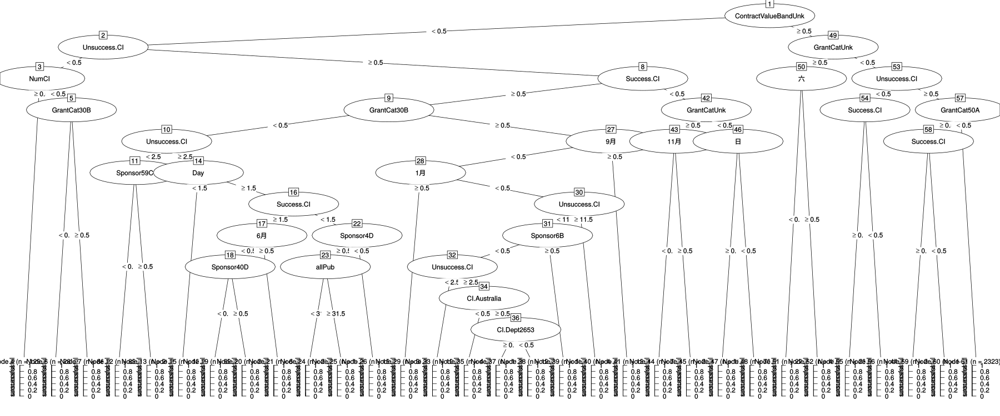
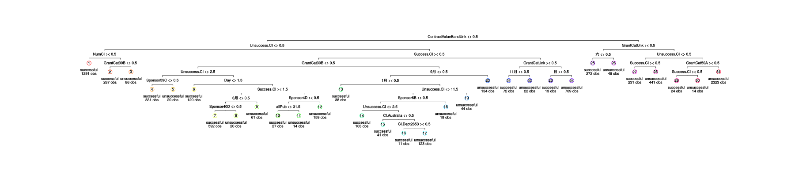
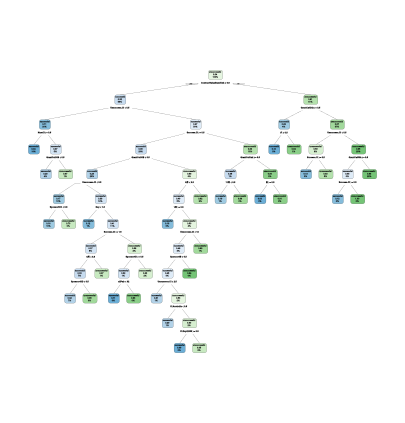
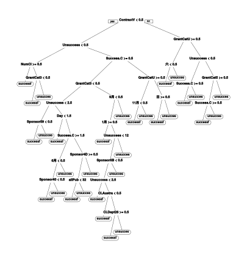
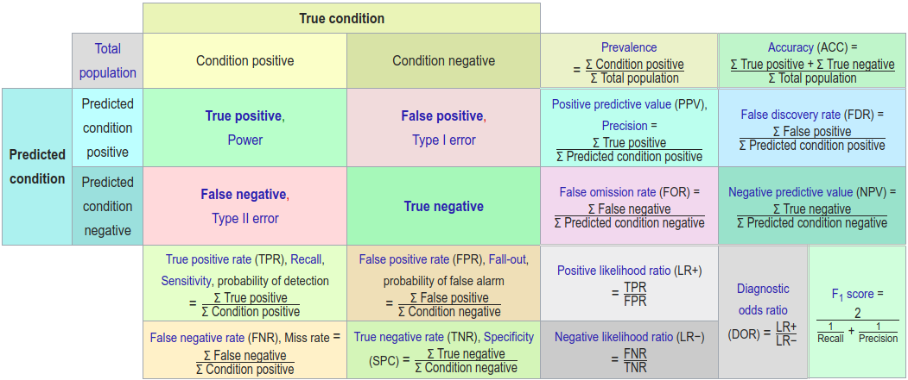
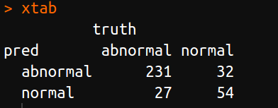
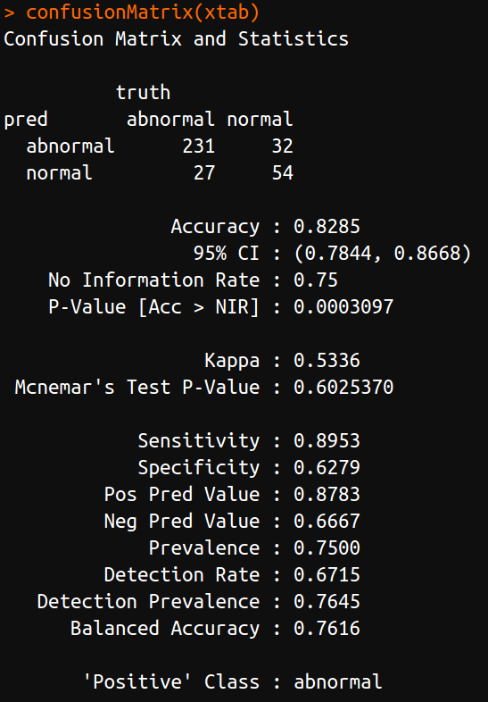
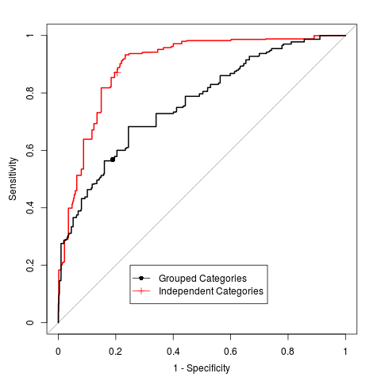
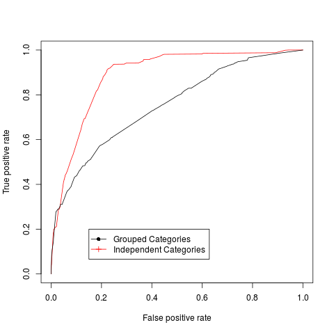

# R语言中的多种决策树算法实现

| 原文   | [9.2 基于树的方法](../../09%20Additive%20Models,%20Trees,%20and%20Related%20Methods/9.2%20Tree-Based%20Methods(CART)/index.html) |
| ---- | ---------------------------------------- |
| 作者   | szcf-weiya                               |
| 发布 | 2018-03-15 |

构造分类问题的决策树有多种算法，对于 R 语言来说，如

- CART，包含在 `rpart` 包中
- J48，包含在 `RWeka` 包中
- C5.0，包含在 `C50` 包中

!!! tip 
    当然，决策树有关的算法及其变种远不止这三种，在 `caret` 包中还可以实现其它算法，具体细节可以参见[The caret Package](http://topepo.github.io/caret)

参考 [Applied Predictive Modeling](../../references/AppliedPredictiveModeling.2013.pdf) 的有关章节进行模拟实验，这里记录了详细的模拟过程。

## 获取数据

下载 `AppliedPredictiveModeling` 源码包，调用`Chapter`文件夹中的`CreateGrantData.R`脚本文件得到预处理后的`Grant Data`。`Grant Data`来自[Predict Grant Applications | Kaggle](https://www.kaggle.com/c/unimelb)

## 可视化

对树的可视化有多种包可以实现，以`rpart`拟合的模型为例，介绍三种可视化的方法。

### `partykit` 包

```r
library(partykit)
plot(as.party(rpartFit$finalModel))
```



### `maptree` 包

```r
library(maptree)
draw.tree(rpartFit$finalModel)
```



### `rpart.plot` 包

这里介绍两个函数，一个是`rpart.plot()`

```r
library(rpart.plot)
rpart.plot(rpartFit$finalModel, fallen.leaves = FALSE) 
```



另一个是更一般的`prp()`，需要自定义的参数更多，更灵活

```r
prp(rpartFit$finalModel) 
```



## 混淆矩阵

**混淆矩阵 (confusion matrix)** 通过表格形式展示算法预测的效果。下图（来自[维基百科](https://en.wikipedia.org/wiki/Confusion_matrix)）展示了具体的各个量的细节



在`R` 语言中，调用 `caret` 包中的 `confusionMatrix()` 函数可以直接计算上图中的各个统计量。举个两类别例子（取自`confusionMatrix()`的帮助文档），


```r
lvs <- c("normal", "abnormal")
truth <- factor(rep(lvs, times = c(86, 258)),
                levels = rev(lvs))
pred <- factor(
               c(
                 rep(lvs, times = c(54, 32)),
                 rep(lvs, times = c(27, 231))),
               levels = rev(lvs))
xtab <- table(pred, truth)
```

采用上述代码生成的混淆矩阵



计算混淆矩阵的各个统计量，即



<!--
为了学习 Julia 同时加深对公式的印象，编写下面的 Julia 代码实现同样的功能。
-->

## ROC 曲线

### `pROC`

`AppliedPredictiveModeling`源码包给出的做法是调用 `pROC`，先计算得到 `roc` 对象，然后利用其 `plot` 函数便可以绘制 `ROC`曲线

对应代码如下

```r
library(pROC)
rpartRoc <- roc(response = rpartFit$pred$obs,
                predictor = rpartFit$pred$successful,
                levels = rev(levels(rpartFit$pred$obs)))
plot(rpartRoc, type = "s", print.thres = c(.5),
     print.thres.pch = 3,
     print.thres.pattern = "",
     print.thres.cex = 1.2,
     col = "red", legacy.axes = TRUE,
     print.thres.col = "red")
```


比如，以 `rpart` 拟合的两个模型为例



### `ROCR`

另外，我们也可以用 `ROCR` 实现。具体地，将 `prediction` 和 `performance` 函数包装起来构成自己的绘图函数，代码如下

```r
library(ROCR)
rocplot = function(obj, ...) {
  predob = prediction(obj$pred$successful,
                      obj$pred$obs,
                      label.ordering = rev(levels(obj$pred$obs)))
  perf = performance(predob , "tpr" , "fpr")
  plot(perf, ...) 
}
rocplot(rpartFit, col="red")
```

比如，对于 `rpart` 拟合的两个模型



看起来曲线比上一种方法更加光滑，不过上一种方法也可以指定`smooth()`函数达到光滑的目的（但又似乎过于光滑了）。

### 比较

1. `pROC` 可以更方便获取相应数据，比如阈值，以及对应 AUC 值，并可以在图象中表示出来。
2. `ROCR` 绘图横纵坐标的选择更灵活，除了常见的`True Positive Rate ~ False Positive Rate`，即`Sensitivity ~ 1-Specificity` 还可以选择 `lift ~ rpp`。

## 结果

各种方法的结果通过具体的决策树、混淆矩阵以及 ROC 曲线来体现。上面通过举例已经说明了决策树的可视化方法、混淆矩阵的计算方法以及 ROC 曲线的绘制方法，并给出了例图，这里不再赘述。完整代码及结果参见[Github: szcf-weiya/ESL-CN](https://github.com/szcf-weiya/ESL-CN/tree/master/docs/notes/tree)


