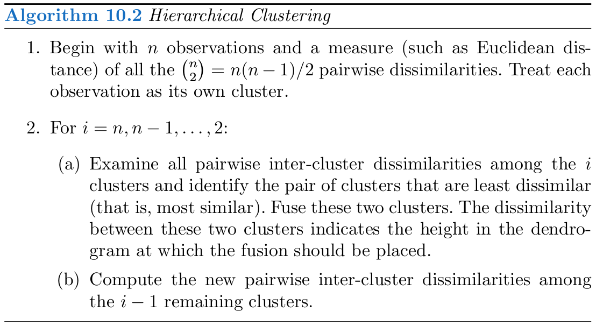
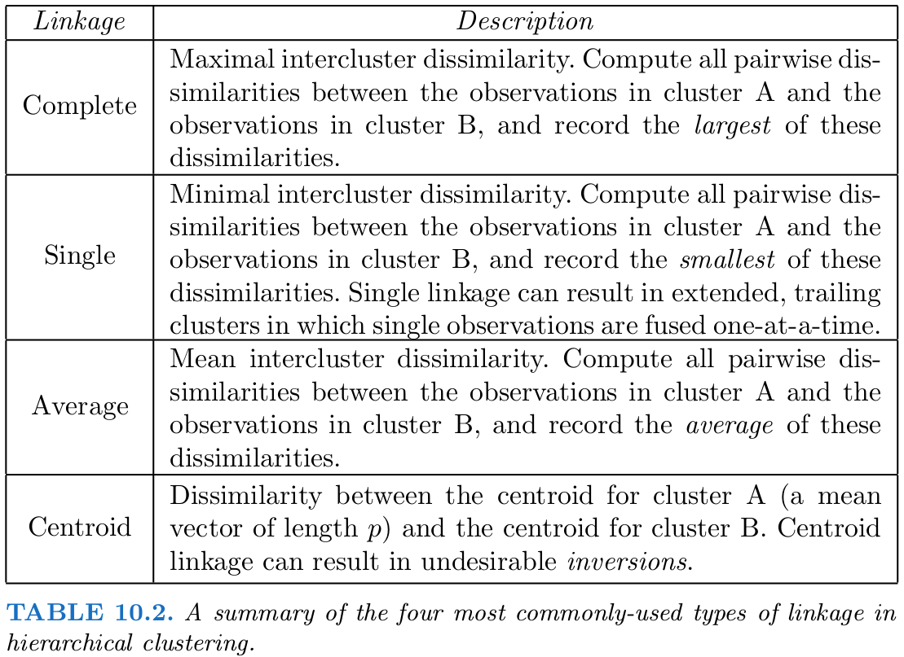

## $K$-means


通过一个简单的例子来说明用 `kmeans()` 进行 $K$-means 聚类。

```{r}
set.seed(123)
x = matrix(rnorm(50*2), ncol=2)
x[1:25, 1] = x[1:25, 1] + 3
x[1:25, 2] = x[1:25, 2] - 4
```

然后进行 $K$-means 聚类，

```{r}
km.out = kmeans(x, 2, nstart = 20)
plot(x, col = (km.out$cluster+1), main = "K-means (K=2)", xlab = "", ylab = "", pch = 20, cex = 2)
```

其中 `nstart` 表示随机初始划分的个数。可以比较下 $K=3$ 时 `nstart = 1` 和 `nstart = 20` 的差异

```{r}
set.seed(1234)
km.out = kmeans(x, 3, nstart = 1)
km.out$tot.withinss
km.out = kmeans(x, 3, nstart = 20)
km.out$tot.withinss
```

## Hierarchical Clustering



可以采用不同的 linkage 进行 **系统聚类 (Hierarchical Clustering)**



```{r}
hc.complete = hclust(dist(x), method = "complete")
hc.average = hclust(dist(x), method = "average")
hc.single = hclust(dist(x), method = "single")
```

并且作出 dendrograms.

```{r}
par(mfrow=c(1,3))
plot(hc.complete, main = "Complete Linkage", xlab = "", sub = "", cex=.9)
plot(hc.average, main = "Average Linkage", xlab = "", sub = "", cex=.9)
plot(hc.single, main = "Single Linkage", xlab = "", sub = "", cex=.9)
```

为了确定分类结果，可以用 `cutree()` 返回类别标签，

```{r}
cutree(hc.complete, 2)
```

当使用基于相关系数的距离度量时，可以采用 `as.dist()` 函数，比如

```{r}
x = matrix(rnorm(30*3), ncol = 3)
dd = as.dist(1-cor(t(x)))
plot(hclust(dd, method="complete"), main = "Complete Linkage with Correlation-Based Distance", xlab = "", sub = "")
```

## References

[James, G., Witten, D., Hastie, T., & Tibshirani, R. (Eds.). (2013). An introduction to statistical learning: with applications in R. New York: Springer.](https://www-bcf.usc.edu/~gareth/ISL/ISLR%20First%20Printing.pdf)
