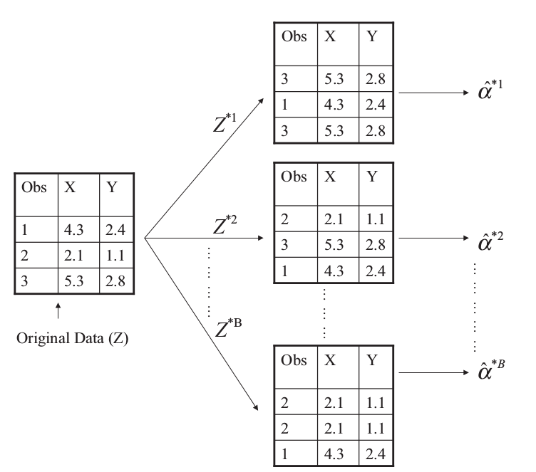

## Resampling Methods

**Resampling methods** involve repeatedly drawing samples from a training set and refitting a model of interest on each sample in order to obtain additional information about the fitted model.

estimate the variability of a linear regression fit: 

- repeatedly draw different samples from the training data 
- fit a linear regression to each new sample 
- examine the extent to which the resulting fits differ

two of the most commonly used resampling methods 

- cross-validation 
- bootstrap

## Cross-Validation

### The Validation Set Approach

It involves randomly dividing the available set of observations into two parts, a training set and a validation set or hold-out set.

- LOOCV
- $k$-fold CV

#### Remark:

- When we examine real data, we do not know the true test MSE, and so it is difficult to determine the accuracy of the cross-validation estimate
- If we examine simulated data, then we can compute the true test MSE, and can thereby evaluate the accuracy of our cross-validation results.

#### our goal

determine how well a given statistical learning procedure can be expected to perform on independent data; in this case, the actual estimate of the test MSE is of interest.
we are interested only in the location of the minimum point in the estimated test MSE curve.

## Bootstrap

can be used to estimate the standard errors of the coefficients from a linear regression fit

### Example

two financial assets that yield returns of $X$ and $Y$

$\alpha X+(1-\alpha)Y$, where

$$
\alpha = \frac{\sigma_Y^2-\sigma_{XY}}{\sigma_X^2+\sigma^2_Y-2\sigma_{XY}}
$$

we want to estimate

$$
\hat\alpha = \frac{\hat\sigma_Y^2-\hat\sigma_{XY}}{\hat\sigma_X^2+\hat\sigma^2_Y-2\hat\sigma_{XY}}
$$

$$
SE_B(\hat\alpha)=\sqrt{\frac{1}{B-1}\sum\limits_{r=1}^B(\alpha^{*r}-\frac{1}{B}\sum\limits_{r'=1}^B\hat\alpha^{*r'})^2}
$$



## Lab

### The Validation Set Approach

```{r}
library(ISLR)
set.seed(1)
train = sample(392, 196)
attach(Auto)
## linear regression
lm.fit = lm(mpg ~ horsepower, data = Auto, subset = train)
mean((mpg - predict(lm.fit, Auto))[-train]^2)

## polynomial regression
lm.fit2 = lm(mpg ~ poly(horsepower, 2), data = Auto, subset = train)
mean((mpg-predict(lm.fit2, Auto))[-train]^2)

## cubic regression
lm.fit3 = lm(mpg ~ poly(horsepower, 3), data = Auto, subset = train)
mean((mpg-predict(lm.fit3, Auto))[-train]^2)
```

#### LOOCV

```{r}
library(boot)
glm.fit = glm(mpg ~ horsepower, data = Auto)
cv.err = cv.glm(Auto, glm.fit)
cv.err$delta
```

It would return a vector of length two. The first component is the raw cross-validation estimate of prediction error. The second component is the adjusted cross-validation estimate. The adjustment is designed to compensate for the bias introduced by not using leave-one-out cross-validation.

```{r}
cv.error = rep(0, 5)
for (i in 1:5){
  glm.fit = glm(mpg ~ poly(horsepower, i), data = Auto)
  cv.error[i] = cv.glm(Auto, glm.fit)$delta[1]
}
cv.error
```

#### $k$-fold CV

```{r}
set.seed(17)
cv.error.10 = rep(0, 10)
for (i in 1:10){
  glm.fit = glm(mpg~poly(horsepower, i), data = Auto)
  cv.error.10[i] = cv.glm(Auto, glm.fit, K = 10)$delta[1]
}
cv.error.10
```

### Bootstrap

#### Estimating the Accuracy of a Statistic of Interest

Two steps:

1. create a function that computes the statistic of interest 
2. use the `boot()` function, which is part of the boot library, to perform the bootstrap by repeatedly sampling observations from the data set with replacement.

```{r}
alpha.fn = function(data, index){
  X = data$X[index]
  Y = data$Y[index]
  return((var(Y)-cov(X,Y))/(var(X)+var(Y)-2*cov(X,Y)))
}
alpha.fn(Portfolio, 1:100)
set.seed(1)
alpha.fn(Portfolio, sample(100, 100, replace = T))
boot(Portfolio, alpha.fn, R = 1000)
```

#### Estimating the Accuracy of a Linear Regression Model

The bootstrap approach can be used to assess the variability of the coefficient estimates and predictions from a statistical learning method.

```{r}
boot.fn = function(data, index)
  return(coef(lm(mpg~horsepower, data = data, subset = index)))

boot.fn(Auto, 1:392)
set.seed(1)
boot.fn(Auto, sample(392, 392, replace = T))
boot(Auto, boot.fn, 1000)
summary(lm(mpg~horsepower, data = Auto))$coef
```

- although the formula for the standard errors do not rely on the linear model being correct, the estimate for $\sigma^2$ does.
- the standard formulas assume (somewhat unrealistically) that the $x_i$ are fixed, and all the variability comes from the variation in the errors $\epsilon_i$. The bootstrap approach does not rely on any of these assumptions

```{r}
boot.fn = function(data, index)
coef(lm(mpg~horsepower+I(horsepower^2), data = data, subset = index))
set.seed(1)
boot(Auto, boot.fn, 1000)
summary(lm(mpg~horsepower+I(horsepower^2), data = Auto))$coef
```

